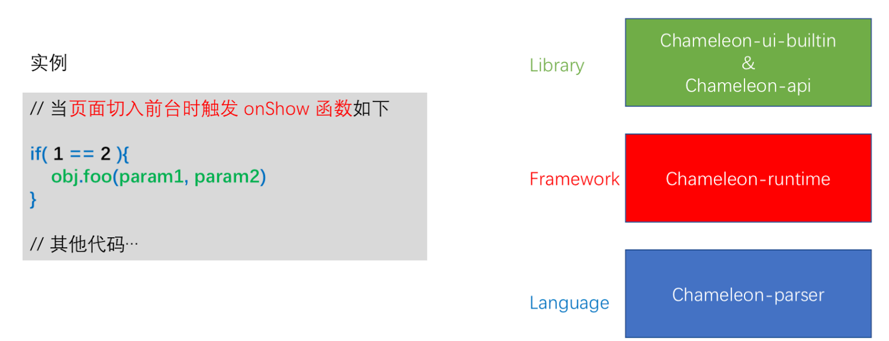

# 定制扩展端(Terminal expand)[chameleon-tool@0.4.0-mvvm.6 版本生效]

希望扩展支持 头条小程序、淘宝小程序、高德小程序、react-native？
你只需按标准流程即可扩展，敬请期待：

- xxx-runtime ：运行时
- xxx-ui: 扩展组件
- xxx-api: 基础 api
- xxx-plugin: 解析器

## 原理解释

实现原理图


首先任何一份应用层的高级语言代码块分成几层：语言层（Language）、框架层（Framewrok）与库层（Library）：

Language —— 通俗来说，实现程序所需的基本逻辑命令：逻辑判断(if)、循环(for)与函数调用（foo())等。

Framewrok —— 通俗来说，完成一个 App 应用交互任务所需规范，例如生命周期（onLoad、onShow）、模块化与数据管理等。

Library —— 可以理解就是“方法封装集合”。比如 Web 前端中 Vue 更适合叫框架，而 jQuery 更适合叫库；Android 系统下
activity manager + window Manager View System 等的集合叫框架，而 SQLite 、libc 更适合叫库。

对应到 Chameleon 就是这样：



你可以理解 Chameleon 为了实现“让 MVVM 跨端环境大统一”的目标做了以下工作：

- 定义了标准的 Language(CML DSL)、Framework 与 Library（内置组件和 API）协议层。
- 在线下编译时将 DSL 转译成各端 DSL，只编译 Language 层面足够基础且稳定的代码。
- 在各个端运行时分别实现了 Framework 统一，在各个端尽量使用原有框架，方便利用其生态，这样很多组件可以直接用起来。
- 在各个端运行时分别实现了 Library（内置组件和 API）。
- 为用户提供多态协议，方便扩展以上几方面的内容，触达底层端特殊属性，同时提升可维护性。

| 信息/协议 | 框架协议（Framework)                                                 | API 接口协议（Library)                           | 内置组件协议（Library)                       | DSL 协议（Language)                                                                                                        | 用户可扩展协议                     |
| --------- | -------------------------------------------------------------------- | ------------------------------------------------ | -------------------------------------------- | -------------------------------------------------------------------------------------------------------------------------- | ---------------------------------- |
| 实现      | Chameleon Runtime                                                    | chameleon-api                                    | chameleon-ui-builtin                         | chameleon tool                                                                                                             | chameleon tool                     |
| 描述      | 各端引擎中按规范各自实现；实现框架生命周期、数据流向、尺寸单位、路由 | 各端引擎中按规范各自实现；为本地能力调用提供基类 | 各端引擎中按规范各自实现；为界面开发提供基类 | 编译转换（组件调用、循环、条件判断、事件回调关联、父子关系等等，不涉及具体什么组件该传什么参数）；提供标准数据驱动规范语法 | 多态协议标准；提供多端差异化实现。 |

实现思路很简单，所有设计为了 MVVM 标准化，不做多余设计，所以宏观的角度就像 Node.js（libuv）同时运行在 Windows 和 macOS 系统，都提供了一个跨平台抽象层。


## 统一的工作
跨端框架最核心的工作是统一，定义一个标准格式作为统一的规范，通过编译时+运行时的手段去实现各端的代码和功能。chameleon目前支持的端都是采用这种方式，经过实践发现，几乎所有前端框架的开发都可以统一为一个MVVM+的标准规范。chameleon就定义了这种规范，并提供给各端用户扩展新端的方法。
首先明确一下我们需要对如下部分进行统一：
### 1 语言统一
cml中共涉及到三种语言，CML模板语言，JS语言，CMSS样式语言。

- 1、JS语言，前端通用语言，如果目标端也采用js语言则不需要语法的编译。

- 2、CMSS语言，是标准css语言的子集，具体参见：[CMSS样式标准](./cmss.md)，目标端可以对其进行编译，比如统一尺寸单位将cpx转为px或者rpx。例如weex需要将其转为对象的形式。

- 3、CML模板语言，这是CML定义的独立语言，具体参见[CML模板语言标准](./template.md)，用于描述视图层，包括了循环，条件，数据绑定，事件绑定等语法，用户可以根据CML提供的库，将其转为AST语法树，然后针对节点进行编译，编译后输出代码。

以react-native为例，如何将cml单文件进行语法统一？ 思路是将cmss语言转为js 对象，将cml模板语法进行编译 转为jsx语法 放入render函数。

### 2 路由统一
路由表示了前端应用中各页面之间的组织形式，CML中的路由标准化为JSON格式对象，实际上是项目中`router.config.json`文件的内容。
必选字段`routes`为设置页面路由对象的数组，每一个页面路由对象必选字段为`path`,`path`指向页面的cml文件，页面必须是普通cml文件，页面不能是多态的，`path`的取值为相对于项目`src`下的页面绝对路径，不带`.cml`文件后缀。

```
{
  "routes":[
    {
      "path": "/pages/index/index"
    }
  ]
}
```
如果目标端的路由需要有其他的字段，也可以在`router.config.json`中进行添加，例如web端需要url字段：
```
{
  "routes":[
    {
      "url": "cml/h5/index",
      "path": "/pages/index/index"
    }
  ]
}
```
用户可以在编写的插件中通过getRouterConfig方法获取到该对象，在编译的过程中可以根据该json对象进行路由的统一。
例如微信小程序端，可以将路由的path放入到app.json的pages字段，web端如果用vue-router，可以生成vue-router对象，插入到编译过程中。

### 3 逻辑对象统一
逻辑对象主要负责逻辑的处理，包括调用底层的接口，和视图层之间的数据绑定和事件绑定。标准格式参见[逻辑对象标准](./vm.md)。MVVM+模式中都有VM对象，可以通过实现一套运行时框架，提供方法将VM对象转为目标端的VM对象，处理方法可以通过编译时插入。例如：
```

<script>
class Index  {
  data = {
    title: "chameleon",
  }
  mounted() {
  }
}
export default new Index();


// 插入如下代码 
import {createApp} from ('cml-target-runtime');
createApp(exports.default);
</script>
```
createApp方法接收VM对象，在运行时将其转化为目标端需要的形式。

### 4 组件化统一
前端开发都是以组件为单位，组件化表示了组件之间的关系，标准具体参见[组件化标准](./component.md)。 cml文件中的组件关系放在了json配置部分，在编译时可以使用。
例如web端的编译，可以处理cml文件的script部分的时候，获取组件信息进行插入代码。

### 5 事件统一
事件的统一包括了事件名称的统一和事件对象的统一，标准参见：[事件标准](./event.md)。涉及到CML模板语法和VM对象处理的工作。事件名称直接通过CML模板语法编译时就可以转，比如c-bind:tap 编译成 bindtap或者v-on:click。事件对象的统一可以采用事件代理的方式，即让所有的事件都绑定事件代理方法，而在事件代理方法中对事件对象统一处理后再触发原来绑定的方法。而事件代理方法可以在对VM对象进行处理时进行混入。

### 6 状态管理统一
面对多页面、多组件之间进行复杂的状态，状态管理是提高效率的解决方案，标准参见：[状态管理标准](./store.md)。实现store实例，如果目标端有类似库，可以做封装统一，例如vuex、redux。或者用mobx实现。

### 7 内置组件统一
CML提供了统一的内置组件，例如button， input 让各端能够表现一致，扩展端需要建立一个组件库对内置组件中的接口进行继承和目标端的实现。具体参见[扩展内置组件](./ui-builtin.md)。

### 8 内置API统一
CML提供了统一的内置API，例如网络请求、数据存储，扩展新端需要建立一个appi库对内置API中提供的方法进行实现，具体参见[扩展内置API](./api.md)。

## 如何扩展端

参见[操作教程](./quickstart.md)
