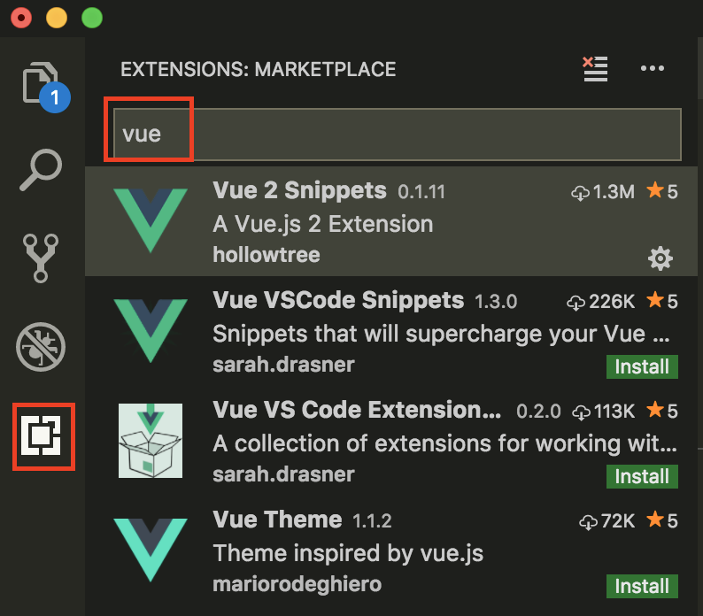
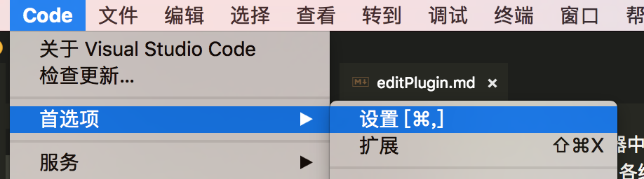
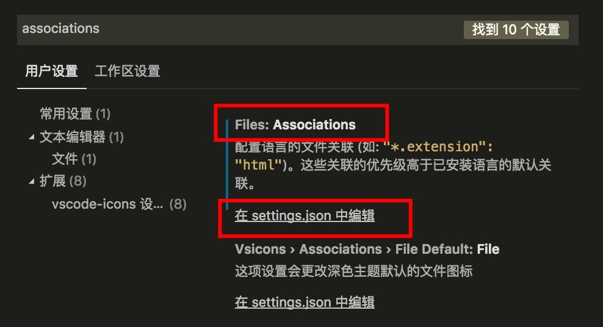
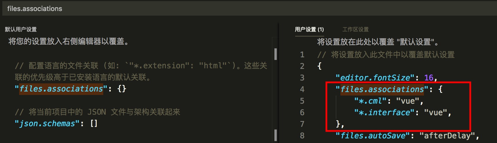
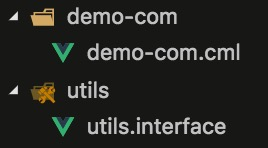
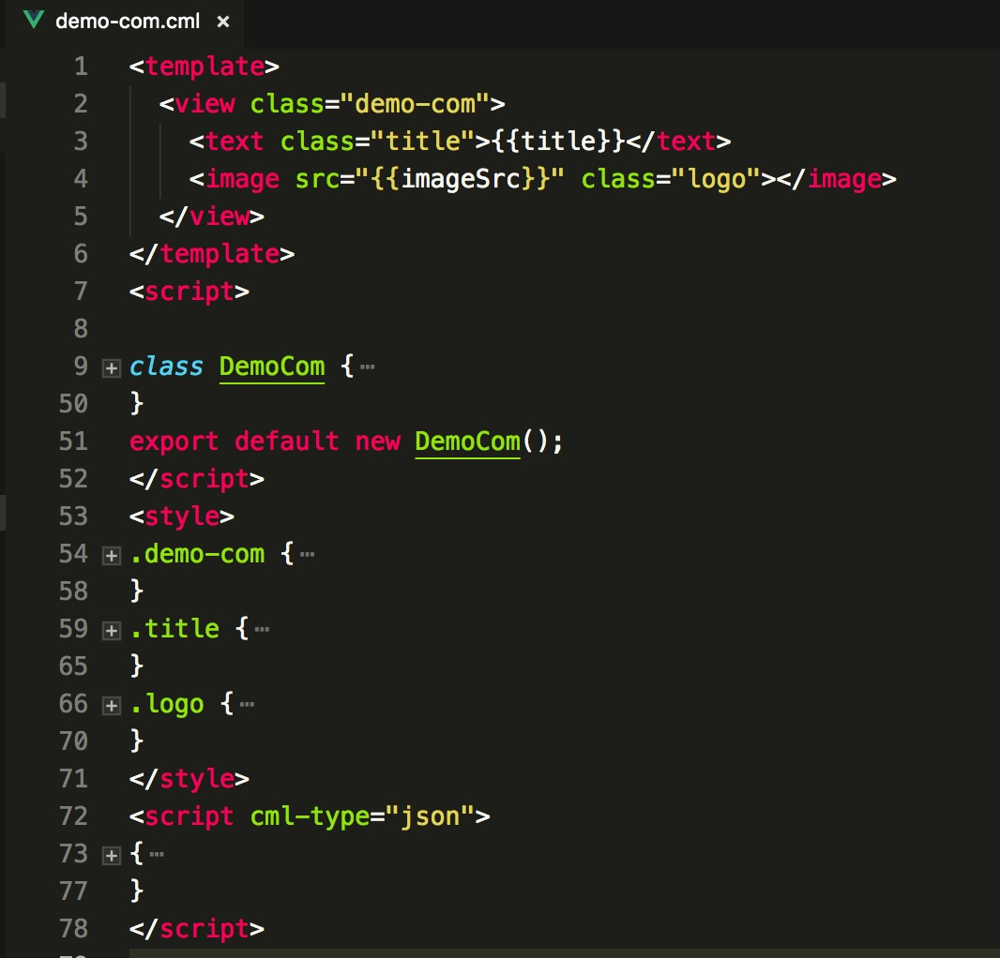
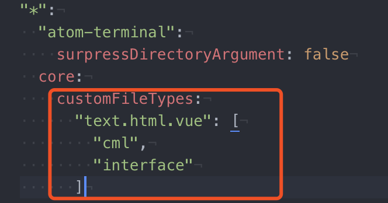
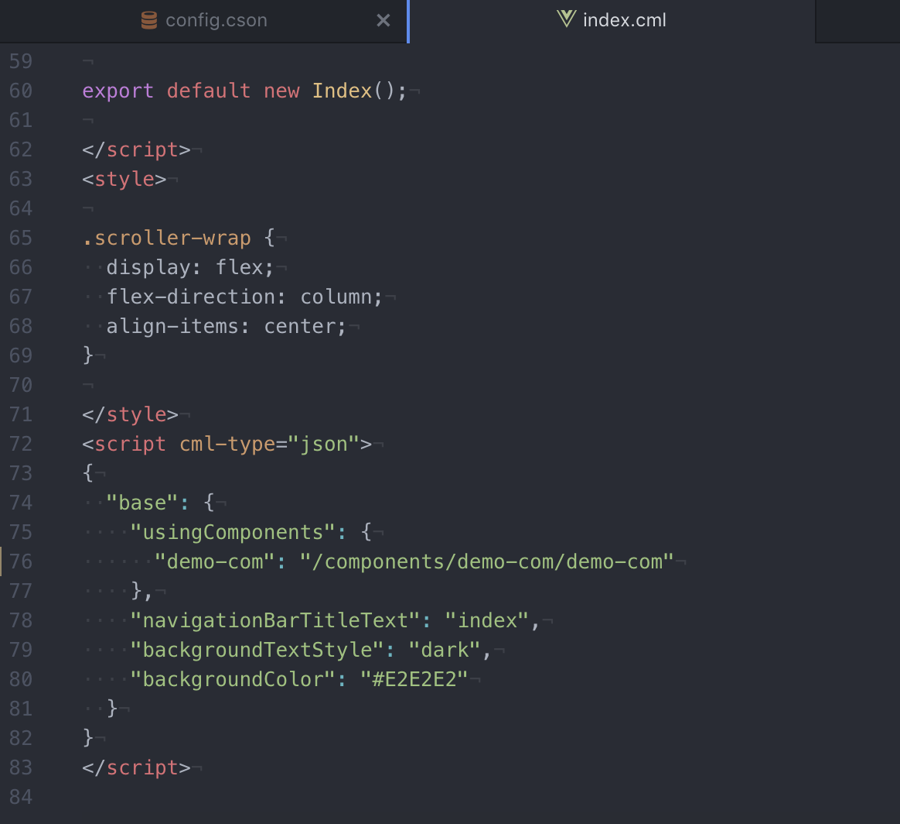
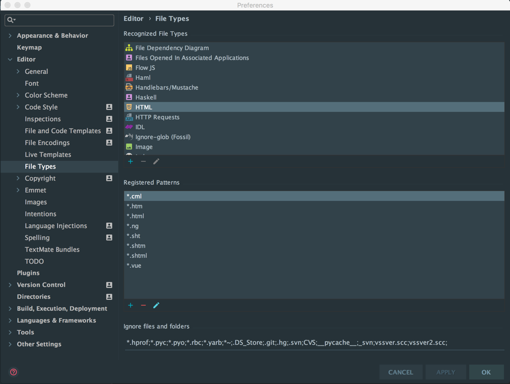

## 编辑器插件
chameleon项目编辑器中语法高亮，暂时使用.vue的插件，后续会推出更强大的插件，各编辑器配置插件教程如下：

### Visual Studio Code

#### 1 安装vue编辑器插件

在`vscode` 左侧`Extensions`搜索框中输入vue，点击 install 要安装的vue插件，这里选择的是`Vue 2 Snippets`, 安装完成后需要重启`vscode`使其生效。



#### 2 配置文件识别类型

选择 code -> 首选项 -> 设置



进入设置界面，搜索框输入`associations`, 在`Files: Associations` 下点击`在 settings.json 中编辑`。



在用户设置中的`files.associations`字段添加如下配置
```
"files.associations": {
    "*.cml": "vue",
    "*.interface": "vue",
},
```



此时就完成了插件配置，示例如下：





### Atom

#### 1 安装vue编辑器插件

使用快捷键打开编辑器设置页面：

```
  command + ,(逗号)
```

选择左侧的`Install` Tab，然后在搜索框输入`language-vue`, 在搜索结果中找到vue语言支持并安装

#### 2 配置`cml文件`及`interface文件`使用`vue语言`高亮

选择`atom`菜单下的`config`

<image src="../assets/atom.jpg" width="300" />

在打开的`config.cson`文件中的`core`下添加以下代码

```
customFileTypes:
  "text.html.vue": [
    "cml",
    "interface"
  ]
```


#### 3 然后重启atom，即可生效




### Webstrom

### 1 配置vue模板

```
 command + ,(逗号)
```
选择左侧`editor`-> `File Types`,



找到上面的html类型，将`*.vue`和`*.cml`和添加进其中。
确定的时候会提示被占用了，要把那个清除掉，重启webstrom就OK了。
