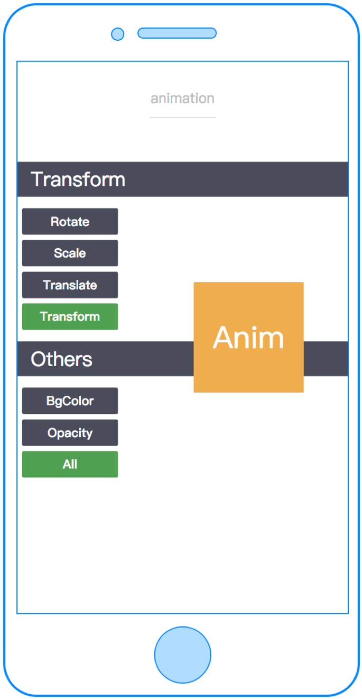

# API

CML 支持大量基础 API，对外提供统一的接口，以模块的方式引入 `chameleon-api` 进行使用。

例如:

```javascript
import cml from 'chameleon-api';
cml.showToast({
  message: 'Hello world!',
  duration: 1000,
});
```

注意：

- 接口均以 promise 形式进行返回，所以你可以结合异步流程控制如 async、await 进行操作。
- API 模块为按需加载模块，可有效减少包体积。
-  失败回调的返回格式为{errMsg:string}，如果是自己扩展的方法也建议按照此结构进行构造。
- 你还可以利用多态接口来实现跨端的接口或差异化实现特定端接口。

## 运行时

### export & import

CML 框架的编译时加载方案是在 ES6 的 Module 能力基础上扩展的，主要由两个命令构成：export 和 import。

#### export 命令

export 命令用于规定模块的对外接口。

一个模块就是一个独立的文件。该文件内部的所有变量，外部无法获取。如果你希望外部能够读取模块内部的某个变量，就必须使用 export 关键字输出该变量。下面是一个 JS 文件，里面使用 export 命令输出变量。

```javascript
// profile.js
const name = 'Mike';
const gender = 'male';
const age = 24;

export { name, gender, age };
```

#### import 命令、require 命令

import 命令和 require 命令用于输入其他模块提供的功能。

使用 export 命令定义了模块的对外接口以后，通过`import`命令加载这些模块。
导入规范如下表所示：

<table>
  <tr>
    <th width="200px">当前文件后缀</th>
    <th>仅限导入的类型</th>
    <th>示例</th>
  </tr>
  <tr>
    <td>.cml</td>
    <td>.js、.json</td>
    <td>
      import a from 'a.js'; <br/>
      import b from 'b.json';
    </td>
  </tr>
  <tr>
    <td>
    *.[web|weex|wx|alipay|baidu|tt|qq].cml
    </td>
    <td>.interface、.js、.json</td>
    <td>
      import a from 'a.js'; <br/>
      import b from 'b.json';<br/>
      import c from 'c.interface';
    </td>
  </tr>
  <tr>
    <td>.js</td>
    <td><.interface、.js、.json</td>
    <td>
      import a from 'a.js';<br/>
      import b from 'b.json';<br/>
      import c from 'c.interface';<br/>
    </td>
  </tr>
  <tr>
    <td>.interface</td>
    <td>.js、.json</td>
    <td>
      import a from 'a.js';
      import b from 'b.json';
    </td>
  </tr>
</table>

如果没有加后缀名，会依次查找后缀为`.interface`, `.js`的文件

```javascript
// 会依次查找 profile.interface profile.js
import { name, gender, age } from './profile';
// 最后找到 profile.js
function setName(human) {
  human.textContent = name + ' ' + gender + ' ' + age;
}
```

```javascript
// 会依次查找 profile.interface profile.js

const { name, age, gender } = require('./profile');
// 最后找到 profile.js
function setName(human) {
  human.textContent = name + ' ' + gender + ' ' + age;
}
```

### @import

指定导入的外部样式表及目标媒体。支持导入`.css`、`.less`、`.stylus`类型文件。

该规则必须在样式表头部最先声明。并且其后的分号是必需的，如果省略了此分号，外部样式表将无法正确导入，并会生成错误信息。

```vue
<style>
@import './base.css';
</style>
```

```vue
<style lang="less">
@import './base.less';
</style>
```

```vue
<style lang="stylus">
@import './base.stylus';
</style>
```

### require()

require 属于运行时加载方案命令，支持导入的文件类型同`import`

#### 条件加载

import() 可以放在 if 代码块，根据不同的情况，加载不同的模块。

```javascript
let module;
if (condition) {
  module = require('moduleA');
} else {
  module = require('moduleB');
}
```

#### 返回图片线上资源地址

```javascript
let imgPath = require('../../imgs/iconA.png'); // imgPath形如 https://cml.js.org/assets/imgs/iconA.png，通过publicPath配置 https://cml.js.org
```

## 网络请求

### get()

发送 get 请求

#### 参数

|    参数     |  类型  | 必需 |                                                   默认值                                                    |                                                                                                                                说明                                                                                                                                |
| :---------: | :----: | :--: | :---------------------------------------------------------------------------------------------------------: | :----------------------------------------------------------------------------------------------------------------------------------------------------------------------------------------------------------------------------------------------------------------: |
|     url     | String |  是  |                                                                                                             |                                                                                   网络请求地址，如果项目中配置了 apiPrefix 并且 setting 中的 apiPrefix 为 true，则添加配置的前缀                                                                                   |
|    data     | Object |  否  |                                                                                                             |                                                                                                                 要传的参数，会拼接在请求的 url 中                                                                                                                  |
|   header    | Object |  否  |                                                                                                             |                                                                                                                      设置 http 请求的 header                                                                                                                       |
| resDataType | String |  否  |                                                    json                                                     |                                                                              设置 response 的数据类型, 为 json 时, 会尝试对返回值进行 JSON.parse(), 若不希望 parse, 则传入'text'即可                                                                               |
|   setting   | Object |  否  | {jsonp: false(仅 Web 端有效), apiPrefix: Boolean(根据传入 url 决定), credentials: 'include'(仅 Web 端有效)} | 自定义了设置，apiPrefix 为是否添加 chameleon.config.js 中设置的 apiPrefix (以http://或https://或//开头的url默认不会拼接, 其他情况均会自动拼接); jsonp 为 true 时会发起一个 jsonp 请求; credentials 可选值'omit'/'same-origin'/'include', 对应 fetch 的 credentials |
|   domain    | String |  否  |                                                                                                             |                                       网络请求的域名前缀（chameleon-api@0.3.1 开始支持）具体参见 [API 多域名 Mock](../docs/build.md#api-多域名-mock)<br/><b>如果设置了 domain 则 chameleon.config.js 中的 apiPrefix 失效</b>                                       |

#### 返回值

返回 promise，对应的请求成功和失败回调

#### 举例

```javascript
cml
  .get({
    url: 'https://cml.com/api/user/1',
  })
  .then(
    (res) => {
      cml.showToast({
        message: JSON.stringify(res),
        duration: 2000,
      });
    },
    (err) => {
      cml.showToast({
        message: JSON.stringify(err),
        duration: 2000,
      });
    },
  );
```

### post()

发送 post 请求

#### 参数

|    参数     |  类型  | 必需 |                                                   默认值                                                    |                                                                                                                                说明                                                                                                                                |
| :---------: | :----: | :--: | :---------------------------------------------------------------------------------------------------------: | :----------------------------------------------------------------------------------------------------------------------------------------------------------------------------------------------------------------------------------------------------------------: |
|     url     | String |  是  |                                                                                                             |                                                                                   网络请求地址，如果项目中配置了 apiPrefix 并且 setting 中的 apiPrefix 为 true，则添加配置的前缀                                                                                   |
|    data     | Object |  否  |                                                                                                             |                                                                                                                 要传的参数，会拼接在请求的 url 中                                                                                                                  |
|   header    | Object |  否  |                                                                                                             |                                                                                                                      设置 http 请求的 header                                                                                                                       |
| contentType | String |  否  |                                                    form                                                     |                                                                 取值：form 或 json，决定 body 中 data 的格式，对应 header 中 content-type 为 application/x-www-form-urlencoded 或 application/json                                                                 |
| resDataType | String |  否  |                                                    json                                                     |                                                                              设置 response 的数据类型, 为 json 时, 会尝试对返回值进行 JSON.parse(), 若不希望 parse, 则传入'text'即可                                                                               |
|   setting   | Object |  否  | {jsonp: false(仅 Web 端有效), apiPrefix: Boolean(根据传入 url 决定), credentials: 'include'(仅 Web 端有效)} | 自定义了设置，apiPrefix 为是否添加 chameleon.config.js 中设置的 apiPrefix (以http://或https://或//开头的url默认不会拼接, 其他情况均会自动拼接); jsonp 为 true 时会发起一个 jsonp 请求; credentials 可选值'omit'/'same-origin'/'include', 对应 fetch 的 credentials |
|   domain    | String |  否  |                                                                                                             |                                       网络请求的域名前缀（chameleon-api@0.3.1 开始支持）具体参见 [API 多域名 Mock](../docs/build.md#api-多域名-mock)<br/><b>如果设置了 domain 则 chameleon.config.js 中的 apiPrefix 失效</b>                                       |

#### 返回值

返回 promise，对应的请求成功和失败回调

#### 举例

```javascript
cml
  .post({
    url: 'https://cml.com/api/user/update',
    data: {
      a: 1,
    },
  })
  .then(
    (res) => {
      cml.showToast({
        message: JSON.stringify(res),
        duration: 2000,
      });
    },
    (err) => {
      cml.showToast({
        message: JSON.stringify(err),
        duration: 2000,
      });
    },
  );
```

### request()

发送 request 请求

#### 参数

|    参数     |  类型  | 必需 |                                                   默认值                                                    |                                                                                                                                说明                                                                                                                                |
| :---------: | :----: | :--: | :---------------------------------------------------------------------------------------------------------: | :----------------------------------------------------------------------------------------------------------------------------------------------------------------------------------------------------------------------------------------------------------------: |
|     url     | String |  是  |                                                                                                             |                                                                                   网络请求地址，如果项目中配置了 apiPrefix 并且 setting 中的 apiPrefix 为 true，则添加配置的前缀                                                                                   |
|    data     | Object |  否  |                                                                                                             |                                                                                                                 要传的参数，会拼接在请求的 url 中                                                                                                                  |
|   method    | Object |  否  |                                                                                                             |                                                                                              若 cml.get()/cml.post()无法满足需求,如需使用 DELETE/PUT 时,可调用此方法                                                                                               |
|   header    | Object |  否  |                                                                                                             |                                                                                                                      设置 http 请求的 header                                                                                                                       |
| contentType | String |  否  |                                                    form                                                     |                                                                 取值：form 或 json，决定 body 中 data 的格式，对应 header 中 content-type 为 application/x-www-form-urlencoded 或 application/json                                                                 |
| resDataType | String |  否  |                                                    json                                                     |                                                                              设置 response 的数据类型, 为 json 时, 会尝试对返回值进行 JSON.parse(), 若不希望 parse, 则传入'text'即可                                                                               |
|   setting   | Object |  否  | {jsonp: false(仅 Web 端有效), apiPrefix: Boolean(根据传入 url 决定), credentials: 'include'(仅 Web 端有效)} | 自定义了设置，apiPrefix 为是否添加 chameleon.config.js 中设置的 apiPrefix (以http://或https://或//开头的url默认不会拼接, 其他情况均会自动拼接); jsonp 为 true 时会发起一个 jsonp 请求; credentials 可选值'omit'/'same-origin'/'include', 对应 fetch 的 credentials |
|   domain    | String |  否  |                                                                                                             |                                       网络请求的域名前缀（chameleon-api@0.3.1 开始支持）具体参见 [API 多域名 Mock](../docs/build.md#api-多域名-mock)<br/><b>如果设置了 domain 则 chameleon.config.js 中的 apiPrefix 失效</b>                                       |

#### 返回值

返回 promise，对应的请求成功和失败回调

#### 举例

```javascript
cml
  .request({
    url: 'https://cml.com/api/user/1',
    data: {
      a: 1,
    },
    method: 'PUT',
  })
  .then(
    (res) => {
      cml.showToast({
        message: JSON.stringify(res),
        duration: 2000,
      });
    },
    (err) => {
      cml.showToast({
        message: JSON.stringify(err),
        duration: 2000,
      });
    },
  );
```

## 路由导航

### navigateTo()

保留当前页面，跳转到应用内的某个页面。

#### 参数

<table>
  <tr>
    <th>参数名</th>
    <th>类型</th>
    <th>必填</th>
    <th>默认值</th>
    <th>说明</th>
  </tr>
  <tr>
    <td>path</td>
    <td>String</td>
    <td>是</td>
    <td>无</td>
    <td>应用内页面的路径，路由里面的path值 </td>
  </tr>
  <tr>
    <td>query</td>
    <td>Object</td>
    <td>否</td>
    <td>无</td>
    <td>要传递的参数，可在将进入页面的 `beforeCreate` 里面获取</td>
  </tr>
</table>

#### 返回值

无

#### 举例

```javascript
cml.navigateTo({
  path: '/pages/navigateBack/index',
  query: {
    a: 1,
    b: 'test',
  },
});
```

### redirectTo()

关闭当前页面，跳转到应用内的某个页面

#### 参数

<table>
  <tr>
    <th>参数名</th>
    <th>类型</th>
    <th>必填</th>
    <th>默认值</th>
    <th>说明</th>
  </tr>
  <tr>
    <td>path</td>
    <td>String</td>
    <td>是</td>
    <td>无</td>
    <td>应用内页面的路径， 即路由里面的path值 </td>
  </tr>
  <tr>
    <td>query</td>
    <td>Object</td>
    <td>否</td>
    <td>无</td>
    <td>要传递给<b>将进入页面</b>参数，可在<b>将进入页面</b>的 beforeCreate 里面获取</td>
  </tr>
</table>

#### 返回值

无

#### 举例

```javascript
cml.redirectTo({
  path: '/pages/navigateBack/index',
  query: {
    a: 1,
    b: 'test',
  },
});
```

### navigateBack()

关闭当前页面，返回上一页面

####  参数

<table>
  <tr>
    <th>参数名</th>
    <th>类型</th>
    <th>必填</th>
    <th>默认值</th>
    <th>说明</th>
  </tr>
  <tr>
    <td>backPageNum</td>
    <td>Number[负数]</td>
    <td>否</td>
    <td>-1</td>
    <td>要返回的页面级数, 为负数, 默认返回上一页</td>
  </tr>
</table>

**举例**

```javascript
cml.navigateBack(-1);
```

## 数据存储

### setStorage()

该方法通过键值对的形式将数据存储到本地。同时也可以通过该方法更新已有的数据。

#### 参数

| 参数  |            类型            |    说明    |
| :---: | :------------------------: | :--------: |
|  key  |           String           | 要存储的键 |
| value | String/Number/Object/Array |  储存的值  |

#### 返回值

返回 promise

#### 举例

```javascript
cml.setStorage('name', 'Hanks').then(
  () => {},
  function(err) {},
);
```

### getStorage()

 获取本地存储的对应键名的键值

#### 参数

| 参数 |  类型  |    说明    |
| :--: | :----: | :--------: |
| key  | String | 存储的键名 |

#### 返回值

返回 promise

| 返回值 |  类型  |         说明         |
| :----: | :----: | :------------------: |
| value  | String | 存储的键名对应的键值 |

#### 举例

```javascript
cml.getStorage('name').then(
  (value) => {
    // 处理获取到的键值
  },
  function(err) {},
);
```

### removeStorage()

删除本地存储中对应键值对应的数据

#### 参数

| 参数 |  类型  |    说明    |
| :--: | :----: | :--------: |
| key  | String | 存储的键名 |

#### 返回值

返回 promise

#### 举例

```javascript
cml.removeStorage('name').then(
  () => {},
  function(err) {},
);
```

## 地理位置

> 注： 在 Weex 端，接入 CML 客户端 sdk 之后才可以使用该方法

### getLocationInfo()

#### 参数

无

#### 返回值

<table>
    <tr>
        <th>参数</th>
        <th>类型</th>
        <th>说明</th>
    </tr>
    <tr>
        <td>lng</td>
        <td>Number</td>
        <td>经度</td>
    </tr>
    <tr>
        <td>lat</td>
        <td>Number</td>
        <td>纬度</td>
    </tr>
</table>

#### 举例

```javascript
cml.getLocationInfo().then((res) => {
  // res: { lng[number]: 40.33, lat[number]: 154.33 }
  cml.showToast({
    message: JSON.stringify(res),
    duration: 2000,
  });
});
```

## 系统信息

### getSystemInfo()

获取系统信息，至少返回系统类型，如 iOS 或 Android。

#### 参数

无

#### 返回值

|     返回值     |  类型  |                                                             说明                                                             |
| :------------: | :----: | :--------------------------------------------------------------------------------------------------------------------------: |
|       os       | String |                                          系统类型，`ios` 或 `android`。注意是小写。                                          |
|      env       | String | 所处环境，`web`，`weex`，`wx`（微信小程序），`alipay`(支付宝小程序)，`baidu`（百度小程序）,`qq`(QQ 小程序)，`tt`(头条小程序) |
| viewportWidth  | Number |                                                           视口宽度                                                           |
| viewportHeight | Number |                                                           视口高度                                                           |
|  extraParams   | Object |                                         包含端内 bridge 或小程序 api 返回的所有信息                                          |

#### 举例

```javascript
cml.getSystemInfo().then((info) => {});
```

## 启动参数

### getLaunchOptionsSync()

获取程序启动时的参数信息（同步方法）

#### 参数

无

#### 返回值

<table>
    <tr>
        <th>参数</th>
        <th>类型</th>
        <th>说明</th>
    </tr>
    <tr>
        <td>query</td>
        <td>Object</td>
        <td>小程序，web或者native中启动时的query信息</td>
    </tr>
    <tr>
        <td>path</td>
        <td>String</td>
        <td>启动小程序的路径</td>
    </tr>
    <tr>
        <td>scene</td>
        <td>Number</td>
        <td>启动小程序的场景值</td>
    </tr>
    <tr>
        <td>其他</td>
        <td>Any</td>
        <td>小程序中并列返回的其他参数</td>
    </tr>
</table>

#### 举例

```javascript
let obj = getLaunchOptionsSync();
cml.showToast({
  message: JSON.stringify(obj),
});
```

## 元素属性

### getRect()

获取某个节点的部分属性

#### 参数

| 参数名  |  类型   | 必填 | 默认值 |                                    说明                                    |
| :-----: | :-----: | :--: | :----: | :------------------------------------------------------------------------: |
|   ref   | String  |  是  |   无   |                        页面上标记了 ref 属性的节点                         |
| context | context |  是  |   无   | 由于小程序端限制, 组件内获取元素属性需要指定组件的上下文, 通常传 this 即可 |

#### 返回值

Promise 成功回调返回值:

| 返回值 |  类型  |       说明       |
| :----: | :----: | :--------------: |
| width  | number |    节点的宽度    |
| height | number |    节点的高度    |
|  left  | number | 节点的左边界坐标 |
| right  | number | 节点的右边界坐标 |
|  top   | number | 节点的上边界坐标 |
| bottom | number | 节点的下边界坐标 |

#### 举例

```javascript
// 'refTest'为template中某个节点的ref属性所对应的值
cml.getRect('refTest', this).then((res) => {
  cml.showToast({
    message: JSON.stringify(res),
  });
});
```

## 单位转换

### 尺寸单位

- cpx: chemeleon 体系中的尺寸单位，可以根据屏幕宽度进行自适应，规定屏幕的  宽度为 750cpx。例如在 iPhone6 上，屏幕宽度为 375px(css 像素)，则 750cpx = 375px,即 1cpx = 0.5px

### px2cpx()

px 转 cpx，输入一个 px 值得到当前设备上对应的 cpx 值

#### 参数

| 参数 |  类型  |         说明          |
| :--: | :----: | :-------------------: |
|  px  | Number | 要转换为 cpx 的 px 值 |

#### 返回值

返回对应的 cpx 值

#### 举例

```javascript
const cpx = cml.px2cpx(100);
```

### cpx2px()

cpx 转 px，输入一个 cpx 值得到当前设备上对应的 px 值

#### 参数

| 参数 |  类型  |         说明          |
| :--: | :----: | :-------------------: |
| cpx  | Number | 要转换为 px 的 cpx 值 |

#### 返回值

返回对应的 px 值

#### 举例

```javascript
const px = cml.cpx2px(100);
```

## 交互反馈

### showToast()

显示消息的提示框

#### 参数

showToast 方法传入一个对象， 对象中包含如下参数：

|  参数名  |  类型  | 必填 | 默认值 |             说明             |
| :------: | :----: | :--: | :----: | :--------------------------: |
| message  | String |  否  |   无   |          展示的内容          |
| duration | number |  否  |  2000  | 展示的持续时间(以毫秒为单位) |

#### 举例

```javascript
cml.showToast({
  message: 'Hello World',
  duration: 1000,
});
```

### alert()

用于确保用户可以得到某些消息的警示框。当警示框出现后，用户需要点击确定按钮才能继续进行操作。

#### 参数说明

alert 方法传入一个对象，对象中包含如下参数：

|    参数名    |  类型  | 必填 | 默认值 |           说明           |
| :----------: | :----: | :--: | :----: | :----------------------: |
|   message    | String |  否  |   无   |  警示框内显示的文本信息  |
| confirmTitle | String |  否  |  确定  | 确认按钮上显示的文字信息 |

#### 返回值

调用 alert 之后返回一个 Promise 对象

#### 举例

```javascript
cml
  .alert({
    message: 'This is alert! ',
    confirmTitle: 'ok',
  })
  .then(function() {
    cml.showToast({
      message: 'success!',
      duration: 1000,
    });
  });
```

### confirm()

用于使用户可以接受或验证某些信息的确认框。当确认框出现后，用户需要点击确认或取消按钮才能继续进行操作。

#### 参数说明

confirm 方法传入一个对象，对象中包含如下参数:

|    参数名    |  类型  | 必填 | 默认值 |                  说明                  |
| :----------: | :----: | :--: | :----: | :------------------------------------: |
|   message    | String |  否  |   无   |         确认框内显示的文字信息         |
| confirmTitle | String |  否  |  确定  | 确认按钮上显示的文字信息，默认是"确认" |
| cancelTitle  | String |  否  |  取消  | 取消按钮上显示的文字信息，默认是“取消” |

#### 返回值

调用 confrim 之后返回一个 Promise 对象，其成功回调返回值为：

|  返回值 |  类型  |          说明          |
| :-----: | :----: | :--------------------: |
|  value  | String | 所点击按钮上的文本信息 |

#### 举例

```javascript
cml
  .confirm({
    message: 'Do you confirm?',
    confirmTitle: 'ok',
    cancelTitle: 'cancel',
  })
  .then(function(value) {
    cml.showToast({
      message: '用户点击了' + value,
      duration: 1000,
    });
  });
```

## 设置 title

### setTitle()

设置当前页面的 title（在 Weex 端请使用 page 组件的 title 属性来设置 title）

#### 参数

|  参数 |  类型  |   说明   |
| :---: | :----: | :------: |
| title | String | 标题内容 |

#### 返回值

无

#### 举例

```javascript
cml.setTitle('我是标题');
```

## 打开关闭页面

### open()

打开新的应用页面

#### 参数

|      参数名       |  类型  | 必填 | 默认值 |                              说明                               |
| :---------------: | :----: | :--: | :----: | :-------------------------------------------------------------: |
|        url        | String |  是  |   无   |                          cmlUrl 带参数                          |
| commonPatchParams | Object |  否  |   无   | 额外传入的需要同时添加到各个端的参数 ，可用于业务代码自定义添加 |
|   extraOptions    | Object |  否  |   无   | 额外传入的配置，closeCurrent: true 会关闭当前页面后再打开新页面 |

#### 返回值

无

#### 举例

```javascript
cml.open(
  'https://url?cml_addr=xxx29134e8fa.js&weixin_appid=123456&baidu_appid=123456&alipay_appid=123456&path=page/a/b/c&envVersion=release',
  {
    wd: 'chameleon',
    time: new Date(),
  },
  {
    closeCurrent: false,
  },
);
```

### close()

这个方法设计的初衷是关闭当前“单页面应用”。如果是你要在页面应用中返回上个页面，请使用 `navigate` 来后退。
注意：在浏览器端，该功能  属于部分支持。

> 注： 在 Weex 端，接入 CML 客户端 sdk 之后才可以使用该方法

#### 参数

无

#### 返回值

无

#### 举例

```javascript
cml.close();
```

## 选取照片

通过拍照，相册，拍照相册二选一 3 种方式选择照片数据

> 注： 在 Weex 端，接入 CML 客户端 sdk 之后才可以使用该方法

### chooseImage()

#### 参数

| 参数            | 类型     | 必填 | 说明                                                                                                       |
| --------------- | -------- | ---- | ---------------------------------------------------------------------------------------------------------- |
| params.type     | String   | 是   | 类型 camera(相机)，album(相册)，choice(菜单选择) 注意 web 在端外使用 js 方式，故默认使用拍照相册二选一方式 |
| callbackSuccess | Function | 是   | 获取返回的数据回调，返回参数包含 Web 和 Weex 使用返回的 base64 数据, 小程序使用返回的 tempFilePaths 字段   |
| callbackFail    | Function | 否   | 调用发生失败信息                                                                                           |

#### 示例

```javascript
// choice方式选择图片
cml.chooseImage({ type: 'choice' }).then((res) => {
  const myImageData = res.base64; // 微信小程序中使用返回的 res.tempFilePaths[0]
  // 接下来可以进行上传到服务器等操作
});
```

## 剪贴板

### setClipBoardData()

传进 setClipBoardData 方法中的内容(text)将会自动复制到系统剪贴板。
返回值 promise 的回调中会告知你此操作是否成功

#### 参数

| 参数名 |  类型  | 必填 | 默认值 | 说明 |
| :----: | :----: | :--: | :----: | :--: |
|  data  | string |  是  |   无   |  无  |

#### 举例

```javascript
cml
  .setClipBoardData('你所需要复制的文本内容')
  .then((res) => {
    cml.showToast({
      message: JSON.stringify(res),
      duration: 2000,
    });
  })
  .catch((reason) => {
    cml.showToast({
      message: JSON.stringify(reason),
      duration: 2000,
    });
  });
```

### getClipBoardData()

获取系统剪贴板中的内容(text)  
注意：
出于安全考虑和平台限制，只支持获取在本页中复制的内容。
如果你当前没有在本页面发生过 copy 操作，而触发了此方法，则会返回 fail。

#### 参数

无

#### 返回值

Promise 返回值类型为:

| 返回值 |  类型  |          说明          |
| :----: | :----: | :--------------------: |
|  res   | string | 当前系统剪贴板中的内容 |

#### 举例

```javascript
cml.getClipBoardData().then((res) => {
  cml.showToast({
    message: JSON.stringify(res),
    duration: 2000,
  });
});
```

## WebSocket

> 注： 在 Weex 端，接入 CML 客户端 sdk 之后才可以使用该方法

### initSocket()

该方法传入一个 url，返回一个 WebSocket 实例

#### 参数

| 参数 |  类型  |           说明           |
| :--: | :----: | :----------------------: |
| url  | String | 开发者服务器 ws 接口地址 |

#### 返回值

返回 WebSocket 实例

#### 举例

假设将调用 cml.initSocket 返回的 WebSocket 实例命名为 ws，则 ws 上具有的方法如下：

- ws.send(data): 通过 WebSocket 连接向服务端发送数据,data 支持字符串和对象
- ws.close(): 关闭 WebSocket 连接
- ws.onopen(): 监听 WebSocket 连接打开事件
- ws.onclose(): 监听 WebSocket 连接关闭事件
- ws.onmessage(): 监听 WebSocket 接收到服务器的消息事件
- ws.onerror(): 监听 WebSocket 错误事件

```javascript
let ws = cml.initSocket('ws://172.22.137.223:3333');

ws.onopen(() => {
  cml.showToast({
    message: 'socket connected...',
    duration: 1000,
  });
  setTimeout(() => {
    ws.send('hello cml socket');
  }, 2000);
});

ws.onmessage((res) => {
  cml.showToast({
    message: 'receive from server: ' + res.data,
    duration: 1000,
  });
  ws.send({
    keyword: 'socket传递复杂类型',
    content: 'hello cml socket',
    arr: ['test1', 12, {}],
  });
});

ws.onerror((err) => {
  console.error(err);
});

ws.onclose(() => {
  cml.showToast({
    message: 'socket closed...',
  });
});

setTimeout(() => {
  ws.close();
}, 20000);
```

## 计时器

### setTimeout()

设定一个定时器，在定时到期以后执行注册的回调函数

#### 参数

|   参数   |   类型   |       说明        |
| :------: | :------: | :---------------: |
| callback | Function |     回调函数      |
|  delay   |  Number  | 延迟时间，单位 ms |

#### 返回值

| 返回值 |  类型  |    说明    |
| :----: | :----: | :--------: |
|   ID   | Number |  计时器 id |

#### 举例

```javascript
setTimeout(() => {
  // do something after 3000ms
}, 3000);
```

### clearTimeout()

取消由 setTimeout() 方法设置的定时器

#### 参数

| 参数 |  类型  |    说明    |
| :--: | :----: | :--------: |
|  ID  | Number |  计时器 id |

#### 返回值

无

#### 举例

```javascript
var timer = setTimeout(() => {
  // do something after 3000ms
}, 3000);
clearTimeout(timer);
```

### setInterval()

设定一个定时器，按照指定的周期（以毫秒计）来执行注册的回调函数

#### 参数

|   参数   |   类型   |       说明        |
| :------: | :------: | :---------------: |
| callback | Function |     回调函数      |
|  delay   |  Number  | 延迟时间，单位 ms |

#### 返回值

| 返回值 |  类型  |    说明    |
| :----: | :----: | :--------: |
|   ID   | Number |  计时器 id |

#### 举例

```javascript
setInterval(() => {
  // do something every 3000ms
}, 3000);
```

### clearInterval()

取消由 setInterval() 方法设置的定时器 。

#### 参数

| 参数 |  类型  |    说明    |
| :--: | :----: | :--------: |
|  ID  | Number |  计时器 id |

#### 返回值

无

#### 举例

```javascript
var timer = setInterval(() => {
  // do something after 3000ms
}, 3000);
clearInterval(timer);
```

## canIUse

用来查询某个方法 CML 是否支持。调用此方法，并传入你想知道是否支持的方法名。

### canIUse()

```javascript
cml.canIUse('showToast').then(() => {
  // 支持
}, () => {
  // 不支持
};
```

## 异步控制

你可以使用 Promise，async、await 来更好的进行异步流  的控制。

### Promise((resolve, reject) => {})

#### 参数

- resolve：成功回调
- reject： 失败回调

```javascript
const promise = new Promise((resolve, reject) => {
  // 异步操作的代码
  if (/* 异步操作成功 */){
    resolve(value);
  } else {
    reject(error);
  }
});
```

### async, await

```javascript
const sleep = function(time) {
  return new Promise((resolve, reject) => {
    setTimeout(() => {
      resolve('ok');
    }, time);
  });
};

const start = async function() {
  let result = await sleep(3000);
  console.log(result);
};

start();
```

## 错误处理

在跨端的代码的书写中，你可以使用 try catch，Promise.catch()来进行错误的处理，但不可以在小程序和 Weex 端的代码里出现 window.onerror 方法 。

### promise.then().catch((e) => {})

#### 举例

```javascript
var promise = new Promise(function(resolve, reject) {
  resolve('Success');
});

promise
  .then(function(value) {
    console.log(value); // "Success!"
    throw 'oh, no!';
  })
  .catch(function(e) {
    console.log(e); // "oh, no!"
  });
```

### try catch

你可以使用 try catch finally 来捕获和处理异常错误。

#### 举例

```javascript
try {
  throw 'myException'; // generates an exception
} catch (e) {
  // statements to handle any exceptions
  logMyErrors(e); // pass exception object to error handler
}
```

## 动画关键帧

### requestAnimationFrame()

方法告诉客户在下一次重绘之前需要调用的函数。（回调次数：Web 端通常是每秒 60 次，大多数浏览器通常匹配 W3C 所建议的刷新频率，其它端为 60 次）

#### 参数

|  参数名  |   类型   | 必填 |                                           说明                                           |
| :------: | :------: | :--: | :--------------------------------------------------------------------------------------: |
| callback | function |  是  | 该函数在下次重绘前调用。只有一个参数，即开始触发回调的时间（performance.now() 的返回值） |

### cancelAnimationFrame()

取消由 requestAnimationFrame 方法设置的关键帧

#### 参数

| 参数名 |  类型  | 必填 |       说明        |
| :----: | :----: | :--: | :---------------: |
|   ID   | number |  是  | 要取消的定时器 ID |

## 动画

动画模块用来在目标元素上执行动画

可执行一系列简单的变换 (位置、大小、旋转角度、背景颜色和透明度等)

### createAnimation()

返回一个动画实例 animation。调用实例的方法来描述动画。最后通过实例的 export 方法导出动画数据传递给目标组件的 c-animation 属性。

#### 参数

|         参数名         |  类型  |   必填   |  默认值   |         说明          |
| :--------------------: | :----: | :------: | :-------: | :-------------------: |
|    object.duration     | number |    否    |    400    | 动画持续时间，单位 ms |
|      object.delay      | number |    否    |     0     | 动画延迟时间，单位 ms |
| object.timingFunction  | string |    否    | 'linear'  |       回调函数        |
| object.transformOrigin | string |    否    | '50% 50%' | 定义变化过程的中心点  |
|       object.cb        | number | function |    无     |       回调函数        |

#### timingFunction 的合法值

|      值       |                  说明                  |
| :-----------: | :------------------------------------: |
|   'linear'    |       动画从头到尾的速度是相同的       |
|    'ease'     | 动画以低速开始，然后加快，在结束前变慢 |
|   'ease-in'   |             动画以低速开始             |
| 'ease-in-out' |          动画以低速开始和结束          |
|  'ease-out'   |             动画以低速结束             |

#### 返回值

|   返回值  |   类型    |   说明   |
| :-------: | :-------: | :------: |
| animation | animation | 动画实例 |

### animation 方法

动画实例方法

#### animation.export()

导出动画队列。**export 方法每次调用后会清掉之前的动画操作，但会保留 transtorm 族和 transformOrigin。**

##### 参数

无

##### 返回值

|     返回值    |  类型  |       说明       |
| :-----------: | :----: | :--------------: |
| animationData | object | 已生成的动画数据 |

#### animation.step(object Object)

表示一组动画完成。可以在一组动画中调用任意多个动画方法，一组动画中的所有动画会同时开始，一组动画完成后才会进行下一组动画

##### 参数

|     参数名      |  类型  |   必填   |  默认值   |         说明          |
| :-------------: | :----: | :------: | :-------: | :-------------------: |
|    duration     | number |    否    |    400    | 动画持续时间，单位 ms |
|      delay      | number |    否    |     0     | 动画延迟时间，单位 ms |
| transformOrigin | string |    否    | '50% 50%' | 定义变化过程的中心点  |
|       cb        | number | function |    无     |       回调函数        |

##### timingFunction 的合法值

|      值       |                  说明                  |
| :-----------: | :------------------------------------: |
|   'linear'    |       动画从头到尾的速度是相同的       |
|    'ease'     | 动画以低速开始，然后加快，在结束前变慢 |
|   'ease-in'   |             动画以低速开始             |
| 'ease-in-out' |          动画以低速开始和结束          |
|  'ease-out'   |             动画以低速结束             |

返回值

##### 返回值

|   返回值  |   类型    |   说明   |
| :-------: | :-------: | :------: |
| animation | animation | 动画实例 |

#### animation.rotate()

从原点顺时针旋转一个角度

##### 参数

|  参数  |     类型     |    说明    |
| :----: | :----------: | :--------: |
| number | number angle | 旋转的角度 |

##### 返回值

|   返回值  |   类型    |   说明   |
| :-------: | :-------: | :------: |
| animation | animation | 动画实例 |

> 注： 调用 export 方法后不会清除该样式

##### 示例

```vue
<template>
  <view>
    <view class="block" c-animation="{{animationData}}" c-bind:click="handleClick">
      <text>请点击我</text>
    </view>
  </view>
</template>
<script>
import { createAnimation } from 'chameleon-api';
const animation = createAnimation();
class Index {
  data = {
    animationData: null,
  };
  methods = {
    handleClick() {
      this.animationData = animation
        .rotate(90)
        .step({ duration: 1000 })
        .export();
    },
  };
}
export default new Index();
</script>
<style scoped>
.block {
  position: absolute;
  width: 200cpx;
  height: 200cpx;
  background-color: #e3edcd;
}
</style>
<script cml-type="json">
{
    "base": {
        "usingComponents": {}
    }
}
</script>
```

#### animation.rotateX()

从 X 轴顺时针旋转一个角度

##### 参数

|  参数  |     类型     |    说明    |
| :----: | :----------: | :--------: |
| number | number angle | 旋转的角度 |

##### 返回值

|   返回值  |   类型    |   说明   |
| :-------: | :-------: | :------: |
| animation | animation | 动画实例 |

> 注： 调用 export 方法后不会清除该样式

##### 示例

```vue
<template>
  <view>
    <view class="block" c-animation="{{animationData}}" c-bind:click="handleClick">
      <text>请点击我</text>
    </view>
  </view>
</template>
<script>
import { createAnimation } from 'chameleon-api';
const animation = createAnimation();
class Index {
  data = {
    animationData: null,
  };
  methods = {
    handleClick() {
      this.animationData = animation
        .rotateX(90)
        .step({ duration: 1000 })
        .export();
    },
  };
}
export default new Index();
</script>
<style scoped>
.block {
  position: absolute;
  width: 200cpx;
  height: 200cpx;
  background-color: #e3edcd;
}
</style>
<script cml-type="json">
{
    "base": {
        "usingComponents": {}
    }
}
</script>
```

#### animation.rotateY()

从 Y 轴顺时针旋转一个角度

##### 参数

|  参数  |     类型     |    说明    |
| :----: | :----------: | :--------: |
| number | number angle | 旋转的角度 |

##### 返回值

|   返回值  |   类型    |   说明   |
| :-------: | :-------: | :------: |
| animation | animation | 动画实例 |

> 注： 调用 export 方法后不会清除该样式

##### 示例

```vue
<template>
  <view>
    <view class="block" c-animation="{{animationData}}" c-bind:click="handleClick">
      <text>请点击我</text>
    </view>
  </view>
</template>
<script>
import { createAnimation } from 'chameleon-api';
const animation = createAnimation();
class Index {
  data = {
    animationData: null,
  };
  methods = {
    handleClick() {
      this.animationData = animation
        .rotateY(90)
        .step({ duration: 1000 })
        .export();
    },
  };
}
export default new Index();
</script>
<style scoped>
.block {
  position: absolute;
  width: 200cpx;
  height: 200cpx;
  background-color: #e3edcd;
}
</style>
<script cml-type="json">
{
    "base": {
        "usingComponents": {}
    }
}
</script>
```

#### animation.rotateZ()

从 Z 轴顺时针旋转一个角度

##### 参数

|  参数  |     类型     |    说明    |
| :----: | :----------: | :--------: |
| number | number angle | 旋转的角度 |

##### 返回值

|   返回值  |   类型    |   说明   |
| :-------: | :-------: | :------: |
| animation | animation | 动画实例 |

> 注： 调用 export 方法后不会清除该样式

##### 示例

```vue
<template>
  <view>
    <view class="block" c-animation="{{animationData}}" c-bind:click="handleClick">
      <text>请点击我</text>
    </view>
  </view>
</template>
<script>
import { createAnimation } from 'chameleon-api';
const animation = createAnimation();
class Index {
  data = {
    animationData: null,
  };
  methods = {
    handleClick() {
      this.animationData = animation
        .rotateZ(90)
        .step({ duration: 1000 })
        .export();
    },
  };
}
export default new Index();
</script>
<style scoped>
.block {
  position: absolute;
  width: 200cpx;
  height: 200cpx;
  background-color: #e3edcd;
}
</style>
<script cml-type="json">
{
    "base": {
        "usingComponents": {}
    }
}
</script>
```

#### animation.scale()

缩放

##### 参数

|   参数    |  类型  |                        说明                         |
| :-------: | :----: | :-------------------------------------------------: |
| number sx | number | 当仅有 sx 参数时，表示在 X 轴、Y 轴同时缩放 sx 倍数 |
| number sy | number |                 在 Y 轴缩放 sy 倍数                 |

##### 返回值

|   返回值  |   类型    |   说明   |
| :-------: | :-------: | :------: |
| animation | animation | 动画实例 |

> 注： 调用 export 方法后不会清除该样式

##### 示例

```vue
<template>
  <view>
    <view class="block" c-animation="{{animationData}}" c-bind:click="handleClick">
      <text>请点击我</text>
    </view>
  </view>
</template>
<script>
import { createAnimation } from 'chameleon-api';
const animation = createAnimation();
class Index {
  data = {
    animationData: null,
  };
  methods = {
    handleClick() {
      this.animationData = animation
        .scale(2, 2)
        .step({ duration: 1000 })
        .export();
    },
  };
}
export default new Index();
</script>
<style scoped>
.block {
  position: absolute;
  width: 200cpx;
  height: 200cpx;
  background-color: #e3edcd;
}
</style>
<script cml-type="json">
{
    "base": {
        "usingComponents": {}
    }
}
</script>
```

#### animation.scaleX()

缩放 X 轴

##### 参数

|   参数    |  类型  |      说明      |
| :-------: | :----: | :------------: |
| number sx | number | X 轴的缩放倍数 |

##### 返回值

|   返回值  |   类型    |   说明   |
| :-------: | :-------: | :------: |
| animation | animation | 动画实例 |

> 注： 调用 export 方法后不会清除该样式

##### 示例

```vue
<template>
  <view>
    <view class="block" c-animation="{{animationData}}" c-bind:click="handleClick">
      <text>请点击我</text>
    </view>
  </view>
</template>
<script>
import { createAnimation } from 'chameleon-api';
const animation = createAnimation();
class Index {
  data = {
    animationData: null,
  };
  methods = {
    handleClick() {
      this.animationData = animation
        .scaleX(2)
        .step({ duration: 1000 })
        .export();
    },
  };
}
export default new Index();
</script>
<style scoped>
.block {
  position: absolute;
  width: 200cpx;
  height: 200cpx;
  background-color: #e3edcd;
}
</style>
<script cml-type="json">
{
    "base": {
        "usingComponents": {}
    }
}
</script>
```

#### animation.scaleY()

缩放 Y 轴

##### 参数

|   参数    |  类型  |      说明      |
| :-------: | :----: | :------------: |
| number sx | number | Y 轴的缩放倍数 |

##### 返回值

|   返回值  |   类型    |   说明   |
| :-------: | :-------: | :------: |
| animation | animation | 动画实例 |

> 注： 调用 export 方法后不会清除该样式

##### 示例

```vue
<template>
  <view>
    <view class="block" c-animation="{{animationData}}" c-bind:click="handleClick">
      <text>请点击我</text>
    </view>
  </view>
</template>
<script>
import { createAnimation } from 'chameleon-api';
const animation = createAnimation();
class Index {
  data = {
    animationData: null,
  };
  methods = {
    handleClick() {
      this.animationData = animation
        .scaleY(2)
        .step({ duration: 1000 })
        .export();
    },
  };
}
export default new Index();
</script>
<style scoped>
.block {
  position: absolute;
  width: 200cpx;
  height: 200cpx;
  background-color: #e3edcd;
}
</style>
<script cml-type="json">
{
    "base": {
        "usingComponents": {}
    }
}
</script>
```

#### animation.skew()

对 X、Y 轴坐标进行倾斜

##### 参数

|   参数    |  类型  |         说明          |
| :-------: | :----: | :-------------------: |
| number ax | number | 对 X 轴坐标倾斜的角度 |
| number ay | number | 对 Y 轴坐标倾斜的角度 |

##### 返回值

|   返回值  |   类型    |   说明   |
| :-------: | :-------: | :------: |
| animation | animation | 动画实例 |

> 注： 调用 export 方法后不会清除该样式

#### animation.skewX()

对 X 轴坐标进行倾斜

##### 参数

|   参数    |  类型  |         说明          |
| :-------: | :----: | :-------------------: |
| number ax | number | 对 X 轴坐标倾斜的角度 |

##### 返回值

|   返回值  |   类型    |   说明   |
| :-------: | :-------: | :------: |
| animation | animation | 动画实例 |

> 注： 调用 export 方法后不会清除该样式

#### animation.skewY()

对 X 轴坐标进行倾斜

##### 参数

|   参数    |  类型  |         说明          |
| :-------: | :----: | :-------------------: |
| number ay | number | 对 Y 轴坐标倾斜的角度 |

##### 返回值

|   返回值  |   类型    |   说明   |
| :-------: | :-------: | :------: |
| animation | animation | 动画实例 |

> 注： 调用 export 方法后不会清除该样式

#### animation.translate()

对 X 轴坐标进行倾斜

##### 参数

|   参数    |  类型  |       说明        |
| :-------: | :----: | :---------------: |
| number tx | number | 在 X 轴平移的距离 |
| number ty | number | 在 Y 轴平移的距离 |

##### 返回值

|   返回值  |   类型    |   说明   |
| :-------: | :-------: | :------: |
| animation | animation | 动画实例 |

> 注： 调用 export 方法后不会清除该样式

##### 示例

```vue
<template>
  <view>
    <view class="block" c-animation="{{animationData}}" c-bind:click="handleClick">
      <text>请点击我</text>
    </view>
  </view>
</template>
<script>
import { createAnimation } from 'chameleon-api';
const animation = createAnimation();
class Index {
  data = {
    animationData: null,
  };
  methods = {
    handleClick() {
      this.animationData = animation
        .translate(100, 100)
        .step({ duration: 1000 })
        .export();
    },
  };
}
export default new Index();
</script>
<style scoped>
.block {
  position: absolute;
  width: 200cpx;
  height: 200cpx;
  background-color: #e3edcd;
}
</style>
<script cml-type="json">
{
    "base": {
        "usingComponents": {}
    }
}
</script>
```

#### animation.translateX()

在 X 轴平移

##### 参数

|   参数    |  类型  |       说明        |
| :-------: | :----: | :---------------: |
| number tx | number | 在 X 轴平移的距离 |

##### 返回值

|   返回值  |   类型    |   说明   |
| :-------: | :-------: | :------: |
| animation | animation | 动画实例 |

> 注： 调用 export 方法后不会清除该样式

##### 示例

```vue
<template>
  <view>
    <view class="block" c-animation="{{animationData}}" c-bind:click="handleClick">
      <text>请点击我</text>
    </view>
  </view>
</template>
<script>
import { createAnimation } from 'chameleon-api';
const animation = createAnimation();
class Index {
  data = {
    animationData: null,
  };
  methods = {
    handleClick() {
      this.animationData = animation
        .translateX(100)
        .step({ duration: 1000 })
        .export();
    },
  };
}
export default new Index();
</script>
<style scoped>
.block {
  position: absolute;
  width: 200cpx;
  height: 200cpx;
  background-color: #e3edcd;
}
</style>
<script cml-type="json">
{
    "base": {
        "usingComponents": {}
    }
}
</script>
```

#### animation.translateY()

在 Y 轴平移

##### 参数

|   参数    |  类型  |       说明        |
| :-------: | :----: | :---------------: |
| number ty | number | 在 Y 轴平移的距离 |

##### 返回值

|   返回值  |   类型    |   说明   |
| :-------: | :-------: | :------: |
| animation | animation | 动画实例 |

> 注： 调用 export 方法后不会清除该样式

##### 示例

```vue
<template>
  <view>
    <view class="block" c-animation="{{animationData}}" c-bind:click="handleClick">
      <text>请点击我</text>
    </view>
  </view>
</template>
<script>
import { createAnimation } from 'chameleon-api';
const animation = createAnimation();
class Index {
  data = {
    animationData: null,
  };
  methods = {
    handleClick() {
      this.animationData = animation
        .translateY(100)
        .step({ duration: 1000 })
        .export();
    },
  };
}
export default new Index();
</script>
<style scoped>
.block {
  position: absolute;
  width: 200cpx;
  height: 200cpx;
  background-color: #e3edcd;
}
</style>
<script cml-type="json">
{
    "base": {
        "usingComponents": {}
    }
}
</script>
```

#### animation.opacity()

设置透明度

##### 参数

|    返回值    |  类型  |  说明  |
| :----------: | :----: | :----: |
| number value | number | 高度值 |

##### 返回值

|   返回值  |   类型    |   说明   |
| :-------: | :-------: | :------: |
| animation | animation | 动画实例 |

##### 示例

```vue
<template>
  <view>
    <view class="block" c-animation="{{animationData}}" c-bind:click="handleClick">
      <text>请点击我</text>
    </view>
  </view>
</template>
<script>
import { createAnimation } from 'chameleon-api';
const animation = createAnimation();
class Index {
  data = {
    animationData: null,
  };
  methods = {
    handleClick() {
      this.animationData = animation
        .opacity(0.1)
        .step({ duration: 1000 })
        .export();
    },
  };
}
export default new Index();
</script>
<style scoped>
.block {
  position: absolute;
  width: 200cpx;
  height: 200cpx;
  background-color: #e3edcd;
}
</style>
<script cml-type="json">
{
    "base": {
        "usingComponents": {}
    }
}
</script>
```

#### animation.backgroundColor()

设置背景色（目前只支持 16 进制）

##### 参数

|    参数名    |  类型  |             说明             |
| :----------: | :----: | :--------------------------: |
| string value | string | 颜色值（目前只支持 16 进制） |

##### 返回值

|   返回值  |   类型    |   说明   |
| :-------: | :-------: | :------: |
| animation | animation | 动画实例 |

##### 示例

```vue
<template>
  <view>
    <view class="block" c-animation="{{animationData}}" c-bind:click="handleClick">
      <text>请点击我</text>
    </view>
  </view>
</template>
<script>
import { createAnimation } from 'chameleon-api';
const animation = createAnimation();
class Index {
  data = {
    animationData: null,
  };
  methods = {
    handleClick() {
      this.animationData = animation
        .backgroundColor('#000000')
        .step({ duration: 1000 })
        .export();
    },
  };
}
export default new Index();
</script>
<style scoped>
.block {
  position: absolute;
  width: 200cpx;
  height: 200cpx;
  background-color: #e3edcd;
}
</style>
<script cml-type="json">
{
    "base": {
        "usingComponents": {}
    }
}
</script>
```

#### animation.width()

设置宽度

##### 参数

|    参数名    |  类型  |  说明  |
| :----------: | :----: | :----: |
| number value | Number | 长度值 |

##### 返回值

|   返回值  |   类型    |   说明   |
| :-------: | :-------: | :------: |
| animation | animation | 动画实例 |

##### 示例

```vue
<template>
  <view>
    <view class="block" c-animation="{{animationData}}" c-bind:click="handleClick">
      <text>请点击我</text>
    </view>
  </view>
</template>
<script>
import { createAnimation } from 'chameleon-api';
const animation = createAnimation();
class Index {
  data = {
    animationData: null,
  };
  methods = {
    handleClick() {
      this.animationData = animation
        .height(100)
        .step({ duration: 1000 })
        .export();
    },
  };
}
export default new Index();
</script>
<style scoped>
.block {
  position: absolute;
  width: 200cpx;
  height: 200cpx;
  background-color: #e3edcd;
}
</style>
<script cml-type="json">
{
    "base": {
        "usingComponents": {}
    }
}
</script>
```

#### animation.height()

设置高度

##### 参数

|    参数名    |  类型  |  说明  |
| :----------: | :----: | :----: |
| number value | number | 长度值 |

##### 返回值

|   返回值  |   类型    |   说明   |
| :-------: | :-------: | :------: |
| animation | animation | 动画实例 |

##### 示例

```vue
<template>
  <view>
    <view class="block" c-animation="{{animationData}}" c-bind:click="handleClick">
      <text>请点击我</text>
    </view>
  </view>
</template>
<script>
import { createAnimation } from 'chameleon-api';
const animation = createAnimation();
class Index {
  data = {
    animationData: null,
  };
  methods = {
    handleClick() {
      this.animationData = animation
        .height(100)
        .step({ duration: 1000 })
        .export();
    },
  };
}
export default new Index();
</script>
<style scoped>
.block {
  position: absolute;
  width: 200cpx;
  height: 200cpx;
  background-color: #e3edcd;
}
</style>
<script cml-type="json">
{
    "base": {
        "usingComponents": {}
    }
}
</script>
```

#### 示例

```vue
<template>
  <view>
    <view class="block" c-animation="{{animationData}}" c-bind:click="handleClick">
      <text>请点击我</text>
    </view>
  </view>
</template>
<script>
import { createAnimation } from 'chameleon-api';
const animation = createAnimation();
class Index {
  data = {
    animationData: null,
  };
  methods = {
    handleClick() {
      this.animationData = animation
        .translateX(200)
        .step({ duration: 1000 })
        .translateY(200)
        .step({ duration: 1000 })
        .width(100)
        .step({ duration: 1000 })
        .height(100)
        .step({ duration: 1000 })
        .backgroundColor('#000000')
        .step({ duration: 1000 })
        .opacity(0.1)
        .step({ duration: 1000 })
        .export();
    },
  };
}
export default new Index();
</script>
<style scoped>
.block {
  position: absolute;
  width: 200cpx;
  height: 200cpx;
  background-color: #e3edcd;
}
</style>
<script cml-type="json">
{
    "base": {
        "usingComponents": {}
    }
}
</script>
```

<div style="display: flex;flex-direction: row;justify-content: space-around; align-items: flex-end;">
  <div style="display: flex;flex-direction: column;align-items: center;">
    
    <text style="color: #fda775;font-size: 24px;">wx</text>
  </div>
  <div style="display: flex;flex-direction: column;align-items: center;">
    
    <text style="color: #fda775;font-size: 24px;">web</text>
  </div>
  <div style="display: flex;flex-direction: column;align-items: center;">
    
    <text style="color: #fda775;font-size: 24px;">native</text>
  </div>
</div>

## Store

### ChameleonStore.createStore()

Store 构造器。

```javascript
// store.js
import createStore from 'chameleon-store';

const store = createStore({ ...options });

export default store;
```

#### state

类型: Object

CML Store 实例的根 `state` 对象。[详细介绍](../docs/store.md#state)

#### mutations

类型: { [type: string]: Function }

在 store 上注册 mutation，处理函数总是接受 state 作为第一个参数（如果定义在模块中，则为模块的局部状态），payload 作为第二个参数（可选）。

[详细介绍](../docs/store.md#mutations)

#### actions

类型: { [type: string]: Function }

在 store 上注册 action。处理函数总是接受 context 作为第一个参数，payload 作为第二个参数（可选）。

context 对象包含以下属性：

```javascript
{
  state, // 等同于 `store.state`，若在模块中则为局部状态
    rootState, // 等同于 `store.state`，只存在于模块中
    commit, // 等同于 `store.commit`
    dispatch, // 等同于 `store.dispatch`
    getters, // 等同于 `store.getters`
    rootGetters; // 等同于 `store.getters`，只存在于模块中
}
```

同时如果有第二个参数 payload 的话也能够接收。

[详细介绍](../docs/store.md#action)

#### getters

类型: { [key: string]: Function }
在 store 上注册 getter，getter 方法接受以下参数：

```javascript
state,     // 如果在模块中定义则为模块的局部状态
getters,   // 等同于 store.getters
```

当定义在一个模块里时会特别一些：

```javascript
state, // 如果在模块中定义则为模块的局部状态
getters, // 等同于 store.getters
rootState, // 等同于 store.state
rootGetters, // 所有 getters
```

注册的 getter 暴露为 store.getters。

[详细介绍](../docs/store.md#getter)

#### Modules

类型: Object

包含了子模块的对象，会被合并到 store，大概长这样：

```javascript
{
  key: {
    state,
    namespaced?,
    mutations,
    actions?,
    getters?,
    modules?
  },
  ...
}
```

与根模块的选项一样，每个模块也包含 state 和 mutations 选项。模块的状态使用 key 关联到 store 的根状态。模块的 mutation 和 getter 只会接收 Module 的局部状态作为第一个参数，而不是根状态，并且模块 action 的 context.state 同样指向局部状态。

### store 方法

通过 `chameleon-store` 创建的 `store` 实例，有以下方法：

#### store.commit()

提交 mutation。[详细介绍](../docs/store.md#mutation)

##### 参数说明

<table>
<tr>
    <th>参数</th>
    <th>类型</th>
    <th>必填</th>
    <th>说明</th>
</tr>
<tr>
    <td>type</td>
    <td>String</td>
    <td>是</td>
    <td>类型</td>
</tr>
<tr>
    <td>payload</td>
    <td>any</td>
    <td>否</td>
    <td>载荷,传入的额外参数</td>
</tr>
</table>

##### 示例

```js
// store.js
import createStore from 'chameleon-store';
const store = createStore({
  state: {
    count: 0,
  },
  mutations: {
    increment(state) {
      state.count++;
    },
  },
});
export default store;

// app.js
store.commit('increment');
```

#### store.dispatch()

分发 action。返回一个解析所有被触发的 action 处理器的 Promise。[详细介绍](../docs/store.md#action)

##### 参数说明

<table>
<tr>
    <th>参数</th>
    <th>类型</th>
    <th>必填</th>
    <th>说明</th>
</tr>
<tr>
    <td>type</td>
    <td>String</td>
    <td>是</td>
    <td>类型</td>
</tr>
<tr>
    <td>payload</td>
    <td>any</td>
    <td>否</td>
    <td>载荷,传入的额外参数</td>
</tr>
</table>

##### 示例

```js
// store.js
import createStore from 'chameleon-store';
const store = createStore({
  state: {
    count: 0,
  },
  mutations: {
    increment(state) {
      state.count++;
    },
  },
  actions: {
    incrementAsync({ commit }) {
      setTimeout(() => {
        commit('increment');
      }, 1000);
    },
  },
});
export default store;

// app.js
store.dispatch('incrementAsync');
```

#### store.mapState()

为组件创建计算属性以返回 CML store 中的状态。[详细介绍](../docs/store.md#state)

##### 参数说明

| 参数 | 参数                                | 必填 | 说明                                                     |
| ---- | ----------------------------------- | ---- | -------------------------------------------------------- |
| map  | Array\<string\> \| Object\<string\> | 是   | 如果是对象形式，成员可以是一个函数。function(state: any) |

##### 示例

```js
// store.js
import createStore from 'chameleon-store';
const store = createStore({
  state: {
    count: 0,
  },
  mutations: {
    increment(state) {
      state.count++;
    },
  },
});

export default store;

// app.js
import store from './store.js';
class Index {
  // ...
  computed = store.mapState({
    // 箭头函数可使代码更简练
    count: (state) => state.count,

    // 传字符串参数 'count' 等同于 `state => state.count`
    countAlias: 'count',

    // 为了能够使用 `this` 获取局部状态，必须使用常规函数
    countPlusLocalState(state) {
      return state.count + this.localCount;
    },
  });
}
export default new Index();
```

#### store.mapGetters()

为组件创建计算属性以返回 getter 的返回值。[详细介绍](../docs/store.md#getters)

##### 参数说明

| 参数 | 参数                                | 必填 | 说明                                                     |
| ---- | ----------------------------------- | ---- | -------------------------------------------------------- |
| map  | Array\<string\> \| Object\<string\> | 是   | 如果是对象形式，成员可以是一个函数。function(state: any) |

##### 示例

```js
// store.js
import createStore from 'chameleon-store';
const store = createStore({
  state: {
    todos: [
      { id: 1, text: '...', done: true },
      { id: 2, text: '...', done: false },
    ],
  },
  getters: {
    doneTodos: (state) => {
      return state.todos.filter((todo) => todo.done);
    },
  },
});
export default store;

// app.js
import store from './store.js';
class Index {
  // ...
  computed = {
    // 使用对象展开运算符将 getter 混入 computed 对象中
    ...store.mapGetters([
      'doneTodosCount',
      //'anotherGetter'
    ]),
  };
}
export default new Index();
```

#### store.mapMutations()

创建组件方法提交 mutation。[详细介绍](../docs/store.md#mutation)

##### 参数说明

| 参数 | 参数                                | 必填 | 说明                                                                           |
| ---- | ----------------------------------- | ---- | ------------------------------------------------------------------------------ |
| map  | Array\<string\> \| Object\<string\> | 是   | 如果是对象形式，成员可以是一个函数。function(commit: function, ...args: any[]) |

##### 示例

```js
// store.js
import createStore from 'chameleon-store';
const store = createStore({
  state: {
    count: 0,
  },
  mutations: {
    increment(state) {
      state.count++;
    },
  },
});

export default store;

// app.js
import store from './store.js';
class Index {
  // ...
  methods = {
    ...store.mapMutations([
      'increment', // 将 `this.increment()` 映射为 `this.$store.commit('increment')`
    ]),
    ...store.mapMutations({
      add: 'increment', // 将 `this.add()` 映射为 `this.$store.commit('increment')`
    }),
  };
}
export default new Index();
```

#### store.mapActions()

创建组件方法分发 action。[详细介绍](../docs/store.md#action)

##### 参数说明

| 参数 | 参数                                | 必填 | 说明                                                                             |
| ---- | ----------------------------------- | ---- | -------------------------------------------------------------------------------- |
| map  | Array\<string\> \| Object\<string\> | 是   | 如果是对象形式，成员可以是一个函数。function(dispatch: function, ...args: any[]) |

##### 示例

```js
// store.js
import createStore from 'chameleon-store';
const store = createStore({
  state: {
    count: 0,
  },
  mutations: {
    increment(state) {
      state.count++;
    },
  },
  actions: {
    increment(context) {
      context.commit('increment');
    },
  },
});
export default store;

// app.js
import store from './store.js';
class Index {
  // ...
  methods = {
    ...store.mapActions([
      'increment', // 将 `this.increment()` 映射为 `this.$store.dispatch('increment')`
    ]),
    ...store.mapActions({
      add: 'increment', // 将 `this.add()` 映射为 `this.$store.dispatch('increment')`
    }),
  };
}
export default new Index();
```

#### store.registerModule()

注册一个动态模块。[详细介绍](../docs/store.md#modules)

##### 参数说明

<table>
<tr>
    <th>参数</th>
    <th>类型</th>
    <th>必填</th>
    <th>说明</th>
</tr>
<tr>
    <td>path</td>
    <td>String</td>
    <td>是</td>
    <td>模块注册路径名</td>
</tr>
<tr>
    <td>module</td>
    <td>Module</td>
    <td>是</td>
    <td>模块</td>
</tr>
</table>

##### 示例

```js
// 注册模块 `myModule`
store.registerModule('myModule', {
  // ...
});
```

## Audio

### createInnerAudioContext()

创建一个 `audio` 上下文 `innerAudioContext` 对象；

`chameleon-api@0.5.0`之后版本开始支持。

### innerAudioContext 属性

| 属性        | 描述                         | 备注 |
| ----------- | ---------------------------- | ---- |
| src         | 用于播放的音频资源地址       |      |
| autoplay    | 用于控制是否自动开始播放     |      |
| loop        | 用于控制是否重复播放音频     |      |
| volume      | 音量，范围 0~1,默认值为 1    |      |
| duration    | 当前音频的长度 (单位:s)      | 只读 |
| currentTime | 当前音频的播放位置 (单位:s)  | 只读 |
| paused      | 当前音频是否暂停或者停止状态 | 只读 |

### innerAudioContext 方法

#### innerAudioContext.play()

播放

#### innerAudioContext.pause()

暂停

#### innerAudioContext.stop()

停止，停止后的音频在播放会从头播放

#### innerAudioContext.seek(number position)

跳转到指定位置

#### innerAudioContext.destroy()

销毁当前音频实例

#### innerAudioContext.onCanplay()

监听音频进入可以播放状态的事件。但不保证后面可以流畅播放

#### InnerAudioContext.offCanplay(function callback)

取消监听音频进入可以播放状态的事件

#### InnerAudioContext.onPlay(function callback)

监听音频播放事件

#### InnerAudioContext.offPlay(function callback)

取消监听音频播放事件

#### InnerAudioContext.onPause(function callback)

监听音频暂停事件

#### InnerAudioContext.offPause(function callback)

取消监听音频暂停事件

#### InnerAudioContext.onStop(function callback)

监听音频停止事件

#### InnerAudioContext.offStop(function callback)

取消监听音频停止事件

#### InnerAudioContext.onEnded(function callback)

监听音频自然播放至结束的事件

#### InnerAudioContext.offEnded(function callback)

取消监听音频自然播放至结束的事件

#### InnerAudioContext.onTimeUpdate(function callback)

监听音频播放进度更新事件

#### InnerAudioContext.offTimeUpdate(function callback)

取消监听音频播放进度更新事件

#### InnerAudioContext.onError(function callback)

监听音频播放错误事件

#### InnerAudioContext.offError(function callback)

取消监听音频播放错误事件

#### InnerAudioContext.onSeeking(function callback)

监听音频进行跳转操作的事件

#### InnerAudioContext.offSeeking(function callback)

取消监听音频进行跳转操作的事件

#### InnerAudioContext.onSeeked(function callback)

监听音频完成跳转操作的事件

#### InnerAudioContext.offSeeked(function callback)

取消监听音频完成跳转操作的事件
