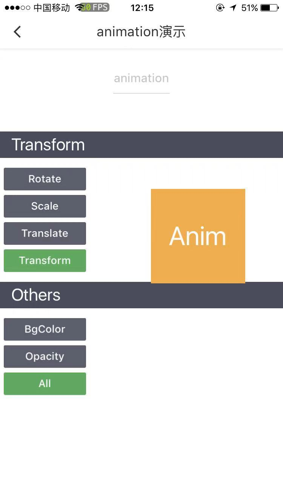

### animation

动画实例

##### [animation.export()](/api/createAnimation/animation/export.html)

导出动画队列

##### [animation.step(object Object)](/api/createAnimation/animation/step.html)

表示一组动画完成。可以在一组动画中调用任意多个动画方法，一组动画中的所有动画会同时开始，一组动画完成后才会进行下一组动画

##### [animation.rotate(number | number angle)](/api/createAnimation/animation/rotate.html)

从原点顺时针旋转一个角度

##### [animation.rotateX(number | number angle)](/api/createAnimation/animation/rotateX.html)

从 X 轴顺时针旋转一个角度

##### [animation.rotateY(number | number angle)](/api/createAnimation/animation/rotateY.html)

从 Y 轴顺时针旋转一个角度

##### [animation.rotateZ(number | number angle)](/api/createAnimation/animation/rotateZ.html)

从 Z 轴顺时针旋转一个角度

##### [animation.scale(number sx, number sy)](/api/createAnimation/animation/scale.html)

缩放

##### [animation.scaleX(number scale)](/api/createAnimation/animation/scaleX.html)

缩放 X 轴

##### [animation.scaleY(number scale)](/api/createAnimation/animation/scaleY.html)

缩放 Y 轴

<!-- ##### [Animation.skew(number ax, number ay)](/api/createAnimation/animation/skew.html)

对 X、Y 轴坐标进行倾斜

##### [Animation.skewX(number angle)](/api/createAnimation/animation/skewX.html)

对 X 轴坐标进行倾斜

##### [Animation.skewY(number angle)](/api/createAnimation/animation/skewY.html)

对 Y 轴坐标进行倾斜 -->

##### [animation.translate(number, number)](/api/createAnimation/animation/translate.html)

平移变换

##### [animation.translateX(number)](/api/createAnimation/animation/translateX.html)

对 X 轴平移

##### [animation.translateY(number)](/api/createAnimation/animation/translateY.html)

对 Y 轴平移

##### [animation.opacity(number)](/api/createAnimation/animation/opacity.html)

设置透明度

##### [animation.backgroundColor(string value)](/api/createAnimation/animation/backgroundColor.html)

设置背景色 （目前只支持 16 进制）

##### [animation.width(number)](/api/createAnimation/animation/width.html)

设置宽度

##### [animation.height(number)](/api/createAnimation/animation/height.html)

设置高度

### 示例

```html
<template>
  <view>
    <view class="block" c-animation="{{animationData}}" c-bind:click="handleClick">
      <text>请点击我</text>
    </view>
  </view>
</template>
<script>
  import { createAnimation } from 'chameleon-api';
  const animation = createAnimation();
  class Index {
    data = {
      animationData: null,
    };
    methods = {
      handleClick() {
        this.animationData = animation
          .translateX(200)
          .step({ duration: 1000 })
          .translateY(200)
          .step({ duration: 1000 })
          .width(100)
          .step({ duration: 1000 })
          .height(100)
          .step({ duration: 1000 })
          .backgroundColor('#000000')
          .step({ duration: 1000 })
          .opacity(0.1)
          .step({ duration: 1000 })
          .export();
      },
    };
  }
  export default new Index();
</script>
<style scoped>
  .block {
    position: absolute;
    width: 200cpx;
    height: 200cpx;
    background-color: #e3edcd;
  }
</style>
<script cml-type="json">
  {
      "base": {
          "usingComponents": {}
      }
  }
</script>
```

<div style="display: flex;flex-direction: row;justify-content: space-around; align-items: flex-end;">
  <div style="display: flex;flex-direction: column;align-items: center;">
    
    <text style="color: #fda775;font-size: 24px;">wx</text>
  </div>
  <div style="display: flex;flex-direction: column;align-items: center;">
    
    <text style="color: #fda775;font-size: 24px;">web</text>
  </div>
  <div style="display: flex;flex-direction: column;align-items: center;">
    
    <text style="color: #fda775;font-size: 24px;">native</text>
  </div>
</div>

[查看完整示例](/example/animation.html)
