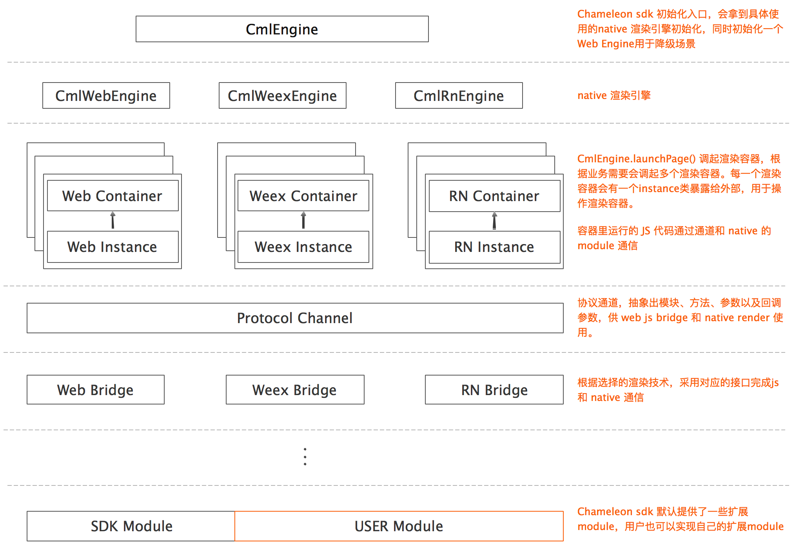

<h1>Android SDK 简介</h1>

github 地址[点这里](https://github.com/beatles-chameleon/chameleon-sdk-android)

Chameleon android SDK 是 Chameleon 整体框架的一部分，主要任务是完成 Chameleon JsBundle 在 android 端的本地渲染。SDK 底层采用 weex 作为渲染引擎，同时扩展一些一般工程通用的基础能力，如缓存能力、降级能力等。

# 1. 项目结构

项目一级目录结构如下：

```
|+ app SDK使用示例
|+ cmlsdk SDK接入层，抽象 Chameleon 引擎能力、实现通用扩展能力
|+ cmlweex 包装 weex 渲染引擎
|+ cmlweb 包装 web 渲染引擎
|+ js-bundle-mgr 实现 js bundle 预加载、缓存
|+ rich-text-component 富文本组件
|+ sdk-image 图片选择、图片拍摄组件
|+ sdk-location 位置组件
```

cmlsdk 模块单独拿出来看下目录结构：

```
|- cmlsdk
    |+ adapter 定义了扩展能力的接口以及默认实现，无默认实现的能力需要第三方项目根据自己的实际业务需求去实现
    |+ bridge 定义了 js 和 native 通信的接口，实现协议相关的处理能力，以及实现了协议层使用入口
    |+ bundle js bundle 相关定义，目前只有一个类用来描述 js bundle 相关信息
    |+ common 通用能力的基础封装类
    |+ container 渲染容器的抽象能力定义
    |+ extend Chameleon 提供的一些能力
    |+ module 扩展能力管理，收集 sdk 默认提供的以及第三方用户自己实现的 module，根据 bridge 层指令执行具体某个 module 的某个 method
    |+ utils 工具类集合
    |+ widget 自定义的widget，目前只有一个 title bar，用做 webview 渲染容器的action bar
    |- CmlBaseLifecycle 生命周期的接口定义
    |- CmlConstant 常量定义
    |- CmlEngine Chameleon SDK 使用入口
    |- CmlEnvironment 运行环境和运行参数配置入口、扩展能力设置入口
    |- CmlInstanceManage 页面运行实例的管理类，每一个容器实例运行时，其对应的Instance会注册到这里
    |- ICmlEngine 引擎的抽象接口
    |- ICmlInstance 容器实例抽象接口
    |- ICmlActivityInstance 全屏容器实例抽象接口
    |- ICmlViewInstance 视图容器实例抽象接口
```

项目整体架构如下图所示：



# 2. Chameleon 使用

Chameleon android SDK 的使用步骤如下:

- 引用 Chameleon 及工程需要的相关类库
- 在项目中初始化 Chameleon SDK
- 加载 JS Bundle

详细的使用方式可以参看手把手系列之[《变色龙 SDK 使用范例》](../../example/android_example.html)，建议<font color=#FF0000>先看使用范例</font>再阅读其他章节。

如果需要自定义自己的 adapter，参看[《Adapter 的使用》](./adapter.html)一节。如果需要扩展 module，参看[《Module 的使用》](./module.html)一节。

# 3. 基础类说明

## 3.1 CmlEngine

此类是 <em>Chameleon/kəˈmiːlɪən/</em> SDK 的入口类，提供基本的初始化入口和 <em>Chameleon</em>容器的调起能力。具体包含以下能力

- SDK 初始化入口
- 调起渲染容器
- 初始化预加载列表
- 注册扩展 module

## 3.2 CmlEnvironment

CmlEnvironment 主要提供了开发期间需要的一些能力，如

- 调试开关
- 降级开关
- 缓存开关

以及一些常量的定义，如

- 预加载的最大缓存
- 运行时的最大缓存

adapter 设置和获取，详情参看[《Adapter 的使用》](./adapter.html)一节

- 各种能力的自定义实现配置入口

# 4. 富文本组件

富文本是 Chameleon 里唯一一个默认注册的组件，主要有以下内容

```
 |
 |-richinfo     主要是富文本需要定义的协议、点击事件的回调等
 |-utils    工具类，主要是加载assets下默认的字体
 |-CmlRichTextComponent     继承与与CmlComponent的富文本组件
 |-CmlRichTextEngine     富文本入口类，
```

---

## richinfo

- CmlClickSpanListener：富文本点击事件回调
- CmlCustomTypefaceSpan：加载自定义字体
- CmlRichInfo：富文本协议及实现
- CmlRichInfoSpan：配合 CmlRichInfo 显示富文本文字，可直接设置给 TextView

## utils

- CmlFontUtil：主要就是加载自定义字体，如 assets 下 fonts 包下的 Barlow-Medium.ttf 字体

#### 相关链接

- [Module 的使用](/chameleon_client/android/module.html)
- [Adapter 的使用](/chameleon_client/android/adapter.html)
