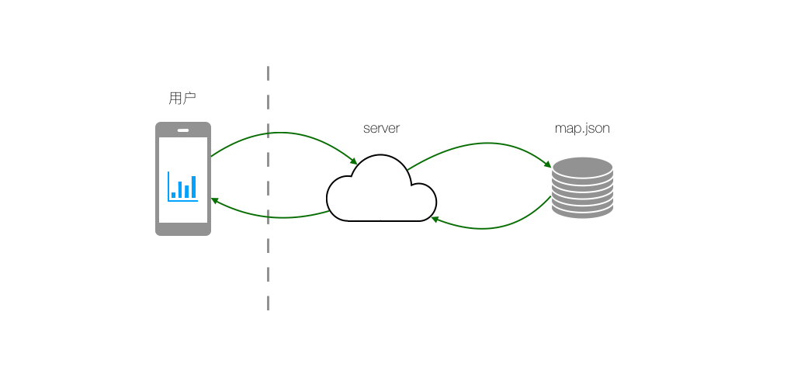

# 端 JS 包资源缓存、更新和预加载

## 缓存策略

浏览器在加载静态资源的时候一般的话会使用两种 HTTP 缓存管理机制：

- 强制缓存(Cache-Control、Expires)
- 协商式缓存(ETag、Last-Modified)

类似的，在使用`chameleon sdk`加载 JS 包的时候也会提供两种缓存管理机制：

- 基于 LRU 的强制缓存
- 类 HTTP 的协商式缓存(后续发布)

### 基于 LRU 的强制缓存

基于[LRU](https://baike.baidu.com/item/LRU)的`缓存策略`，简单来说就是实现了一个`缓存池`，每次请求先从缓存池中搜索一下，如果有就直接使用缓存池中的 JS 包，如果没有，就从网络上请求 JS 包资源并将资源缓存在缓存池中，每一份 JS 包缓存按照`最后使用时间`排序，当缓存池满了以后，将最早使用过的缓存从缓存池中`清理`出去，保证客户端上的资源占用可控。

#### 如何配置

- iOS
- android

### 类 HTTP 的协商式缓存(后续发布)

与普通浏览器实现的协商式缓存类似，用户只需在静态资源服务端配置好静态资源的协商式缓存头部，即可实现与普通浏览器一致的方式使用协商式缓存。

## 更新策略

当 JS 包升级迭代需要在客户端内使用最新的包时，在使用两种缓存方式下，相应的存在两周更新方式，下面会详细介绍

### 强制缓存下的更新：

由于强制缓存，客户端不会主动的去向服务器请求最新的更新包，会导致客户端一直使用老的版本。

为了能够打到规避这种情况，我们提供了一种可供参考的解决方案：

1. 配置文件指纹

设置`chameleon.config.js`中的`hash: true`，具体可参考工程化配置之[文件指纹](../framework/config.html)，`chameleon`项目构建出的 JS 包文件名会类似如下

```bash
test_project_c6bdf9074a821f01e70f.js
```

2. 上线打包出来的 JS 包

得到以下可以访问的资源地址

```bash
https://www.static.com/test_project_c6bdf9074a821f01e70f.js
```

3. 替换入口资源地址

将入口页面中的[chameleon url](../framework/chameleon_url.html)`cml_addr`替换成 encodeURIComponent 后的最新资源地址即可，比如

原 chameleon url:

```bash
https://www.static.com/test_project.html?cml_addr=https%3A%2F%2Fwww.static.com%2Ftest_project_21f01e70fc6bdf9074a8.js
```

新的 chameleon url

```bash
https://www.static.com/test_project.html?cml_addr=https%3A%2F%2Fwww.static.com%2Ftest_project_c6bdf9074a821f01e70f.js
```

**最佳实践**

由于强制缓存下每次修改都需要修改入口页面的 chameleon url 中的 cml_addr 参数，可能会导致修改频繁影响效率，所以建议通过后端读取[map.json](../framework/config.html#%E6%9E%84%E5%BB%BA%E7%BB%93%E6%9E%9C%E4%BF%A1%E6%81%AF)的方式下发跳转`chameleon url`进行统一管理。

具体请求过程如下图所示:



1. JS 包修改上线后，同时将`map.json`上线到服务器上
2. 入口页面加载数据时，服务器从`map.json`文件中查询到要跳转的`chameleon url`，并与初始化数据合并和下发给入口页面。
3. 入口页面逻辑将接受到的`chameleon url`作为需要跳转的链接进行使用。

这样每次 bundle 修改后可以自动完成更新

### 协商式缓存下的更新：

可以直接使用 http 的缓存更新策略，不需额外的配置。

## 预加载

在某些场景下，为了能够让页面更快的呈现在用户面前，需要让客户端提前下载一些 js 包，这时就需要用到预加载。

### 如何配置

- iOS
- android 参考[《变色龙 SDK 使用范例》](../example/android_example.html)第 6 节
