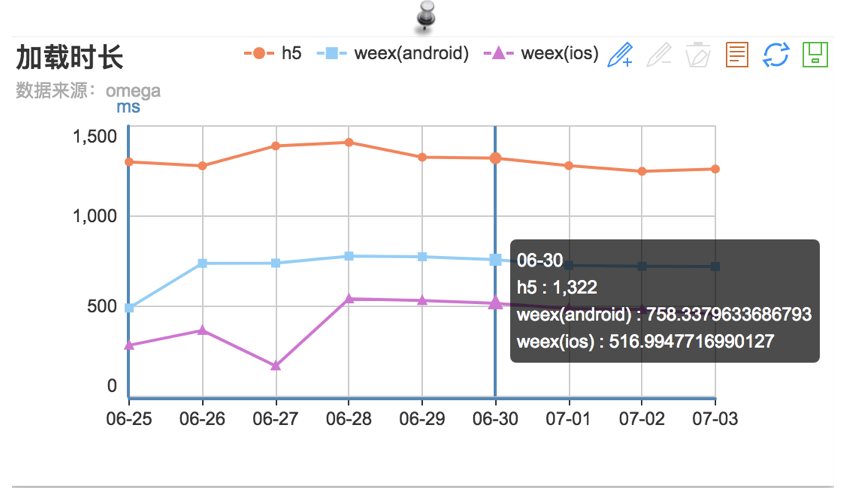

# 目前 Chameleon 的性能统计方式是 Omega 埋点。

#### bts_weex_container_load_time

记录从创建页面至渲染完成的耗时。

#### bts_weex_container_render_time

记录从开始加载（传递参数至 weex）至渲染完成的耗时。

#### bts_weex_container_exception

记录渲染失败、出错、H5 主动通知降级。

和 WebView 对比，性能统计对比图

