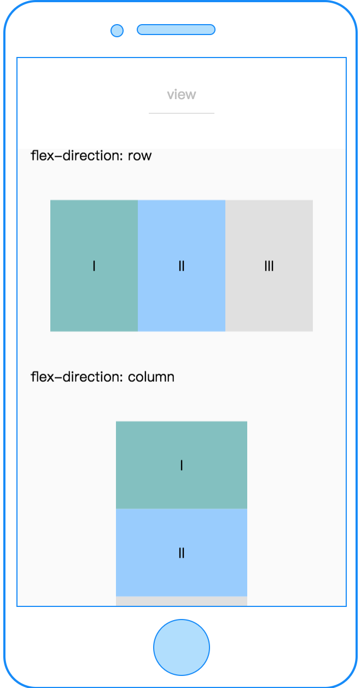
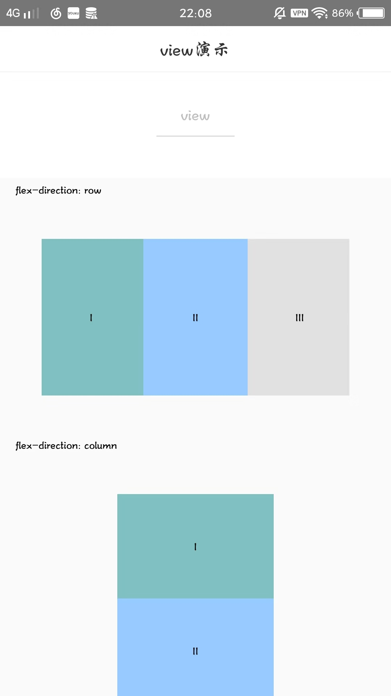

# view

---

视图容器。

类似 web 端的 div 块级元素标签。

### 示例

```html
<template>
  <view class="flex-item"></view>
</template>
<script>
  class View {}
  export default new View();
</script>
<style scoped>
  .flex-item {
    width: 200cpx;
    height: 300cpx;
    background-color: #81c0c0;
  }
</style>
<script cml-type="json">
  {
    "base": {}
  }
</script>
```

<div style="display: flex;flex-direction: row;justify-content: space-around; align-items: flex-end;">
  <div style="display: flex;flex-direction: column;align-items: center;">
    
    <text style="color: #fda775;font-size: 24px;">wx</text>
  </div>
  <div style="display: flex;flex-direction: column;align-items: center;">
    
    <text style="color: #fda775;font-size: 24px;">web</text>
  </div>
  <div style="display: flex;flex-direction: column;align-items: center;">
    
    <text style="color: #fda775;font-size: 24px;">native</text>
  </div>
</div>

### Bug & Tip

1. 如果需要使用滚动视图，请使用 [scroller](/component/base/layout/scroller.html) 包裹

[查看完整示例](/example/view.html)
