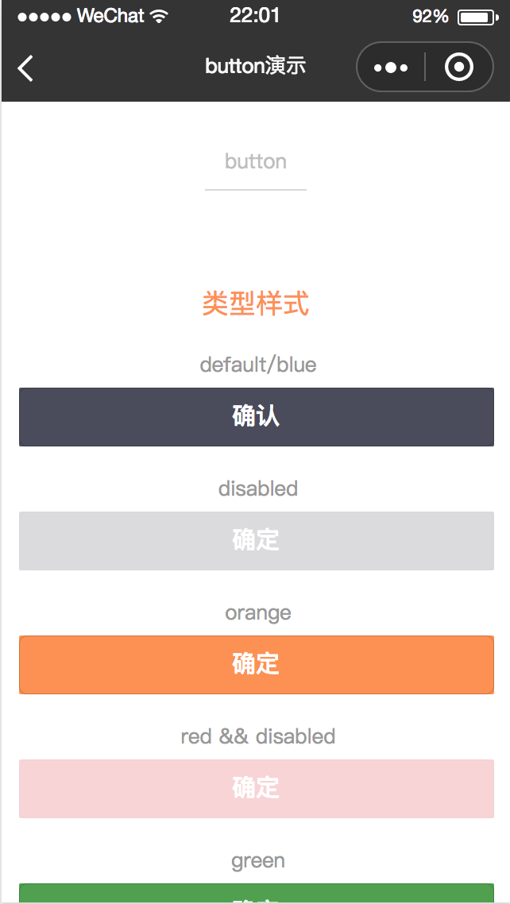
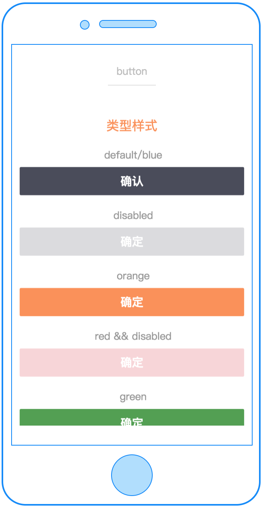
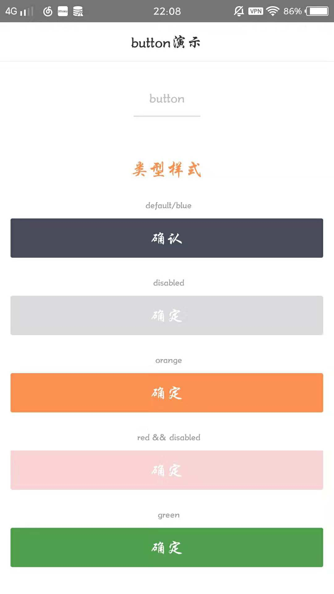

# button

---

按钮

### 属性

<table>
  <tr>
    <th width="150px">属性名</th>
    <th>类型</th>
    <th width="60px">必填</th>
    <th width="100px">默认值</th>
    <th>说明</th>
  </tr>
  <tr>
    <td>text</td>
    <td>String</td>
    <td>否</td>
    <td>无</td>
    <td>按钮文案，优先级高于 slot 属性，注意：默认button内容为空</td>
  </tr>
  <tr>
    <td>size</td>
    <td>String</td>
    <td>否</td>
    <td>auto</td>
    <td>按钮尺寸,可选值：auto、full、big、medium、small，注： auto 代表依据button内容撑开，如果父容器定义宽度，则继承父容器的宽度</td>
  </tr>
  <tr>
    <td>width</td>
    <td>Number</td>
    <td>否</td>
    <td>无</td>
    <td>自定义按钮宽度，单位为 cpx，优先级高于 size 属性 注意：类型是 Number</td>
  </tr>
  <tr>
    <td>type</td>
    <td>String</td>
    <td>否</td>
    <td>"blue"</td>
    <td>按钮颜色,可选值：red、orange、blue、white、green</td>
  </tr>
  <tr>
    <td>disabled</td>
    <td>Boolean</td>
    <td>否</td>
    <td>false</td>
    <td>是否禁用</td>
  </tr>
  <tr>
    <td>btn-style</td>
    <td>String</td>
    <td>否</td>
    <td></td>
    <td>自定义button的样式，如 "background-color:blue;height:100cpx;"</td>
  </tr>
  <tr>
    <td>text-style</td>
    <td>String</td>
    <td>否</td>
    <td></td>
    <td>自定义按钮text的样式，如 "color:red;text-align:center;"</td>
  </tr>
  <tr>
    <td>disabled-style</td>
    <td>String</td>
    <td>否</td>
    <td></td>
    <td>定义button disabled的样式，如 "background-color:grew;"</td>
  </tr>
  <tr>
    <td>text-style-disabled</td>
    <td>String</td>
    <td>否</td>
    <td></td>
    <td>定义button disabled时text的样式，如 "color:white;"</td>
  </tr>
  <tr>
    <td>btn-hover-style</td>
    <td>String</td>
    <td>否</td>
    <td></td>
    <td>指定按钮按下去的效果样式，如 "background-color:pink;"</td>
  </tr>
  <tr>
    <td>text-hover-style</td>
    <td>String</td>
    <td>否</td>
    <td></td>
    <td>指定按钮按下去的text样式，如 "color:pink;"</td>
  </tr>
  <tr>
    <td>slot</td>
    <td></td>
    <td>否</td>
    <td></td>
    <td>置于button里的插槽，可自由定义</td>
  </tr>
  <tr>
    <td>c-bind:onclick</td>
    <td>EventHandle</td>
    <td>否</td>
    <td></td>
    <td>button 点击事件
      <br/>
      返回事件对象：
      <br/>
      event.type= "onclick"
      <br/>
      event.detail = { type, disabled }
    </td>
  </tr>
  <!-- <tr>
    <td>open-type</td>
    <td>String</td>
    <td>否</td>
    <td></td>
    <td>微信开放能力，只支持wx端</td>
  </tr>
  <tr>
    <td>lang</td>
    <td>String</td>
    <td>否</td>
    <td>"en"</td>
    <td>指定返回用户信息的语言，有效值：zh_CN 简体中文，zh_TW 繁体中文，en 英文
      <br/>open-type="getUserInfo"时生效
    </td>
  </tr>
  <tr>
    <td>c-bind:getuserinfo</td>
    <td>Handler</td>
    <td>否</td>
    <td></td>
    <td>用户点击该按钮时，会返回获取到的用户信息
      <br/>open-type="getUserInfo"时生效
    </td>
  </tr>
  <tr>
    <td>session-from</td>
    <td>String</td>
    <td>否</td>
    <td></td>
    <td>会话来源
      <br/>open-type="contact"时生效
    </td>
  </tr>
  <tr>
    <td>send-message-title</td>
    <td>String</td>
    <td>否</td>
    <td>"当前标题"</td>
    <td>会话内消息卡片标题
      <br/>open-type="contact"时生效
    </td>
  </tr>
  <tr>
    <td>send-message-path</td>
    <td>String</td>
    <td>否</td>
    <td>"当前分享路径"</td>
    <td>会话内消息卡片点击跳转小程序路径
      <br/>open-type="contact"时生效
    </td>
  </tr>
  <tr>
    <td>send-message-img</td>
    <td>String</td>
    <td>否</td>
    <td>截图</td>
    <td>会话内消息卡片图片
      <br/>open-type="contact"时生效
    </td>
  </tr>
  <tr>
    <td>show-message-card</td>
    <td>Boolean</td>
    <td>否</td>
    <td>false</td>
    <td>是否显示会话内消息卡片
      <br/>open-type="contact"时生效
    </td>
  </tr>
  <tr>
    <td>c-bind:contact</td>
    <td>Handler</td>
    <td>否</td>
    <td></td>
    <td>客服消息回调
      <br/>open-type="contact"时生效
    </td>
  </tr>
  <tr>
    <td>c-bind:getphonenumber</td>
    <td>Handler</td>
    <td>否</td>
    <td></td>
    <td>获取用户手机号回调
      <br/>open-type="getPhoneNumber"时生效
    </td>
  </tr>
  <tr>
    <td>app-parameter</td>
    <td>String</td>
    <td>否</td>
    <td></td>
    <td>打开APP时，向APP传递的参数
      <br/>open-type="launchApp"时生效
    </td>
  </tr>
  <tr>
    <td>c-bind:error</td>
    <td>Handler</td>
    <td>否</td>
    <td></td>
    <td>当使用开放能力时，发生错误的回调
      <br/>open-type="launchApp"时生效
    </td>
  </tr>
  <tr>
    <td>c-bind:opensetting</td>
    <td>Handler</td>
    <td>否</td>
    <td></td>
    <td>在打开授权设置页后回调
      <br/>open-type="openSetting"时生效
    </td>
  </tr> -->
</table>

<!-- ### open-type 的有效值

<table>
  <tr>
    <th>值</th>
    <th>说明</th>
  </tr>
  <tr>
    <td>contact</td>
    <td>打开客服会话，如果用户在会话中点击消息卡片后返回小程序，可以从 c-bind:contact 回调中获取到用户所点消息的页面路径 path 和对应的参数 query</td>
  </tr>
  <tr>
    <td>share</td>
    <td>触发用户转发</td>
  </tr>
  <tr>
    <td>getUserInfo</td>
    <td>获取用户信息，可以从c-bind:getuserinfo回调中获取到用户信息</td>
  </tr>
  <tr>
    <td>getPhoneNumber</td>
    <td>获取用户手机号，可以从c-bind:getphonenumber回调中获取到微信服务器返回的加密数据</td>
  </tr>
  <tr>
    <td>launchApp</td>
    <td>打开APP，可以通过app-parameter属性设定向APP传的参数，通过 c-bind:error 可以监听打开 APP 的错误事件</td>
  </tr>
  <tr>
    <td>openSetting</td>
    <td>打开授权设置页</td>
  </tr>
  <tr>
    <td>feedback</td>
    <td>打开“意见反馈”页面</td>
  </tr>
</table> -->

### 示例

```html
<template>
  <button type="blue" text="确定" disabled="{{true}}" c-bind:onclick="testclick"></button>
</template>

<script>
  import cml from 'chameleon-api';
  class Button {
    methods = {
      testclick(e) {
        let type = e.detail.type;
        cml.showToast({
          message: type + ' button',
        });
      },
    };
  }
  export default new Button();
</script>
<script cml-type="json">
  {
    "base": {}
  }
</script>
```

<div style="display: flex;flex-direction: row;justify-content: space-around; align-items: flex-end;">
  <div style="display: flex;flex-direction: column;align-items: center;">
    
    <text style="color: #fda775;font-size: 24px;">wx</text>
  </div>
  <div style="display: flex;flex-direction: column;align-items: center;">
    
    <text style="color: #fda775;font-size: 24px;">web</text>
  </div>
  <div style="display: flex;flex-direction: column;align-items: center;">
    
    <text style="color: #fda775;font-size: 24px;">native</text>
  </div>
</div>

[查看完整示例](/example/button.html)
