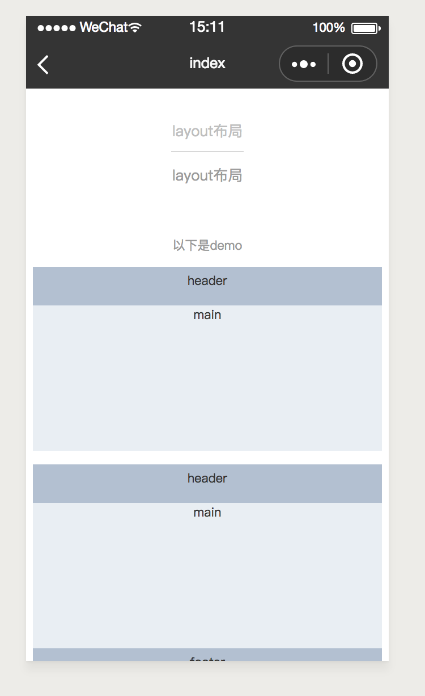

# container

---

### 属性

<table>
    <tr>
        <th>属性名</th>
        <th>类型</th>
        <th>必填</th>
        <th>默认值</th>
        <th>说明</th>
    </tr>
    <tr>
        <td>direction</td>
        <td>String</td>
        <td>否</td>
        <td>'row'</td>
        <td>container内布局组件的排列方式，默认是水平（row),可取值为 'row'或者 'column'</td>
    </tr>
</table>

# main

<table>
    <tr>
        <th>属性名</th>
        <th>类型</th>
        <th>必填</th>
        <th>默认值</th>
        <th>说明</th>
    </tr>
    <tr>
        <td>main-style</td>
        <td>String</td>
        <td>否</td>
        <td>''</td>
        <td>容器的样式</td>
    </tr>
</table>

# head

<table>
    <tr>
        <th>属性名</th>
        <th>类型</th>
        <th>必填</th>
        <th>默认值</th>
        <th>说明</th>
    </tr>
    <tr>
        <td>head-style</td>
        <td>String</td>
        <td>否</td>
        <td>''</td>
        <td>容器的样式</td>
    </tr>
</table>

# foot

<table>
    <tr>
        <th>属性名</th>
        <th>类型</th>
        <th>必填</th>
        <th>默认值</th>
        <th>说明</th>
    </tr>
    <tr>
        <td>foot-style</td>
        <td>String</td>
        <td>否</td>
        <td>''</td>
        <td>容器的样式</td>
    </tr>
</table>

# aside

<table>
    <tr>
        <th>属性名</th>
        <th>类型</th>
        <th>必填</th>
        <th>默认值</th>
        <th>说明</th>
    </tr>
    <tr>
        <td>aside-style</td>
        <td>String</td>
        <td>否</td>
        <td>''</td>
        <td>容器的样式</td>
    </tr>
</table>

### 示例

```html
<template>
  <view>
    <scroller height="{{-1}}">
      <view>
        <container direction="column">
          <head>
            <view>
              <text>header</text>
            </view>
          </head>
          <main>
            <view>
              <text>main</text>
            </view>
          </main>
        </container>
      </view>
      <!-- 2 -->
      <view>
        <container direction="column">
          <head>
            <view>
              <text>header</text>
            </view>
          </head>
          <main>
            <view>
              <text>main</text>
            </view>
          </main>
          <foot>
            <view>
              <text>footer</text>
            </view>
          </foot>
        </container>
      </view>
      <!-- 3 -->
      <view>
        <container direction="row">
          <aside>
            <view>
              <text>aside</text>
            </view>
          </aside>
          <main style="flex:1;">
            <view>
              <text>main</text>
            </view>
          </main>
        </container>
      </view>
      <!-- 4 -->
      <view>
        <container direction="column">
          <head>
            <view>
              <text>header</text>
            </view>
          </head>
          <container direction="row" style="flex:1;">
            <aside>
              <view>
                <text>aside</text>
              </view>
            </aside>
            <main style="flex:1;">
              <view>
                <text>main</text>
              </view>
            </main>
          </container>
        </container>
      </view>
      <!-- 5 -->
      <view>
        <container direction="column">
          <head>
            <view>
              <text>header</text>
            </view>
          </head>
          <container direction="row" style="flex:1;">
            <aside>
              <view>
                <text>aside</text>
              </view>
            </aside>
            <container direction="column" style="flex:1">
              <main style="flex:1;">
                <view>
                  <text>main</text>
                </view>
              </main>
              <foot>
                <view>
                  <text>foot</text>
                </view>
              </foot>
            </container>
          </container>
        </container>
      </view>
      <!-- 6 -->
      <view class="container-wrap">
        <container direction="row">
          <aside>
            <view>
              <text>aside</text>
            </view>
          </aside>
          <container direction="column" style="flex:1;">
            <head>
              <view>
                <text>header</text>
              </view>
            </head>
            <main style="flex:1;">
              <view>
                <text>main</text>
              </view>
            </main>
          </container>
        </container>
      </view>
      <!-- 7 -->
      <view>
        <container direction="row">
          <aside>
            <view>
              <text>aside</text>
            </view>
          </aside>
          <container direction="column" style="flex:1;">
            <head>
              <view>
                <text>header</text>
              </view>
            </head>
            <main style="flex:1;">
              <view>
                <text>main</text>
              </view>
            </main>
            <foot>
              <view>
                <text>footer</text>
              </view>
            </foot>
          </container>
        </container>
      </view>
    </scroller>
  </view>
</template>
<script>
  class CLayout {}
  export default new CLayout();
</script>
<script cml-type="json">
  {
    "base": {}
  }
</script>
```

<div style="display: flex;flex-direction: row;justify-content: space-around; align-items: flex-end;">
  <div style="display: flex;flex-direction: column;align-items: center;">
    
    <text style="color: #fda775;font-size: 24px;">wx</text>
  </div>
  <div style="display: flex;flex-direction: column;align-items: center;">
    
    <text style="color: #fda775;font-size: 24px;">web</text>
  </div>
  <div style="display: flex;flex-direction: column;align-items: center;">
    
    <text style="color: #fda775;font-size: 24px;">native</text>
  </div>
</div>

[查看完整示例](/example/container.html)
