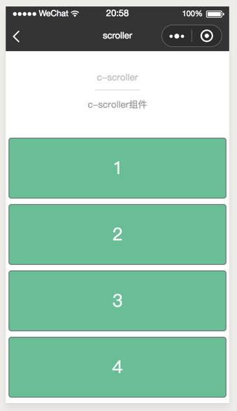
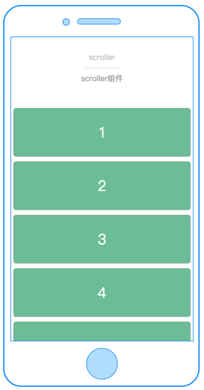
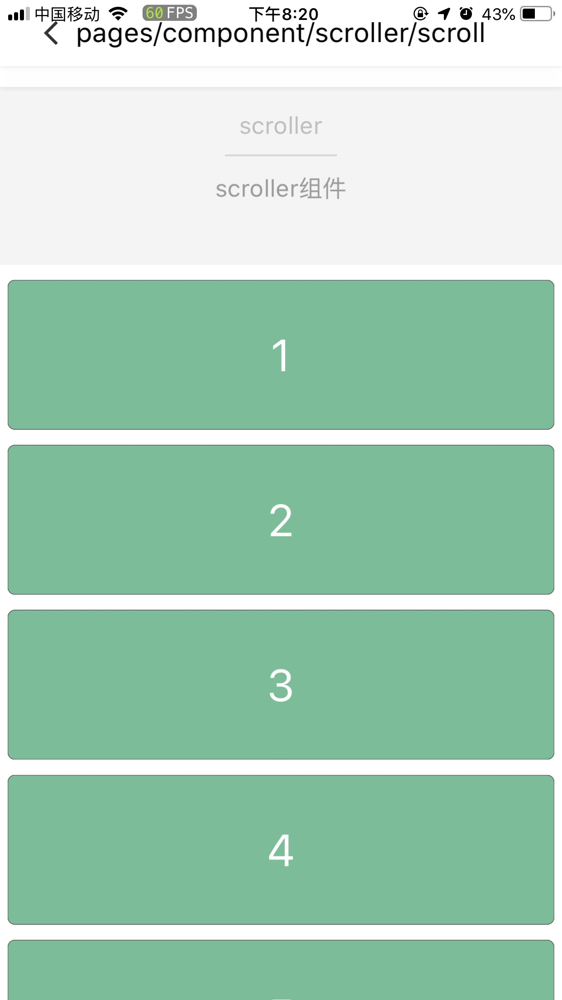

# scroller

---

可滚动视图区域。

可容纳排成一列的子组件的滚动器。

### 属性

<table>
  <tr>
    <th width="200px">属性名</th>
    <th>类型</th>
    <th width="60px">必填</th>
    <th>默认值</th>
    <th>说明</th>
  </tr>
  <tr>
    <td>cstyle</td>
    <td>String</td>
    <td>否</td>
    <td></td>
    <td>自定义组件内联样式</td>
  </tr>
  <tr>
    <td>height</td>
    <td>Number</td>
    <td>scroll-direction为`vertical`时必传</td>
    <td>无</td>
    <td>定义纵向滚动区域的高度<br/>
      注意：<br/>
      1、&#60;scroller&#62; height="&#123;&#123;100&#125;&#125;" /&#62; <br/>
      这样传值才是Number类型
      <br/>
      2、height为-1时，&#60;scroller&#62;的可滚动区域高度为scroller放置点至页面底部
    </td>
  </tr>
  <tr>
    <td>width</td>
    <td>Number</td>
    <td>scroll-direction为`horizontal`时必传</td>
    <td>无</td>
    <td>定义横向滚动区域的宽度<br/>
      注意：<br/>
      height为-1时，&#60;scroller&#62;填充页面剩余宽度
    </td>
  </tr>
  <tr>
    <td>scroll-direction</td>
    <td>String</td>
    <td>否</td>
    <td>vertical</td>
    <td>定义滚动的方向。可选为 horizontal 或者 vertical</td>
  </tr>
  <tr>
    <td>bottom-offset</td>
    <td>Number</td>
    <td>否</td>
    <td>0</td>
    <td>距底部/右边多远时（单位cpx），触发 onBottom 事件</td>
  </tr>
  <tr>
    <td>scroll-top</td>
    <td>Number</td>
    <td>否</td>
    <td>0</td>
    <td>scroll-direction为`vertical`时，设置滚动到的位置，（单位cpx）</td>
  </tr>
  <tr>
    <td>scroll-left</td>
    <td>Number</td>
    <td>否</td>
    <td>0</td>
    <td>scroll-direction为`horizontal`时，设置滚动到的位置，（单位cpx）</td>
  </tr>
  <tr>
    <td>bounce</td>
    <td>Boolean</td>
    <td>否</td>
    <td>true</td>
    <td>上拉下拉是否回弹(仅支持web)</td>
  </tr>
  <tr>
    <td>c-bind:scrolltobottom</td>
    <td>EventHandle</td>
    <td>否</td>
    <td></td>
    <td>滚动到底部，会触发 scrolltobottom 事件
      <br/>
      返回事件对象：
      <br/>
      event.type= "scrolltobottom"
      <br/>
      event.detail = { direction }
    </td>
  </tr>
  <tr>
    <td>c-bind:onscroll</td>
    <td>EventHandle</td>
    <td>否</td>
    <td></td>
    <td>滚动时触发，
        <br/>
        返回事件对象：
        <br/>
        event.type = 'scroll'
        <br/>
        event.detail = {scrollLeft, scrollTop, scrollHeight, scrollWidth, deltaX, deltaY}
    </td>
  </tr>
</table>

### 限制

不允许相同方向的 `<list>` 或者 `<scroller>` 互相嵌套，换句话说就是嵌套的 `<list>`/`<scroller>` 必须是不同的方向。

举个例子，不允许一个垂直方向的 `<list>` 嵌套的一个垂直方向的 `<scroller>` 中，但是一个垂直方向的 `<list>` 是可以嵌套的一个水平方向的 `<list>` 或者 `<scroller>` 中的。

### 示例

```html
<template>
  <view class="container">
    <scroller
      scroll-direction="{{scrollDirection}}"
      bottom-offset="{{bottomOffset}}"
      c-bind:scrolltobottom="onBottom"
      c-bind:onscroll="onScroll"
      height="{{-1}}"
    >
      <view
        class="cell"
        c-for="{{panels}}"
        c-for-index="i"
        c-for-item="item"
        c-bind:tap="change"
        data-idx="{{i}}"
      >
        <view class="panel" style="{{item.computedStyle}}">
          <text class="text">{{item.label}}</text>
        </view>
      </view>
    </scroller>
  </view>
</template>

<script>
  class Scroller {
    data = {
      /**
       * scroller 配置
       */
      bottomOffset: 20,
      scrollDirection: 'vertical',
      panels: [],
      rows: [],
    };
    methods = {
      change(e) {
        let target = e.currentTarget;
        let dataset = target.dataset;
        let i = dataset.idx;

        const item = this.panels[i];
        if (item) {
          item.height = item.height === 200 ? 400 : 200;
          item.width = item.width === 330 ? 730 : 330;
          item.computedStyle = `height:${item.height}cpx;width:${item.width}cpx;background-color:${item.bgc};opacity:${item.opacity}`;
        }
      },
      randomfn() {
        let ary = [];
        for (let i = 1; i <= 40; i++) {
          let item = { label: i, height: 200, width: 730, bgc: '#69BE96', opacity: 1 };
          item.computedStyle = `height:${item.height}cpx;width:${item.width}cpx;background-color:${item.bgc};opacity:${item.opacity}`;

          ary.push(item);
        }
        return ary;
      },
      onScroll(e) {
        console.log(e);
      },
      onBottom(e) {
        console.log(e);
      },
    };
    created(res) {
      this.panels = this.randomfn();

      for (let i = 0; i < 30; i++) {
        this.rows.push('row ' + i);
      }
      console.log('demo page created:', res);
    }
  }
  export default new Scroller();
</script>
<style scoped>
  .container {
    position: absolute;
    top: 0;
    left: 0;
    right: 0;
    bottom: 0;
  }
  .title {
    text-align: center;
    flex-direction: row;
    justify-content: center;
  }
  .panel {
    display: flex;
    margin: 10cpx;
    top: 10cpx;
    align-items: center;
    justify-content: center;
    text-align: center;
    border: 1px solid #666;
    border-radius: 10cpx;
    transition-property: width, height;
    transition-duration: 0.5s;
    transition-delay: 0s;
    transition-timing-function: cubic-bezier(0.25, 0.1, 0.25, 1);
  }
  .cell {
    display: flex;
    background-color: white;
    flex-direction: row;
  }

  .text {
    font-size: 60cpx;
    color: white;
  }
</style>

<script cml-type="json">
  {
    "base": {}
  }
</script>
```

<div style="display: flex;flex-direction: row;justify-content: space-around; align-items: flex-end;">
  <div style="display: flex;flex-direction: column;align-items: center;">
    
    <text style="color: #fda775;font-size: 24px;">wx</text>
  </div>
  <div style="display: flex;flex-direction: column;align-items: center;">
    
    <text style="color: #fda775;font-size: 24px;">web</text>
  </div>
  <div style="display: flex;flex-direction: column;align-items: center;">
    
    <text style="color: #fda775;font-size: 24px;">native</text>
  </div>
</div>

### Bug & Tip

1. 使用竖向滚动时，`<scroller>`需要有一个固定高度。
2. 如果子组件的总高度高于其本身，那么所有的子组件都可滚动。
3. `<scroller>`可以当作根元素或者嵌套元素使用。
4. `<scroller>` 中不可以使用 `<textarea>`、`<video>` 组件。
5. `<scroller>` 中不建议在`<scroller>`上面加 class 改变样式，可以通过 cstyle 属性传入内联样式。
6. `<scroller>` 的子组件定位无效。
