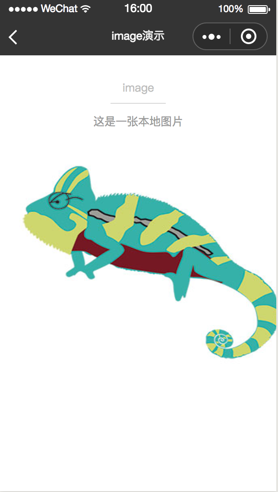
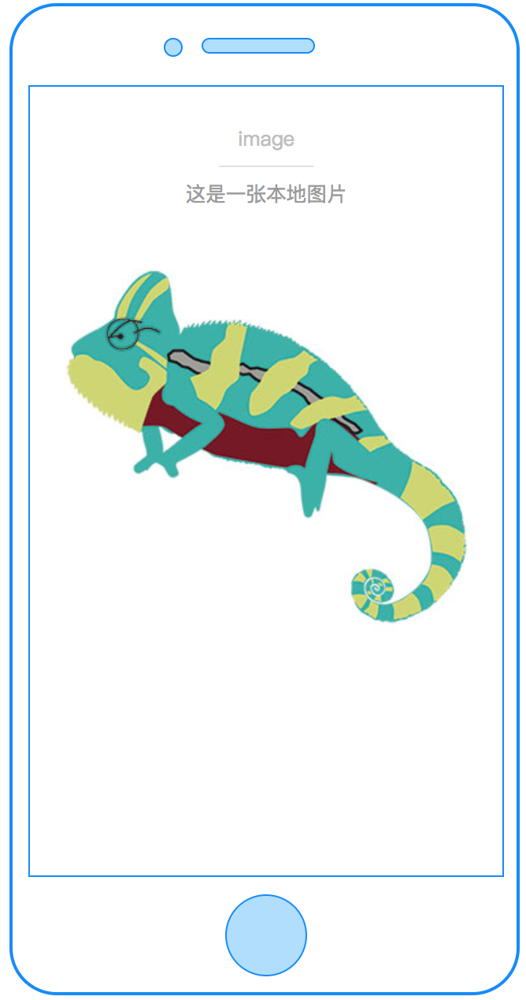

# image

---

图片

### 属性

<table>
  <tr>
    <th width="200px">属性名</th>
    <th>类型</th>
    <th width="60px">必填</th>
    <th width="80px">默认值</th>
    <th>说明</th>
  </tr>
  <tr>
    <td>src</td>
    <td>String</td>
    <td>否</td>
    <td></td>
    <td>图片资源地址，支持本地路径和网络图片资源</td>
  </tr>
  <!-- <tr>
    <td>cstyle</td>
    <td>String</td>
    <td>否</td>
    <td></td>
    <td>自定义image的样式，如 "height:100cpx;width:100cpx;"</td>
  </tr>
  <tr>
    <td>c-bind:error</td>
    <td>EventHandle</td>
    <td>否</td>
    <td></td>
    <td>当错误发生时触发，event.detail = {errMsg}
    </td>
  </tr>
  <tr>
    <td>c-bind:load</td>
    <td>EventHandle</td>
    <td>否</td>
    <td></td>
    <td>当图片载入完毕时触发，event.detail = {height, width}
    </td>
  </tr> -->
</table>

### 示例

```html
<template>
  <image src="{{imageSrc}}" style="width: 682px;height:600px;"></image>
</template>

<script>
  class Image {
    data = {
      imageSrc: require('../../../assets/images/chameleon.jpg'),
    };
    methods = {
      imageLoad(e) {},
      imageError(e) {},
    };
  }
  export default new Image();
</script>

<style scoped>
  .container {
    display: flex;
    flex-direction: column;
    align-items: center;
  }
</style>
<script cml-type="json">
  {
    "base": {}
  }
</script>
```

<div style="display: flex;flex-direction: row;justify-content: space-around; align-items: flex-end;">
  <div style="display: flex;flex-direction: column;align-items: center;">
    
    <text style="color: #fda775;font-size: 24px;">wx</text>
  </div>
  <div style="display: flex;flex-direction: column;align-items: center;">
    
    <text style="color: #fda775;font-size: 24px;">web</text>
  </div>
  <div style="display: flex;flex-direction: column;align-items: center;">
    
    <text style="color: #fda775;font-size: 24px;">native</text>
  </div>
</div>

[查看完整示例](/example/image.html)
