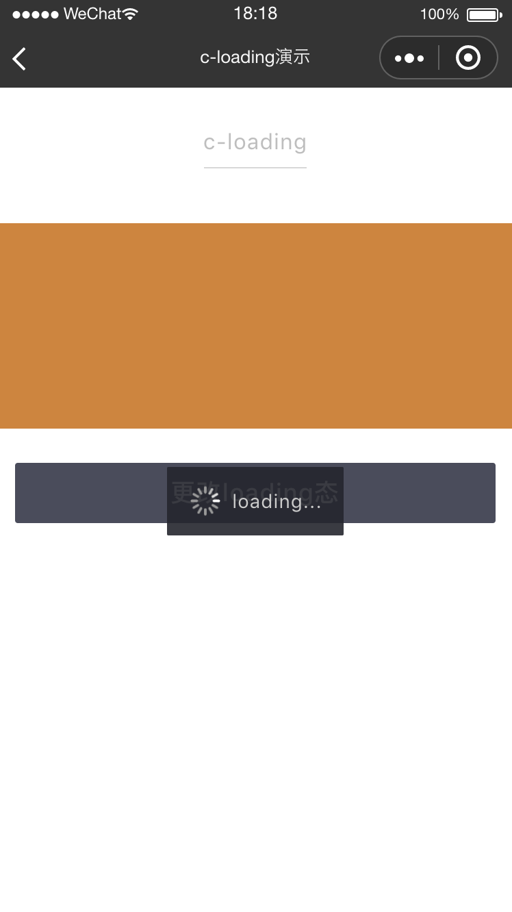
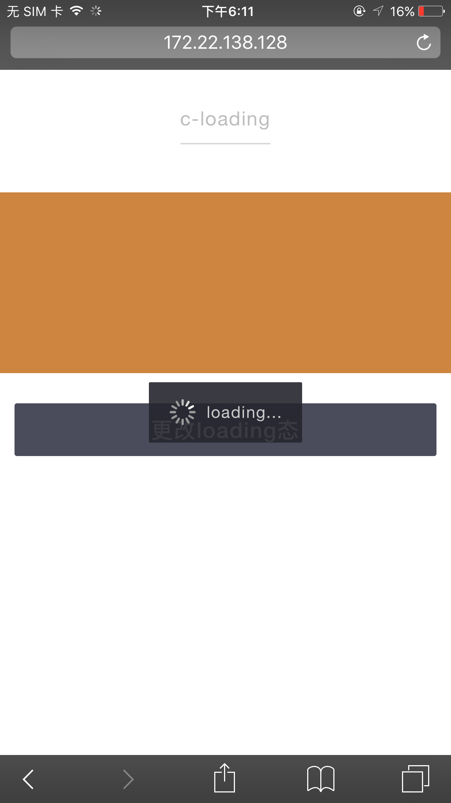
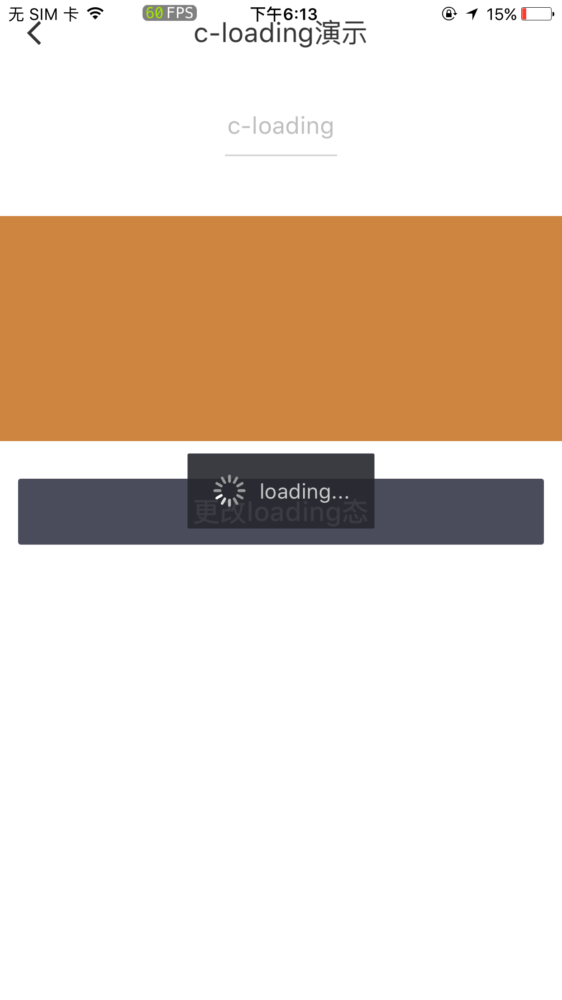
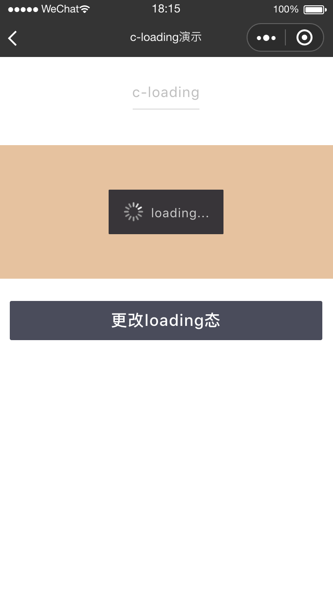
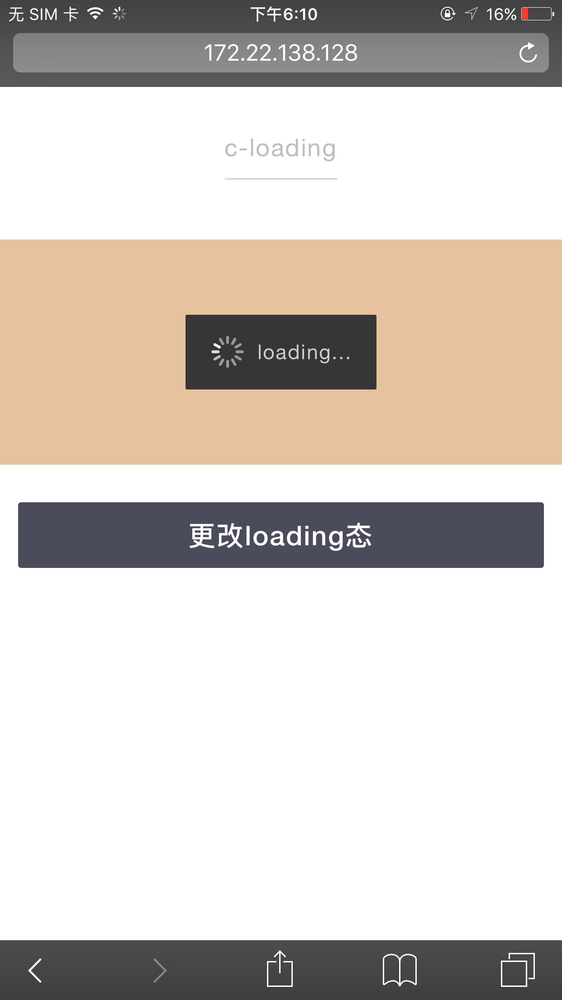
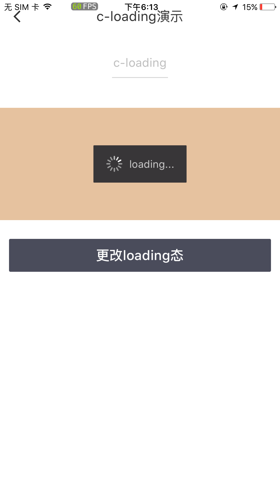

# c-loading

---

加载中

### 属性

<table>
    <tr>
        <th>属性名</th>
        <th>类型</th>
        <th>必填</th>
        <th>默认值</th>
        <th>说明</th>
    </tr>
    <tr>
        <td>tip</td>
        <td>String</td>
        <td>否</td>
        <td>'loading...'</td>
        <td>描述文案</td>
    </tr>
    <tr>
        <td>loading</td>
        <td>Boolean</td>
        <td>否</td>
        <td>true</td>
        <td>是否为加载中状态</td>
    </tr>
</table>

### 示例 1

> 注： 使用此模式时，请将 c-loading 组件放在所有元素的最后，如使用 router-view，请放在 router-view 后面

```html
<template>
  <c-loading loading="{{true}}"></c-loading>
</template>
<script cml-type="json">
  {
    "base": {
        "usingComponents": {
            "c-loading": "cml-ui/components/c-loading/c-loading"
        }
    }
  }
</script>
```

<div style="display: flex;flex-direction: row;justify-content: space-around; align-items: flex-end;">
  <div style="display: flex;flex-direction: column;align-items: center;">
    
    <text style="color: #fda775;font-size: 24px;">wx</text>
  </div>
  <div style="display: flex;flex-direction: column;align-items: center;">
    
    <text style="color: #fda775;font-size: 24px;">web</text>
  </div>
  <div style="display: flex;flex-direction: column;align-items: center;">
    
    <text style="color: #fda775;font-size: 24px;">native</text>
  </div>
</div>

### 示例 2

```html
<template>
  <c-loading loading="{{true}}"></c-loading>
</template>

<script>
  class CLoading {}
  export default new CLoading();
</script>

<script cml-type="json">
  {
    "base": {
        "usingComponents": {
            "c-loading": "cml-ui/components/c-loading/c-loading"
        }
    }
  }
</script>
```

<div style="display: flex;flex-direction: row;justify-content: space-around; align-items: flex-end;">
  <div style="display: flex;flex-direction: column;align-items: center;">
    
    <text style="color: #fda775;font-size: 24px;">wx</text>
  </div>
  <div style="display: flex;flex-direction: column;align-items: center;">
    
    <text style="color: #fda775;font-size: 24px;">web</text>
  </div>
  <div style="display: flex;flex-direction: column;align-items: center;">
    
    <text style="color: #fda775;font-size: 24px;">native</text>
  </div>
</div>
