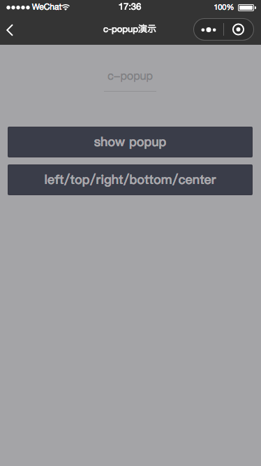
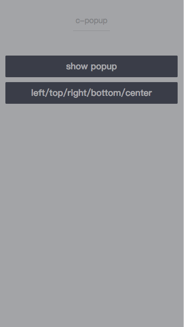
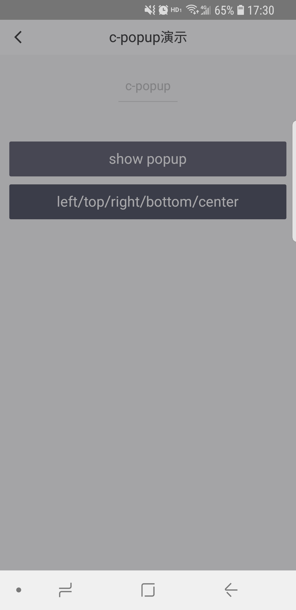

# c-popup

---

蒙层

### 属性

<table>
    <tr>
        <th>属性名</th>
        <th>类型</th>
        <th>必填</th>
        <th>默认值</th>
        <th>说明</th>
    </tr>
    <tr>
        <td>mask</td>
        <td>Boolean</td>
        <td>否</td>
        <td>true</td>
        <td>是否显示透明蒙层</td>
    </tr>
    <tr>
        <td>show</td>
        <td>Boolean</td>
        <td>是</td>
        <td>false</td>
        <td>开启打开popup</td>
    </tr>
    <tr>
        <td>center</td>
        <td>Boolean</td>
        <td>否</td>
        <td>true</td>
        <td>内容是否垂直水平居中</td>
    </tr>
    <tr>
        <td>position</td>
        <td>String</td>
        <td>否</td>
        <td></td>
        <td>内容展示位置，优先级比center高，可选值left/top/right/bottom</td>
    </tr>
    <tr>
        <td>c-bind:close</td>
        <td>EventHandle</td>
        <td>否</td>
        <td></td>
        <td>点击蒙层时触发</td>
    </tr>
</table>

###示例

```html
<template>
  <c-popup show="{{true}}" mask="{{true}}"></c-popup>
</template>
<script>
  class C_popup {}
  export default new C_popup();
</script>
<script cml-type="json">
  {
    "base": {
        "usingComponents": {
            "c-popup": "cml-ui/components/c-popup/c-popup"
        }
    }
  }
</script>
```

<div style="display: flex;flex-direction: row;justify-content: space-around; align-items: flex-end;">
  <div style="display: flex;flex-direction: column;align-items: center;">
    
    <text style="color: #fda775;font-size: 24px;">wx</text>
  </div>
  <div style="display: flex;flex-direction: column;align-items: center;">
    
    <text style="color: #fda775;font-size: 24px;">web</text>
  </div>
  <div style="display: flex;flex-direction: column;align-items: center;">
    
    <text style="color: #fda775;font-size: 24px;">native</text>
  </div>
</div>

[查看完整示例](/example/c-popup.html)
