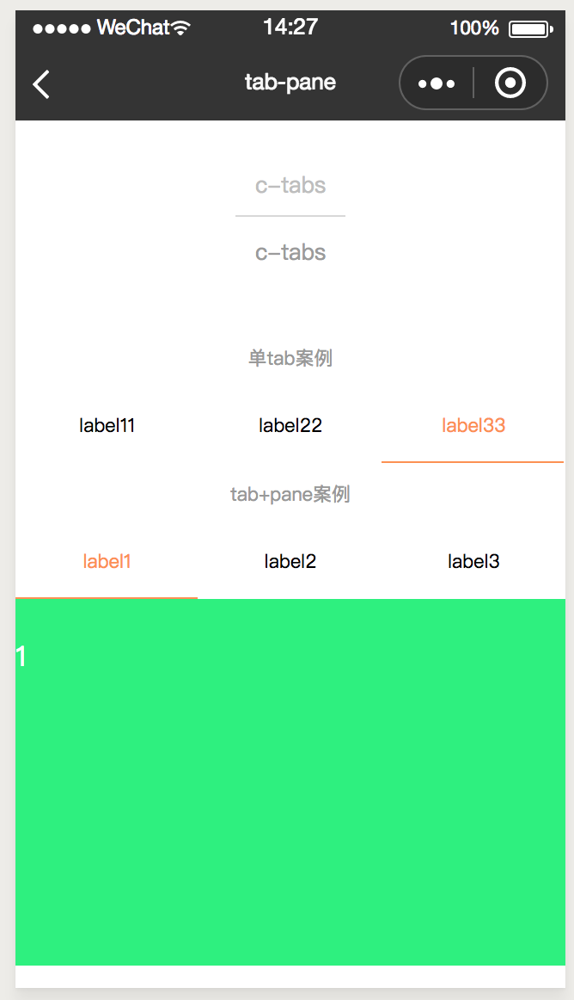
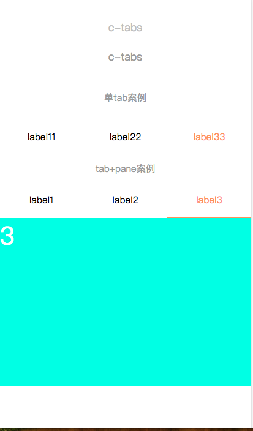
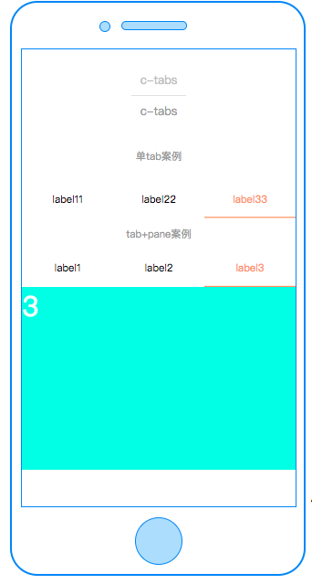

# c-tab

---

### 属性

<table>
    <tr>
        <th>属性名</th>
        <th>类型</th>
        <th>必填</th>
        <th>默认值</th>
        <th>说明</th>
    </tr>
    <tr>
        <td>tabs</td>
        <td>Array</td>
        <td>是</td>
        <td>[]</td>
        <td>tabs显示内容数组，tabs中数组中具体的值请看tabs详情</td>
    </tr>
    <tr>
        <td>active-label</td>
        <td>String</td>
        <td>是</td>
        <td>tabs数组中的某一个label的值</td>
        <td>注意必须和tabs数组中某一个label的值相等</td>
    </tr>
    <tr>
        <td>inline</td>
        <td>Boolean</td>
        <td>否</td>
        <td>true</td>
        <td>代表每一个tab栏的 前置icon + tab内容 + 后置icon 的排列方向，默认水平排列</td>
    </tr>
    <tr>
        <td>line-style</td>
        <td>String</td>
        <td>否</td>
        <td>''</td>
        <td>标识tab栏的下划标志线的样式</td>
    </tr>
    <tr>
        <td>active-label-style</td>
        <td>String</td>
        <td>否</td>
        <td>"color:#FC9153"</td>
        <td>标识tab栏激活后的文案的样式</td>
    </tr>
    <tr>
        <td>has-underline</td>
        <td>Boolean</td>
        <td>否</td>
        <td>true</td>
        <td>是否需要下划线</td>
    </tr>
    <tr>
        <td>active-icon-style</td>
        <td>String</td>
        <td>否</td>
        <td>''</td>
        <td>label前缀icon或者后缀icon激活后的样式</td>
    </tr>
</table>

### 事件

<table>
    <tr>
        <th>事件名</th>
        <th>描述</th>
        <th>事件参数中detail对象</th>
    </tr>
    <tr>
        <td>tabclick</td>
        <td>点击每个tab时候出发的事件名称</td>
        <td>label:表示激活tab的文案,activeIndex:表示激活tab的索引</td>
    </tr>
</table>

### tabs 数组具体属性详情

<table>
    <tr>
        <th>属性名</th>
        <th>类型</th>
        <th>必填</th>
        <th>默认值</th>
        <th>说明</th>
    </tr>
    <tr>
        <td>label</td>
        <td>String</td>
        <td>是</td>
        <td>tabs数组中的某一个label的值</td>
        <td>注意必须和tabs数组中某一个label的值相等</td>
    </tr>
    <tr>
        <td>labelStyle</td>
        <td>String</td>
        <td>否</td>
        <td></td>
        <td>外部传入控制每一个tab栏的文案样式</td>
    </tr>
    <tr>
        <td>prefixStyle</td>
        <td>String</td>
        <td>否</td>
        <td></td>
        <td>外部传入控制每一个tab栏的前缀样式</td>
    </tr>
    <tr>
        <td>suffixStyle</td>
        <td>String</td>
        <td>否</td>
        <td></td>
        <td>外部传入控制每一个tab栏的后缀样式</td>
    </tr>
</table>

# c-tab-pane

### 属性

<table>
    <tr>
        <th>属性名</th>
        <th>类型</th>
        <th>必填</th>
        <th>默认值</th>
        <th>说明</th>
    </tr>
    <tr>
        <td>tabs</td>
        <td>Array</td>
        <td>是</td>
        <td>[]</td>
        <td>tabs显示内容数组，tabs中数组中具体的值请看tabs详情</td>
    </tr>
    <tr>
        <td>active-label</td>
        <td>String</td>
        <td>是</td>
        <td>tabs数组中的某一个label的值</td>
        <td>注意必须和tabs数组中某一个label的值相等</td>
    </tr>
</table>

**注意，如果 c-tab-pane 组件配合 c-tabs 组件使用，那么二者的 tabs 和 active-label 属性必须引用同一个值；每个 c-tab-pane 组件下，同时对应一个 c-tab-pane-item 组件；**

### c-tab-pane-item

用于提供一个可以容纳每个 pane 的容器,宽度 750cpx;

### 示例

```html
<template>
  <view>
    <!-- 单tab测试 -->
    <view class="title">
      <text>单tab案例</text>
    </view>
    <c-tab
      tabs="{{tabsAlone}}"
      c-bind:tabclick="handleTabTapAlone"
      active-label="{{activeLabelAlone}}"
      inline="{{false}}"
    >
    </c-tab>
    <view class="title">
      <text class="title">tab+pane案例</text>
    </view>
    <c-tab
      tabs="{{tabs}}"
      c-bind:tabclick="handleTabTap"
      active-label="{{activeLabel}}"
      inline="{{false}}"
    >
    </c-tab>
    <c-tab-pane tabs="{{tabs}}" active-label="{{activeLabel}}">
      <!-- 案例1 -->
      <!-- 
      <c-tab-pane-item c-for="{{tabs}}" >
      <slot><text>{{item.label}}</text></slot>
      </c-tab-pane-item> 
      -->

      <!-- 案例2 -->
      <c-tab-pane-item>
        <view class="one">
          <text>1</text>
        </view>
      </c-tab-pane-item>
      <c-tab-pane-item>
        <view class="two">
          <text>2</text>
        </view>
      </c-tab-pane-item>
      <c-tab-pane-item>
        <view class="three">
          <text>3</text>
        </view>
      </c-tab-pane-item>
      <c-tab-pane-item>
        <view>
          <text>4</text>
        </view>
      </c-tab-pane-item>
    </c-tab-pane>
  </view>
</template>
<script cml-type="json">
  {
    "base": {
        "usingComponents": {
            "c-tab": "cml-ui/components/c-tab/c-tab",
            "c-tab-pane": "cml-ui/components/c-tab-pane/c-tab-pane",
            "c-tab-pane-item": "cml-ui/components/c-tab-pane-item/c-tab-pane-item"
        }
    }
  }
</script>
```

<div style="display: flex;flex-direction: row;justify-content: space-around; align-items: flex-end;">
  <div style="display: flex;flex-direction: column;align-items: center;">
    
    <text style="color: #fda775;font-size: 24px;">wx</text>
  </div>
  <div style="display: flex;flex-direction: column;align-items: center;">
    
    <text style="color: #fda775;font-size: 24px;">web</text>
  </div>
  <div style="display: flex;flex-direction: column;align-items: center;">
    
    <text style="color: #fda775;font-size: 24px;">native</text>
  </div>
</div>

[查看完整示例](/example/c-tab.html)
