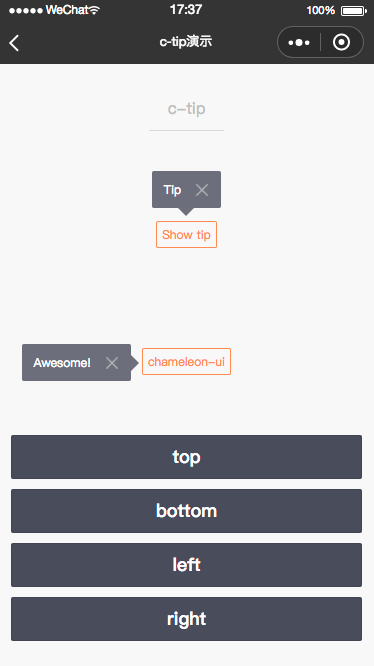
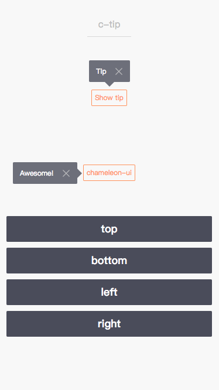
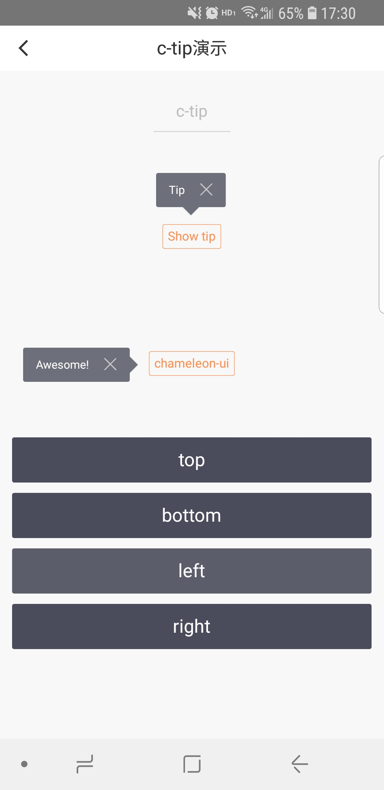

# c-tip

---

提示

### 属性

<table>
  <tr>
    <th>属性名</th>
    <th>类型</th>
    <th>必填</th>
    <th>默认值</th>
    <th>说明</th>
  </tr>
  <tr>
    <td>show</td>
    <td>Boolean</td>
    <td>否</td>
    <td>false</td>
    <td>提示框是否显示</td>
  </tr>
  <tr>
    <td>direction</td>
    <td>String</td>
    <td>否</td>
    <td>top</td>
    <td>提示框所在位置，可选值top/right/bottom/left</td>
  </tr>
  <tr>
    <td>offset-left</td>
    <td>Number</td>
    <td>否</td>
    <td></td>
    <td>小三角之Tip左边距离</td>
  </tr>
  <tr>
    <td>offset-top</td>
    <td>Number</td>
    <td>否</td>
    <td></td>
    <td>小三角之Tip顶部距离</td>
  </tr>
  <tr>
    <td>offset-right</td>
    <td>Number</td>
    <td>否</td>
    <td></td>
    <td>小三角之Tip右边距离</td>
  </tr>
  <tr>
    <td>offset-bottom</td>
    <td>Number</td>
    <td>否</td>
    <td></td>
    <td>小三角之Tip底部距离</td>
  </tr>
  <tr>
    <td>c-bind:close</td>
    <td>EventHandle</td>
    <td></td>
    <td></td>
    <td>点击关闭按钮触发</td>
  </tr>
</table>

> 注意：Tip 小三角默认是居中显示的，当 direction 值为 top 或 bottom 时，如果 offset-left 或 offset-right 有值且不是 NaN，则小三角的距离为传入值

### 示例

```html
<template>
  <view class="container">
    <c-tip show="{{true}}" direction="top" style="position:absolute;top:0;left:0;">
      <text style="font-size: 24cpx;color: #fff">Tip</text>
    </c-tip>

    <c-tip show="{{true}}" direction="left" style="postions: absolute;top: 200cpx;left: 0;">
      <text style="font-size: 24cpx;color: #fff">Awesome!</text>
    </c-tip>
  </view>
</template>
<script>
  class CTip {}

  export default new CTip();
</script>
<script cml-type="json">
  {
    "base": {
        "usingComponents": {
            "c-tip": "cml-ui/components/c-tip/c-tip"
        }
    }
  }
</script>
```

<div style="display: flex;flex-direction: row;justify-content: space-around; align-items: flex-end;">
  <div style="display: flex;flex-direction: column;align-items: center;">
    
    <text style="color: #fda775;font-size: 24px;">wx</text>
  </div>
  <div style="display: flex;flex-direction: column;align-items: center;">
    
    <text style="color: #fda775;font-size: 24px;">web</text>
  </div>
  <div style="display: flex;flex-direction: column;align-items: center;">
    
    <text style="color: #fda775;font-size: 24px;">native</text>
  </div>
</div>

[查看完整示例](/example/c-tip.html)
