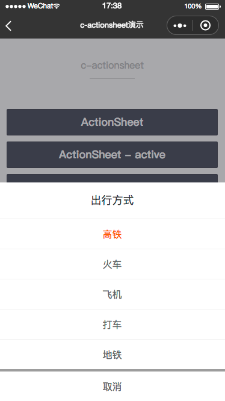
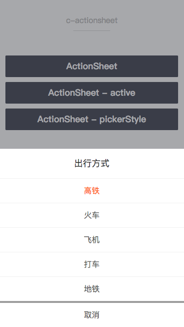
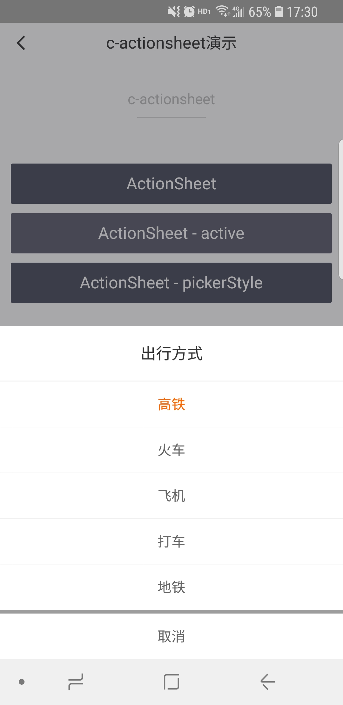

# c-actionsheet

---

操作列表

### 属性

<table>
  <tr>
    <th>属性名</th>
    <th>类型</th>
    <th>必填</th>
    <th>默认值</th>
    <th>说明</th>
  </tr>
  <tr>
    <td>title</td>
    <td>String</td>
    <td>否</td>
    <td>标题</td>
    <td>操作列表标题</td>
  </tr>
  <tr>
    <td>list</td>
    <td>Array</td>
    <td>是</td>
    <td>[]</td>
    <td>操作列表数据，如['action1', 'action2']</td>
  </tr>
  <tr>
    <td>active</td>
    <td>Number</td>
    <td></td>
    <td></td>
    <td>当前选中元素索引，从0开始</td>
  </tr>
  <tr>
    <td>show</td>
    <td>Boolean</td>
    <td>否</td>
    <td>false</td>
    <td>操作列表是否显示</td>
  </tr>
  <tr>
    <td>cancel-txt</td>
    <td>String</td>
    <td>否</td>
    <td>取消</td>
    <td>取消按钮文本</td>
  </tr>
  <tr>
    <td>header-style</td>
    <td>String</td>
    <td>否</td>
    <td></td>
    <td>标题自定义样式</td>
  </tr>
  <tr>
    <td>cancel-style</td>
    <td>String</td>
    <td>否</td>
    <td></td>
    <td>取消按钮自定义样式</td>
  </tr>
  <tr>
    <td>content-style</td>
    <td>String</td>
    <td>否</td>
    <td></td>
    <td>普通操作样式</td>
  </tr>
  <tr>
    <td>active-style</td>
    <td>String</td>
    <td>否</td>
    <td></td>
    <td>当前选中操作样式</td>
  </tr>
  <tr>
    <td>c-bind:select</td>
    <td>EventHandle</td>
    <td>否</td>
    <td></td>
    <td>点击操作时触发，event.detail = { index, value }</td>
  </tr>
  <tr>
    <td>c-bind:cancel</td>
    <td>EventHandle</td>
    <td>否</td>
    <td></td>
    <td>点击取消或蒙层时触发</td>
  </tr>
</table>

### 示例

```vue
<template>
  <c-actionsheet
    show="{{true}}"
    title="{{title}}"
    list="{{list}}"
    active="{{0}}"
    cancel-txt="取消"
  ></c-actionsheet>
</template>

<script>
class C_actionsheet {
  data = {
    list: ['高铁', '火车', '飞机', '打车', '地铁'],
    title: '出行方式',
  };
}
export default new C_actionsheet();
</script>
<script cml-type="json">
{
  "base": {
      "usingComponents": {
          "c-actionsheet": "cml-ui/components/c-actionsheet/c-actionsheet"
      }
  }
}
</script>
```

<div style="display: flex;flex-direction: row;justify-content: space-around; align-items: flex-end;">
  <div style="display: flex;flex-direction: column;align-items: center;">
    
    <text style="color: #fda775;font-size: 24px;">wx</text>
  </div>
  <div style="display: flex;flex-direction: column;align-items: center;">
    
    <text style="color: #fda775;font-size: 24px;">web</text>
  </div>
  <div style="display: flex;flex-direction: column;align-items: center;">
    
    <text style="color: #fda775;font-size: 24px;">native</text>
  </div>
</div>
