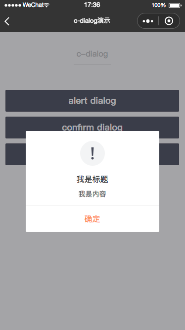
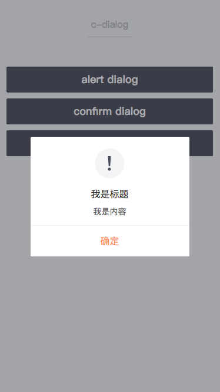
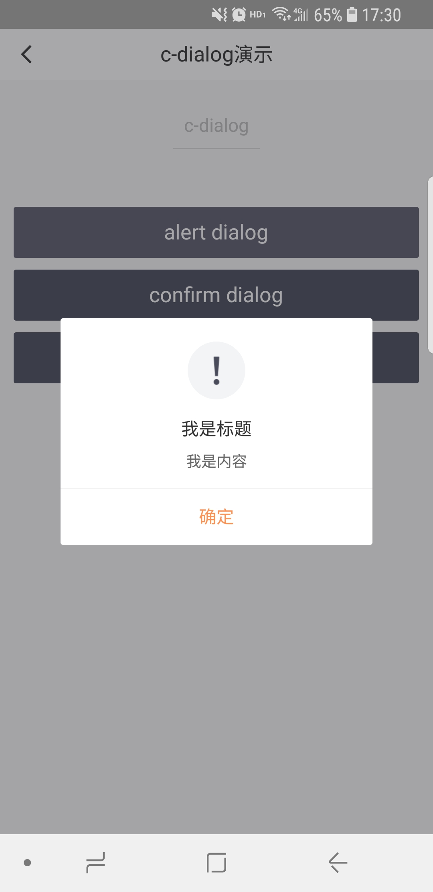

# c-dialog

---

对话框

### 属性

<table>
    <tr>
        <th>属性名</th>
        <th>类型</th>
        <th>必填</th>
        <th>默认值</th>
        <th>说明</th>
    </tr>
    <tr>
        <td>title</td>
        <td>String</td>
        <td>是</td>
        <td></td>
        <td>对话框提示的标题</td>
    </tr>
    <tr>
        <td>content</td>
        <td>String</td>
        <td>是</td>
        <td></td>
        <td>对话框提示的内容</td>
    </tr>
    <tr>
        <td>type</td>
        <td>String</td>
        <td>否</td>
        <td>alert</td>
        <td>对话框的类型，有效值：alert/confirm</td>
    </tr>
    <tr>
        <td>cancel-text</td>
        <td>String</td>
        <td>否</td>
        <td>“取消”</td>
        <td>取消按钮的文字</td>
    </tr>
    <tr>
        <td>cancel-style</td>
        <td>Object</td>
        <td>否</td>
        <td></td>
        <td>
          自定义取消按钮的文案样式 <br/>
          如 {'color':'red','text-align':'center'}
        </td>
    </tr>
    <tr>
        <td>confirm-text</td>
        <td>String</td>
        <td>否</td>
        <td>“确定”</td>
        <td>确认按钮的文字</td>
    </tr>
    <tr>
        <td>confirm-style</td>
        <td>Object</td>
        <td>否</td>
        <td></td>
        <td>
          自定义确认按钮的文案样式<br/>
          如 {'color':'red','text-align':'center'}
        </td>
    </tr>
    <tr>
        <td>icon-type</td>
        <td>String</td>
        <td>否</td>
        <td>“warn”</td>
        <td>图标，有效值success/warn</td>
    </tr>
    <tr>
        <td>icon-url</td>
        <td>String</td>
        <td>否</td>
        <td></td>
        <td>图标地址</td>
    </tr>
    <tr>
        <td>icon-style</td>
        <td>Object</td>
        <td>否</td>
        <td></td>
        <td>图标的样式</td>
    </tr>
    <tr>
        <td>mask</td>
        <td>Boolean</td>
        <td>否</td>
        <td>true</td>
        <td>是否显示透明蒙层</td>
    </tr>
    <tr>
        <td>show</td>
        <td>Boolean</td>
        <td>否</td>
        <td>false</td>
        <td>开启打开alert类型对话框</td>
    </tr>
    <tr>
        <td>show-close</td>
        <td>Boolean</td>
        <td>否</td>
        <td>false</td>
        <td>是否显示close关闭图标</td>
    </tr>
    <tr>
        <td>c-bind:show</td>
        <td>EventHandle</td>
        <td>否</td>
        <td></td>
        <td>开启alert类型对话框时触发<br/>返回事件对象：<br/>event.type="changeShow",<br/>e.detail={value}</td>
    </tr>
    <tr>
        <td>c-bind:cancel</td>
        <td>EventHandle</td>
        <td>否</td>
        <td></td>
        <td>用户点击cancel时触发<br/>返回事件对象：<br/>event.type="cancelEvent"</td>
    </tr>
    <tr>
        <td>c-bind:confirm</td>
        <td>EventHandle</td>
        <td>否</td>
        <td></td>
        <td>用户点击confirm时触发<br/>返回事件对象：<br/>event.type="confirmEvent"</td>
    </tr>
    <tr>
        <td>c-bind:close</td>
        <td>EventHandle</td>
        <td>否</td>
        <td></td>
        <td>点击close图标时触发<br/>返回事件对象：
            <br/>event.type="closeEvent"
        </td>
    </tr>
</table>

### 示例

```vue
<template>
  <view class="toast-page">
    <c-dialog show="{{true}}" title="标题" mask="{{true}}" content="内容内容"> </c-dialog>
  </view>
</template>

<script>
class C_dialog {}

export default new C_dialog();
</script>

<script cml-type="json">
{
  "base": {
    "usingComponents": {
      "c-dialog": "cml-ui/components/c-dialog/c-dialog"
    }
  }
}
</script>
```

<div style="display: flex;flex-direction: row;justify-content: space-around; align-items: flex-end;">
  <div style="display: flex;flex-direction: column;align-items: center;">
    
    <text style="color: #fda775;font-size: 24px;">wx</text>
  </div>
  <div style="display: flex;flex-direction: column;align-items: center;">
    
    <text style="color: #fda775;font-size: 24px;">web</text>
  </div>
  <div style="display: flex;flex-direction: column;align-items: center;">
    
    <text style="color: #fda775;font-size: 24px;">native</text>
  </div>
</div>
