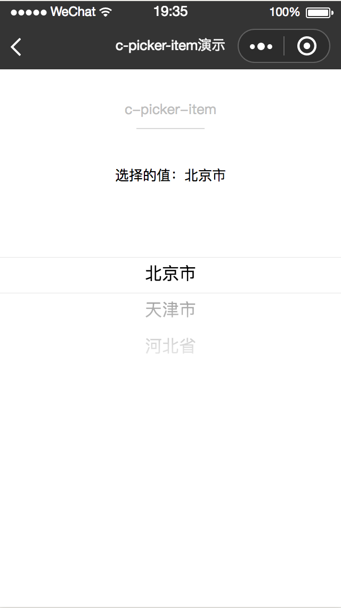
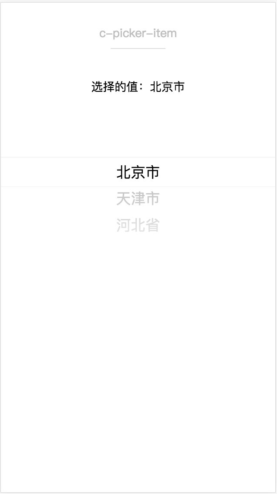
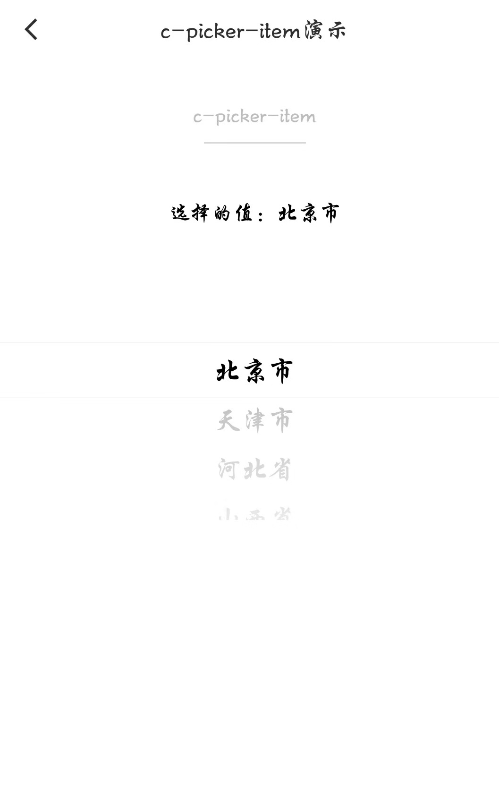

# c-picker-item

---

滚动选择器

### 属性

<table>
  <tr>
    <th>属性名</th>
    <th>类型</th>
    <th>必填</th>
    <th>默认值</th>
    <th>说明</th>
  </tr>
  <tr>
    <td>list</td>
    <td>Array</td>
    <td>是</td>
    <td>['']</td>
    <td>滚动选择器滚动的数据，注意：data 属性名已废弃</td>
  </tr>
  <tr>
    <td>default-index</td>
    <td>Number</td>
    <td>是</td>
    <td>0</td>
    <td>滚动选择器默认的数据索引</td>
  </tr>
  <tr>
    <td>height</td>
    <td>Number</td>
    <td>是</td>
    <td>400</td>
    <td>滚动选择器的高度</td>
  </tr>
  <tr>
    <td>text-align</td>
    <td>String</td>
    <td>是</td>
    <td>"center"</td>
    <td>滚动选择器的文本样式:"居中"</td>
  </tr>
  <tr>
    <td>c-bind:selectchange</td>
    <td>EventHandle</td>
    <td>是</td>
    <td></td>
    <td>
    选择器滚动时触发:
    <br/>
    返回事件对象:
    <br/>
    event.type="selectchange"
    <br/>
    event.detail = {index}</td>
  </tr>
</table>

### 示例

```vue
<template>
  <page title="c-picker-item演示">
    <view class="container">
      <text class="select-text">选择的值：{{ provins[provinsIndex] }}</text>
      <c-picker-item
        text-align="center"
        height="{{400}}"
        list="{{provins}}"
        default-index="{{defaultIndex}}"
        c-bind:selectchange="selectchange"
      >
      </c-picker-item>
    </view>
  </page>
</template>
<script>
import { provins } from './data';
class CPickerItem {
  data = {
    provins: [
      '北京市',
      '天津市',
      '河北省',
      '山西省',
      '内蒙古',
      '辽宁省',
      '吉林省',
      '黑龙江省',
      '上海市',
      '江苏省',
      '浙江省',
      '安徽省',
      '福建省',
      '江西省',
      '山东省',
      '河南省',
      '湖北省',
      '湖南省',
      '广东省',
      '广西',
      '海南省',
      '重庆市',
      '四川省',
      '贵州省',
      '云南省',
      '西藏',
      '陕西省',
      '甘肃省',
      '青海',
      '宁夏',
      '新疆',
    ],
    defaultIndex: 0,
    provinsIndex: 0,
  };

  computed = {};
  watch = {};

  methods = {
    selectchange(e) {
      this.provinsIndex = this.defaultIndex = e.detail.index;
    },
  };

  beforeCreate() {}
  created() {}
  beforeMount() {}
  mounted() {}
  beforeDestroy() {}
  destroyed() {}
}

export default new CPickerItem();
</script>
<style scoped>
.container {
  background: #f8f8f8;
}
.page-demo {
  background: #fafafa;
}
.title-text {
  color: #999;
  margin: 30cpx 20cpx 10cpx;
  display: block;
  font-size: 28cpx;
}
.picker-item {
  background: #fff;

  border-top: 1px solid #d9d9d9;
  border-bottom: 1px solid #d9d9d9;
  display: flex;
  flex-direction: row;
}
.picker-text-left {
  font-size: 40cpx;
  height: 70cpx;
  line-height: 70cpx;
  margin-left: 20cpx;
  width: 300cpx;
}
.picker-text-right {
  font-size: 40cpx;
  height: 70cpx;
  line-height: 70cpx;
  margin-left: 20cpx;
  flex: 1;
  text-align: center;
}
.select-text {
  font-size: 32cpx;
  text-align: center;
  display: flex;
  justify-content: center;
  align-items: center;
}
</style>
<script cml-type="json">
{
    "base": {
        "usingComponents": {
            "c-picker-item": "cml-ui/components/c-picker-item/c-picker-item"
        }
    }
}
</script>
```

<div style="display: flex;flex-direction: row;justify-content: space-around; align-items: flex-end;">
  <div style="display: flex;flex-direction: column;align-items: center;">
    
    <text style="color: #fda775;font-size: 24px;">wx</text>
  </div>
  <div style="display: flex;flex-direction: column;align-items: center;">
    
    <text style="color: #fda775;font-size: 24px;">web</text>
  </div>
  <div style="display: flex;flex-direction: column;align-items: center;">
    
    <text style="color: #fda775;font-size: 24px;">native</text>
  </div>
</div>

### Bug & Tips

1.使用`c-picker-item`组件时控制显示隐藏需要在该组件的父节点上添加`c-if`指令，保证隐藏时父节点被销毁，否则会导致微信小程序错误。
