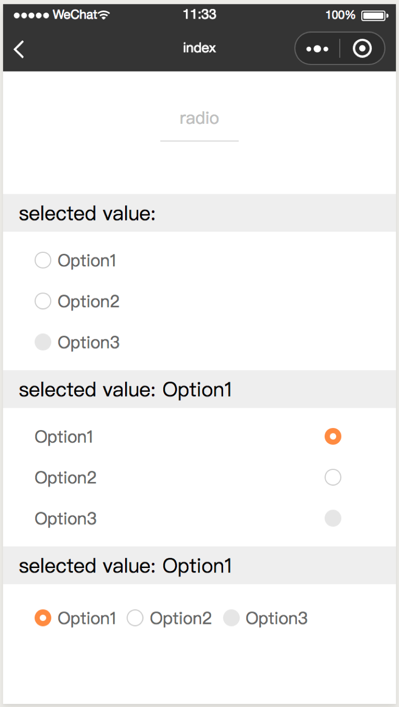
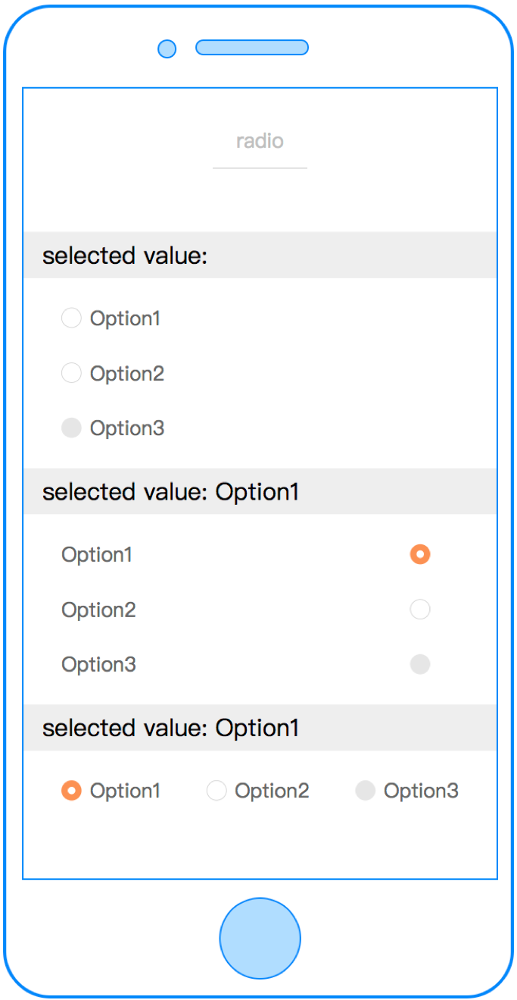
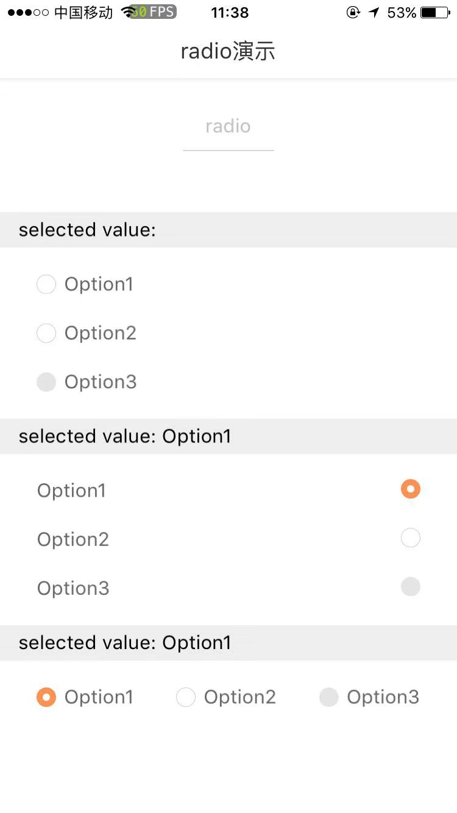

# c-radio-group

---

单选框列表

### 属性

<table>
  <tr>
    <th width="200px">属性名</th>
    <th>类型</th>
    <th width="60px">必填</th>
    <th>默认值</th>
    <th>说明</th>
  </tr>
  <tr>
    <td>option</td>
    <td>Array</td>
    <td>是</td>
    <td>[]</td>
    <td>选项数组</td>
  </tr>
  <tr>
    <td>horizontal</td>
    <td>Boolean</td>
    <td>否</td>
    <td>false</td>
    <td>单选框排列方向，默认纵向排列</td>
  </tr>
  <tr>
    <td>position</td>
    <td>String</td>
    <td>否</td>
    <td>left</td>
    <td>按钮相对于文案的位置，可选值包括：left、right</td>
  </tr>
  <tr>
    <td>color</td>
    <td>String</td>
    <td>否</td>
    <td>-</td>
    <td>选中时颜色</td>
  </tr>
  <tr>
    <td>cstyle</td>
    <td>String</td>
    <td>否</td>
    <td>-</td>
    <td>自定义样式</td>
  </tr>
  <tr>
    <td>itemStyle</td>
    <td>String</td>
    <td>否</td>
    <td>-</td>
    <td>radio自定义样式</td>
  </tr>
  <tr>
    <td>c-bind:groupchange</td>
    <td>EventHandle</td>
    <td>否</td>
    <td></td>
    <td>点击按钮出发
        <br/>返回事件对象：
        <br/>event.detail
        <br/>返回值：
        <br/>event.detail.value - 修改后的选项数组
        <br/>event.detail.index - 修改的单选框索引
    </td>
  </tr>
</table>

### 示例

```vue
<template>
  <c-radio-group option="{{ radioGroupOption }}" c-bind:groupchange="groupChangeHandler">
  </c-radio-group>
</template>
<script>
class CRadio {
  data = {
    radioGroupOption: [
      {
        checked: false,
        label: 'Option1',
      },
      {
        checked: false,
        label: 'Option2',
      },
      {
        checked: false,
        label: 'Option3',
        disabled: true,
      },
    ],
    radioSelect: '',
  };

  methods = {
    groupChangeHandler(e) {
      this.radioSelect = this.radioGroupOption[e.detail.index].label;
    },
  };
}

export default new CRadio();
</script>
<script cml-type="json">
{
  "base": {
      "usingComponents": {
          "c-radio-group": "cml-ui/components/c-radio-group/c-radio-group"
      }
  }
}
</script>
```

<div style="display: flex;flex-direction: row;justify-content: space-around; align-items: flex-end;">
  <div style="display: flex;flex-direction: column;align-items: center;">
    
    <text style="color: #fda775;font-size: 24px;">wx</text>
  </div>
  <div style="display: flex;flex-direction: column;align-items: center;">
    
    <text style="color: #fda775;font-size: 24px;">web</text>
  </div>
  <div style="display: flex;flex-direction: column;align-items: center;">
    
    <text style="color: #fda775;font-size: 24px;">native</text>
  </div>
</div>
