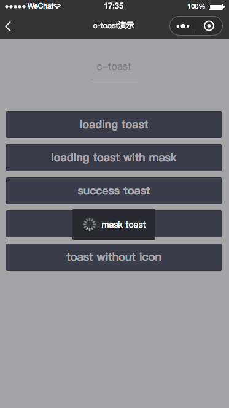
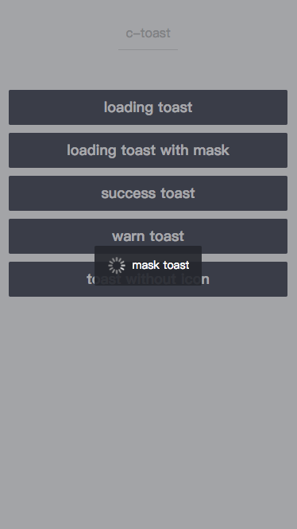
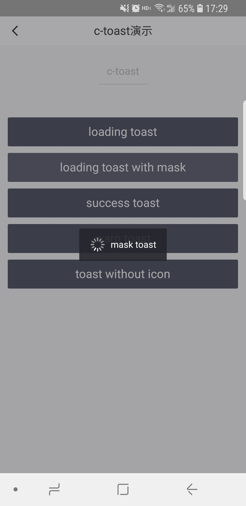

# c-toast

---

提示框

### 属性

<table>
    <tr>
        <th>属性名</th>
        <th>类型</th>
        <th>必填</th>
        <th>默认值</th>
        <th>说明</th>
    </tr>
    <tr>
        <td>message</td>
        <td>String</td>
        <td>是</td>
        <td></td>
        <td>提示框提示的内容</td>
    </tr>
    <tr>
        <td>duration</td>
        <td>Number</td>
        <td>否</td>
        <td>3000</td>
        <td>提示的延迟时间，单位为毫秒</td>
    </tr>
    <tr>
        <td>type</td>
        <td>String</td>
        <td>否</td>
        <td>“loading”</td>
        <td>提示框的类型，有效值：loading/success/warn</td>
    </tr>
    <tr>
        <td>mask</td>
        <td>Boolean</td>
        <td>否</td>
        <td>false</td>
        <td>是否显示透明蒙层</td>
    </tr>
    <tr>
        <td>show</td>
        <td>Boolean</td>
        <td>否</td>
        <td>false</td>
        <td>是否显示</td>
    </tr>
    <tr>
        <td>need-icon</td>
        <td>Boolean</td>
        <td>否</td>
        <td>true</td>
        <td>是否显示图标</td>
    </tr>
</table>

### 示例

```vue
<template>
  <view class="toast-page">
    <c-toast show="{{true}}" message="加载中..." mask="{{true}}"></c-toast>
  </view>
</template>
<script>
class C_toast {}

export default new C_toast();
</script>
<script cml-type="json">
{
  "base": {
      "usingComponents": {
          "c-toast": "cml-ui/components/c-toast/c-toast"
      }
  }
}
</script>
```

<div style="display: flex;flex-direction: row;justify-content: space-around; align-items: flex-end;">
  <div style="display: flex;flex-direction: column;align-items: center;">
    
    <text style="color: #fda775;font-size: 24px;">wx</text>
  </div>
  <div style="display: flex;flex-direction: column;align-items: center;">
    
    <text style="color: #fda775;font-size: 24px;">web</text>
  </div>
  <div style="display: flex;flex-direction: column;align-items: center;">
    
    <text style="color: #fda775;font-size: 24px;">native</text>
  </div>
</div>
