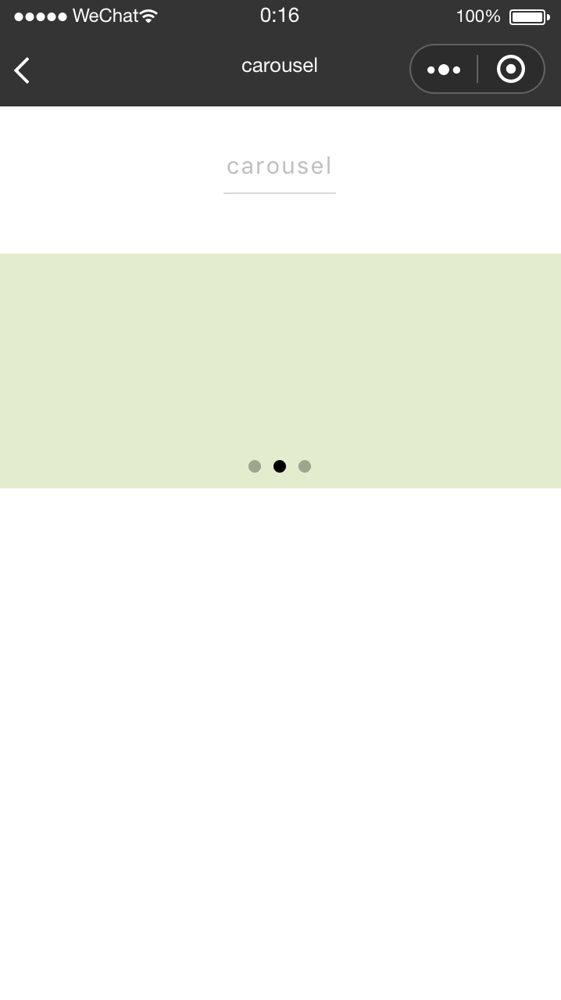
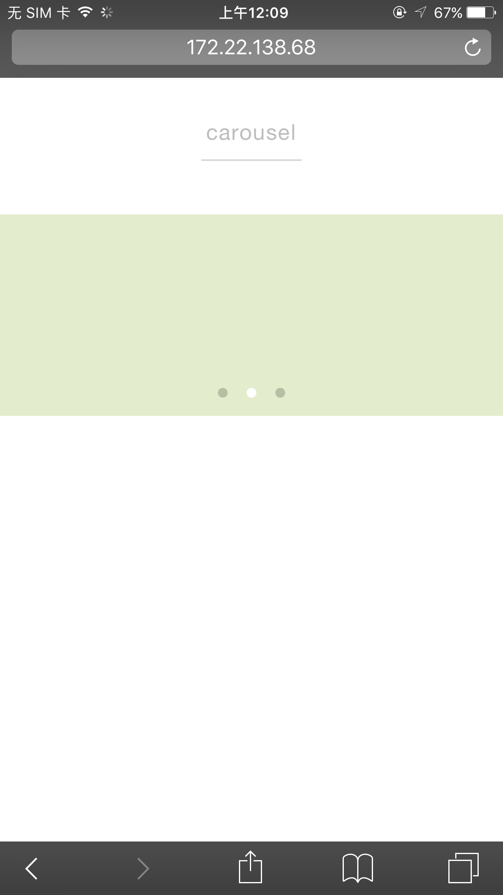

# carousel

---

轮播图。

`<carousel>` 标签内可包含多条 `<carousel-item>`，适合轮播图展示。

### 属性

<table>
  <tr>
    <th width="170px">属性名</th>
    <th>类型</th>
    <th width="90px">默认值</th>
    <th>说明</th>
  </tr>
  <tr>
    <td>autoplay</td>
    <td>Boolean</td>
    <td>false</td>
    <td>是否自动切换</td>
  </tr>
  <tr>
    <td>current</td>
    <td>Number</td>
    <td>0</td>
    <td>当前所在滑块的索引值</td>
  </tr>
  <tr>
    <td>interval</td>
    <td>Number</td>
    <td>5000</td>
    <td>自动切换的时间间隔</td>
  </tr>
  <tr>
    <td>circular</td>
    <td>Boolean</td>
    <td>false</td>
    <td>是否采用衔接滑动</td>
  </tr>
  <tr>
    <td>indicator-dots</td>
    <td>Boolean</td>
    <td>false</td>
    <td>是否显示面板指示点</td>
  </tr>
  <tr>
    <td>indicator-color</td>
    <td>Color</td>
    <td>#cccccc</td>
    <td>指示点颜色</td>
  </tr>
  <tr>
    <td>indicator-active-color</td>
    <td>Color</td>
    <td>#000000</td>
    <td>当前选中的指示点颜色</td>
  </tr>
  <tr>
    <td>change</td>
    <td>EventHandle</td>
    <td></td>
    <td>current 改变时会触发 change 事件，event.detail = {current: activeIndex}</td>
  </tr>
</table>

### 示例

**carousel**

```vue
<template>
  <view>
    <carousel class="container" indicator-dots="{{true}}" current="{{1}}" circular="{{true}}">
      <carousel-item>
        <view class="carousel-item" style="background-color: #EBDEAA"></view>
      </carousel-item>
      <carousel-item>
        <view class="carousel-item" style="background-color: #E3EDCD"></view>
      </carousel-item>
      <carousel-item>
        <view class="carousel-item" style="background-color: #EAEAEF"></view>
      </carousel-item>
    </carousel>
  </view>
</template>
<script>
class Carousel {}

export default new Carousel();
</script>
<style scoped>
.container {
  height: 300cpx;
}
.carousel-item {
  height: 300cpx;
  width: 750cpx;
}
</style>
<script cml-type="json">
{
    "base": {
        "usingComponents": {}
    }
}
</script>
```

<div style="display: flex;flex-direction: row;justify-content: space-around; align-items: flex-end;">
  <div style="display: flex;flex-direction: column;align-items: center;">
    
    <text style="color: #fda775;font-size: 24px;">wx</text>
  </div>
  <div style="display: flex;flex-direction: column;align-items: center;">
    
    <text style="color: #fda775;font-size: 24px;">web</text>
  </div>
  <div style="display: flex;flex-direction: column;align-items: center;">
    
    <text style="color: #fda775;font-size: 24px;">native</text>
  </div>
</div>

### Bug & Tips

1. 如需兼容安卓端，carousel 需要有一个固定高度。
2. 如果希望修改 current 值时轮播滚动到对应 carousel-item，则需要通过 change 事件同步 current，以保证修改 current 的值与当前的值是不同的。
