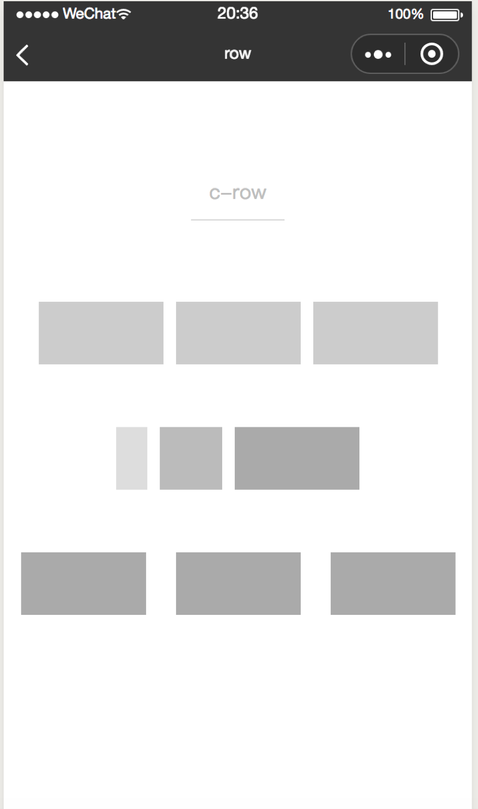
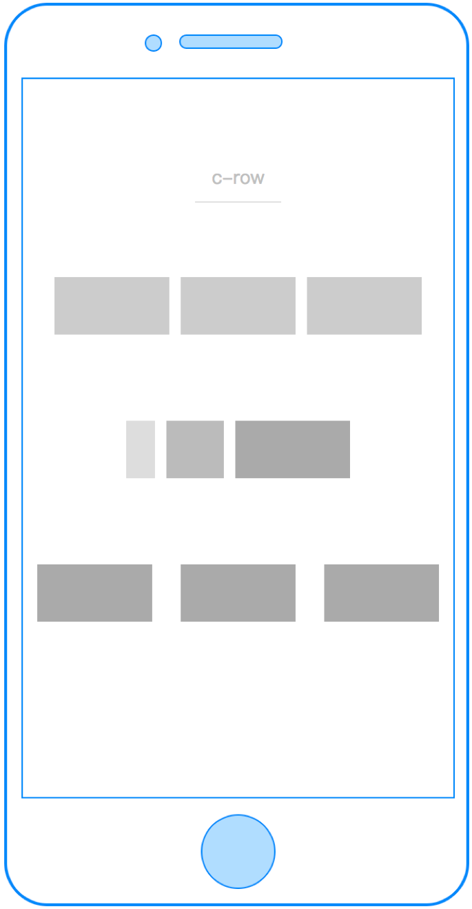
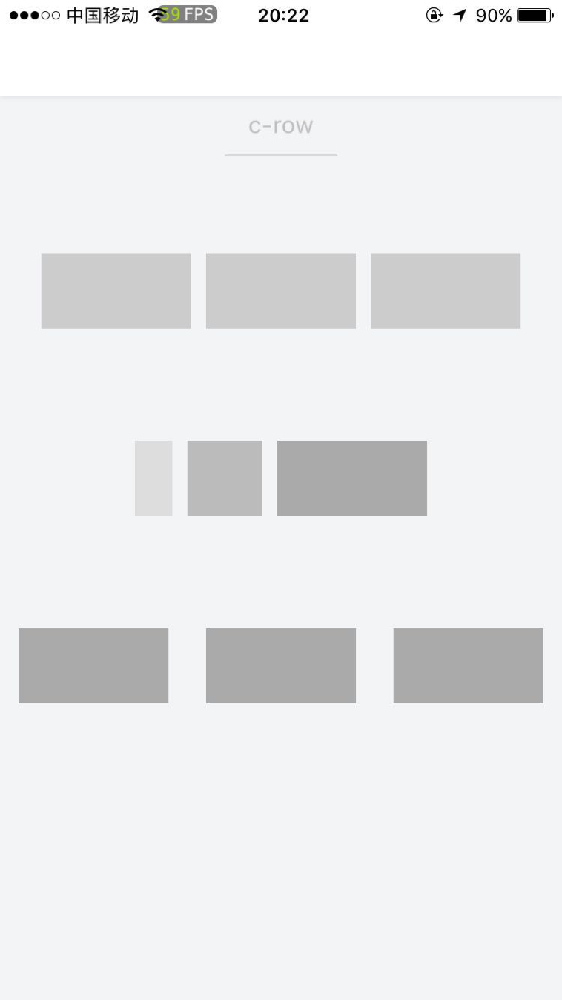

# col

---

纵向 flex 布局容器

与`<row>` 组件结合使用，可快速构建整洁干净的 flex 布局。

### 属性

<table>
  <tr>
    <th width="200px">属性名</th>
    <th>类型</th>
    <th width="60px">必填</th>
    <th>默认值</th>
    <th>说明</th>
  </tr>
  <tr>
    <td>width</td>
    <td>Number</td>
    <td>否</td>
    <td>0</td>
    <td>容器宽度，值为0时容器宽度由内部元素宽度决定</td>
  </tr>
  <tr>
    <td>height</td>
    <td>Number</td>
    <td>否</td>
    <td>0</td>
    <td>容器高度，值为0时容器高度由内部元素高度决定</td>
  </tr>
  <tr>
    <td>background-color</td>
    <td>String</td>
    <td>否</td>
    <td></td>
    <td>容器背景色</td>
  </tr>
  <tr>
    <td>margin</td>
    <td>Number</td>
    <td>否</td>
    <td>0</td>
    <td>容器左右间隔（单位cpx）</td>
  </tr>
</table>

### 示例

```vue

<template>
  <row margin="{{100}}" height="{{100}}">
    <col margin="{{50}}">
      <view class="col-item"></view>
    </col>
    <col margin="{{50}}">
      <view class="col-item"></view>
    </col>
    <col margin="{{50}}">
      <view class="col-item"></view>
    </col>
  </row>
</template>
<script>

class Col  {
}
export default new Col();
</script>
<style scoped>
.col-item {
  background: #aaa;
  width:200cpx;
  height:100cpx;
}
</style>
<script cml-type="json">
{
  "base": {}
}
</script>
```

<div style="display: flex;flex-direction: row;justify-content: space-around; align-items: flex-end;">
  <div style="display: flex;flex-direction: column;align-items: center;">
    
    <text style="color: #fda775;font-size: 24px;">wx</text>
  </div>
  <div style="display: flex;flex-direction: column;align-items: center;">
    
    <text style="color: #fda775;font-size: 24px;">web</text>
  </div>
  <div style="display: flex;flex-direction: column;align-items: center;">
    
    <text style="color: #fda775;font-size: 24px;">native</text>
  </div>
</div>
