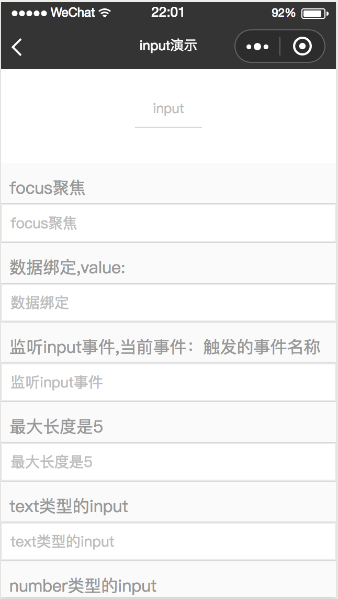
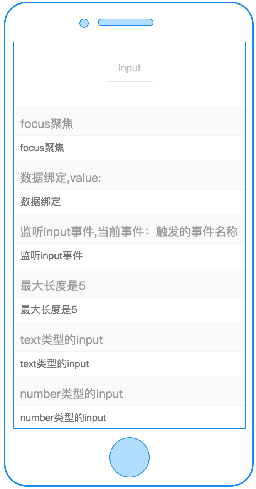
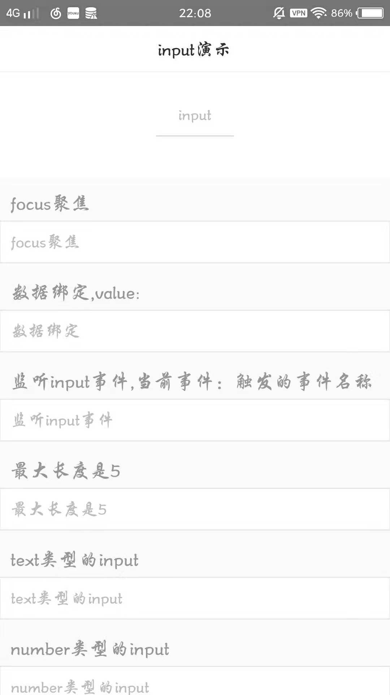

# input

---

输入框

### 属性

<table>
    <tr>
        <th width="180px;">属性名</th>
        <th>类型</th>
        <th width="60px;">必填</th>
        <th>默认值</th>
        <th>说明</th>
    </tr>
    <tr>
        <td>cstyle</td>
        <td>String</td>
        <td>否</td>
        <td></td>
        <td>自定义样式,如 "color:red;text-align:center;"</td>
    </tr>
    <tr>
        <td>value</td>
        <td>String</td>
        <td>否</td>
        <td></td>
        <td>输入框的初始内容</td>
    </tr>
    <tr>
        <td>type</td>
        <td>String</td>
        <td>否</td>
        <td>"text"</td>
        <td>输入框的类型</td>
    </tr>
    <tr>
        <td>placeholder</td>
        <td>String</td>
        <td>否</td>
        <td></td>
        <td>提示用户输入的内容</td>
    </tr>
    <tr>
        <td>disabled</td>
        <td>Boolean</td>
        <td>否</td>
        <td>false</td>
        <td>是否禁用</td>
    </tr>
    <tr>
        <td>focus</td>
        <td>Boolean</td>
        <td>否</td>
        <td>false</td>
        <td>获取焦点（web端不支持）</td>
    </tr>
    <tr>
        <td>maxlength</td>
        <td>Number</td>
        <td>否</td>
        <td>140</td>
        <td>最大输入长度</td>
    </tr>
    <tr>
        <td>return-key-type</td>
        <td>String</td>
        <td>否</td>
        <td>"done"</td>
        <td>设置键盘右下角按钮的文字（web端不支持）</td>
    </tr>
    <tr>
        <td>placer-holder-color</td>
        <td>String</td>
        <td>否</td>
        <td>"#bebebe"</td>
        <td>指定placeholder的颜色（web端不支持）</td>
    </tr>
    <tr>
        <td>maxValue</td>
        <td>Number</td>
        <td>否</td>
        <td>Infinity</td>
        <td>最大值 仅对type="number"生效</td>
    </tr>
    <tr>
        <td>minValue</td>
        <td>Number</td>
        <td>否</td>
        <td>-Infinity</td>
        <td>最小值 仅对type="number"生效</td>
    </tr>
    <tr>
        <td>c-bind:input</td>
        <td>EventHandle</td>
        <td>否</td>
        <td></td>
        <td>  键盘输入时触发
            <br/>
            返回事件对象：
            <br/>event.type="input",
            <br/>event.detail={value}
        </td>
    </tr>
    <tr>
        <td>c-bind:confirm</td>
        <td>EventHandle</td>
        <td>否</td>
        <td></td>
        <td>点击完成按钮时触发
            <br/>返回事件对象：
            <br/>event.type="confirm",
            <br/>event.detail
        </td>
    </tr>
    <tr>
        <td>c-bind:focus</td>
        <td>EventHandle</td>
        <td>否</td>
        <td></td>
        <td>输入框获取焦点时触发
            <br/>返回事件对象：
            <br/>event.type="focus",
            <br/>event.detail
        </td>
    </tr>
    <tr>
        <td>c-bind:blur</td>
        <td>EventHandle</td>
        <td>否</td>
        <td></td>
        <td>输入框失去焦点时触发
            <br/>返回事件对象：
            <br/>event.type="blur"
            <br/>event.detail
        </td>
    </tr>
</table>

#####type 的有效值：

<table>
    <tr>
        <th>值</th>
        <th>说明</th>
    </tr>
    <tr>
        <td>text</td>
        <td>文本类型的输入</td>
    </tr>
    <tr>
        <td>password</td>
        <td>密码类型的输入</td>
    </tr>
    <tr>
        <td>number</td>
        <td>数字类型的输入</td>
    </tr>
</table>

#####return-key-type 的有效值：

<table>
    <tr>
        <th>值</th>
        <th>说明</th>
    </tr>
    <tr>
        <td>done</td>
        <td>右下角按钮为“完成”</td>
    </tr>
    <tr>
        <td>search</td>
        <td>右下角按钮为“搜索”</td>
    </tr>
    <tr>
        <td>next</td>
        <td>右下角按钮为“下一个”</td>
    </tr>
    <tr>
        <td>go</td>
        <td>右下角按钮为“前往”</td>
    </tr>
</table>

### 示例

```vue
<template>
    <input placeholder='请输入你的用户名' focus="{{isfocus}}" c-bind:blur="bindblurevent"></input>
</template>
<script>
class Input {
  data = {
    isfocus: false
  }
  computed = {}
  watch = {}
  methods = {
    bindblurevent()  {
      console.log('blur');
      this.isfocus = false;
    }
  }
  mounted = function(res) {
    setTimeout(() => {
        this.isfocus = true;
    }, 300);
  }
};
export default new Input();
</script>
<script cml-type="json">
{
  "base": {}
}
</script>
```

<div style="display: flex;flex-direction: row;justify-content: space-around; align-items: flex-end;">
  <div style="display: flex;flex-direction: column;align-items: center;">
    
    <text style="color: #fda775;font-size: 24px;">wx</text>
  </div>
  <div style="display: flex;flex-direction: column;align-items: center;">
    
    <text style="color: #fda775;font-size: 24px;">web</text>
  </div>
  <div style="display: flex;flex-direction: column;align-items: center;">
    
    <text style="color: #fda775;font-size: 24px;">native</text>
  </div>
</div>

### Bug & Tips

1. `<input>`web 端不支持自动 focus
2. `<input>`return-key-type 字段 web 端不支持
