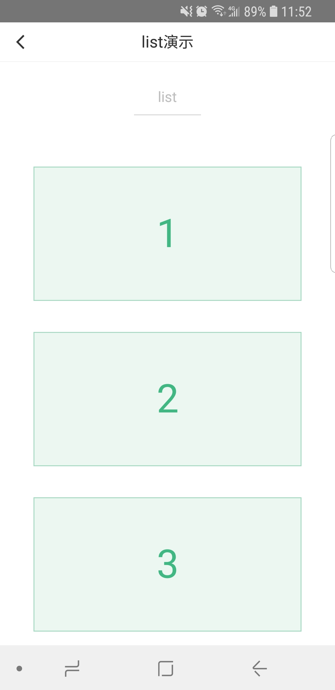

# list

---

可滚动长列表。

`<list>` 标签内可包含多条 `<cell>`，适合用于长列表的展示。

`<cell>` 使用文档[cell](cell.md)。

### 属性

<table>
  <tr>
    <th width="200px">属性名</th>
    <th>类型</th>
    <th width="60px">必填</th>
    <th>默认值</th>
    <th>说明</th>
  </tr>
  <tr>
    <td>cstyle</td>
    <td>String</td>
    <td>否</td>
    <td></td>
    <td>自定义组件内联样式</td>
  </tr>
  <tr>
    <td>height</td>
    <td>Number</td>
    <td>必传</td>
    <td>无</td>
    <td>
      定义滚动区域的高度<br/>
      注意：<br/>
      1、&#60;list&#62; height="&#123;&#123;100&#125;&#125;" /&#62; <br/>
      这样传值才是Number类型
      <br/>
      2、height为-1时，&#60;list&#62; 的可滚动区域高度为list放置点至页面底部
    </td>
  </tr>
  <tr>
    <td>bottom-offset</td>
    <td>Number</td>
    <td>否</td>
    <td>0</td>
    <td>距底部/右边多远时（单位cpx），触发 onBottom 事件</td>
  </tr>
  <tr>
    <td>to-element</td>
    <td>String</td>
    <td>否</td>
    <td></td>
    <td>滚动到的元素，仅支持ref(web、weex端)</td>
  </tr>
  <tr>
    <td>bounce</td>
    <td>Boolean</td>
    <td>否</td>
    <td>true</td>
    <td>上拉下拉是否回弹(仅支持web)</td>
  </tr>
  <tr>
    <td>c-bind:scrolltobottom</td>
    <td>EventHandle</td>
    <td>否</td>
    <td></td>
    <td>滚动到底部，会触发 scrolltobottom 事件
      <br/>
      返回事件对象：
      <br/>
      event.type= "scrolltobottom"
      <br/>
      event.detail = { direction }
    </td>
  </tr>
  <tr>
    <td>c-bind:onscroll</td>
    <td>EventHandle</td>
    <td>否</td>
    <td></td>
    <td>滚动时触发，
        <br/>
        返回事件对象：
        <br/>
        event.type = 'scroll'
        <br/>
        event.detail = {scrollLeft, scrollTop, scrollHeight, scrollWidth, deltaX, deltaY}
    </td>
  </tr>
</table>

### 限制

1. 不允许相同方向的 `<list>` 或者 `<scroller>` 互相嵌套，换句话说就是嵌套的 `<list>`/`<scroller>` 必须是不同的方向。

举个例子，不允许一个垂直方向的 `<list>` 嵌套的一个垂直方向的 `<scroller>` 中，但是一个垂直方向的 `<list>` 是可以嵌套的一个水平方向的 list 或者 `<scroller>` 中的。

### 示例

```vue
<template>
  <view class="container">
    <list
      bottom-offset="{{bottomOffset}}"
      c-bind:scrolltobottom="onBottom"
      c-bind:onscroll="onScroll"
      height="{{-1}}"
    >
      <cell class="cell" c-for="{{lists}}" c-for-index="i" c-for-item="item" data-idx="{{i}}">
        <view class="panel">
          <text class="text">{{ item }}</text>
        </view>
      </cell>
    </list>
  </view>
</template>

<script>
import cml from 'chameleon-api';

const LOADMORE_COUNT = 4;

class List {
  data = {
    /**
     * list 配置 子元素必须是 cell 标签
     */
    bottomOffset: 20,
    lists: [1, 2, 3, 4, 5, 6, 7, 8, 9, 10],
  };
  methods = {
    onBottom(e) {
      cml.showToast({
        message: 'loadmore',
        duration: 1000,
      });

      setTimeout(() => {
        const length = this.lists.length;
        for (let i = length; i < length + LOADMORE_COUNT; ++i) {
          this.lists.push(i + 1);
        }
      }, 800);
    },
    onScroll(e) {},
  };
}

export default new List();
</script>
<style scoped>
.container {
  position: absolute;
  top: 88cpx;
  left: 0;
  right: 0;
  bottom: 0;
}
.panel {
  display: flex;
  width: 600cpx;
  height: 300cpx;
  margin-left: 75cpx;
  margin-top: 35cpx;
  margin-bottom: 35cpx;
  flex-direction: column;
  justify-content: center;
  border-width: 2px;
  border-style: solid;
  border-color: rgb(162, 217, 192);
  background-color: rgba(162, 217, 192, 0.2);
}
.text {
  font-size: 88cpx;
  text-align: center;
  color: #41b883;
}
</style>

<script cml-type="json">
{
  "base": {}
}
</script>
```

<div style="display: flex;flex-direction: row;justify-content: space-around; align-items: flex-end;">
  <div style="display: flex;flex-direction: column;align-items: center;">
    
    <text style="color: #fda775;font-size: 24px;">wx</text>
  </div>
  <div style="display: flex;flex-direction: column;align-items: center;">
    
    <text style="color: #fda775;font-size: 24px;">web</text>
  </div>
  <div style="display: flex;flex-direction: column;align-items: center;">
    
    <text style="color: #fda775;font-size: 24px;">native</text>
  </div>
</div>

### Bug & Tips

1. `<list>`组件的父容器必须为可定位元素， `<list>`内容的布局由父容器决定。
2. `<list>` 中不可以使用 `<textarea>`、`<video>` 组件。
3. `<list>` 中不建议在`<list>`上加 class 改变样式，可以通过 cstyle 属性传入内联样式。
4. `<list>` 的子组件定位无效。
