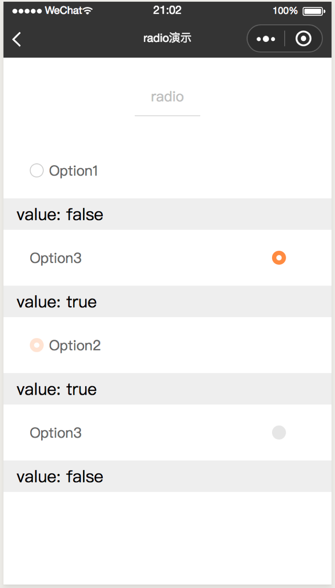
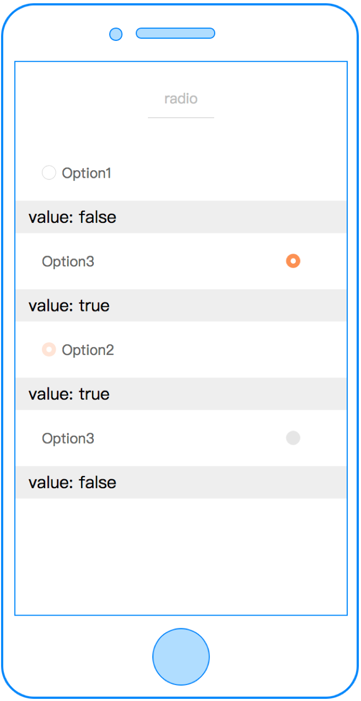
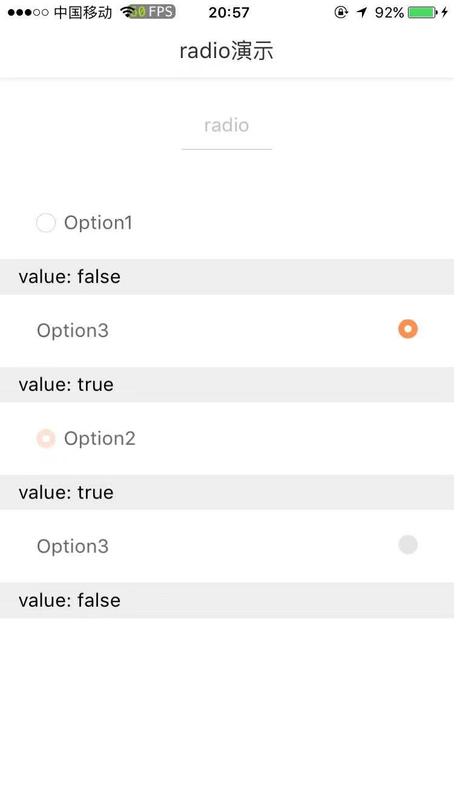

# radio

---

单选框

### 属性

<table>
  <tr>
    <th width="200px">属性名</th>
    <th>类型</th>
    <th width="60px">必填</th>
    <th>默认值</th>
    <th>说明</th>
  </tr>
  <tr>
    <td>checked</td>
    <td>Boolean</td>
    <td>否</td>
    <td>关闭</td>
    <td>是否开启</td>
  </tr>
  <tr>
    <td>label</td>
    <td>String</td>
    <td>否</td>
    <td></td>
    <td>单选框文案</td>
  </tr>
  <tr>
    <td>disabled</td>
    <td>Boolean</td>
    <td>否</td>
    <td>false</td>
    <td>是否禁用</td>
  </tr>
  <tr>
    <td>position</td>
    <td>String</td>
    <td>否</td>
    <td>left</td>
    <td>单选框相对于文案的位置，可选值包括：left、right</td>
  </tr>
  <tr>
    <td>group-index</td>
    <td>Number</td>
    <td>否</td>
    <td>-1</td>
    <td>表示在radio-group中的索引</td>
  </tr>
  <tr>
    <td>cstyle</td>
    <td>String</td>
    <td>否</td>
    <td>-</td>
    <td>自定义样式</td>
  </tr>
  <tr>
    <td>c-bind:change</td>
    <td>EventHandle</td>
    <td>否</td>
    <td></td>
    <td>点击单选框触发
        <br/>返回事件对象：
        <br/>event.detail
        <br/>返回值：
        <br/>event.detail.value
    </td>
  </tr>
</table>

### 示例

```vue
<template>
  <radio checked="{{ radioValue }}" label="Option" c-bind:change="valueChange"> </radio>
</template>
<script>
class Index {
  data = {
    radioValue: false,
  };
  methods = {
    valueChange(e) {
      this.radioValue = e.detail.value;
    },
  };
}
export default new Index();
</script>
<script cml-type="json">
{
  "base": {}
}
</script>
```

<div style="display: flex;flex-direction: row;justify-content: space-around; align-items: flex-end;">
  <div style="display: flex;flex-direction: column;align-items: center;">
    
    <text style="color: #fda775;font-size: 24px;">wx</text>
  </div>
  <div style="display: flex;flex-direction: column;align-items: center;">
    
    <text style="color: #fda775;font-size: 24px;">web</text>
  </div>
  <div style="display: flex;flex-direction: column;align-items: center;">
    
    <text style="color: #fda775;font-size: 24px;">native</text>
  </div>
</div>
