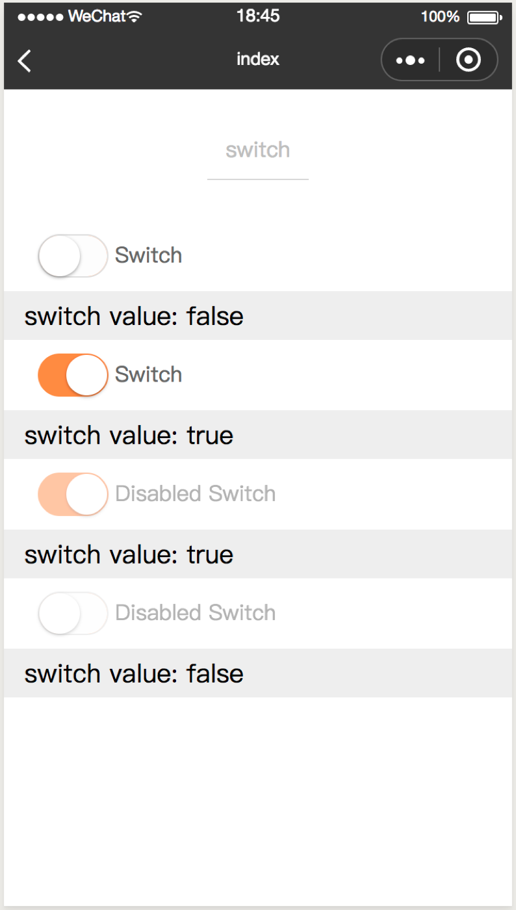
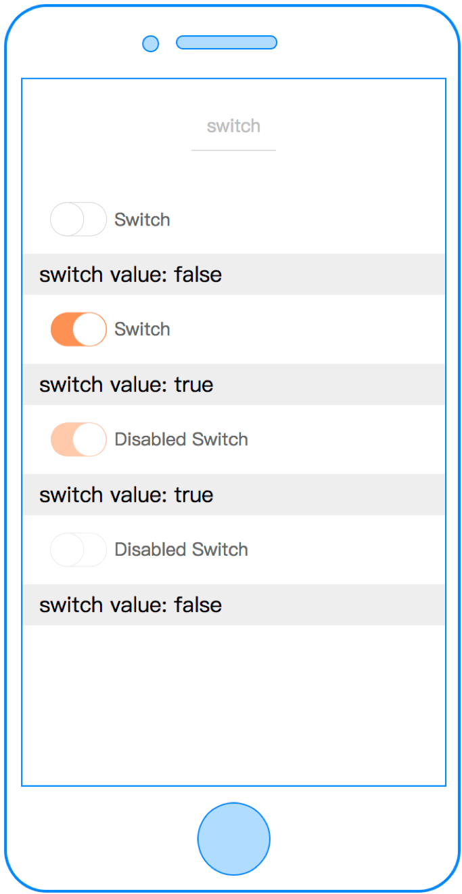
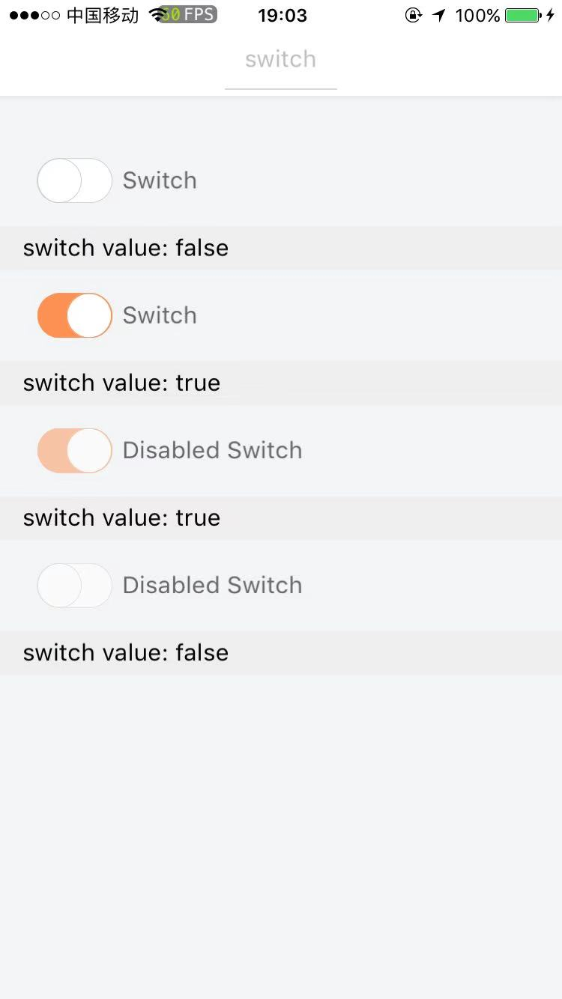

# switch

---

开关

### 属性

<table>
  <tr>
    <th width="200px">属性名</th>
    <th>类型</th>
    <th width="60px">必填</th>
    <th>默认值</th>
    <th>说明</th>
  </tr>
  <tr>
    <td>checked</td>
    <td>Boolean</td>
    <td>否</td>
    <td>关闭</td>
    <td>是否开启switch按钮</td>
  </tr>
  <tr>
    <td>label</td>
    <td>String</td>
    <td>否</td>
    <td></td>
    <td>按钮文案</td>
  </tr>
  <tr>
    <td>disabled</td>
    <td>Boolean</td>
    <td>否</td>
    <td>false</td>
    <td>是否禁用</td>
  </tr>
  <tr>
    <td>opencolor</td>
    <td>String</td>
    <td>否</td>
    <td></td>
    <td>定义选中的颜色，如 '#000'</td>
  </tr>
  <tr>
    <td>c-bind:change</td>
    <td>EventHandle</td>
    <td>否</td>
    <td></td>
    <td>点击按钮触发
        <br/>返回事件对象：
        <br/>event.detail
        <br/>返回值：
        <br/>event.detail.value
    </td>
  </tr>
</table>

### 示例

```vue
<template>
  <switch checked="{{ switchValue }}" label="Switch" c-bind:change="switchChange"> </switch>
</template>
<script>
class Switch {
  data = {
    switchValue: false,
  };
  methods = {
    switchChange(e) {
      this.switchValue = e.detail.value;
    },
  };
}
export default new Switch();
</script>
<script cml-type="json">
{
  "base": {}
}
</script>
```

<div style="display: flex;flex-direction: row;justify-content: space-around; align-items: flex-end;">
  <div style="display: flex;flex-direction: column;align-items: center;">
    
    <text style="color: #fda775;font-size: 24px;">wx</text>
  </div>
  <div style="display: flex;flex-direction: column;align-items: center;">
    
    <text style="color: #fda775;font-size: 24px;">web</text>
  </div>
  <div style="display: flex;flex-direction: column;align-items: center;">
    
    <text style="color: #fda775;font-size: 24px;">native</text>
  </div>
</div>
