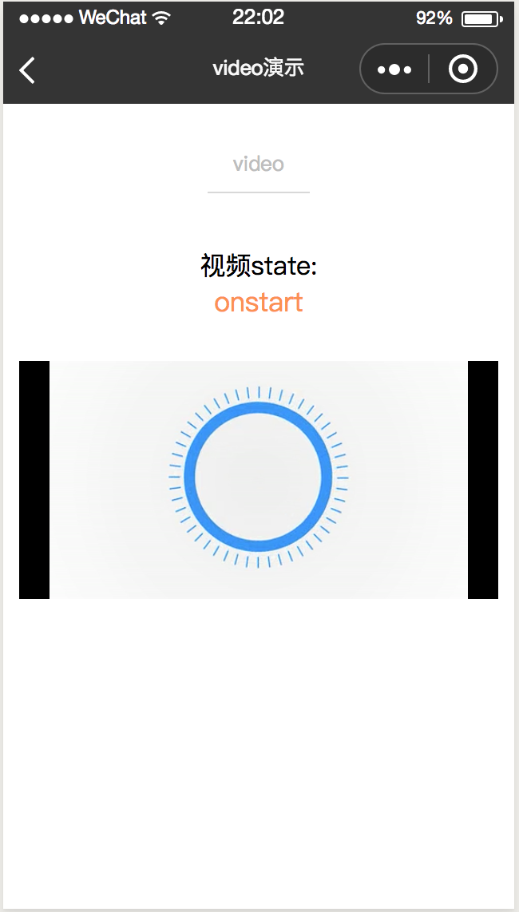
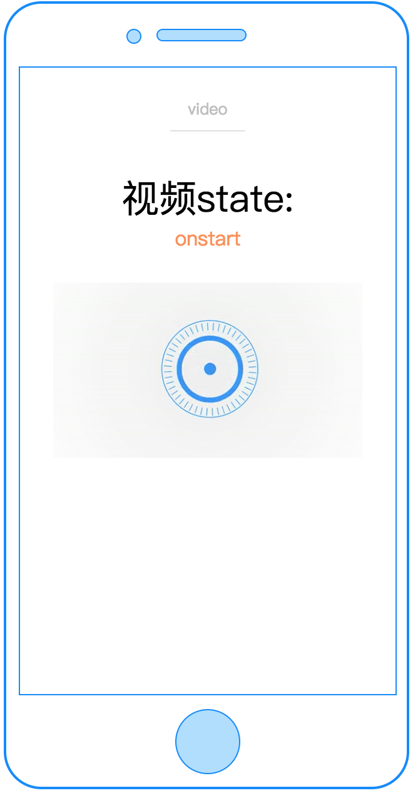
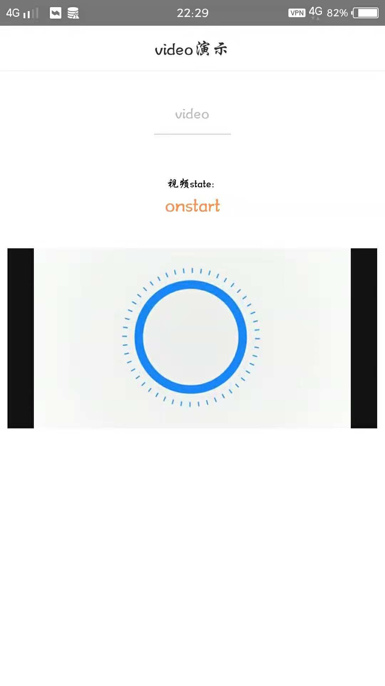

# video

---

视频播放器

### 属性

<table>
  <tr>
    <th width="200px">属性名</th>
    <th>类型</th>
    <th width="60px">必填</th>
    <th width="80px">默认值</th>
    <th>说明</th>
  </tr>
  <tr>
    <td>src</td>
    <td>String</td>
    <td>否</td>
    <td></td>
    <td>要播放视频的资源地址</td>
  </tr>
    <tr>
    <td>cstyle</td>
    <td>String</td>
    <td>否</td>
    <td></td>
    <td>自定义image的样式，如 "height:100cpx;width:100cpx;"</td>
  </tr>
  <tr>
    <td>autoplay</td>
    <td>Boolean</td>
    <td>否</td>
    <td>false</td>
    <td>是否自动播放</td>
  </tr>
  <tr>
    <td>controls</td>
    <td>Boolean</td>
    <td>否</td>
    <td>false</td>
    <td>是否显示默认播放控件（播放/暂停按钮、播放进度、时间）（只对wx有效）</td>
  </tr>
  <tr>
    <td>c-bind:start</td>
    <td>EventHandle</td>
    <td>否</td>
    <td></td>
    <td>当开始/继续播放时触发start事件
    </td>
  </tr>
  <tr>
    <td>c-bind:pause</td>
    <td>EventHandle</td>
    <td>否</td>
    <td></td>
    <td>当暂停播放时触发 pause 事件
    </td>
  </tr>
  <tr>
    <td>c-bind:finish</td>
    <td>EventHandle</td>
    <td>否</td>
    <td></td>
    <td>当播放到末尾时触发 finish 事件
    </td>
  </tr>
  <tr>
    <td>c-bind:fail</td>
    <td>EventHandle</td>
    <td>否</td>
    <td></td>
    <td>视频播放出错时触发 fail
    </td>
  </tr>
</table>

### 示例

```vue
<template>
  <view class="container">
    <video
      class="video"
      src="{{videoSrc}}"
      autoplay="{{true}}"
      controls="{{true}}"
      c-bind:start="onstart"
      c-bind:pause="onpause"
      c-bind:finish="onfinish"
      c-bind:fail="onfail"
    ></video>
  </view>
</template>

<script>
import cml from 'chameleon-api';
class Video {
  data = {
    videoSrc:
      'http://wxsnsdy.tc.qq.com/105/20210/snsdyvideodownload?filekey=30280201010421301f0201690402534804102ca905ce620b1241b726bc41dcff44e00204012882540400&bizid=1023&hy=SH&fileparam=302c020101042530230204136ffd93020457e3c4ff02024ef202031e8d7f02030f42400204045a320a0201000400',
    state: '----',
  };
}
export default new Video();
</script>
<style scoped>
.video {
  width: 720cpx;
  height: 350cpx;
  margin-top: 60cpx;
}
</style>
<script cml-type="json">
{
  "base": {}
}
</script>
```

<div style="display: flex;flex-direction: row;justify-content: space-around; align-items: flex-end;">
  <div style="display: flex;flex-direction: column;align-items: center;">
    
    <text style="color: #fda775;font-size: 24px;">wx</text>
  </div>
  <div style="display: flex;flex-direction: column;align-items: center;">
    
    <text style="color: #fda775;font-size: 24px;">web</text>
  </div>
  <div style="display: flex;flex-direction: column;align-items: center;">
    
    <text style="color: #fda775;font-size: 24px;">native</text>
  </div>
</div>

### Bug & Tips

1. `<text>` 是唯一合法的子组件。
