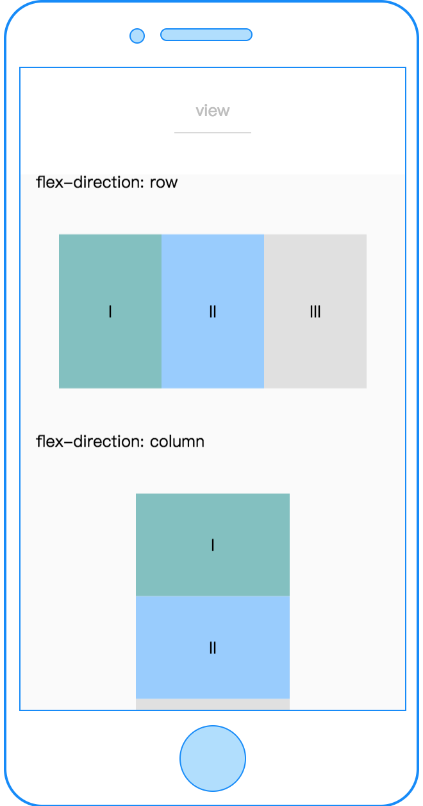
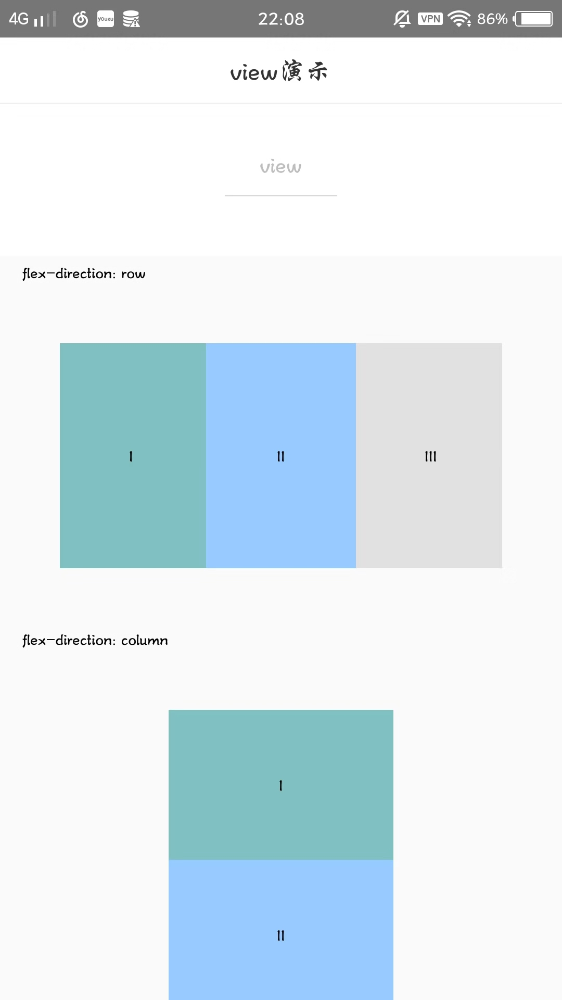

# view

---

视图容器。

类似 Web 端的 div 块级元素标签。

### 示例

```vue
<template>
  <view class="flex-item"></view>
</template>
<script>
class View {}
export default new View();
</script>
<style scoped>
.flex-item {
  width: 200cpx;
  height: 300cpx;
  background-color: #81c0c0;
}
</style>
<script cml-type="json">
{
  "base": {}
}
</script>
```

<div style="display: flex;flex-direction: row;justify-content: space-around; align-items: flex-end;">
  <div style="display: flex;flex-direction: column;align-items: center;">
    
    <text style="color: #fda775;font-size: 24px;">wx</text>
  </div>
  <div style="display: flex;flex-direction: column;align-items: center;">
    
    <text style="color: #fda775;font-size: 24px;">web</text>
  </div>
  <div style="display: flex;flex-direction: column;align-items: center;">
    
    <text style="color: #fda775;font-size: 24px;">native</text>
  </div>
</div>

### Bug & Tips

1. 如果需要使用滚动视图，请使用[scroller](scroller.md)包裹
