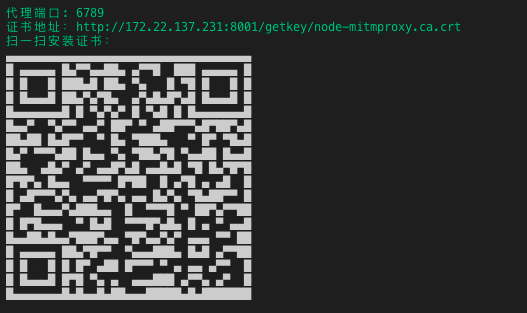

# 工程化

工程化是使用软件工程的技术和方法对项目的开发、上线和维护进行管理。CML 的工程化包含如下几个大方面：

- 1 模块化，项目中的文件统一以模块化的方式引入，包括.css,.js 以及定义的 interface 文件，这样做有如下好处避免变量污染与命名冲突，提高代码的复用率，提高代码的可维护性。
- 2 组件化，CML 定义了.cml 文件，以组件为单位，将一个组件需要的视图、逻辑、样式、配置采用单文件的形式进行开发，提高了代码的可读性。
- 3 本地开发解决方案，CML 提供了大量的工程化方法，解决本地开发时的各种痛点，包括
  - 提供 dev 服务，Mock 数据等能力，达到不依赖后端实现开发的前后端分离。
  - 提供  热更新，自动刷新，调试窗口，线上资源代理等能力，提高本地开发时的效率。
- 4 线上部署解决方案，CML 的构建是完全配置化的，内置线上线下两种构建模式，线上工程化相关功能包括
  - 线上静态资源的路径指定
  -  基于文件内容的文件指纹
  - 减少文件体积的代码压缩
- 5 渐进式使用，CML 提供了两种渐进式使用的方式，一种是将 CML 的组件导出成各端的原生组件，第二种方式是引用插件在 webpack 项目中使用 CML 组件与接口。

## 数据 Mock

### 如何 Mock API 请求

> 如果需要 Mock 多个域名的 API 请参见 [API 多域名 Mock](build.md#api-多域名-mock)。

1、 使用[内置网络请求](../api/#网络请求)接口发起网络请求。例如：

```javascript
import cml from 'chameleon-api';
cml
  .get({
    url: '/api/getdriver',
  })
  .then(
    (res) => {
      cml.showToast({
        message: JSON.stringify(res),
        duration: 2000,
      });
    },
    (err) => {
      cml.showToast({
        message: JSON.stringify(err),
        duration: 2000,
      });
    },
  );
```

调用方法的参数 url 中只需要写 api 的路径。那么本地 dev 开发模式如何 mock 这个 api 请求以及 build 线上模式如何请求线上地址，就需要在配置文件中配置 apiPrefix。

2、配置 `apiPrefix` `dev` 开发模式和 `build` 模式配置的 `apiPrefix` 会拼接到网络请求的 url 前，`dev` 模式不配置时，默认为当前启动 Web 服务的 ip+端口。上面的例子中如果本地 ip 为 `198.168.1.1` 启动端口为 `8000`。`dev` 模式发起的网络请求为 `198.168.1.1:8000/api/getdriver`, `build` 模式发起的网络请求为 `http://api.chameleon.com/api/getdriver`。

```javascript
// 设置 API 请求前缀
const apiPrefix = 'http://api.chameleon.com';
cml.config.merge({
  wx: {
    dev: {},
    build: {
      apiPrefix,
    },
  },
});
```

3、 配置本地 Mock 数据

前两步操作实现了网络请求 dev 模式请求本地，build 模式请求线上，这一步就讲解如何 mock 本地请求数据。

在`/mock/api/`文件夹下创建 Mock 数据的 js 文件。文件内容格式如下：

```javascript
module.exports = [
  {
    method: 'get',
    path: '/api/getdriver',
    controller: function(req, res, next) {
      console.log('/api/driver/getList');
      res.json({
        total: 100,
        driverList: [],
      });
    },
  },
];
```

- method 指定请求方法，默认值['get','post']
- path 指定请求的路径
- controller 是 express 的中间件形式，在中间件中可以做任何操作最后调用 res 的方法返回结果。

启动 dev 模式后，通过 ip+端口+path 即可访问配置的 api 请求。结合上面讲到的网络请求方法，即可实现本地的 API 数据 Mock。

<b> 扩展 如何在本地 dev 模式请求线上数据？</b>

可以在 mock 文件的 controller 中请求对应的线上数据，例如可以使用 [request 模块](https://github.com/request/request)实现请求。

注：[apiPrefix、publicPath、router.config.json、cmlUrl 的关系](../tutorial/deploy-guide.md#apiPrefix、publicPath、router.config.json、cmlUrl的关系)

### 如何 mock php 模板下发数据

`/mock/template/`文件夹下存放的 php 文件是下发的模板数据，php 文件内将下发的数据赋值给\$CML 对象，例如：

```php
<?php
  $chameleon = array(
    "errno" => 0,
    "errmsg" => "",
    "pageData" => array(
      "pageInfo" => array(
        "title" => "chameleon",
        "content" => "chameleon跨端"
      )
    )
  );
?>
```

在模板中通过变量`pageData,errno,errmsg`接收。

```javascript
<script>
  var pageData = {json_encode($pageData)}
  var errno = {json_encode($errno)}
  var errmsg = {json_encode($errmsg)}
</script>
```

同时还模拟了与模板下发的 pageData 相同的 ajax 请求，只需在当前访问页面的 url 上添加 puredata=1 参数。

```javascript
{
  errno: 0,
  errmsg: '',
  pageData: {
    pageInfo: {
      title: 'chameleon',
      content: 'chameleon跨端'
    }
  }
}
```

## API 多域名 Mock

在数据 Mock 一节讲述了如何进行 API 数据的 mock，但是只局限于所有 api 请求都是相同域名的情况，工作中可能出现一个项目请求多个域名的 api 接口，本节将讲解如和进行多域名的 mock。

### 版本要求

- `chameleon-tool >= 0.2.1`
- `chameleon-api >= 0.3.1`

### chameleon.config.js 中配置多域名信息

domain 对象配置多域名的信息。
`domain`, Object 类型。
配置在 base 对象中，可以作为所有平台的公共配置，dev 模式中配置的`localhost`会替换成当前 dev 模式启动的 web 服务 ip+端口。

例如：

```
cml.config.merge({
  base: {
    dev: {
      domain: {
        domain1: "localhost",
        domain2: "localhost"
      },
    },
    build: {
      domain: {
        domain1: "http://api.cml.com",
        domain2: "http://api2.cml.com"
      },
    }
  },
})
```

### 使用 chameleon-api 发网络请求

`chameleon-api`的网络请求`get、post、request`方法中添加 domain 参数。
`chameleon.config.js`中添加的`domain`对象配置，在项目中可以通过`process.env.domain`变量访问。

例如：

```javascript
import cml from 'chameleon-api';
cml
  .get({
    domain: process.env.domain.domain1,
    url: '/api/getMessage',
  })
  .then(
    (res) => {
      cml.showToast({
        message: JSON.stringify(res),
        duration: 2000,
      });
    },
    (err) => {
      cml.showToast({
        message: JSON.stringify(err),
        duration: 2000,
      });
    },
  );
```

### 配置 Mock 数据

前两步操作实现了网络请求 dev 模式请求本地，build 模式请求线上，这一步就讲解如何 mock 本地多域名的请求数据。

在`/mock/api/`文件夹下创建 Mock 数据的 js 文件。文件内容格式如下：

```javascript
module.exports = [
  {
    domainKey: 'domain1',
    request: [
      {
        method: ['get', 'post'],
        path: '/api/getMessage',
        controller: function(req, res, next) {
          res.json({
            total: 0,
            message: [
              {
                name: 'HelloCML domain1',
              },
            ],
          });
        },
      },
    ],
  },
  {
    domainKey: 'domain2',
    request: [
      {
        method: ['get', 'post'],
        path: '/api/getMessage',
        controller: function(req, res, next) {
          res.json({
            total: 0,
            message: [
              {
                name: 'domain2!',
              },
            ],
          });
        },
      },
    ],
  },
];
```

- domainKey 指定 Mock 的域名，对应 `chameleon.config.js` 中 domain 对象的 key 值。
- method 指定请求方法，默认值['get','post']
- path 指定请求的路径
- controller 是 express 的中间件形式，在中间件中可以做任何操作最后调用 res 的方法返回结果。

## 资源定位

### 静态资源引用

模板中引用静态资源，不能直接将资源的路径写在模板中，而是要通过 js 中 require 该静态资源得到变量，在模板中引用该变量。
该路径会根据[项目配置的 publicPath](config.md)自动替换成正确路径。利用该功能可以实现  静态资源  开发路径和部署路径之间的  分离，开发者只需要写相对路径，线上可以通过设置`publicPath`指定任意路径。

```vue
<template>
  <!-- 
错误形式
<image src="./images/logo.png" /> 
-->
  <!-- 正确形式 -->
  <image src="{{imgPath}}" />
</template>
<script>
class Index {
  data = {
    imgPath: require('./images/logo.png'),
  };
}
export default new Index();
</script>
```

### 图片 base64

支持在引用图片 url 后面添加`inline`参数，以指定图片的 base64 格式，例如：

```vue
<script>
class Index {
  data = {
    imgPath: require('./images/logo.png?__inline'),
  };
}
export default new Index();
</script>
```

## 文件指纹

查看[文件指纹配置](config.md#文件指纹)

## 代码压缩

查看[代码压缩配置](config.md#代码压缩)

## 热更新与自动刷新

查看[热更新与自动刷新配置](config.md#热更新与自动刷新)

## 代理模式开发

调试线上编译处理过的非可读性代码，可以使用本功能

通过简单的 CML 配置将线上文件代理到线下的开发环境，这样就可以通过修改线下的源码 debug 线上页面了，使用方法如下：

### 第一步

chameleon.config.js 中开启代理模式:

```javascript
{
    ...
    proxy: {
        enable: true,
    }
    ...
}
```

### 第二步

执行以下命令

```
cml dev
```

### 第三步

根据调试面板打印的信息给手机安装证书



### 第四步

根据上图提示将手机代理到相应的端口

完成以上步骤就可以进行代理开发了。

默认代理了 Weex 和 Web 端的 js 和 css 文件，如需代理更多文件，可以  添加 mapremote 配置，方法如下：

```javascript
{
    ...
    proxy: {
        enable: true,
        mapremote: [{
            from: 'https://a.b.com/weex/aaa_(.+).js',
            to: 'http://localhost:8000/weex/aaa.js'
        },{
            from: 'https://a.b.com/weex/bbb_(.+).js',
            to: 'http://localhost:8000/weex/bbb.js'
        }]
    }
    ...
}
```

## cmlUrl

一个 cmlUrl 能在多端运行，在普通浏览器/webview 运行 Web 端，小程序运行小程序端，Native 渲染（weex）则拉取对应的 JS Bundle 并展现，完整地址如下，使用场景包含：

- a.跨应用页面之间跳转使用[open 接口](../api/#open)
- b.服务端下发给端（weex/浏览器/小程序）进行跳转

`https://h5地址`?
`cml_addr=jsbundle地址`&
`path=路由path(通用字段)`&
`envVersion=要打开的小程序版本(通用字段)`&
`weixin_appid=123456`&
`weixin_path=微信小程序路由path`&
`weixin_envVersion=要打开的微信小程序版本`&
`baidu_appid=123456`&
`baidu_path=百度小程序路由path`&
`baidu_envVersion=要打开的百度小程序版本`&
`alipay_appid=123456`&
`alipay_path=支付宝小程序路由path`

<table>
    <tr>
        <th>参数</th>
        <th>作用</th>
        <th>说明</th>
    </tr>
    <tr>
        <td>h5地址</td>
        <td>H5端的地址或者用于提示bundle出错的h5地址</td>
        <td>如果你没有h5地址，可以选择将h5地址写为jsbundle地址（后面的cml_addr=jsbundle地址依然需要）。</td>
    </tr>
    <tr>
        <td>cml_addr</td>
        <td>描述weex/rn js bundle地址</td>
        <td>内部非使用sdk开发者暂时使用cml_addr字段</td>
    </tr>
    <tr>
        <td>path</td>
        <td>描述应用里面的页面路由， 即路由里面的 path 值 </td>
        <td>若未填写weixin_path, baidu_path, alipay_path时, 统一使用该字段</td>
    </tr>
    <tr>
        <td>envVersion</td>
        <td>要打开的小程序版本 </td>
        <td>有效值 develop（开发版），trial（体验版），release（正式版） ，仅在当前小程序为开发版或体验版时此参数有效(仅支持<a href="https://developers.weixin.qq.com/miniprogram/dev/api/wx.navigateToMiniProgram.html">微信小程序</a>和<a href="https://docs.alipay.com/mini/api/open-miniprogram">支付宝小程序</a>)</td>
    </tr>
    <tr>
        <td>weixin_appid</td>
        <td>描述微信小程序的app id</td>
        <td>微信小程序跳转需要 <a href="https://developers.weixin.qq.com/minigame/dev/api/open-api/miniprogram-navigate/wx.navigateToMiniProgram.html?t=18091916">appid</a></td>
    </tr>
    <tr>
        <td>weixin_path</td>
        <td>描述应用里面的页面路由(目标微信小程序为非 CML 项目时可用)</td>
        <td></td>
    </tr>
    <tr>
        <td>weixin_envVersion</td>
        <td>要打开的小程序版本 </td>
        <td>有效值 develop（开发版），trial（体验版），release（正式版） ，仅在当前小程序为开发版或体验版时此参数有效(该字段仅对微信小程序跳转生效)</td>
    </tr>
    <tr>
        <td>baidu_appid</td>
        <td>描述百度小程序的appKey</td>
        <td>百度小程序跳转需要 <a href="https://smartprogram.baidu.com/docs/develop/api/open_smartprogram/#navigateToSmartProgram/">appKey</a></td>
    </tr>
    <tr>
        <td>baidu_path</td>
        <td>描述应用里面的页面路由(目标百度小程序为非 CML 项目时可用)</td>
        <td></td>
    </tr>
    <tr>
        <td>alipay_appid</td>
        <td>描述支付宝小程序的app id</td>
        <td>支付宝小程序跳转需要 <a href="https://docs.alipay.com/mini/api/open-miniprogram">appid</a></td>
    </tr>
    <tr>
        <td>alipay_path</td>
        <td>描述应用里面的页面路由(目标支付宝小程序为非 CML 项目时可用)</td>
        <td></td>
    </tr>
    <tr>
        <td>alipay_envVersion</td>
        <td>要打开的小程序版本 </td>
        <td>有效值 develop（开发版），trial（体验版），release（正式版） ，仅在当前小程序为开发版或体验版时此参数有效(该字段仅对支付宝小程序跳转生效)</td>
    </tr>
</table>

## 规范与校验

按照框架定义，有相应的目录规范，文件规范，文件内容规范等，按照规范编写代码，可以最大程度的减少开发、调试时间。

另，框架提供了校验工具，让开发者可以提前发现不符合规范的问题，提高效率。

### 接口校验语法

> 接口是一系列方法的声明，是一些方法特征的集合，一个接口只有方法的特征没有方法的实现，因此这些方法可以在不同的地方被不同的类实现，而这些实现可以具有不同的行为（功能）进行沟通。

#### 校验配置

通过配置决定是否开启接口的校验。
`Object、Array、Nullable`这三个类型默认是不支持的，因为我们建议更精确的校验，可以通过配置文件开启这三个类型。
具体参见[多态校验控制的配置](config.md#多态校验控制)

#### 类型说明

** 注意：建议定义类型的时候取值为 Number String Boolean Null Undefined(Void) Object Array Function Date RegExp**

目前 CML 接口定义支持简单类型和复合类型。

其中简单类型包括以下类型：

- Number(number)
- String(string)
- Boolean(bool)
- Undefined(void)
- Null

复合类型包括以下类型：

- Function
- Object
- Array
- Date
- RegExp

#### 接口语法

接口的使用分两个过程：

1. 定义一个接口。
2. 定义实现接口的类。

##### 接口定义

**范式**

    interface [接口名称] {
        // 接口中的属性
        [属性名称]: [类型],

        // 接口中的方法
       [方法名称]([传入参数1名称]: [传入参数1类型], [传入参数2名称]: [传入参数2类型], ...): [返回类型]
    }

**举例**

    // 一个名为interface1的接口
    interface interface1 {
      // foo1: 传入分别为string和number的两个数据，返回值类型为string值
      foo1(a: string, b: number): string;

      // foo2: 传入分别为string和Callback(上文定义)的两个数据，返回值类型为bool值
      foo2(c: string, d: Callback): Boolean;
    }

##### 实现接口（定义类）

**范式**

    class [类名称] implaments [接口名称] {

        // 实现接口中的属性
        [属性名称]: [类型]

        // 实现接口中的方法
      [方法名称]([传入参数1名称], [传入参数2名称], ...){
          return [返回值];
        }
    }

**举例**

    // 实现一个名称为Clazz，实现上文定义的interface1接口
    class Clazz implaments interface1 {

        // 实现interface1定义的foo1方法，输入值和输出值要满足定义
        foo1(a, b) {
            return 'hello ' + a + ' : ' + (b + 1);
        }

        // 实现interface1定义的foo2方法，输入值和输出值要满足定义
        foo2(c, d) {
            return 'balabala...';
        }
    }

#### 复合类型的定义范式

    type [类型名称] = [类型定义]

不同的复合类型，类型定义也不相同，下面会对三种复合类型做详细说明。

##### Function 类型定义

**范式**

    type [Function类型名称] = ([传入参数1名称]: [传入参数1类型], [传入参数2名称]: [传入参数2类型], ...) => [返回类型]

**举例**

    // 定义一个传参分别为number,string,bool类型的三个参数，返回值为number的函数类型
    type Callback = (a: number, b: string, c: bool) => number;

##### Object 类型定义

**范式**

    type [Object类型名称] = {
        [属性名称1]: [类型1],
        [属性名称2]: [类型2]
    }

**举例**

    // 定义含有a,b,c三个属性的复合类型
    type Scheme = {
        a: string,
        b: bool,
        c: number
    }

##### Array 类型定义

**范式**

    type [Array类型名称] = [
      [类型1]
    ]

**举例**

    // 定义名称为arrayType1的数组类型，数组元素为number类型
    type arrayType1 = [
        number
    ]

##### 目前数组的详细校验只能校验数组中的元素是同一种类型，即[1,2,3],而不能校验 [1,2,'this is string'];

- 如果想要校验某个入参或者函数的返回值是一个数组，但是数组中的值得类型不是同一类型
- 或者只想简单的对某个对象进行类型校验，但是对象中具体的 key-value 值不想校验；
  那么在项目配置开启['Object','Array']直接校验的前提下，可以如下写\*\*

```javascript
interface EntryInterface {
  handleDate(arr: Array, o: Object): Array;
}
```

```javascript
class Method implements EntryInterface {
  let arr = [1,2,3,'str'];
  let obj = {address:'China'}
  handleDate(arr,obj){
    return ['this is str',{name:"jhon"}];
  }
}
```

此时校验就只会校验入参或者返回值得数据类型是否是 Array 或者 Object ，而不会深入校验数组或者对象中的元素；

#### 复合类型中的相互嵌套

Function、Object、Array 三种复合类型可以互相嵌套：

    // 定义一个传参分别为number,string,bool类型的三个参数，返回值为number的函数类型
    type Callback = (a: number, b: string, c: bool) => number;

    // 定义名称为arrayType1的数组类型，数组元素为number类型
    type arrayType1 = [
        number
    ]

    // 定义名称为Scheme的，含有Array类型和Function类型属性的Object类型
    type Scheme = {
        a: arrayType1,
        b: Callback,
    }

    // 定义名称为Plan，含有Scheme类型和Callback的属性的Object类型
    type Plan = {
        a: string,
        b: Scheme,
        c: Callback
    }

    // 定义名称为arrayType1类型，元素为Plan类型
    type arrayType1 = [
        Plan
    ]

##### Date 类型的定义

如果函数参数或者返回值是 Date 数据类型，那么可以按照下面的方式进行定义；

```javascript
interface EntryInterface {
  handleDate(d: Date): Date;
}
```

```javascript
class Method implements EntryInterface {
  handleDate(d) {
    return new Date();
  }
}
```

#### RegExp 类型的定义

如果函数参数或者返回值是 RegExp 数据类型，那么可以按照下面的方式进行定义；

```javascript
interface EntryInterface {
  handleDate(d: RegExp): RegExp;
}
```

```javascript
class Method implements EntryInterface {
  handleDate(r) {
    return new RegExp();
  }
}
```

#### Maybe Types : 意味着该值可能是这种类型，但是也可能是 undefined 或者 null

**注意如果要定义 Nullable（?Number）这样的参数，那么该参数的占位符是必须的**

```javascript
interface EntryInterface {
  acceptsMaybeNumber(a: ?Number, b: String, c: Boolean): Undefined;
}
```

```javascript
class Method implements EntryInterface {
  acceptsMaybeNumber(a, b, c) {}
}
```

```javascript
acceptsMaybeNumber(42, 'str', true); // Works!
acceptsMaybeNumber(undefined, 'str', true); // Works!
acceptsMaybeNumber(null, 'str', true); // Works!
acceptsMaybeNumber('42', 'str', true); // Error!

//**注意如果要定义Nullable（?Number）这样的参数，那么该参数的占位符是必须的,在校验入参的时候，会按照interface中定义的顺序，有序的校验传入的参数是否和interface中定义的数据参数类型一直，(?Number)这种定义的校验其实只是说明这个参数可以是 null  undefined number类型的数据，但是是必须传递的**
acceptsMaybeNumber('str', true); // Error!
```

### 全局变量校验

CML 的代码最终会运行在多端框架中，每一个端都会有一些特有的全局变量，chameleon 内部维护了一个各端全局变量的散列表如下表所示。

<b>全局变量校验校验的是某一端运行的代码中存在其他端的全局变量并且不是当前端的全局变量</b>。例如非微信小程序端的  代码中不能出现`wx`全局变量，非百度小程序的代码中不能出现`swan`全局变量。

可以通过项目配置决定是否开启全局变量校验，还可以配置哪些文件是白名单文件进行校验。

<table>
<tr><th>端</th><th>全局变量</th></tr>
<tr><td>微信小程序</td><td>["wx"]</td></tr>
<tr><td>百度小程序</td><td>["swan"]</td></tr>
<tr><td>weex</td><td>["weex"]</td></tr>
<tr><td>支付宝小程序</td><td>["my"]</td></tr>
<tr><td>web</td><td><div style="width: 500px">["postMessage","blur","focus","close","frames","self","window","parent","opener","top","length","closed","location","document","origin","name","history","locationbar","menubar","personalbar","scrollbars","statusbar","toolbar","status","frameElement","navigator","customElements","external","screen","innerWidth","innerHeight","scrollX","pageXOffset","scrollY","pageYOffset","screenX","screenY","outerWidth","outerHeight","devicePixelRatio","clientInformation","screenLeft","screenTop","defaultStatus","defaultstatus","styleMedia","onanimationend","onanimationiteration","onanimationstart","onsearch","ontransitionend","onwebkitanimationend","onwebkitanimationiteration","onwebkitanimationstart","onwebkittransitionend","isSecureContext","onabort","onblur","oncancel","oncanplay","oncanplaythrough","onchange","onclick","onclose","oncontextmenu","oncuechange","ondblclick","ondrag","ondragend","ondragenter","ondragleave","ondragover","ondragstart","ondrop","ondurationchange","onemptied","onended","onerror","onfocus","oninput","oninvalid","onkeydown","onkeypress","onkeyup","onload","onloadeddata","onloadedmetadata","onloadstart","onmousedown","onmouseenter","onmouseleave","onmousemove","onmouseout","onmouseover","onmouseup","onmousewheel","onpause","onplay","onplaying","onprogress","onratechange","onreset","onresize","onscroll","onseeked","onseeking","onselect","onstalled","onsubmit","onsuspend","ontimeupdate","ontoggle","onvolumechange","onwaiting","onwheel","onauxclick","ongotpointercapture","onlostpointercapture","onpointerdown","onpointermove","onpointerup","onpointercancel","onpointerover","onpointerout","onpointerenter","onpointerleave","onafterprint","onbeforeprint","onbeforeunload","onhashchange","onlanguagechange","onmessage","onmessageerror","onoffline","ononline","onpagehide","onpageshow","onpopstate","onrejectionhandled","onstorage","onunhandledrejection","onunload","performance","stop","open","alert","confirm","prompt","print","requestAnimationFrame","cancelAnimationFrame","requestIdleCallback","cancelIdleCallback","captureEvents","releaseEvents","getComputedStyle","matchMedia","moveTo","moveBy","resizeTo","resizeBy","getSelection","find","webkitRequestAnimationFrame","webkitCancelAnimationFrame","fetch","btoa","atob","createImageBitmap","scroll","scrollTo","scrollBy","onappinstalled","onbeforeinstallprompt","crypto","ondevicemotion","ondeviceorientation","ondeviceorientationabsolute","indexedDB","webkitStorageInfo","sessionStorage","localStorage","chrome","visualViewport","speechSynthesis","webkitRequestFileSystem","webkitResolveLocalFileSystemURL","openDatabase","applicationCache","caches","whichAnimationEvent","animationendEvent","infinity","SETTING","AppView","ExtensionOptions","ExtensionView","WebView","iconPath","_app","_ZOOM_","Feed","md5","$","jQuery","Search","windmill","Lethargy","alertTimeOut","supportApps","lethargyX","lethargyY","iView","onModuleResLoaded","iEditDelete","infinityDrag","i","array","TEMPORARY","PERSISTENT","addEventListener","removeEventListener","dispatchEvent"]</div></td></tr>
</table>

### 代码规范校验

#### 核心文件校验

根据`chameleon`目录结构，确定核心文件的位置，保证 CML 项目能够正常运行。

##### 目录结构

```bash
├── chameleon.config.js                 // 项目的配置文件
├── dist                                // 打包产出目录
├── mock                                // 模拟数据目录
├── node_modules                        // npm包依赖
├── package.json
└── src                                 // 项目源代码
    ├── app                             // app入口
    ├── components                      // 组件文件夹
    ├── pages                           // 页面文件夹
    ├── router.config.json              // 路由配置文件
    └── store                           // 全局状态管理
```

##### 核心文件列表

会对以下核心文件进行检查：

```bash
chameleon.config.js
src/app/app.cml
src/router.config.json
```

#### CML 文件规范校验

CML 文件规范校验包括校验以下三个规范：

- CML 文件命名规范
- CML 文件内容规范
- CML Interface 内容规范

##### CML 文件命名规范

以 cml 后缀结尾的文件分两种情况：

**多端实现完全一致组件命名格式**

```bash
[component name].cml
```

组件所有逻辑实现在同一文件中

举例：

```bash
demo.cml
```

**多端实现不一致组件命名格式**

```bash
[component name].[weex|wx|alipay|baidu|web].cml
```

组件文件名按照适配端命名，需要同一目录下的 interface 文件组合使用

```bash
[component name].interface
```

举例：

```bash
demo.interface
demo.weex.cml
demo.wx.cml
demo.alipay.cml
demo.baidu.cml
demo.web.cml
```

##### CML 文件内容规范

cml 文件中可能包括以下几个字段标签

1. template(template 规范)：标签中书写组件的视图层结构，chameleon 自定义了一套标签语言，结合基础组件、事件系统，可以构建出页面的结构。
1. style(CMSS 规范)：标签中书写组件的样式, 描述视图中的元素样式。
1. script(script 规范)：标签中填充编写组件逻辑层响应页面操作的代码。
1. json(json 规范)：标签中书写组件的配置信息。

举例：

```vue
// demo.cml code
<template>
  <view id="banner"> </view>
</template>
<script>
class Index {}
export default new Index();
</script>
<style scoped>
#banner {
  background-color: #ff0000;
}
</style>
<script cml-type="json">
{
  "base":{
    "usingComponents": {
    }
  },
  "wx": {
    "navigationBarTitleText": "index",
    "backgroundTextStyle": "dark",
    "backgroundColor": "#E2E2E2"
  },
  "alipay": {
    "defaultTitle": "index",
    "pullRefresh": false,
    "allowsBounceVertical": "YES",
    "titleBarColor": "#ffffff"
  },
  "baidu": {
    "navigationBarBackgroundColor": "#ffffff",
    "navigationBarTextStyle": "white",
    "navigationBarTitleText": "index",
    "backgroundColor": "#ffffff",
    "backgroundTextStyle": "dark",
    "enablePullDownRefresh": false,
    "onReachBottomDistance": 50
  },
  "web": {
  },
  "weex": {
  }
}
</script>
```

##### CML Interface 内容规范

`.interface` 后缀文件用于定义多态组件的接口。

> 接口是一系列方法的声明，是一些方法特征的集合，一个接口只有方法的特征没有方法的实现，因此这些方法可以在不同的地方被不同的类实现，而这些实现可以具有不同的行为（功能）进行沟通。

**类型说明**

**注意：建议定义类型的时候取值为 Number String Boolean Null Undefined(Void) Object Array Function Date RegExp**

目前 CML 接口定义支持简单类型和复合类型。

其中简单类型包括以下类型：

- Number(number)
- String(string)
- Boolean(bool)
- Undefined(void)
- Null

复合类型包括以下类型：

- Function
- Object
- Array
- Date
- RegExp
- Promise

**接口语法**

接口的使用分两个过程：

1. 定义一个接口。
2. 定义实现接口的类。

**接口定义**

范式:

```javascript
    interface [接口名称] {
        // 接口中的属性
        [属性名称]: [类型],
        // 接口中的方法
       [方法名称]([传入参数1名称]: [传入参数1类型], [传入参数2名称]: [传入参数2类型], ...): [返回类型]
    }
```

举例：

```javascript
// 一个名为interface1的接口
interface interface1 {
  // foo1: 传入分别为string和number的两个数据，返回值类型为string值
  foo1(a: string, b: number): string;
  // foo2: 传入分别为string和Callback(上文定义)的两个数据，返回值类型为bool值
  foo2(c: string, d: Callback): Boolean;
}
```

**实现接口（定义类）**

范式：

```javascript
    class [类名称] implaments [接口名称] {
        // 实现接口中的属性
        [属性名称]: [类型]
        // 实现接口中的方法
      [方法名称]([传入参数1名称], [传入参数2名称], ...){
          return [返回值];
        }
    }
```

举例：

```javascript
    // 实现一个名称为Clazz，实现上文定义的interface1接口
    class Clazz implaments interface1 {
        // 实现interface1定义的foo1方法，输入值和输出值要满足定义
        foo1(a, b) {
            return 'hello ' + a + ' : ' + (b + 1);
        }
        // 实现interface1定义的foo2方法，输入值和输出值要满足定义
        foo2(c, d) {
            return 'balabala...';
        }
    }
```

**复合类型的定义范式**

```javascript
type[类型名称] = [类型定义];
```

不同的复合类型，类型定义也不相同，下面会对三种复合类型做详细说明。

**Function 类型定义**

范式:

```javascript
    type [Function类型名称] = ([传入参数1名称]: [传入参数1类型], [传入参数2名称]: [传入参数2类型], ...) => [返回类型]
```

举例：

```javascript
// 定义一个传参分别为number,string,bool类型的三个参数，返回值为number的函数类型
type Callback = (a: number, b: string, c: boolean) => number;
```

**Object 类型定义**

范式：

```javascript
type[Object类型名称] = {
  [属性名称1]: [类型1],
  [属性名称2]: [类型2],
};
```

举例：

```javascript
// 定义含有a,b,c三个属性的复合类型
type Scheme = {
  a: string,
  b: boolean,
  c: number,
};
```

**Array 类型定义**

范式：

```javascript
type[Array类型名称] = [[类型1]];
```

举例：

```javascript
// 定义名称为arrayType1的数组类型，数组元素为number类型
type arrayType1 = [number];
```

**复合类型中的相互嵌套**

Function、Object、Array 三种复合类型可以互相嵌套：

```javascript
// 定义一个传参分别为number,string,bool类型的三个参数，返回值为number的函数类型
type Callback = (a: number, b: string, c: boolean) => number;
// 定义名称为arrayType1的数组类型，数组元素为number类型
type arrayType1 = [number];
// 定义名称为Scheme的，含有Array类型和Function类型属性的Object类型
type Scheme = {
  a: arrayType1,
  b: Callback,
};
// 定义名称为Plan，含有Scheme类型和Callback的属性的Object类型
type Plan = {
  a: string,
  b: Scheme,
  c: Callback,
};
// 定义名称为arrayType1类型，元素为Plan类型
type arrayType1 = [Plan];
```

**Promise 类型的定义**

对于 async 函数，由于该函数调用之后的返回值是 Promise 对象，所以这样的函数的返回值要声明成 Promise;

```javascript
interface EntryInterface {
  appEntry(): Promise;
  appEntry2(): Promise;
}
```

在 methods 中

```javascript
class Method implements EntryInterface {
  async appEntry(num) {}
  appEntry2() {
    return new Promise((resolve, reject) => {
      setTimeout(resolve, 2000);
    });
  }
}
```

**Date 类型的定义**

如果函数参数或者返回值是 Date 数据类型，那么可以按照下面的方式进行定义；

```javascript
interface EntryInterface {
  handleDate(d: Date): Date;
}
```

```javascript
class Method implements EntryInterface {
  handleDate(d) {
    return new Date();
  }
}
```

**RegExp 类型的定义**

如果函数参数或者返回值是 RegExp 数据类型，那么可以按照下面的方式进行定义；

```javascript
interface EntryInterface {
  handleDate(d: RegExp): RegExp;
}
```

```javascript
class Method implements EntryInterface {
  handleDate(r) {
    return new RegExp();
  }
}
```

#### 模板规范校验

该文档汇集模板校验支持所有检查点，附录有模板格式规范

##### 模板语言校验

模板可以指定模板语言，指定方式为在 template 标签上指定 lang 属性， 其合法值为 "cml" 和 "vue"。

校验点:

- template 可以忽略 lang 属性，此时默认值为 cml
- template lang 属性如果指定，则必须为 "cml" 或者 "vue"

> 报错信息：'the tag template lang attribute: "<%= lang %>" is not valid'.

##### 模板 template 标签校验

校验点：每个模板只能  且必须有一对 template 根标签。

> 报错信息："Each template can only have one group of template tags."

##### 模板内 tags 校验

每个模板都有一个模板语言和一个平台类型，其中模板语言由 template 的 lang 属性指定，平台类型由模板文件的文件名解析出来。
对于多态组件平台类型可以直接从文件名解析出来， 比如 index.web.cml, index.weex.cml, index.wx.cml, index.alipay.cml, index.baidu.cml, 对应的平台类型分别为 web, weex, wx, alipay, baidu。
对于单文件组件，由于其模板要跨三端，故模板中只能使用 CML 原生支持的内建标签。

校验点：

- 单文件组件只能使用 CML 内建标签，使用非内建标签校验不通过。
  - CML 内建标签有: ['template', 'view', 'text', 'block', 'scroller', 'list', 'cell', 'image', 'switch', 'video', 'input', 'button', 'radio', 'checkbox', 'page', 'router-view', 'slot']
- **`src/app/app.cml` 项目启动文件中可以使用`app`组件，且只有`store`和`router-config`属性**
- 多态组件可以使用 CML 内建标签， 加上各平台类型所支持的原生标签，使用其他标签验证不同过。在使用平台类型支持的原生标签时，必须使用 'origin-'  为前缀。比如: 在 wx 平台下使用 swiper 标签，那么在模板里的写法是 'origin-swiper'. 各个平台类型支持的原生标签列举如下:
  - web 平台原生支持标签: ['a', 'abbr', 'acronym', 'address', 'applet', 'area', 'article', 'aside', 'audio', 'b', 'base', 'basefont', 'bdi', 'bdo', 'big', 'blockquote', 'body', 'br', 'button', 'canvas', 'caption', 'center', 'cite', 'code', 'col', 'colgroup', 'command', 'datalist', 'dd', 'del', 'details', 'dir', 'div', 'dfn', 'dialog', 'dl', 'dt', 'em', 'embed', 'fieldset', 'figcaption', 'figure', 'font', 'footer', 'form', 'frame', 'frameset', 'h1', 'h2', 'h3', 'h4', 'h5', 'h6', 'head', 'header', 'hr', 'html', 'i', 'iframe', 'img', 'input', 'ins', 'kbd', 'keygen', 'label', 'legend', 'li', 'link', 'map', 'mark', 'menu', 'menuitem', 'meta', 'meter', 'nav', 'noframes', 'noscript', 'object', 'ol', 'optgroup', 'option', 'output', 'p', 'param', 'pre', 'progress', 'q', 'rp', 'rt', 'ruby', 's', 'samp', 'script', 'section', 'select', 'small', 'source', 'span', 'strike', 'strong', 'style', 'slot', 'sub', 'summary', 'sup', 'table', 'tbody', 'td', 'textarea', 'tfoot', 'th', 'thead', 'time', 'title', 'tr', 'track', 'tt', 'u', 'ul', 'var', 'video', 'wbr']
  - weex 平台原生支持标签: ['a', 'div', 'image', 'indicator', 'input', 'list', 'cell', 'recycle-list', 'loading', 'refresh', 'scroller', 'slider', 'textarea', 'text', 'richtext', 'video', 'waterfall', 'web']
  - wx 平台原生支持标签: ['template', 'view', 'block', 'scroll-view', 'swiper', 'movable-view', 'movable-area', 'cover-view', 'cover-image', 'icon', 'text', 'rich-text', 'progress', 'lable', 'input', 'form', 'checkbox', 'picker', 'picker-view', 'radio', 'switch', 'slider', 'textarea', 'navigator', 'functional-page-navigator', 'camera', 'live-player', 'live-pusher', 'map', 'open-data', 'web-view', 'ad', 'official-account', 'slot']
  - alipay 平台原生支持标签: ['view', 'swiper', 'scroll-view', 'cover-view', 'movable-view', 'text', 'icon', 'progress', 'rich-text', 'button', 'form', 'label', 'input', 'textarea', 'radio', 'checkbox', 'switch', 'slider', 'picker-view', 'picker', 'navigator', 'image', 'canvas', 'map', 'webview']
  - baidu 平台原生支持标签: ['view', 'scroll-view', 'swiper', 'movable-area', 'cover-view', 'cover-image', 'icon', 'text', 'rich-text', 'progress', 'animation-view', 'button', 'checkbox', 'form', 'input', 'label', 'picker', 'radio', 'slider', 'switch', 'textarea', 'navigator', 'audio', 'image', 'video', 'camera', 'ar-camera', 'live-player', 'map', 'canvas', 'open-data', 'web-view']

> 报错信息：'tag: "<%= tag %>" is either not allowed in this template or not referenced as a component'

##### 模板指令校验

除引入的  平台原生组件对应的标签和'origin-'为前缀的原生标签，每个模板只能够使用 template lang 指定  模板语言对应的指令。Chameleon  现只提供两种模板语言 'vue' 和 'cml'。其对应的指令列举如下:

- lang='cml' 支持的指令：['c-if', 'c-else', 'c-else-if', 'c-for', 'c-for-index', 'c-for-item', 'c-model', 'c-text', 'c-show', 'c-bind', 'c-catch', 'c-key']
- lang='vue' 支持的指令：['v-if', 'v-else', 'v-else-if', 'v-for', 'v-on', 'v-bind', 'v-html', 'v-show', 'v-model', 'v-pre', 'v-once', 'slot-scope', 'is', '@', ':']

校验点：

- 单文件模板只能使用模板语言对应的指令，使用模板语言指令之外的指令校验不通过

- 多态组件各平台文件中以  'origin-' 为前缀的平台类型原生标签上必须使**平台原生指令**，不能使用 Chameleon 内置指令，使用此外其他指令校验不通过。各平台支持原生指令列举如下:
  - web 平台支持指令: ['v-if', 'v-else', 'v-else-if', 'v-for', 'v-on', 'v-bind', 'v-html', 'v-show', 'v-model', 'v-pre', 'v-once', 'slot-scope', 'is', '@', ':']
  - weex 平台支持指令同 vue.js 框架: ['v-if', 'v-else', 'v-else-if', 'v-for', 'v-on', 'v-bind', 'v-html', 'v-show', 'v-model', 'v-pre', 'v-once', 'slot-scope', 'is', '@', ':']
  - wx 平台支持指令：['wx:if', 'wx:elif', 'wx:else', 'wx:for', 'wx:for-item', 'wx:for-index', 'wx:key', 'bindtap', 'catchtap']
-  多态组件通过 usingComponents 配置引入的  第三方  平台原生组件，组件对应的标签上只能够使用**平台原生指令**，不能使用 Chameleon 内置指令，使用此外其他指令校验不通过。

> 报错信息：'directive "<%= attribute %>" is not allowed to be used in this template, as the template language is set to "<%= lang %>"'

> 报错信息：'tag "<%= name %>" is prefixed with "origin-" directive, so it\'s not allowed to use a CML built-in directive:"<%= directive %>"'

> 报错信息：'tag "<%= name %>" is a third party imported component, so it\'s not allowed to use a CML built-in directive:"<%= directive %>"'

##### 组件属性和事件名称校验

在使用组件的时，会对使用过程中属性名和绑定的事件名称进行校验。组件属性校验分为内建组件与自定义组件两部分。

校验点：

- 内建组件:使用的属性名和绑定事件必须在组件内有定义否则校验不通过 - CML 内建组件有：['template', 'view', 'text', 'block', 'scroller', 'list', 'cell', 'image', 'switch', 'video', 'input', 'textarea', 'richtext', 'button', 'radio', 'checkbox', 'page', 'router-view', 'slot', 'aside', 'col', 'container', 'foot', 'head', 'main', 'row']
  > 报错信息：'component "<%= name %>" doesn\'t have a defined property named "<%= prop %>"'

>  报错信息：'component "<%= name %>" doesn\'t have a defined event named "<%= prop %>"'

- 自定义组件:模板校验时和根据 usingComponents 配置解析对应组件，使用组件时属性名和事件名必须在组件内有定义否则校验不通过。

> 报错信息：
> "The property "propName" is not a property of component "compName" which path is: path/to/component"

> 报错信息：
> "The event "eventName" is not defined in component "compName" which path is: path/to/component"

##### 内置组件嵌套规则校验

在使用 CML 内置组件时，内置组件之间需要遵循一定的嵌套关系。

校验点：

- text 组件
  - text 组件只能包含 text 组件作为子节点
- scroller 组件
  - scroller 组件不能包含 textarea 或者 video 组件
- list
  - list 组件不能包含 textarea 或者 video 组件
- video
  - video 组件如果包含子组件，那么只能是 text 组件

> 报错信息
> 'tag "<%= parent %>" can not have any child elements, therefor tag "<%= forbiddenTag %>" is not allowed as it\'s children'

> 报错信息
> 'tag "<%= parent %>" can only have "<%= elements %>" as it\'s child elements, therefor tag "<%= forbiddenTag %>" is not allowed as it\'s children'

> 报错信息
> 'tag "<%= parent %>" can not have "<%= forbiddenTag %>" as it\'s child elements, and element in this list: "<%= elements %>" is forbidden as well'

##### 附：模板格式规范

**模板书写规范**

chameleon 模板书写规范尊从 HTML5 基本规范。

**模板目录规范**

CML 支持三端(三种 Native 环境)，每个组件在每个环境对应有一个模板。模板命名格式 `组件名称+端名称.cml` 比如：c-title 组件

```bash
├── components
│   ├── c-title
│   │   ├── c-title.web.cml
│   │   ├── c-title.weex.cml
│   │   └── c-title.wx.cml
```

其中： c-title.web.cml 为 Web 端模板，c-title.weex.cml 为 iOS、Android 端，c-title.wx.cml 为微信小程序端。

本节模板规范就是指对这三个模板文件的编写规范。

**模板语言指定**

每个端的模板都可以并且必须选择两种语法规范中的一个，cml 语法规范 或者 类 vue 语法规范。指定语法规范的方式为在根节点 template 标签上给属性 lang 指定 "cml" 或者 "vue"。

列如指定模板为 cml 语法规范

```vue
<template lang="cml"></template>
```

> 注意：每个模板只能够有一个根节点并且必须为 template 标签，template 便签每个模板只能有一个。

**模板标签使用规范**

每个模板内可以使用的标签由三部分组成：

1. CML 的内置组件对应的标签
   - chamelon 支持的标签有: template、view、text、block、scroller、list、cell、image、switch、video、input、textarea、richtext、button、radio、checkbox、page、router-view、slot、aside、col、container、foot、head、main、row
2. 多态组件中在平台文件里， 以 'origin-'  为  前缀的平台原生组件对应的  标签。

3.  模板文件中通过 usingComponents 引入的组件对应的  标签。

**举例**

仍以 c-title 组件为例，假设各个模板都有自定义组件配置

```vue
<script cml-type="json">
{
  "base": {
    "usingComponents": {
      "tickets": "/components/ticket/index"
    }
  }
}
</script>
```

- c-title.web.cml
  - 可以使用 CML 支持的 view、text、block 等基本标签，带 'origin-'  前缀的 web 原生标签 origin-div、origin-p、origin-span 等,以及自定义组件 tickets。
- c-title.weex.cml
  - 可以使用 CML 支持的 view、text、block 等基本标签，Weex 支持的标签，以及自定义组件 tickets。如果以 Vue 作为 Weex 使用的前端框架，那么 Weex 支持的标签基本和 vue 框架支持的标签基本一致，其中有部分不支持的标签比如：transition 标签，具体请参见[weex 文档](https://weex.apache.org/cn/guide/)。
- c-title.wx.cml
  - 可以使用 CML 支持的 view、text、block 等基本标签，带 'origin-' 前缀的 wx 原生标签比如 origin-swiper、origin-movable-area、origin-cover-view、origin-web-view 等,以及自定义组件 tickets。

**模板指令使用规范**

除引用平台原生组件  对应的标签外，每个模板必须使用模板  语言(由 template 标签  的 lang 属性指定) 所对应的指令集。

- 模板语言为 cml 时支持的指令有：c-if、c-else、c-else-if、c-for、c-for-index、c-for-item、c-model、c-text、c-show、c-bind、c-catch
- 模板语言为类 vue 时支持的指令有：v-if、v-else、v-else-if、v-for、v-on、v-bind、v-html、v-show、v-model、v-pre、v-once、slot-scope、is、@、:

> 类 vue 语法支持上述列表中的指令，其他 vue.js 的指令如 v-cloak 是不支持的。

**举例**

若模板语言为 "cml" 即 template 标签 lang 属性为 "cml"，native 环境为微信小程序。还是以 c-title 组件为例，那么此时对应的是 c-title.wx.cml 模板。
c-title.wx.cml:

```vue
<template lang="cml">
    <view c-if="{{showMessage}}">{{messageText}}</view>
    <picker-view></picker-view>
</template>
```

那么模板里可以使用 CML 支持的指令:

c-if、c-else、c-else-if、c-for、c-for-index、c-for-item、c-model、c-text、c-show、c-bind、c-catch

**引用平台原生组件**

Chameleon 提供两种方式引入平台原生  组件和平台第三方原生组件：

- 通过给平台  原生内置组件添加 'origin-' 前缀引用原生组件
- 通过 usingComponents 引入平台原生第三方组件

>  引用的原生组件上只能够使用平台支持的原生指令，不能使用 CML 内置指令。 改限制只限于组件本身，对其子组件没有影响。

**举例**

若模板语言为 "cml" 即 template 标签 lang 属性为 "cml"，native 环境为微信小程序。还是以 c-title 组件为例，那么此时对应的是 c-title.wx.cml 模板。
c-title.wx.cml:

```vue
<template lang="cml">
    <view>{{messageText}}</view>
    <origin-picker-view></origin-picker-view>
</template>
```

那么模板里可以使用 CML 支持的指令:

c-if、c-else、c-else-if、c-for、c-for-index、c-for-item、c-model、c-text、c-show、c-bind、c-catch

origin-picker-view 组件可以使用微信小程序原生支持的指令:

wx:if、wx:elif、wx:else、wx:for、wx:for-item、wx:for-index、wx:key、bindtap、catchtap

#### 脚本规范校验

- 编写一端代码逻辑时，如果使用其他端的全局变量，会校验失败。
- 使用未定义的 event 名称时，会报错
- 使用未定义的 prop 名称时，会报错

组件逻辑层响应页面操作的代码，需要导出以下规范的对象。

```javascript
{
  // 数据
  data: {
    dataKey1: dataValue1,
    dataKey2: dataValue2
  },
  // 属性
  props: {
    propKey1: propValue1,
    propKey2: propValue2
  },
  // 计算属性
  computed: {
    computedKey1: () => {

    },
    computedKey2: () => {

    }
  },
  // 监听属性
  watch: {
    watchKey1: () => {

    },
    watchKey2: () => {

    }
  },
  // 实例初始化之后，数据和方法挂在到实例之前
  beforeCreate: () => {

  },
  // 数据及方法挂载完成
  created: () => {

  },
  // 开始挂载已经编译完成的html,到对应的dom节点时
  beforeMount: () => {

  },
  // 模板或者html编译完成,且渲染到dom中完成
  mounted: () => {

  },
  // 实例销毁之前
  beforeDestroy: () => {

  },
  // 实例销毁后
  destroyed: () => {

  }
}
```

##### 生命周期

|     钩子      |                    执行时机                     |                  详细                   |
| :-----------: | :---------------------------------------------: | :-------------------------------------: |
| beforeCreate  |    实例初始化之后，数据和方法挂在到实例之前     | 在该钩子函数中会传入当前页面 query 参数 |
|    created    |               数据及方法挂载完成                |                                         |
|  beforeMount  | 开始挂载已经编译完成的 html,到对应的 dom 节点时 |                                         |
|    mounted    |   模板或者 html 编译完成,且渲染到 dom 中完成    |                                         |
| beforeDestroy |                  实例销毁之前                   |                                         |
|   destroyed   |                   实例销毁后                    |                                         |

##### 全局变量校验

编写一端代码逻辑时，如果使用其他端的全局变量，会校验失败。

按照端类型区分可用的全局变量：

**weex**

`weex` , `global`

**wx**

`wx`, `global`

**alipay**

`my`, `global`

**baidu**

`swan`, `global`

**web**

`postMessage`, `blur`, `focus`, `close`, `frames`, `self`, `window`, `parent`, `opener`, `top`, `length`, `closed`, `location`, `document`, `origin`, `name`, `history`, `locationbar`, `menubar`, `personalbar`, `scrollbars`, `statusbar`, `toolbar`, `status`, `frameElement`, `navigator`, `customElements`, `external`, `screen`, `innerWidth`, `innerHeight`, `scrollX`, `pageXOffset`, `scrollY`, `pageYOffset`, `screenX`, `screenY`, `outerWidth`, `outerHeight`, `devicePixelRatio`, `clientInformation`, `screenLeft`, `screenTop`, `defaultStatus`, `defaultstatus`, `styleMedia`, `onanimationend`, `onanimationiteration`, `onanimationstart`, `onsearch`, `ontransitionend`, `onwebkitanimationend`, `onwebkitanimationiteration`, `onwebkitanimationstart`, `onwebkittransitionend`, `isSecureContext`, `onabort`, `onblur`, `oncancel`, `oncanplay`, `oncanplaythrough`, `onchange`, `onclick`, `onclose`, `oncontextmenu`, `oncuechange`, `ondblclick`, `ondrag`, `ondragend`, `ondragenter`, `ondragleave`, `ondragover`, `ondragstart`, `ondrop`, `ondurationchange`, `onemptied`, `onended`, `onerror`, `onfocus`, `oninput`, `oninvalid`, `onkeydown`, `onkeypress`, `onkeyup`, `onload`, `onloadeddata`, `onloadedmetadata`, `onloadstart`, `onmousedown`, `onmouseenter`, `onmouseleave`, `onmousemove`, `onmouseout`, `onmouseover`, `onmouseup`, `onmousewheel`, `onpause`, `onplay`, `onplaying`, `onprogress`, `onratechange`, `onreset`, `onresize`, `onscroll`, `onseeked`, `onseeking`, `onselect`, `onstalled`, `onsubmit`, `onsuspend`, `ontimeupdate`, `ontoggle`, `onvolumechange`, `onwaiting`, `onwheel`, `onauxclick`, `ongotpointercapture`, `onlostpointercapture`, `onpointerdown`, `onpointermove`, `onpointerup`, `onpointercancel`, `onpointerover`, `onpointerout`, `onpointerenter`, `onpointerleave`, `onafterprint`, `onbeforeprint`, `onbeforeunload`, `onhashchange`, `onlanguagechange`, `onmessage`, `onmessageerror`, `onoffline`, `ononline`, `onpagehide`, `onpageshow`, `onpopstate`, `onrejectionhandled`, `onstorage`, `onunhandledrejection`, `onunload`, `performance`, `stop`, `open`, `alert`, `confirm`, `prompt`, `print`, `requestAnimationFrame`, `cancelAnimationFrame`, `requestIdleCallback`, `cancelIdleCallback`, `captureEvents`, `releaseEvents`, `getComputedStyle`, `matchMedia`, `moveTo`, `moveBy`, `resizeTo`, `resizeBy`, `getSelection`, `find`, `webkitRequestAnimationFrame`, `webkitCancelAnimationFrame`, `fetch`, `btoa`, `atob`, `createImageBitmap`, `scroll`, `scrollTo`, `scrollBy`, `onappinstalled`, `onbeforeinstallprompt`, `crypto`, `ondevicemotion`, `ondeviceorientation`, `ondeviceorientationabsolute`, `indexedDB`, `webkitStorageInfo`, `sessionStorage`, `localStorage`, `chrome`, `visualViewport`, `speechSynthesis`, `webkitRequestFileSystem`, `webkitResolveLocalFileSystemURL`, `openDatabase`, `applicationCache`, `caches`, `whichAnimationEvent`, `animationendEvent`, `infinity`, `SETTING`, `AppView`, `ExtensionOptions`, `ExtensionView`, `WebView`, `iconPath`, `_app`, `_ZOOM_`, `Feed`, `md5`, `$`, `jQuery`, `Search`, `windmill`, `Lethargy`, `alertTimeOut`, `supportApps`, `lethargyX`, `lethargyY`, `iView`, `onModuleResLoaded`, `iEditDelete`, `infinityDrag`, `i`, `array`, `TEMPORARY`, `PERSISTENT`, `addEventListener`, `removeEventListener`, `dispatchEvent`

#### 样式规范校验

- 满足 css 规则
- 不支持级联

##### CMSS 规则

CMSS 规则由两个主要的部分构成：选择器，以及一条或多条声明。

selector {
declaration1;
declaration2;
...
declarationN
}
每条声明由一个属性和一个值组成。

##### 声明

属性（property）是你希望设置的样式属性（style attribute）。每个属性有一个值。属性和值被冒号分开，一条声明以分号结尾。

```css
selector {
  property1: value1;
  property2: value2;
}
```

selector 应为一条独立的 id 名称或者 class 名称，不支持级联

```css
// 正确
.selector {
  property1: value1;
  property2: value2;
}
#selector {
  property1: value1;
  property2: value2;
}

// 错误
#selector1 .selector {
  property1: value1;
  property2: value2;
}
```

##### 多端之间的差异对比

<table>
  <tr>
    <th width="200px">CSS属性</th>
    <th>H5</th>
    <th width="100px">小程序</th>
    <th>weex</th>
  </tr>
  <tr>
    <td>布局</td>
    <td>all</td>
    <td>all</td>
    <td>flexbox</td>
  </tr>
  <tr>
    <td>盒模型</td>
    <td>all</td>
    <td>all</td>
    <td>只支持display:border-box</td>
  </tr>
  <tr>
    <td>float浮动</td>
    <td>✅</td>
    <td>✅</td>
    <td>❌</td>
  </tr>
  <tr>
    <td>display:inline-block|none</td>
    <td>✅</td>
    <td>✅</td>
    <td>❌</td>
  </tr>
  <tr>
    <td>ID选择器</td>
    <td>✅</td>
    <td>✅</td>
    <td>❌</td>
  </tr>
  <tr>
    <td>类选择器</td>
    <td>✅</td>
    <td>✅</td>
    <td>✅</td>
  </tr>
  <tr>
    <td>属性选择器</td>
    <td>✅</td>
    <td>✅</td>
    <td>❌</td>
  </tr>
  <tr>
    <td>级联选择器、派生选择器(后代、子元素、相邻兄弟)</td>
    <td>✅</td>
    <td>✅</td>
    <td>❌</td>
  </tr>
  <tr>
    <td>选择器分组</td>
    <td>✅</td>
    <td>✅</td>
    <td>✅</td>
  </tr>
  <tr>
    <td>伪类(:active|:focus)</td>
    <td>✅</td>
    <td>✅</td>
    <td>✅</td>
  </tr>
  <tr>
    <td>伪类(:hover|:link|:visited|:first-child|:lang)</td>
    <td>✅</td>
    <td>✅</td>
    <td>❌</td>
  </tr>
  <tr>
    <td>伪元素(:first-letter|:first-line|:before|:after)</td>
    <td>✅</td>
    <td>✅</td>
    <td>❌</td>
  </tr>
  <tr>
    <td>百分比定值</td>
    <td>✅</td>
    <td>✅</td>
    <td>❌</td>
  </tr>
  <tr>
    <td>line-height:1</td>
    <td>✅</td>
    <td>✅</td>
    <td>❌</td>
  </tr>
  <tr>
    <td>尺寸</td>
    <td>px|rem|em|vw|vh</td>
    <td>px|rpx</td>
    <td>px</td>
  </tr>
  <tr>
    <td>!important</td>
    <td>✅</td>
    <td>✅</td>
    <td>❌</td>
  </tr>
</table>

**注意:**框架会根据上表所述的多端之间的差异做校验。

#### 配置规范校验

CML 文件配置规范的校验，包括语法格式，组件的引用等。

- json 格式是否合法
- usingComponents 只放置在 base 字段下

##### 说明

wx、alipay、baidu、web、weex 分别对应各端构建时所应用的配置信息，base 的配置会应用到每一端的配置，内部做的 result = merge(base,target)。

wx 字段配置的内容最终会生成到微信小程序所需要的 json 文件。

wx.component 字段,如果在微信中该 cml 文件是组件必须声明该字段。
usingComponents 字段是目前最重要的配置，三端都会使用，微信小程序规定页面的 json 文件中配置使用到的组件。web 和 Weex 端的构建时也是根据该字段去找到相应的组件进行自动化的注册。所以用到组件必须进行配置
usingComponents 中组件的引用地址支持引用 src 和 node_modules 下的组件，src 下的，可以写相对路径，也可以写相对于 src 的绝对路径，例如/components/\*\*, node_modules 下的组件，不需要写 node_modules，直接从 npm 的包名称开始写例如 cml-test-ui/navi/navi。 路径写到.cml 文件所在层级，不写后缀。
例子：

````javascript
{
  "base": {
    "usingComponents": {
      "c-scroller": "chameleon-ui-builtin/components/scroller/scroller",
      "c-checkbox": "/components/c-checkbox/c-checkbox"
    }
  },
  "wx": {
    "navigationBarTitleText": "index",
    "backgroundTextStyle": "dark",
    "backgroundColor": "#E2E2E2"
  },
  "alipay": {
    "defaultTitle": "index",
    "pullRefresh": false,
    "allowsBounceVertical": "YES",
    "titleBarColor": "#ffffff"
  },
  "baidu": {
    "navigationBarBackgroundColor": "#ffffff",
    "navigationBarTextStyle": "white",
    "navigationBarTitleText": "index",
    "backgroundColor": "#ffffff",
    "backgroundTextStyle": "dark",
    "enablePullDownRefresh": false,
    "onReachBottomDistance": 50
  },
}

##### CML JSON 规范

包括以下三条：
1. 满足标准的 JSON 格式规范，满足 JSON.parse 的解析
  - 数据在名称/值对中
  - 数据由逗号分隔
  - 花括号保存对象
  - 方括号保存数组

2. CML json为对象，必须包括base字段，根据适配的平台可配置wx|alipay|baidu|web|weex字段，作为单一端上的特殊配置

```javascript
// 适配微信小程序和weex
{
  "base": {

  },
  "wx": {

  },
  "alipay": {

  },
  "baidu": {

  },
  "weex": {

  }
}
````

3. usingComponents 使用规范:

多端实现完全一致组件:

usingComponents 字段必须放置在 base 下，不应出现 wx|alipay|baidu|web|weex 字段中

多端实现不一致组件:

usingComponents 字段可以放置在 base 下，也可以在出现当前端对应的 wx|alipay|baidu|web|weex 字段中

注：多端实现完全一致组件 和 多端实现不一致组件 的说明可参见这
