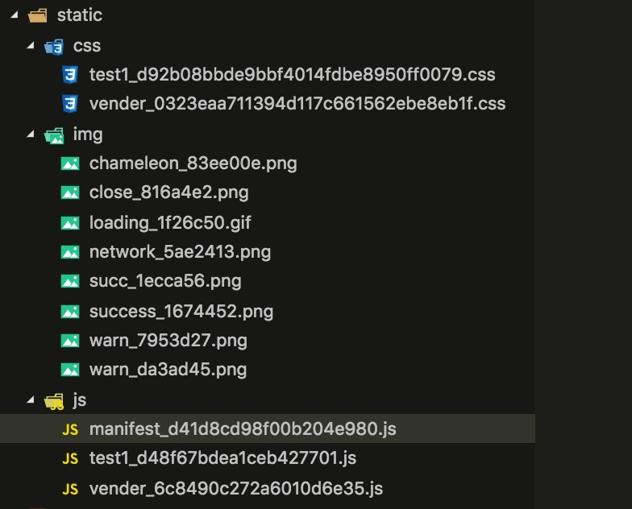

# 配置

针对项目、组件、路由等的特定配置，以满足各种方式的需求。

## 组件配置

组件基础配置及各端差异配置，包括组件引入等。

组件的配置以 json 对象的格式配置在.cml 文件中，结构如下：

```vue
<script cml-type="json">
{
  "base":{
    "usingComponents": {
      "navi": "/components/navi/navi",
      "c-cell": "/components/c-cell/c-cell",
      "c-list": "/components/c-list/c-list",
      "navi-npm": "cml-test-ui/navi/navi"
    }
  },
  "wx": {
  },
  "alipay": {
  },
  "baidu": {
  },
  "web": {
  },
  "weex": {
  }
}
</script>
```

- base 对象为各端共用的配置对象。
- wx、web、weex 分别对应三端特有的配置对象，base 的配置会应用到每一端的配置，内部做的 merge。
- `usingComponents`字段是目前最重要的配置，各端都会使用，小程序规定页面的 json 文件中配置使用到的组件。web 和 Weex 端的构建时也是根据该字段去找到相应的组件进行自动化的注册。所以用到组件必须进行配置
- `usingComponents`中组件的引用地址。
  - 支持引用 src 和 node_modules 下的组件，地址**禁止包含后缀扩展名**：
    - src 下可以写相对路径，也可以写相对于 src 的绝对路径，例如`/components/**`,
    - node_modules 下的组件，不需要写 node_modules，直接从 npm 的包名称开始写例如`cml-test-ui/navi/navi`。
  - 引用的组件类型支持：
    - .cml 扩展名跨端组件
    - .vue 扩展名的 vue、weex 组件，[仅在多态组件可用](poly.md#多态组件)
    - 小程序组件文件夹路径，[仅在多态组件可用](poly.md#多态组件)
    - .js 扩展名的 react 组件，[仅在多态组件可用](poly.md#多态组件)
-  小程序端所需要的一些配置，写在各自的特有配置对象中

## 路由配置

项目统一路由配置，CML 项目内置了一套各端统一的路由配置方式。

### 路由配置文件

`src/router.config.json`是路由的配置文件,内容如下：

```javascript
{
  "mode": "history",
  "domain": "https://www.chameleon.com",
  "routes":[
    {
      "url": "/cml/h5/index",
      "path": "/pages/index/index",
      "mock": "index.php"
    }
  ]
}
```

- mode 为 Web 端路由模式，分为`hash`或`history`。
- domain，当 mode 为 hash 时 domain 为 Web 端页面的最终访问地址，当 mode 为 history 时，domain 为 Web 端页面的域名。
- routes 为路由配置
  - path 为路由对应的 cml 文件的路径,以 src 目录下开始的绝对路径，以/开头。
  - url,当 mode 为 hash 时 url 为 Web 端页面地址对应的 hash，当 mode 为 history 时，url 为 Web 端页面的路径。
  - mock 为该路由对应的 Mock 文件(仅模拟模板下发需要)
- 小程序端，构建时会将`router.config.json`的内容，插入到 app.json 的 pages 字段，实现小程序端的路由。

- <b>注: `router.config.json`中的 domain 指定页面最终线上地址，只是用于 config.json 的生成,真正决定 web 页面访问地址的还是取决于 web 服务器的配置。</b>

注：[apiPrefix、publicPath、router.config.json、cmlUrl 的关系](../tutorial/deploy-guide.md#apiPrefix、publicPath、router.config.json、cmlUrl的关系)

### 使用路由场景

- [应用内路由](../api/#路由导航)
- [跨应用路由](../api/#打开关闭页面)

## 项目配置

不同端、不同模式的差异化构建配置。

本文档描述了项目配置的全部参数及使用方法。

### 配置一览表

#### 项目全局配置

<table>
  <tr>
    <th>字段名</th>
    <th>类型</th>
    <th>可选值</th>
    <th>说明</th>
    <th>备注</th>
  </tr>
  <tr>
    <td><a href="#web端页面文件类型">templateType</a></td>
    <td>String</td>
    <td>html[默认]、smarty</td>
    <td>web端构建出的页面文件类型</td>
    <td></td>
  </tr>
  <tr>
    <td><a href="#web端页面文件名称">projectName</a></td>
    <td>String</td>
    <td>-</td>
    <td>web端构建出的页面文件名称</td>
    <td></td>
  </tr>
  <tr>
    <td><a href="#模板语法">templateLang</a></td>
    <td>String</td>
    <td>cml[默认]、vue</td>
    <td>视图层模版语法</td>
    <td>两种语法不可混用</td>
  </tr>
  <tr>
    <td><a href="#支持端配置">platforms</a></td>
    <td>Array[String]</td>
    <td>['web','weex','wx','alipay','baidu']</td>
    <td>当前项目支持端配置</td>
    <td></td>
  </tr>
  <tr>
    <td><a href="#关闭某一端构建">devOffPlatform</a></td>
    <td>Array[String]</td>
    <td>['web','weex','wx','alipay','baidu']</td>
    <td>dev模式下关闭部分端构建</td>
    <td></td>
  </tr>
  <tr>
    <td><a href="#关闭某一端构建">buildOffPlatform</a></td>
    <td>Array[String]</td>
    <td>['web','weex','wx','alipay','baidu']</td>
    <td>build模式下关闭部分端构建</td>
    <td></td>
  </tr>
  <tr>
    <td><a href="#语法检查">enableLinter</a></td>
    <td>Boolean</td>
    <td>true[默认]、false</td>
    <td>是否开启chameleon的语法检查</td>
    <td></td>
  </tr>
  <tr>
    <td><a href="#多态校验控制">check</a></td>
    <td>Object</td>
    <td>-</td>
    <td>多态校验控制</td>
    <td></td>
  </tr>
  <tr>
    <td><a href="#多态校验控制">check.enable</a></td>
    <td>Boolean</td>
    <td>true[默认]、false</td>
    <td>是否开启多态语法校验</td>
    <td></td>
  </tr>
  <tr>
    <td><a href="#多态校验控制">check.enableTypes</a></td>
    <td>Array[String]</td>
    <td>['Object','Array','Nullable']</td>
    <td>Object表示多态协议中传递数据为对象时不校验内部具体数据，Array表示多态协议中传递数据为数组时不校验内部具体数据，Nullable表示某些参数不是必传</td>
    <td>谨慎使用，确定的输入数据结构会提高代码维护性！</td>
  </tr>
  <tr>
    <td><a href="#全局变量校验">enableGlobalCheck</a></td>
    <td>Boolean</td>
    <td>true、false</td>
    <td>是否开启全局变量校验</td>
    <td></td>
  </tr>
  <tr>
    <td><a href="#全局变量校验白名单">globalCheckWhiteList</a></td>
    <td>Array[String|RegExp] </td>
    <td>-</td>
    <td>文件校验白名单，配置后可不校验改文件</td>
    <td></td>
  </tr>
  <tr>
    <td><a href="#dev服务端口">devPort</a></td>
    <td>Number</td>
    <td>8000[默认]</td>
    <td>dev模式启动的web服务端口，默认从8000开始查找空闲端口</td>
    <td></td>
  </tr>
  <tr>
    <td><a href="#配置babel-loader不处理的文件">excludeBablePath</a></td>
    <td>Array[String|RegExp]</td>
    <td>-</td>
    <td>配置babel-loader不处理文件</td>
    <td></td>
  </tr>
   <tr>
    <td><a href="#配置babel-loader处理的文件">babelPath</a></td>
    <td>Array[String|RegExp]</td>
    <td>-</td>
    <td>配置babel-loader处理文件</td>
    <td></td>
  </tr>
  <tr>
    <td><a href="#cmss处理">cmss</a></td>
    <td>Object</td>
    <td>-</td>
    <td>cml相关配置，仅web端有效</td>
    <td></td>
  </tr>
  <tr>
    <td><a href="#cmss处理">cmss.rem</a></td>
    <td>Boolean</td>
    <td>true[默认]、false</td>
    <td>样式单位是否编译为rem</td>
    <td></td>
  </tr>
  <tr>
    <td><a href="#cmss处理">cmss.scale</a></td>
    <td>Number</td>
    <td>0.5[默认]</td>
    <td>cmss.rem为false时有效，尺寸换算规则 cpx * cmss.scale = px</td>
    <td></td>
  </tr>
  <tr>
    <td><a href="#禁用基础样式">baseStyle</a></td>
    <td>Object</td>
    <td>-</td>
    <td>禁用基础样式</td>
    <td></td>
  </tr>
  <tr>
    <td><a href="#禁用基础样式">baseStyle[platform]</a></td>
    <td>Boolean</td>
    <td>true、false</td>
    <td>禁用该端基础样式，platfrom为：web|weex|wx|alipay|baidu</td>
    <td>baseStyle.web为false时不插入web端基础样式，其他端同理</td>
  </tr>
  <tr>
    <td><a href="#全局引用npm组件库">cmlComponents</a></td>
    <td>Array[String]</td>
    <td>['cml-ui']</td>
    <td>全局自动引入组件库</td>
    <td>当设置该项之后可以直接使用改库下所有组件，无需手动引入</td>
  </tr>
  <tr>
    <td><a href="#配置子项目">subProject</a></td>
    <td>Array[String|Object]</td>
    <td>-</td>
    <td>配置项目中引入的子项目</td>
    <td>子项目的可以通过对象或者字符串的方式配置</td>
  </tr>
  <tr>
    <td><a href="#项目优化">optimize</a></td>
    <td>Object</td>
    <td>-</td>
    <td>优化项目构建</td>
    <td>chameleon-tool@1.0.5-alpha.1开始支持</td>
  </tr>
  <tr>
    <td><a href="#全局样式">globalStyleConfig</a></td>
    <td>Object</td>
    <td>-</td>
    <td>支持全局样式，便于修改内置组件样式</td>
    <td>chameleon-tool@1.0.5-alpha.1开始支持</td>
  </tr>
</table>

#### 平台内构建配置

平台内构建配置是针对某一端执行命令构建时的特殊配置。

<table>
  <tr>
    <th>字段名</th>
    <th>类型</th>
    <th>可选值</th>
    <th>说明</th>
    <th>备注</th>
  </tr>
  <tr>
    <td><a href="#资源发布路径">publicPath</a></td>
    <td>String</td>
    <td>-</td>
    <td>静态资源发布路径</td>
    <td>设置该字段执行构建时静态资源地址将改为该地址</td>
  </tr>
  <tr>
    <td><a href="#api-请求前缀">apiPrefix</a></td>
    <td>String</td>
    <td>-</td>
    <td>接口请求地址地址</td>
    <td>设置该字段调用请求时如果请求路径不是全路径则拼接该地址</td>
  </tr>
  <tr>
    <td><a href="#文件指纹">hash</a></td>
    <td>Boolean</td>
    <td>true[build默认]、false[dev默认]</td>
    <td>构建出的文件名是否带hash</td>
    <td>用于更新浏览器缓存</td>
  </tr>
  <tr>
    <td><a href="#代码压缩">minimize</a></td>
    <td>Boolean</td>
    <td>true[build默认]、false[dev默认]</td>
    <td>构建出的文件是否进行代码压缩</td>
    <td></td>
  </tr>
  <tr>
    <td><a href="#热更新与自动刷新">hot</a></td>
    <td>Boolean</td>
    <td>true[默认]、false</td>
    <td>控制是否开启热更新</td>
    <td>web端有效</td>
  </tr>
  <tr>
    <td><a href="#打包资源分析">analysis</a></td>
    <td>Boolean</td>
    <td>true[默认]、false</td>
    <td>是否打开webpack打包分析工具</td>
    <td></td>
  </tr>
  <tr>
    <td><a href="#调试窗口">console</a></td>
    <td>Boolean</td>
    <td>false[默认]、true</td>
    <td>控制是否打开页面上的调试窗口</td>
    <td>web端有效</td>
  </tr>
  <tr>
    <td><a href="#内置变量">definePlugin</a></td>
    <td>Object</td>
    <td>-</td>
    <td>定义运行时内部变量</td>
    <td></td>
  </tr>
  <tr>
    <td><a href="#模块标识类型">moduleIdType</a></td>
    <td>String</td>
    <td>number、hash、name</td>
    <td>设置webpack打包模块的id类型</td>
    <td></td>
  </tr>
  <tr>
    <td><a href="#babelpolyfill">babelPolyfill</a></td>
    <td>Boolean</td>
    <td>默认 false</td>
    <td>是否添加polyfill</td>
    <td>web端@babel/polyfill 小程序端<a href="https://github.com/didi/chameleon/blob/0.3.x-alpha/packages/chameleon-tool/configs/default/miniappPolyfill.js">miniappPolyfill</a> weex端 <a href="https://github.com/didi/chameleon/blob/0.3.x-alpha/packages/chameleon-tool/configs/default/weexPolyfill.js">weexPolyfill</a></td>
  </tr>
  <tr>
    <td><a href="#domain-多域名请求前缀">domain</a></td>
    <td>Object</td>
    <td>默认 {}</td>
    <td>多域名请求前缀</td>
    <td></td>
  </tr>
</table>

### 配置文件

CML 的构建过程是配置化的，项目的根目录下提供一个 chameleon.config.js 文件，在该文件中可以使用全局对象 CML 的 api 去操作配置对象。例如：

```javascript
// 设置静态资源的线上路径
const publicPath = '//www.static.chameleon.com/static';

// 设置 API 请求前缀
const apiPrefix = 'https://api.chameleon.com';

// 合并配置
cml.config.merge({
  templateType: 'html',
  projectName: 'Chameleon',
  base: {
    dev: {
      domain1: 'localhost',
      domain2: 'localhost',
    },
    build: {
      domain1: 'http://www.cml1.com',
      domain1: 'http://www.cml2.com',
    },
  },
  web: {
    dev: {
      hot: true,
      console: true,
    },
    build: {
      publicPath: `${publicPath}/web`,
      apiPrefix,
    },
  },
});
```

### 配置 api

- `cml.config.merge(obj)` merge 方式修改配置。
- `cml.config.assign(obj)` assign 方式修改配置
- `cml.config.get()` 获取 config 配置

### 配置对象结构

配置对象的第一级为全局配置，例如`projectName`,全局配置中有各平台内的配置对象，例如`web、wx、weex`等。<b>其中`base`对象用于配置各个平台对象的公共部分</b>。

平台对象内部分为各 media 的配置对象，例如`dev、build`。

### 配置详解

下面就详细介绍配置中的功能。

#### Web 端页面文件  类型

`templateType`, String 类型。  
该字段控制 Web 端构建  出的页面文件类型。

- `templateType: 'html'` 构建出.html 文件，纯前端模板
- `templateType: 'smarty'` 构建出.tpl 文件

例如：

```javascript
cml.config.merge({
  templateType: 'html',
});
```

#### Web 端页面文件名称

`projectName`, String 类型。

该字段控制 Web 端构建  出的模板文件名称，默认是当前项目的根目录文件夹名称。

例如：

```javascript
cml.config.merge({
  projectName: 'test_cml',
  templateType: 'html',
});
```

Web 端构建出 `test_cml.html`文件

#### 模板语法

`templateLang`, String 类型。  
CML 的视图层支持两种模板语法，通过在 template 上的`lang`属性做区分，如果不写默认是 CML 语法。  
该字段控制`init page 和init component` 时生成的 cml 文件的 template 模板上的`lang属性`。  
例如：

```javascript
cml.config.merge({
  templateLang: 'cml',
});
```

#### 支持端配置

`platforms`, Array[String]类型。
 配置当前项目支持的  端，该配置决定`cml dev`和`cml build`命令启动构建的端，决定`cml init`命令初始化多态接口和多态组件时只生成相应端代码。
例如：

```javascript
cml.config.merge({
  platforms: ['web', 'wx'],
});
```

`cml dev`和`cml build`只启动 web 和 wx 端的构建。

#### 关闭某一端构建

`devOffPlatform和buildOffPlatform`, Array[String] 类型。
 当我们执行`cml dev` 和 `cml build` 时会自动构建输出  所有平台的代码，可以通过这两个字段控制不需要构建的平台，目前支持取值`["web","wx","weex"]`。
例如：

```javascript
cml.config.merge({
  devOffPlatform: ['wx'],
  buildOffPlatform: ['wx'],
});
```

#### 语法检查

`enableLinter`, Boolean  类型。

默认为 `true`，是否开启 CML 的语法检查，会在命令行提示语法错误。
例如：

```javascript
cml.config.merge({
  enableLinter: false,
});
```

#### 多态校验控制

`check`, Object 类型。
CML 提供了多态接口与多态组件的写法，同时为了保证代码的质量提供了多态校验的方法，可以通过`check`字段进行校验的控制。

`check.enable`, Boolean 类型。 控制是否开启多态校验，默认`true`。

`check.enableTypes`, Array[String] 类型。  可取值`["Object","Array","Nullable"]`,控制校验中是否可以定义直接定义 Object 和 Array 类型，和  是否可以定义可为空类型,默认值为`[]`。
例如：

```javascript
cml.config.merge({
  check: {
    enable: true,
    enableTypes: ['Object', 'Array', 'Nullable'],
  },
});
```

#### 全局变量校验

`enableGlobalCheck`, Boolean 类型。  
默认是 false,(chameleon-tool 0.2.0 版本及之后默认为 true)，控制是否进行全局变量的检验。

例如：

```javascript
cml.config.merge({
  enableGlobalCheck: true,
});
```

#### 全局变量校验白名单

`globalCheckWhiteList`, Array[String|RegExp] 类型。

chameleon 内置了全局变量校验的功能 可以设置白名单不校验某些文件。以文件绝对路径进行匹配，可以是正则表达式径，也可以是字符串的 endWiths。

例如：

```javascript
cml.config.merge({
  globalCheckWhiteList: ['jquery.js', /node_modules/],
});
```

则所有以 `jquery.js` 结尾的文件以及 正则匹配 `/node_modules/` 的不做校验；

#### dev 服务端口

`devPort`, Number 类型。
dev 模式启动的 web 服务端口，默认是从 8000 开始寻找空闲端口，避免了启动多个项目时的端口冲突问题。如果想指定端口可以使用该参数进行配置。
例如：

```javascript
cml.config.merge({
  devPort: 8080,
});
```

#### 配置 babel-loader 不处理的文件

`excludeBablePath`, Array[String|RegExp] 类型。

```javascript
const path = require('path');
cml.config.merge({
  excludeBablePath: [/test-exclude/, path.resolve(__dirname, './src/excludes')],
});
```

这个配置的结果会作为 webpack 模块配置中 Rule.exclude 的值；

#### 配置 babel-loader 处理的文件

`babelPath`, Array[String|RegExp] 类型。 默认开发者引入的 node_modules 中的文件不经过 babel，如有文件需要 babel，设置该参数。

```javascript
const path = require('path');
cml.config.merge({
  babelPath: [path.resolve(__dirname, 'node_modules/test/')],
});
```

这个配置的结果会作为 webpack 模块配置中 Rule.include 的值；

#### cmss 处理

`cmss`，Object 类型。
仅用于 Web 端。其中包含 rem 及 scale 属性，Web 端构建时默认将 cpx 转为 rem，当不需要时转为 rem 时，将 rem 置为 false，则 scale 参数生效，scale 为像素缩放倍数，默认为 1，会将 cpx 按照 scale 的设置进行缩放为 px。例如：

```javascript
cml.config.merge({
  cmss: {
    rem: false,
    scale: 0.5,
  },
});
```

该设置 Web 端 cpx 不转为 rem，而缩小 1 倍转为 px，例如 10cpx 转为 5px。

#### 禁用基础样式

`baseStyle`， Object 类型。
chameleon 为了让各端样式统一，默认会在全局插入一些基础样式，如果开发者的跨端不需要这些基础样式，可以通过该参数进行设置。key 值为端名称，value 为 Boolean 值，是否插入  基础样式。例如：

```javascript
cml.config.merge({
  baseStyle: {
    web: false,
    wx: false,
    weex: false,
  },
});
```

该设置 web、wx、Weex 端均不插入基础样式。

#### 全局引用 npm 组件库

`cmlComponents`, Array[String] 类型。
当我们想把 npm 组件库中的组件全部自动引入，而不需要单独引入时，可以通过该字段配置 npm 包名称。例如 `cml-ui`是我们提供的一个 npm 组件库，可以进行如下配置：

```javascript
cml.config.merge({
  cmlComponents: ['cml-ui'],
});
```

npm 组件库的`package.json`中的`main`字段可以指定路径，否则就会查找 npm 包中的所有 cml 文件自动引入，自动引入的组件名称为 cml 文件名称。

#### 配置子项目

subProject, Array[String|Object]类型。 当配置项为 Object 时， npmName 表示该子项目的地址(从 node_modules 层级开始配置)， isInjectBaseStyle 表示该子项目是否注入基础样式；
当配置项为 String 时，该值直接表示该子项目的地址(从 node_modules 层级开始配置)，此时不支持配置是否注入基础样式，子项目默认注入基础样式。例如：

```javascript
cml.config.merge({
  subProject: [
    {
      npmName: '@didi/cml-login',
      isInjectBaseStyle: false,
    },
    '@didi/base-style-test',
  ],
});
```

#### 项目优化

chameleon-tool@1.0.5-alpha.1 开始支持

```javascript
cml.config.merge({
  optimize: {
  watchNodeModules: false // 默认不对 node_modules中的文件进行 watch,提升编译性能
});
```

#### 全局样式

chameleon-tool@1.0.5-alpha.1 开始支持

使用参考[demo](https://github.com/chameleon-team/cml-global-style)

```javascript
cml.config.merge({
  globalStyleConfig: {
    //globalCssPath 该路径下的样式对非 Weex 端生效；
    globalCssPath: path.join(__dirname, 'src/assets/global.config.less'),
    weexCssConfig: {
      //该文件内的样式会作为全局样式导入
      weexCssPath: path.join(__dirname, 'src/assets/global.weex.less'),
      //由于weex端本身的限制，假如某些情况下，要覆盖内置组件的某个样式，我们提供了对于该组件注入样式的方式，注入的样式只会对该组件生效
      injectCss: [
        {
          componentPath: path.join(
            __dirname,
            'node_modules/cml-ui/components/c-dialog/c-dialog.cml',
          ),
          cssPath: path.join(__dirname, 'src/assets/c-dialog.less'),
        },
      ],
    },
  },
});
```

#### 构建结果信息

`buildInfo`, Object 类型。
`buildInfo.wxAppId`,String 类型。微信的 appId。

当执行完 cml build 后会生成一个`config.json`文件，该文件存储构建后各平台的页面信息。可以通过这个 json 文件做页面的动态下发，页面降级等等。

例如：

```javascript
cml.config.merge({
  buildInfo: {
    wxAppId: '123456',
  },
});
```

cml build 后生成  在`dist/config.json`

```javascript
    {
        "wx": {
            "appId": "123456",
            "path": "/pages/index/index"
        },
        "web": {
            "url": "https://api.chameleon.com/cml/h5/index"
        },
        "weex": {
            "url": "https://static.chameleon.com/pinche/hkcml/weex/hybridkits_pageone_e86b77ae05a015a3a546.js",
            "query": {
                "path": "/pages/index/index"
            }
        }
    }
```

config.json 中微信小程序的 appId 是  通过`buildInfo`配置生成，其他的页面信息是根据`router.config.json`中的配置生成。

例如：

```javascript
cml.config.merge({
  enableLinter: false,
});
```

#### 构建入口与页面 

默认的入口与页面集成在命令行中，对于有特殊  需求的开发者，CML 提供了可以自定义 Web 端构建入口与页面，Weex 端构建入口的功能。
`entry`, Object  类型。
`entry.template`, String 类型。 页面文件的绝对路径。
`entry.web`, String 类型。 Web 端入口文件的  绝对路径。
`entry.weex`, String 类型。 wewx 端入口文件的  绝对路径。
例如：

```
var path = require('path');
cml.config.merge({
  entry: {
    template: path.resolve('./src/index.html')
    web: path.resolve('./src/mian.web.js')
    weex: path.resolve('./src/main.weex.js')
  }
})
```

#### 平台内配置

 每一个平台的构建会需要不同的配置，所以针对每一个平台会有一个平台配置对象，平台配置对象中又有多个 media 配置对象，例如 dev 或者 build 的配置。 下面讲述的配置项都是放在 media 对象中。例如：
`wx web weex`是平台对象，里面的`dev和build`是 media 对象。

```javascript
cml.config.merge({
  wx: {
    dev: {},
    build: {},
  },
  web: {
    dev: {},
    build: {},
  },
  weex: {
    dev: {},
    build: {},
  },
});
```

以下介绍平台内配置支持的配置项

#### 文件指纹

文件指纹是文件的唯一标识，以文件的内容生成 hash 值作为文件名称的一部分。在开启强缓存的情况下，如果文件的 URL 不发生变化，无法刷新浏览器缓存。文件指纹  用于更新浏览器的缓存。小程序端不需要文件指纹。 默认图片资源  开启 hash，build 模式开启 hash。 通过`hash`字段配置。

`hash`, Boolean 类型。
 控制打包出的 js 和 css 文件是否带 hash 后缀，图片字体等静态资源自动带 hash，其小程序端不支持 hash 参数。

例如：

```javascript
cml.config.merge({
  web: {
    dev: {
      hash: true,
    },
  },
});
```

下图为 Web 端开启文件指纹的打包结果。


#### 代码压缩

为了减少资源网络传输的大小，通过压缩器对 js、css、图片进行压缩是一直以来前端工程优化的选择。在 CML 中只需要  配置`minimize`参数。

`minimize`, Boolean 类型。

 控制打包出的文件是否进行压缩。

例如：

```javascript
cml.config.merge({
  web: {
    dev: {
      minimize: true,
    },
  },
});
```

#### 资源发布路径

`publicPath`, String 类型。
 控制代码中静态资源的引用路径， 线上发布需要用到，media 为 dev 时默认 小程序端是本地路径，web 和 Weex 端是当前 dev 服务的  路径。
例如：

```javascript
cml.config.merge({
  web: {
    build: {
      publicPath: 'http://www.chameleon.com/static',
    },
  },
});
```

#### 热更新与自动刷新

热更新与自动刷新都是提高本地开发效率的手段，当项目中的源代码发生改变时， 能够自动的在页面看到改变，其中热更新不需要重新刷新预览的页面。目前只有 Web 端的开发支持热更新，通过[hot 参数配置](config.md#代码热更新)。 `dev`模式默认自动刷新，Web 端可以选择开启热更新。

`hot`, Boolean 类型。

控制是否开启热更新，只在 Web 端生效，开启热更新时，css 代码不会单独分离出来，如果进行线上 js 代理本地 js 调试问题时，请关闭热更新。

例如：

```javascript
cml.config.merge({
  web: {
    dev: {
      hot: true,
    },
  },
});
```

#### 打包资源分析

`analysis`, Boolean 类型。

控制是否  打开 webpack 打包分析工具， 内部使用的`webpack-bundle-analyzer`插件。

例如：

```javascript
cml.config.merge({
  web: {
    dev: {
      analysis: true,
    },
  },
});
```

#### 调试窗口

`console`, Boolean 类型。

控制是否打开页面上的调试窗口，只在 Web 端有效，方便在真机上进行调试。

例如：

```
cml.config.merge({
  web: {
    dev: {
      console: true
    }
  }
})
```

####  内置变量

`definePlugin`, Object 类型，内部使用`webpack.DefinePlugin`实现，定义运行时的内置变量。
例如：

```
cml.config.merge({
  web: {
    dev: {
      definePlugin: {
        'process.env.TEST': JSON.stringify('CML_TEST')
      }
    }
  }
})
```

#### API 请求前缀

`apiPrefix`, String 类型。
这个配置与网络请求相关，在 wx 和 Weex 项目中，ajax 的请求不能像 Web 端一样只写相对路径，而是要写带有域名的绝对路径，`chameleon-api` 这个基础库，提供了网络请求的 api，`get、post、request`方法，该方法会在运行时将请求的相对路径上添加配置的`apiPrefix`。media 是 dev 时 默认为当前 dev 服务的地址,不需要配置。 例如：
`chameleon.config.js`

```
// 设置 API 请求前缀
const apiPrefix = 'http://api.chameleon.com';
cml.config.merge({
  wx: {
    dev: {
    },
    build: {
      apiPrefix
    }
  }
})
```

```vue
<script>
import cml from 'chameleon-api';
class Index {
  methods = {
    sendGet() {
      cml
        .get({
          url: '/api/driver/getList',
          data: {
            name: 'cml',
            age: 18,
          },
        })
        .then((res) => {
          console.log(res);
        })
        .catch((e) => {
          console.log(e);
        });
    },
  };
}
export default new Index();
</script>
```

在执行 `cml wx dev` 命令构建的结果中，`cml.get()` 方法发送的请求是 `http://172.22.137.29:8000/api/driver/getList`

在执行 `cml wx build` 命令构建的结果中，`cml.get()` 方法发送的请求是 `http://api.chameleon.com/api/driver/getList`

#### 模块标识类型

`moduleIdType`,String 类型。
设置 webpack 打包模块的 id 类型。

- number 顺序排列的数组下标。
- hash 利用 webpack.HashedModuleIdsPlugin() 模块的 id 类型为模块内容的 hash 值。
- name 利用 webpack.NamedModulesPlugin() 模块的 id 类型为文件的路径。
- CML 用于 build 模式，模块的 id 类型为模块内容的 hash，并且最终文件的 hash 也经过优化处理，根据文件内容绝对 hash 值。
  默认 media 为 dev 时 取值  为 name 方便开发调试， media 为 build 时取值为 CML 保证 hash 值由文件内容决定，更好的做缓存持久化。

例如：

```
cml.config.merge({
  web: {
    dev: {
      moduleIdType: "number"
    }
  }
})
```

#### babelPolyfill

> chameleon-tool@0.0.15 开始支持 Web 端
> chameleon-tool@0.3.0 开始支持 小程序端
> chameleon-tool@0.3.3 开始支持 Weex 端

`babelPolyfill`, Boolean 类型, 默认 false。
一些 es6+的语法，babel 不会转义，例如 Object.sssign、Object.entries 等方法, 如果客户端运行环境不支持这些语法就会出错。其中 Web 使用的是 `@babel/polyfill`, 小程序端使用的是自写的一些方法的 polyfill，参见 [miniappPolyfill](https://github.com/didi/chameleon/blob/v0.3.x-alpha/packages/chameleon-tool/configs/default/miniappPolyfill.js)，Weex 端使用的是自写的一些方法的 polyfill，参见 [weexPolyfill](https://github.com/didi/chameleon/blob/v0.3.x-alpha/packages/chameleon-tool/configs/default/weexPolyfill.js)。注意添加 polyfill 后会增加一些文件体积。

例如：

```
cml.config.merge({
  base: {
    dev: {
      babelPolyfill: true
    },
    build: {
      babelPolyfill: true
    }
  }
})
```

#### Domain 多域名请求前缀

> chameleon-tool@0.2.1
> chameleon-api@0.3.1 开始支持

`domain`, Object 类型。
一般配置在 base 对象中，作为所有平台的公共配置，dev 模式中配置的`localhost`会替换成当前 dev 模式启动的 web 服务 ip+端口。 具体使用文档参见 [API 多域名 Mock](build.md#api-多域名-mock)。

例如：

```
cml.config.merge({
  base: {
    dev: {
      domain: {
        domain1: "localhost",
        domain2: "localhost"
      },
    },
    build: {
      domain: {
        domain1: "http://api.cml.com",
        domain2: "http://api2.cml.com"
      },
    }
  },
})
```

#### 自定义构建配置

如果我们需要多套构建配置，可以自定义一个 media，比如设置 weex.custom 对象，然后执行`cml weex custom`即可使用你设置的 custom 配置进行构建，但是不会启动 dev 服务和 watch。
例如：

```javascript
cml.config.merge({
  weex: {
    custom: {
      minimize: true, //对打包结果进行压缩
      moduleIdType: 'name', //编译的模块结果以模块名字显示
    },
  },
});
```

自定义构建配置可配置项和上面介绍的平台内配置项是一样的，比如同样支持 publicPath apiPrefix hash minimize anslysis 等；

假如你在构建微信小程序端，一个构建模式下要求不压缩代码，一个构建模式下要求显示模块名字，那么可以如下配置

```javascript
cml.config.merge({
  wx: {
    build: {
      minimize: true, //对打包结果进行压缩
      moduleIdType: 'id', //编译的模块结果以模块名字显示
    },
    custom: {
      minimize: false, //对打包结果进行压缩
      moduleIdType: 'name', //编译的模块结果以模块名字显示
    },
  },
});
```

执行 cml wx build 则打包的代码会进行压缩以及模块名以 id 取名；
执行 cml wx custom 则打包的代码不会压缩抑菌剂模块名以该模块对应的 name 取名

#### 组件导出配置

组件导出相关的配置请参见组件导出介绍。

### 修改 webpack 配置

在`chameleon.config.js`中可以通过 api 获取到构建之前的 webpack 配置并对其进行修改。使用方式：

```
cml.utils.plugin('webpackConfig', function({ type, media, webpackConfig }, cb) {
  // cb函数用于设置修改后的配置
  cb({
    type,
    media,
    webpackConfig
  });
});
```

## 平台列表

<table>
  <tr>
    <th>终端</th>
    <th>关键词</th>
    <th>说明</th>
  </tr>
  <tr>
    <td><a href="https://doc.quickapp.cn">快应用</a></td>
    <td>quickapp</td>
    <td><a href="../tutorial/cml-quickapp-app.html">手动扩展接入</a></td>
  </tr>
  <tr>
    <td><a href="https://developers.weixin.qq.com/miniprogram/dev/framework/">微信小程序</a></td>
    <td>wx</td>
    <td></td>
  </tr>
  <tr>
    <td><a href="https://docs.alipay.com/mini/developer/introduction">支付宝小程序</a></td>
    <td>alipay</td>
    <td></td>
  </tr>
  <tr>
    <td><a href="https://smartprogram.baidu.com/docs/develop/fuctionlist/list/">百度小程序</a></td>
    <td>baidu</td>
    <td></td>
  </tr>
  <tr>
    <td><a href="https://www.w3school.com.cn">手机浏览器 / WebView</a></td>
    <td>web</td>
    <td></td>
  </tr>
  <tr>
    <td><a href="https://developer.toutiao.com/docs/framework/">字节跳动小程序</a></td>
    <td>tt</td>
    <td><a href="../tutorial/migrate-bytedance-to-cml.html">手动扩展接入</a></td>
  </tr>
  <tr>
    <td><a href="https://q.qq.com/wiki/develop/miniprogram/frame/">QQ 小程序</a></td>
    <td>qq</td>
    <td></td>
  </tr>
  <tr>
    <td><a href="https://weex.apache.org/zh/guide/introduction.html">Weex </a></td>
    <td>weex</td>
    <td></td>
  </tr>
</table>
