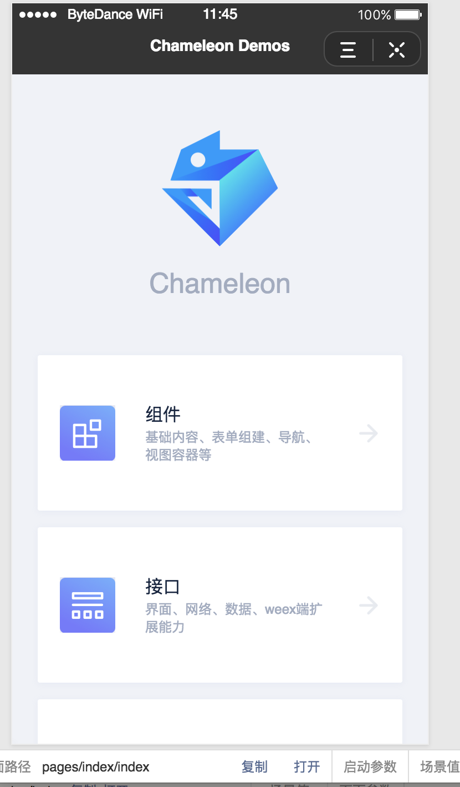
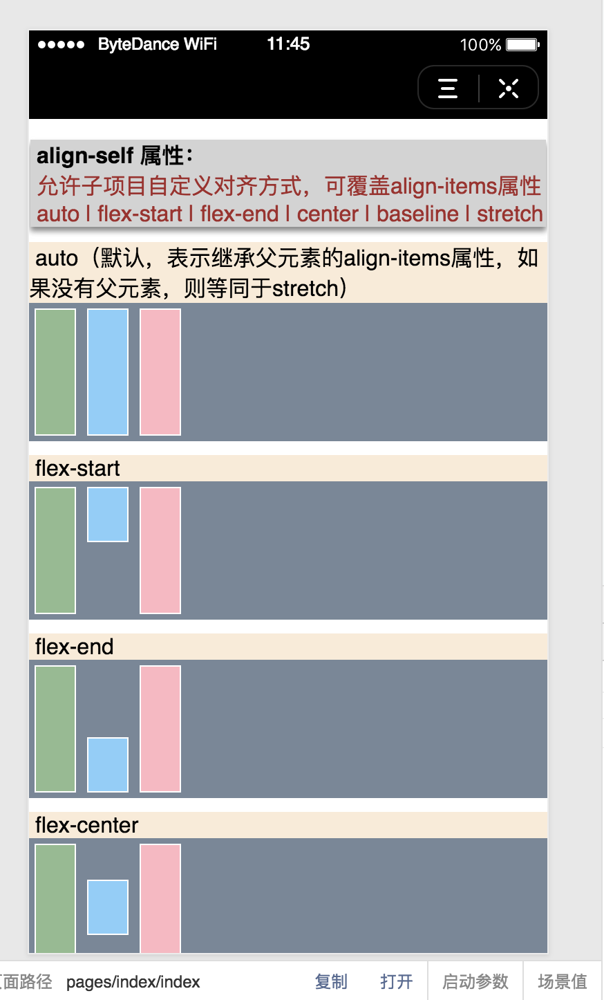
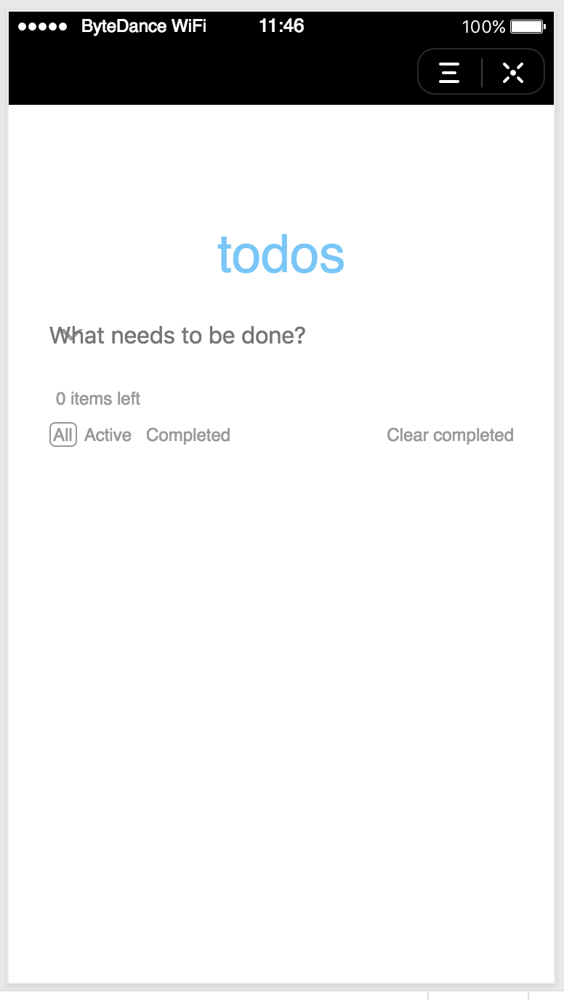

# 字节跳动小程序体验

支持的 `chameleon-tool` 版本

```
npm i chameleon-tool@1.0.3 -g
```

体验仓库

[cml-demo](https://github.com/beatles-chameleon/cml-demo/tree/master-tt)
[cml-flexbox](https://github.com/chameleon-team/cml-flexbox/tree/master-tt)
[cml-yanxuan](https://github.com/chameleon-team/cml-yanxuan/tree/master-tt)
[cml-todomvc](https://github.com/chameleon-team/cml-todomvc/tree/master-tt)

下载[字节跳动小程序开发者工具](https://microapp.bytedance.com/docs/devtool/versionUpdate.md)

clone 下来以上仓库之后, 分支，执行 cml tt dev，在开发者工具中即可预览效果

效果图如下

<div style="display: flex;flex-direction: row;justify-content: space-around; align-items: flex-end;">
  <div style="display: flex;flex-direction: column;align-items: center;">
    
    <text style="color: #fda775;font-size: 24px;"></text>
  </div>
  <div style="display: flex;flex-direction: column;align-items: center;">
    
    <text style="color: #fda775;font-size: 24px;"></text>
  </div>
  <div style="display: flex;flex-direction: column;align-items: center;">
    
    <text style="color: #fda775;font-size: 24px;"></text>
  </div>
  <div style="display: flex;flex-direction: column;align-items: center;">
    
    <text style="color: #fda775;font-size: 24px;"></text>
  </div>
</div>

# 字节跳动小程序接入步骤

根据以下步骤配置之后，既有 CML 的项目可以直接在头条小程序运行。

0、升级最新的 chameleon 包

1、安装头条小程序端所依赖的库

2、将原本引用依赖的 **chameleon 内置库** 改成头条小程序的库，头条的库会依赖原本的**chameleon 内置库**，所以依然可以运行原本的各种小程序、 web 端、weex 端。

## 安装头条扩展需要的仓库

检查原有依赖的版本

```json
"chameleon-api": "1.0.0",
"chameleon-runtime": "1.0.0",
"chameleon-store": "1.0.0",
"chameleon-ui-builtin": "1.0.0",
"cml-ui": "1.0.0"
```

新增头条小程序相关仓库

```json
"cml-tt-api": "0.2.3",
"cml-tt-plugin": "0.2.3",
"cml-tt-runtime": "0.2.3",
"cml-tt-store": "0.2.3",
"cml-tt-ui": "0.2.3",
"cml-tt-ui-builtin": "0.2.3",
```

## 修改 chameleon.config.js 配置文件

### 引入 `path`模块

```javascript
const path = require('path');
```

### 增加 builtinNpmName 、 extPlatform 和 babelPath 配置

```javascript

builtinNpmName: 'cml-tt-ui-builtin',
extPlatform: {
  tt: 'cml-tt-plugin',
},
babelPath: [
  path.join(__dirname,'node_modules/cml-tt-ui-builtin'),
  path.join(__dirname,'node_modules/cml-tt-runtime'),
  path.join(__dirname,'node_modules/cml-tt-api'),
  path.join(__dirname,'node_modules/cml-tt-ui'),
  path.join(__dirname,'node_modules/cml-tt-store'),
  path.join(__dirname,'node_modules/cml-tt-mixins'),
  path.join(__dirname,'node_modules/mobx'),
],
```

以上配置解释

builtinNpmName 字段是你定义的内置 npm 包名称
extPlatform 是配置扩展新端的编译插件，key 值为端标识，value 为编译插件 npm 包名称。
babelPath 配置的是哪些 npm 包要过 babel 处理

具体解释[参考](https://cml.js.org/doc/extend/quickstart.html?h=builtinnpmname)

扩展头条的核心实现具体可以[参考](https://github.com/chameleon-team/cml-tt-sets/tree/dev) 的 dev 分支

### 如果要引入基础样式,需要增加 `tt：true`的配置,默认导入基础样式

[工程配置-baseStyle](https://cml.js.org/doc/framework/config.html?h=basestyle)

```javascript
baseStyle:{
  wx: true,
  web: true,
  weex: true,
  alipay: true,
  baidu: true,
  qq: true,
  tt:true,
},
```

## 修改项目中代码

### 修改项目中引入 `chameleon-store chameleon-api cml-ui` 的地方

store 和 api 的引用:

`chameleon-store` 改为 `cml-tt-store`

`chameleon-api`改为`cml-tt-api`

```javascript
import cml from 'chameleon-api';
import store from 'chameleon-store';
```

改为

```javascript
import cml from 'cml-tt-api';
import store from 'cml-tt-stroe';
```

组件的引用: `cml-ui` 改为 `cml-tt-ui`

```vue
<script cml-type="json">
{
    "base": {
        "usingComponents": {
            "c-actionsheet": "cml-ui/components/c-actionsheet/c-actionsheet"
        },
    }
}
</script>
```

改为

```vue
<script cml-type="json">
{
    "base": {
        "usingComponents": {
            "c-actionsheet": "cml-tt-ui/components/c-actionsheet/c-actionsheet"
        },
    }
}
</script>
```

### 项目中任意多态组件都要增加字节跳动这一端组件

如果原来某个多态组件 `poly-comp`

```
poly-comp.interface
poly-comp.web.cml
poly-comp.weex.cml
poly-comp.wx.cml
poly-comp.alipay.cml
poly-comp.baidu.cml

```

接入头条小程序的话，则需要在加一个 `poly-comp.tt.cml`

### 项目中任意多态接口要增加字节跳动这一端接口

如果原来一个多态接口 `poly-api.interfacce`

```vue
<script cml-type="interface">
type res = [String];
interface UnsupportedInterface {
  getUnsupportApis(): res;
}
</script>

<script cml-type="web">
class Method implements UnsupportedInterface {
  getUnsupportApis() {
    return [];
  }
}

export default new Method();
</script>

<script cml-type="weex">
class Method implements UnsupportedInterface {
  getUnsupportApis() {
    return ['设置页面标题', 'WebSocket', '地理位置'];
  }
}

export default new Method();
</script>

<script cml-type="wx">
class Method implements UnsupportedInterface {
  getUnsupportApis() {
    return [];
  }
}

export default new Method();
</script>

<script cml-type="alipay">
class Method implements UnsupportedInterface {
  getUnsupportApis() {
    return ['启动参数', 'beatles-bridge能力'];
  }
}

export default new Method();
</script>
<script cml-type="baidu">
class Method implements UnsupportedInterface {
  getUnsupportApis() {
    return ['beatles-bridge能力'];
  }
}

export default new Method();
</script>

<script cml-type="qq">
class Method implements UnsupportedInterface {
  getUnsupportApis() {
    return [];
  }
}

export default new Method();
</script>
```

那么需要增加

```vue
<script cml-type="tt">
class Method implements UnsupportedInterface {
  getUnsupportApis() {
    return [];
  }
}

export default new Method();
</script>
```

### 字节跳动小程序命令

字节跳动小程序支持的命令有

```
cml tt dev

cml tt build

```

当你完成了以上的步骤之后，就可以在你的项目中执行 `cml tt dev` 进行字节跳动小程序的开发了。

一个`cml-demo`仓库的 diff[在这里](https://github.com/beatles-chameleon/cml-demo/compare/master-copy...master-copy-tt?expand=1),可供大家参考。
