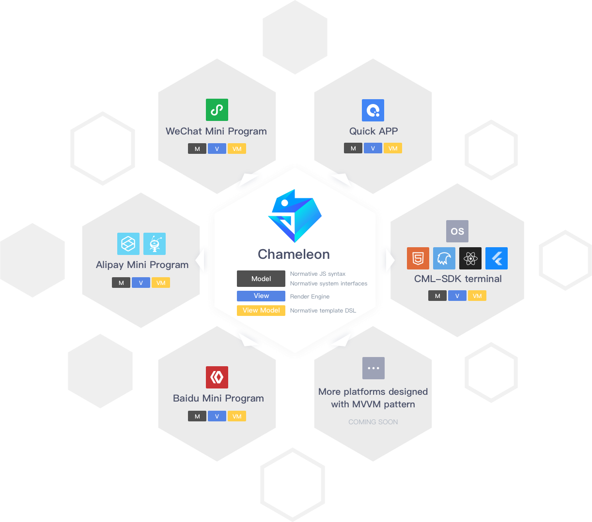
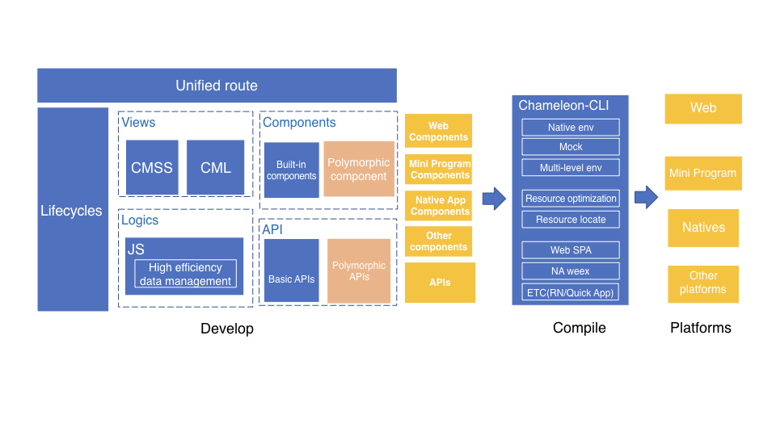

# Introduction

English | [简体中文](introduction.md)

---

CML (chameleon) is a unified solution for cross platform development of mini programs. It can adapt to different environments like chameleon. Develop once and run every platform.

## CML

**Highly consistent performance on each platform**—— Highly consistent performance, no need to reference documents for each platform.

> With polymorphic protocol you can easily organize your platform specified code.

<table>
  <thead>
    <tr>
      <th>Web</th>
      <th>WeChat Mini Program</th>
      <th>Native Weex</th>
      <th>Baidu Smart Program</th>
      <th>AliPay Mini Program</th>
    </tr>
  </thead>
  <tbody>
    <tr>
      <td>
        
      </td>
      <td>
        
      </td>
      <td>
        
      </td>
      <td>
        
      </td>
      <td>
        
      </td>
    </tr>
  </tbody>
</table>

## Background

The goal that our tech team are pursuing when we develop our APP pages is achieving high performance close to native APP and keeping the flexibilities that we have in H5 pages at the same time. As platform entires, such as mobile APP, WeChat Mini Program, AliPay Mini Program, Baidu Smart Program, Quick APP, continue to grow up, it has multiplied the cost of development and maintenance for implementing one single feature. So we urgently need a framework that can write once and come out with codes that can run over all platforms. After tweenty months' hard work, we finally be able to pulish our multi-paltform development framework "Chameleon" and truely focused on build a multi-platform apps with a single codebase.

## Design Concepts

The most basic concepts in software architecture design are "dividing" and "merging". "dividing" means "divide and resolve", which is dividing a complex issue into some small problems that we can solve easily. The design of Micro-service Architecture Pattern in back-end is a good example of this "dividing" concept. The meaning of "merging" is to make all similar business logics into one single module to achieve a high efficiency and high quality system, such as the design of "Middle service" in back-end business system.

Chameleon belongs to the latter, and by defining an unified language framework plus [an unified polymorphic protocol](poly.md), it can essentially extract a self-contained, continuous and maintainable "front-end middle service" from business logics related to multiple platforms.

Although different platforms vary in their basic implementations, their fundamental structure still remains the same: MVVM architectural pattern. **The ultimate goal of Chameleon is to unify all MVVM-like frameworks.**.

## Overview

## Development Languages

As all web developers know, a web page is a combination of HTML, CSS and JS. Our framwork Chameleon will fellow the pattern and still use CML + CMSS + JS.

[JS](logic-layer.md) is used to implement business logic. Comparing with normal web develop workflow, Our framework has a standed MVVM framework, an entire lifecycle, watch property, computed property, two-way data-binding and other awesome features which can improve our development efficiency and reduce maintenance costs.

[CML](doc/view/cml.md) Chameleon Markup Language is used to describe web structures. Just like HTML has a standed set semantic tags, such as `` and `<button>`, CML also has a set of "tags" which we call them `Components`. CML has provided some basic components that are released with our framework[Components](../components/base.md). Additionally, CML also supports <b>template syntax</b>. For example, we have conditional rendering, list rendering and data binding, etc. Except that, we support [Vue-like directives](cml-with-vue.md), so you can get started faster.

[CMSS](cmss.md)(Chameleon Style Sheets) CMSS is used to provide styles for CML pages, and it has most properties that css has, and it supports `less` and `stylus`.

<b>That's all you need to get stated with Chameleon, we believe as long as you have experiences with web development you will be able to use Chameleon in no time.</b>

## Rich Components and APIs

Chameleon provided lots of [components](../components/base.md) that you can used to build your own CML pages, we have built-in components such as `button switch radio checkbox`, and also some extended components `c-picker c-dialog c-loading`, etc. They basiclly covered all the most used components that you want.

Chameleon provided all those [apis](../api/) in npm package named `chameleon-api`, it includes apis for web requests, data storage, location services, system information interfaces and animations, etc.

## Customize Components and APIs

Based on Chameleon's powerful [polymorphic protocol](poly.md), you could extend any apis and components as you want, no need to rely on framework's updates. You can even use some native components that you already have in your previous projects by importing them with polymorphic protocol.

## Smart syntax checker

With our [smart syntax checker](project.md#规范与校验), you will get an tip when there is an syntax error in your IDE. So you don't have to debug CML codes for each single platform, and you can also check out command window for these error reports in text format.

## Progressive Integration

[Progressive Integration](io.md#渐进式接入). If you want to integrate some multi-platform codes in your projects and you don't want to refactor your projects, you can develop a polymorphic component and imported it directly into your own projects.

## Advanced development experience

Chameleon is not only just a solution for multi-platform development, it also absorbed the most useful project design accumulated over the years in the industy. Based on the excellent front-end packaging tool Webpack, Chameleon has a set of clis to help you in the whole workflow from develop, debug, test and publish.
