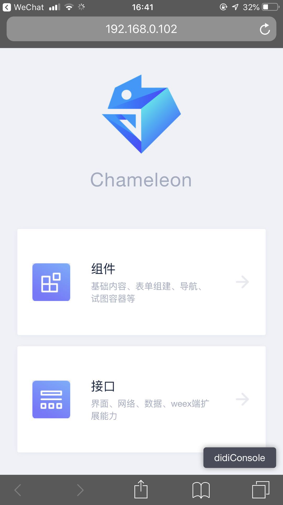
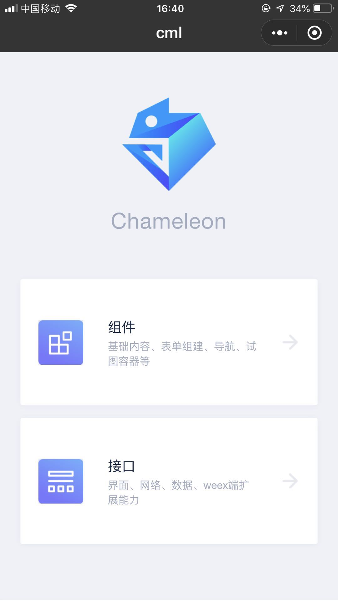
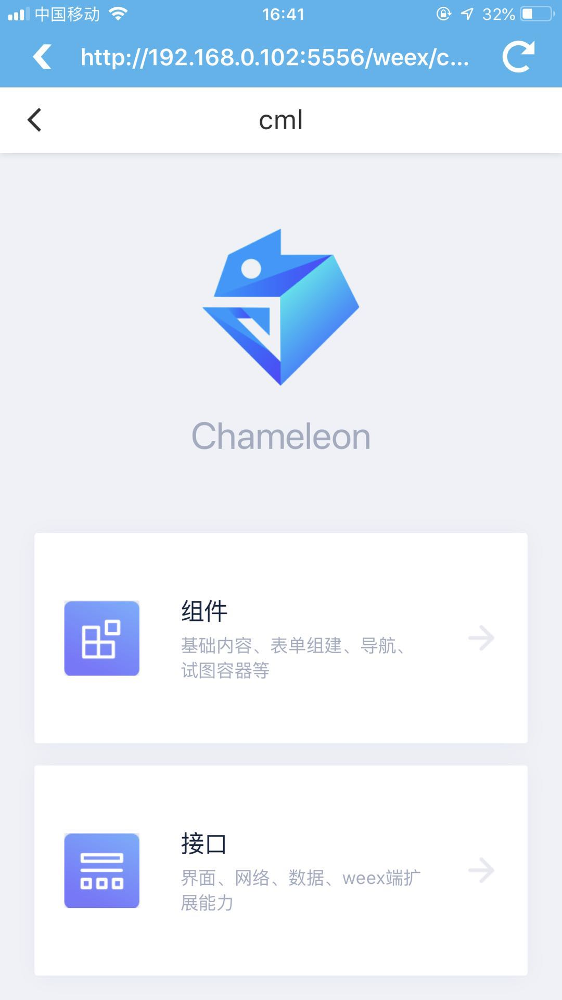
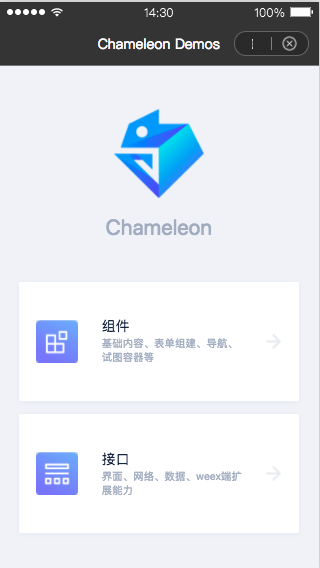
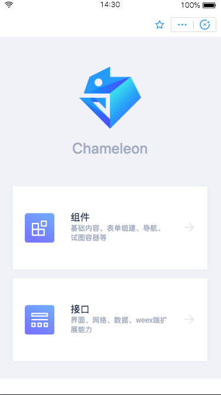
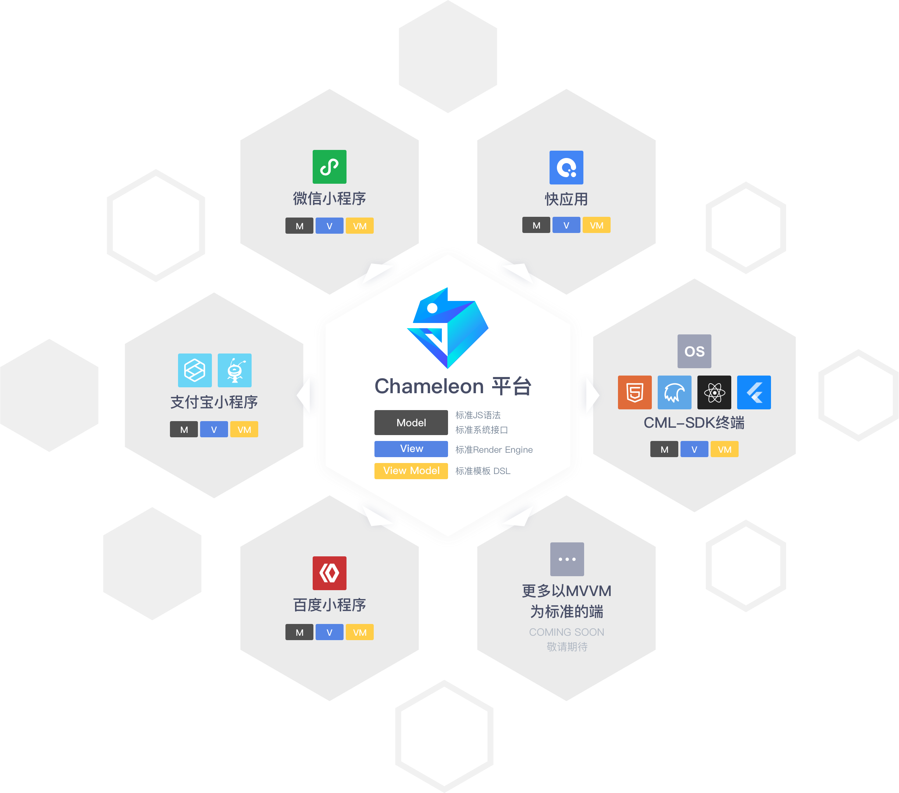

# 介绍

CML (Chameleon) 是一个小程序跨端开发统一解决方案，它可以像变色龙一样适应不同的环境。

一次开发，多端运行，一端所见即多端所见。

## CML

> 多端高度一致，无需关注各端文档。基于多态协议，不影响各端的差异化与灵活性。

[](https://github.com/beatles-chameleon/cml-demo)

<table>
  <thead>
    <tr>
      <th>Web</th>
      <th>微信小程序</th>
      <th>Weex</th>
      <th>百度小程序</th>
      <th>支付宝小程序</th>
    </tr>
  </thead>
  <tbody>
    <tr>
      <td>
        <a href="https://github.com/beatles-chameleon/cml-demo" target="_blank" rel="noopener noreferrer">
          
        </a>
      </td>
      <td>
        <a href="https://github.com/beatles-chameleon/cml-demo" target="_blank" rel="noopener noreferrer">
          
        </a>
      </td>
      <td>
        <a href="https://github.com/beatles-chameleon/cml-demo" target="_blank" rel="noopener noreferrer">
          
        </a>
      </td>
      <td>
        <a href="https://github.com/beatles-chameleon/cml-demo" target="_blank" rel="noopener noreferrer">
          
        </a>
      </td>
      <td>
        <a href="https://github.com/beatles-chameleon/cml-demo" target="_blank" rel="noopener noreferrer">
          
        </a>
      </td>
    </tr>
  </tbody>
</table>

## 背景

研发同学在端内既追求 H5 的灵活性，也要追求性能趋近于原生。面对入口扩张，主端、独立端、微信小程序、支付宝小程序、百度小程序、Android 厂商联盟快应用，单一功能在各平台都要重复实现，开发和维护成本成倍增加。迫切需要维护一套代码可以构建多入口的解决方案，滴滴跨端解决方案 CML 终于发布。真正专注于让一套代码运行多端。

## 设计理念

软件架构设计里面最基础的概念“拆分”和“合并”，拆分的意义是“分而治之”，将复杂问题拆分成单一问题解决，比如后端业务系统的”微服务化“设计；“合并”的意义是将同样的业务需求抽象收敛到一块，达成高效率高质量的目的，例如后端业务系统中的“中台服务”设计。

而 CML 属于后者，通过定义统一的语言框架 + 统一多态协议，从多端（对应多个独立服务）业务中抽离出自成体系、连续性强、可维护强的“前端中台服务”。

虽然各端环境千变万化，但万变不离其宗的是 MVVM 架构思想，CML 目标是让 MVVM 跨端环境大统一。



## 开发语言

从事网页编程的人知道，网页编程采用 HTML + CSS + JS 这样的组合，同样道理，CML（框架）中采用的是 CML + CMSS + JS。

CML (Chameleon Markup Language) 用于描述页面的结构。我们知道 HTML 是有一套标准的语义化标签，例如文本是 `<span>` 按钮是 `<button>`。CML 同样具有一套标准的标签，我们将标签定义为组件，CML 为用户提供了一系列组件。同时 CML 中还支持**模板语法**，例如条件渲染、列表渲染，数据绑定等等。此外，CML 还支持类 VUE 语法，让你更快入手。

CMSS (Chameleon Style Sheets) 用于描述 CML 页面结构的样式语言，其具有大部分 CSS 的特性，并且还可以支持各种 CSS 的预处语言如 `less` `stylus`。

JS 语法用于处理页面的逻辑层，与普通网页编程相比，本项目目标定义标准 MVVM 框架，拥有完整的生命周期，watch，computed，数据双向绑定等优秀的特性，能够快速提高开发速度、降低维护成本。

CML 采用与 Vue 一致的组件化方案、单文件组织方式、生命周期，同时数据响应能力对齐 Vue，数据管理能力对齐 Vuex，非常方便开发者上手、维护。

代码示例

```vue
<template>
  <view>
    <text>{{ title }}</text>
  </view>
</template>

<script>
class Index {
  data = {
    title: 'CML',
  };
  beforeCreate() {}

  created() {}

  beforeMount() {}

  mounted() {}

  beforeDestroy() {}

  destroyed() {}
}

export default new Index();
</script>
```

通过以上对于开发语言的介绍，相信你看到只要是有过网页编程知识的人都可以快速的上手 CML 的开发。

## 多端高度一致

深入到编程语言维度保障一致性，包括框架、生命周期、内置组件、事件通信、路由、界面布局、界面单位、组件作用域、组件通信等高度统一

## 丰富的组件与 API

CML 提供了丰富的内置组件和扩展组件来抹平多端差异。开发者可通过组合这些组件，创建出强大的应用程序。

内置的有 `button` `switch` `radio` `checkbox` 等组件，扩展的有 `c-picker` `c-dialog` `c-loading`等等，覆盖了开发工作中常用的组件。

同时为了方便高效开发，CML 也提供了丰富的 API 库，发布为 npm 包 `chameleon-api`，里面包括了网络请求、数据存储、地理位置、系统信息、动画等方法。

## 自由定制组件与 API

基于强大的多态协议，可自由扩展任意 API 和组件，不强依赖框架的更新。各端原始项目中已积累大量组件，也能直接引入到跨端项目中使用，充分隔离各端差异化实现，轻松维护一套代码实现跨多端

## 智能规范校验

代码规范校验，当出现不符合规范要求的代码时，编辑器会展示智能提示，不用挨个调试各端代码，同时命令行启动窗口也会提示代码的错误位置。

## 渐进式跨端

既想一套代码运行多端，又不用大刀阔斧的重构项目？不仅可以用 cml 开发页面，也可以将多端重用组件用 cml 开发，直接在原有项目里面调用。

## 先进前端开发体验

CML 不仅仅是跨端解决方案，让开发者  高效、低成本开发多端原生应用。基于优秀的前端打包工具 Webpack，吸收了业内多年来积累的最有用的工程化设计，提供了前端基础开发命令行命令工具，帮助端开发者从开发、联调、测试、上线等全流程高效的完成业务开发。

框架提供了自己的视图层描述语言 CML 和 CMSS，以及基于 JavaScript 的逻辑层框架，并在视图层与逻辑层间提供了数据传输和事件系统，让开发者能够专注于数据与逻辑。

### 命令行工具

基于 node 开发的命令行工具，提供简洁的命令，进行初始化与构建项目。

### 目录结构

 提供规范化的项目结构，适合于企业级大型应用的开发，CML 单文件组件的开发模式更有利于提高开发效率与优化文件组织结构。

### 视图层

视图层由 CML 与 CMSS 编写，CML 的核心是一个标准响应式数据驱动视图更新的 MVVM 框架。

### 逻辑层

逻辑层由 javascript 编写，逻辑层将处理数据后自动更新视图，同时提供视图层的事件响应方法。

### 多态协议

提供了跨端时各端底层组件与接口统一的解决方案，使开发者可以自由扩展原生 api 与组件 。

### 规范校验

为了提高开发的效率与代码的可维护性，CML 提供了全面的代码规范与校验， 帮助开发者能够得到更好的开发体验。
