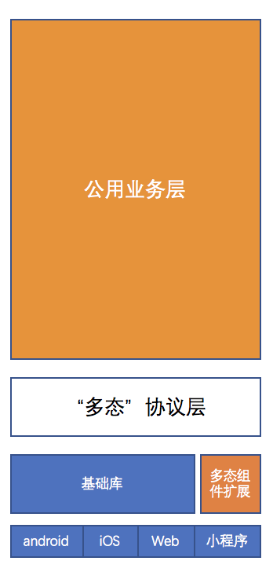
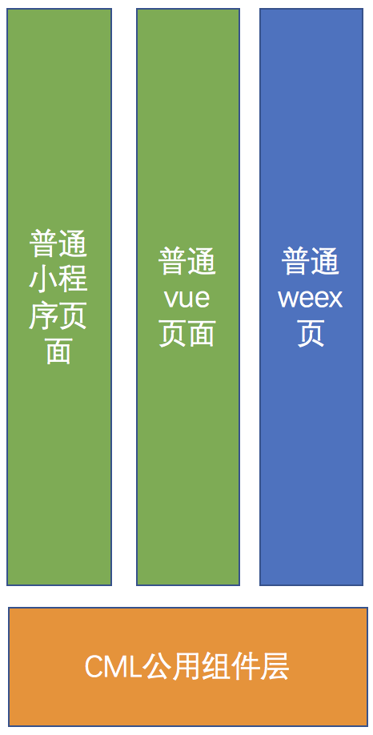

# 导入与导出

**导出**

即 将 Chameleon 可重用组件**导出**给普通项目使用，或者说 某端普通项目里面使用 Chameleon 可重用组件。

**导入**

即 在 Chameleon 可重用项目中**导入**普通项目产出的组件，或者说 可重用代码 Chameleon 项目使用某端普通组件。

**使用方式**

<table>
  <tr>
    <th width="200px">终端</th>
    <th>项目框架</th>
    <th width="60px">导入</th>
    <th>导出</th>
    <th>说明</th>
  </tr>
  <tr>
    <td>微信</td>
    <td>原始项目</td>
    <td></td>
    <td></td>
    <td>已支持</td>
  </tr>
  <tr>
    <td>微信</td>
    <td>MPX</td>
    <td></td>
    <td></td>
    <td>待支持</td>
  </tr>
  <tr>
    <td>Web</td>
    <td>Vue</td>
    <td></td>
    <td></td>
    <td>已支持</td>
  </tr>
  <tr>
    <td>Web</td>
    <td>React</td>
    <td></td>
    <td></td>
    <td>待支持</td>
  </tr>
  <tr>
    <td>Web</td>
    <td>其他</td>
    <td></td>
    <td></td>
    <td>支持导入，不支持导出</td>
  </tr>
  <tr>
    <td>Native</td>
    <td>Vue</td>
    <td></td>
    <td></td>
    <td>已支持</td>
  </tr>
    <tr>
    <td>Native</td>
    <td>React</td>
    <td></td>
    <td></td>
    <td>待支持</td>
  </tr>
  </tr>
    <tr>
    <td>Native</td>
    <td>Flutter</td>
    <td></td>
    <td></td>
    <td>待支持</td>
  </tr>
  </tr>
    <tr>
    <td>Native</td>
    <td>Objective-C MVVM框架</td>
    <td></td>
    <td></td>
    <td>待支持</td>
  </tr>
  </tr>
    <tr>
    <td>Native</td>
    <td>Android Java MVVM框架</td>
    <td></td>
    <td></td>
    <td>待支持</td>
  </tr>
</table>

## 渐进式接入

跨端有 2 种需求。

- **整个项目一套代码实现**：第一种业务层需求在各端环境高度类似，原本需要针对不同端重复开发、重复测试，那么使用 Chameleon 将整个项目”从上至下“都用一套代码运行，针对各端底层极个别差异化实现（使用多态协议）。 - 场景举例：首页官网、列表详情页等
- **仅组件一套代码运行**：第二种是各端页面需求不一致，却有共同的组件需要重复开发、重复测试，各个端用各自原本框架开发（或者使用 Chameleon 方案)，使用一套代码开发公用组件，然后各个端可以使用公用组件实现业务 - 场景举例：分享组件、支付组件、地图组件

<table>
  <tr>
    <th><em>整个项目</em>一套代码实现</th>
    <th><em>仅组件</em>一套代码运行</th>
  </tr>
  <tr>
    <td></td>
    <td></td>
  </tr>
</table>

### webpack 集成

<b>注：内部 webpack 插件版本基于 webpack@3.12.0 开发选择，暂不兼容 webpack4。</b>

通过以下步骤，可以让 webpack 项目中使用 chameleon 的任意组件。

- 1 安装 npm 包 `npm i easy-chameleon chameleon-ui-builtin`

- 2 执行脚本 `node node_modules/\easy-chameleon/bin/index.js`，该脚本会执行检测，安装未安装的第三方 npm 包

- 3 .babelrc 的 preset 添加 flow, chameleon 中用了 flow 语法，如果需要用到`chameleon-api`，建议配置`babel-plugin-chameleon-import`插件实现按需加载。例如：

```
{
  "presets": [
    "flow",
    ["env", {
      "targets": {
        "browsers": ["> 1%", "last 2 versions", "not ie <= 8"]
      }
    }],
    "stage-0"
  ],
  "plugins": [
    "transform-vue-jsx",
    "transform-runtime",
    [
      "babel-plugin-chameleon-import", {
      "libraryName": "chameleon-api",
      "libraryDirectory": "src/interfaces",
      "libraryFileName": "index.js",
      "defaulLibraryDirectory": "",
      "defaulLibraryFileName": "index.js",
      }
    ]
  ]
}

```

- 4 入口代码中，引入代码 `import 'easy-chameleon/entry/web_global.js';`

- 5 修改 webpack 配置文件,`easy-chameleon`提供了`getConfig`方法获取 webpack 配置 ，利用`webpack-merge`将项目原有 webpack 配置与`getConfig`方法获取的配置进行合并，例如：

  ```
  const merge = require('webpack-merge')

  const {getConfig} = require('easy-chameleon');

  devWebpackConfig = merge(devWebpackConfig, getConfig({
    cmlType: 'web',
    media: 'dev',
    hot: true,
    disableExtract: false,
    context: path.join(__dirname,'../'),
    cmss: {
      rem: false,
      scale: 0.5
    }
  }))
  ```

  `getConfig方法参数` getConfig(Object object)

  <table>
  <tr><th>参数</th><th>类型</th><th>默认值</th><th>必填</th><th>说明</th></tr>
  <tr><td>cmlType</td><td>String</td><td></td><td>是</td><td>端类型，可选值为web|wx|weex</td></tr>
  <tr><td>media</td><td>String</td><td></td><td>是</td><td>构建模式，可选值为dev|build</td></tr>
  <tr><td>hot</td><td>Boolean</td><td>false</td><td>否</td><td>是否开启热更新，只在web端生效</td></tr>
  <tr><td>disableExtract</td><td>Boolean</td><td>false</td><td>否</td><td>不提取css文件</td></tr>
  <tr><td>cmss</td><td>Object</td><td></td><td>否</td><td>cmss处理的配置，参见下方cmss对象属性列表</td></tr>
  <tr><td>wxConfig</td><td>Object</td><td></td><td>否</td><td>微信端构建配置，参见下方wxConfig对象属性列表</td></tr>
  </table>

cmss 对象属性列表

<table>
<tr><th>参数</th><th>类型</th><th>默认值</th><th>必填</th><th>说明</th></tr>
<tr><td>rem</td><td>Boolean</td><td>true</td><td>否</td><td>将cpx以75cpx=1rem为标准转换成rem</td></tr>
<tr><td>scale</td><td>Number</td><td>0.5</td><td>否</td><td>当rem为false时，scale将生效，将cpx乘以scale为px</td></tr>
</table>

wxConfig 对象属性列表

<table>
<tr><th>参数</th><th>类型</th><th>默认值</th><th>必填</th><th>说明</th></tr>
<tr><td>entry</td><td>Array[String]</td><td></td><td>是</td><td>指定输出的组件入口，以项目根目录下的相对路径,会寻找指定路径下的cml文件进行编译</td></tr>
<tr><td>outputPath</td><td>String</td><td></td><td>否</td><td>输出路径</td></tr>
</table>

#### 示例

详细示例戳这里[webpack 集成 chameleon](../tutorial/use-cml-in-webpack.md)

### 组件导出

这里介绍的是第二种场景，将 CML 组件导出到某个端使用。

#### 介绍

为了让开发者更自由地使用 Chameleon，我们提供组件导出的形式，让开发者可以在任意端原有项目中使用通过 Chameleon 开发的组件。我们用 web 端和小程序端举例，按正常开发模式我们需要分别维护着 4 套代码（web、wx、alipay、baidu），在某一个业务场景下需要开发一个时间选择器的组件，原有模式下我们需要每个端独自开发，而对于这种公共的组件，就可以选择使用 Chameleon 去维护，通过 Chameleon 开发，只需要维护一套组件代码，最后通过组件导出就可以在各个端进行使用了。这样的模式完全利用了 Chameleon 的跨端优势，大大降低了代码开发维护成本。

组件导出开发模式：


#### 命令行

- `cml web export` 执行 web 端组件导出
- `cml weex export` 执行 weex 端组件导出
- `cml wx export` 执行 wx 端组件导出
- `cml alipay export` 执行 alipay 端组件导出
- `cml baidu export` 执行 baidu 端组件导出

#### 配置

在 chameleon.config.js 中增加 export 配置，即可自定义组件导出配置,可配置项参考下表：

<table>
  <tr>
    <th>配置项</th>
    <th>类型</th>
    <th>说明</th>
  </tr>
  <tr>
    <td>entry</td>
    <td>Array</td>
    <td>组件导出的入口目录，项目根目录的相对路径</td>
  </tr>
  <tr>
    <td>outputPath</td>
    <td>String</td>
    <td>组件导出目录，绝对路径</td>
  </tr>
  <tr>
    <td>publicPath</td>
    <td>String</td>
    <td>公共资源地址</td>
  </tr>
  <tr>
    <td>hash</td>
    <td>Boolean</td>
    <td>导出文件名是否带hash，默认true</td>
  </tr>
  <tr>
    <td>minimize</td>
    <td>Boolean</td>
    <td>导出文件名是否压缩，默认true</td>
  </tr>
  <tr>
    <td>disableExtract</td>
    <td>Boolean</td>
    <td>不拆分css，默认false</td>
  </tr>
  <tr>
    <td>externals</td>
    <td>Object</td>
    <td>导出依赖分离，可配置不导出部分依赖，而使用外部依赖</td>
  </tr>
</table>

以 web 端为例，配置如下：

```js
cml.config.merge({
  web: {
    dev: {},
    build: {},
    export: {
      entry: ['src/components'],
      publicPath: 'https://static.chameleon.com/static',
    },
  },
});
```

#### 导出组件

chameleon 组件导出目录结构如下：

```
├── dist
|   ├── export
│   │   ├── platform (web、weex、wx、alipay、baidu ...)
│   │   │   ├── common
|   │   │   │   ├── web_global.js [仅导出web端组件时存在，需要在入口文件中引用]
|   │   │   │   ├── web_global.css [会在web_global.js中引用]
│   │   │   ├── 组件目录
│   │   │   └── 资源目录
```

下面是在 webpack+vue 环境下引用 chameleon 导出组件的示例：

假设目前已经通过 chameleon 项目导出了 c-header 组件，将组件移动到 webpack+vue 的环境后，需要进行一下几步操作：

1. 假设是 web 端组件，则首先需要在入口文件中引用 web_global.js
2. 在需要使用组件的地方引用组件即可

#### 导出组件公共依赖分离

> 当组件 A 和组件 B 同时依赖于公共模块 C 时，普通导出会将 C 打包到导出的 A、B 组件代码中，此时使用 A、B 组件相当于有两份模块 C 的代码，为了优化这一问题，导出组件提供分离公共依赖配置，即将模块 C 作为第三方依赖，在 A、B 组件导出时将模块 C 分离，在使用时依赖模块 C。

这里以`chameleon-runtime`为例，首先将`chameleon-runtime`编译出仅 web 端使用的版本`chameleon-runtime-web`，在导出 web 组件配置部分增加相关配置，然后导出的组件在依赖`chameleon-runtime`的部分就会变成依赖`chameleon-runtime-web`，最后在使用的项目中下载`chameleon-runtime-web`即可使用。

```js
cml.config.merge({
  web: {
    export: {
      entry: ['src/components'],
      publicPath: 'https://static.chameleon.com/static',
      externals: {
        'chameleon-runtime': 'chameleon-runtime-web',
      },
    },
  },
});
```

#### Bug & Tips

- .babelrc 配置中去掉`module: false`
- 由于生产模式组件为编译后的模块，所以尽量使用线上资源

#### 示例

详细示例戳这里[普通项目使用跨端组件](../tutorial/use-cml-component.md)

## Web

组件开发模式


### Web 端组件接入

chameleon 允许在 web 端多态组件中直接引入原生 vue 组件，一方面是为了增加代码重用度，另一方面则是方便渐进式地迁移使用 chameleon。

#### 为什么要接入 web 端组件

chameleon 作为跨端框架，将各端相同性及差异性进行统一封装形成 chameleon 的规范，但即使是这样，我们也没有办法百分百地避免差异，这样的差异可能来自产品的要求、技术的实现等等，由此 chameleon 提出了 [组件多态协议](poly.md#组件多态)，在多态组件实现中，直接引用原生组件，降低开发成本。

#### 怎么引入 web 端组件

在 chameleon 中使用组件只需要在组件配置中写入依赖的子组件，下面是 web 端组件引用 vue 单文件组件的示例：

```vue
<!-- index.cml -->
<template>
  <v-list></v-list>
</template>
...
<script cml-type="json">
{
  "base": {
    "usingComponents": {
      "v-list": "/components/vue-components/v-list"
    }
  }
}
</script>
```

```vue
<!-- components/vue-components/v-list.vue -->
<template>
  <ul>
    <li v-for="l in list">{{ l }}</li>
  </ul>
</template>
<script>
export default {
  props: {
    list: {
      type: Array,
      default: function() {
        return [1, 2, 3, 4];
      },
    },
  },
};
</script>
```

> 需要注意的是组件路径需要写到.vue 层级，但是不带后缀。

#### 示例

详细示例戳这里[多态组件扩展](../tutorial/poly-echarts.md)

## Weex

组件开发模式


### Weex 端组件接入

chameleon 允许在 weex 端多态组件中直接引入原生 vue 组件，一方面是为了增加代码重用度，另一方面则是方便渐进式地迁移使用 chameleon。

#### 为什么要接入 weex 端组件

chameleon 作为跨端框架，将各端相同性及差异性进行统一封装形成 chameleon 的规范，但即使是这样，我们也没有办法百分百地避免差异，这样的差异可能来自产品的要求、技术的实现等等，由此 chameleon 提出了[组件多态协议](framework/poly/component.md)，在多态组件实现中，直接引用原生组件，降低开发成本。

#### 怎么引入 weex 端组件

第一类是 weex 支持的原生组件，比如`div` `text`等，详细请查看[weex 原生组件列表](http://weex-project.io/cn/references/components/index.html)，如果这样的组件已经满足开发需求，那么就可以直接使用了：

```vue
<!-- list.weex.cml -->
<template>
  <div>
    <text v-for="l in list">{{ l }}</text>
  </div>
</template>
```

第二类是原先封装好的组件，首先你需要将组件复制到 chameleon 项目中，然后只需要在 chameleon 组件中声明式引入该组件即可使用。
还是以`list`组件为例，假设原有封装好的组件`custom-list`，目录结构如下：

```vue
<!-- index.cml -->
<template>
  <v-list></v-list>
</template>
...
<script cml-type="json">
{
  "base": {
    "usingComponents": {
      "v-list": "/components/vue-components/v-list"
    }
  }
}
</script>
```

```vue
<!-- components/vue-components/v-list.vue -->
<template>
  <ul>
    <li v-for="l in list">{{ l }}</li>
  </ul>
</template>
<script>
export default {
  props: {
    list: {
      type: Array,
      default: function() {
        return [1, 2, 3, 4];
      },
    },
  },
};
</script>
```

> 需要注意的是组件路径需要写到.vue 层级，但是不带后缀。

#### 示例

详细示例戳这里[多态组件扩展](../tutorial/poly-echarts.md)

## 微信小程序

组件开发模式


### 小程序组件接入

chameleon 允许在多态组件中引入原生微信小程序组件，对于已经熟悉小程序组件开发的朋友将非常 easy，之前封装的微信小程序组件可以直接使用，微信小程序相关的 ui 库可以直接使用，微信小程序自带的组件也可以直接使用。

#### 为什么要接入微信小程序组件

多态组件存在的差异不过来自于各端需求不同，又或是各端实现方式的不同。微信小程序组件的接入跟第二个问题完美契合，在原有的小程序开发过程中或许已经产出了常用组件，又或是使用着某个微信小程序的组件库，当使用 chameleon 进行开发时，避免了二次开发原有组件的成本。

#### 怎么引入微信小程序组件

第一类是微信小程序支持的组件，比如`view` `text`等，详细请查看[微信小程序组件列表](https://developers.weixin.qq.com/miniprogram/dev/component/)，如果这样的组件已经满足开发需求，那么就可以直接使用了：

```vue
<!-- list.wx.cml -->
<template>
  <view>
    <text v-for="l in list">{{ l }}</text>
  </view>
</template>
```

第二类是原有的组件，首先你需要将组件复制到 chameleon 项目中，然后只需要在 chameleon 组件中声明式引入该组件即可使用。
还是以`list`组件为例，假设原有封装好的微信小程序的组件`custom-list`，目录结构如下：

```bash
├── components                      // 组件文件夹
|   ├── custom-list
|   |   ├── custom-list.wxml
|   |   ├── custom-list.wxss
|   |   ├── custom-list.js
|   |   └── custom-list.json
```

那么，在 list.wx.cml 中可以直接引用：

```vue
<!-- list.wx.cml -->
<template>
  <custom-list list="{{list}}"></custom-list>
</template>
...
<script cml-type="json">
{
  "base": {
    "usingComponents": {
      "custom-list": "/components/custom-list/custom-list"
    }
  }
}
```

> 需要注意的是组件路径需要写到.wxml 层级，但是不带后缀。

第三类是微信小程序的组件库，这里以[iVew Webapp](https://weapp.iviewui.com/docs/guide/start)为例，首先需要将其代码下载下来放到 chameleon 项目中，假设目录结构如下：

```
├── components                      // 组件文件夹
|   ├── iview
|   |   ├── action-sheet
|   |   |   ├── index.js
|   |   |   ├── index.json
|   |   |   ├── index.wxml
|   |   |   └── index.wxss
|   |   ├── alert
|   |   ├── avatar
|   |   └── ...
```

这里我们需要使用 action-sheet 组件只需要如下即可：

```vue
<!-- component.wx.cml -->
<template>
  <action-sheet></action-sheet>
</template>
...
<script cml-type="json">
{
  "base": {
    "usingComponents": {
      "action-sheet": "/components/iview/action-sheet/index"
    }
  }
}
```

> 需要注意的是组件路径需要写到.wxml 层级，但是不带后缀。

#### 示例

详细示例戳这里[多态组件扩展](../tutorial/poly-echarts.md)

## 支付宝小程序

组件开发模式


### 小程序组件接入

chameleon 允许在多态组件中直接引入支付宝小程序组件，如果你已经封装了支付宝小程序的组件，如果你已经在用支付宝小程序的组件库，不用担心，在 chameleon 项目中你仍然可以使用。

#### 为什么要接入支付宝小程序组件

多态组件存在的差异不过来自于各端需求不同，又或是各端实现方式的不同。支付宝小程序组件的接入跟第二个问题完美契合，在原有的小程序开发过程中或许已经产出了常用组件，又或是使用着某个支付宝小程序的组件库，当使用 chameleon 进行开发时，避免了二次开发原有组件的成本。

#### 怎么引入支付宝小程序组件

第一类是支付宝小程序支持的组件，比如`view` `text`等，详细请查看[支付宝小程序组件列表](https://docs.alipay.com/mini/component/overview)，如果这样的组件已经满足开发需求，那么就可以直接使用了：

```vue
<!-- list.alipay.cml -->
<template>
  <view>
    <text v-for="l in list">{{ l }}</text>
  </view>
</template>
```

第二类是原有的组件，首先你需要将组件复制到 chameleon 项目中，然后只需要在 chameleon 组件中声明式引入该组件即可使用。
还是以`list`组件为例，假设原有封装好的支付宝小程序的组件`custom-list`，目录结构如下：

```
├── components                      // 组件文件夹
|   ├── custom-list
|   |   ├── custom-list.axml
|   |   ├── custom-list.acss
|   |   ├── custom-list.js
|   |   └── custom-list.json
```

那么，在 list.alipay.cml 中可以直接引用：

```vue
<!-- list.alipay.cml -->
<template>
  <custom-list list="{{list}}"></custom-list>
</template>
...
<script cml-type="json">
{
  "base": {
    "usingComponents": {
      "custom-list": "/components/custom-list/custom-list"
    }
  }
}
```

> 需要注意的是组件路径需要写到.axml 层级，但是不带后缀。

#### 示例

详细示例戳这里[多态组件扩展](../tutorial/poly-echarts.md)

## 百度小程序

组件开发模式


### 小程序组件接入

chameleon 允许在多态组件中直接引入百度小程序组件，如果你已经封装了百度小程序的组件，如果你已经在用百度小程序的组件库，不用担心，在 chameleon 项目中你仍然可以使用。

#### 为什么要接入百度小程序组件

多态组件存在的差异不过来自于各端需求不同，又或是各端实现方式的不同。百度小程序组件的接入跟第二个问题完美契合，在原有的小程序开发过程中或许已经产出了常用组件，又或是使用着某个百度小程序的组件库，当使用 chameleon 进行开发时，避免了二次开发原有组件的成本。

#### 怎么引入百度小程序组件

第一类是百度小程序支持的组件，比如`view` `text`等，详细请查看[百度小程序组件列表](https://smartprogram.baidu.com/docs/develop/component/view/)，如果这样的组件已经满足开发需求，那么就可以直接使用了：

```vue
<!-- list.baidu.cml -->
<template>
  <view>
    <text v-for="l in list">{{ l }}</text>
  </view>
</template>
```

第二类是原有的组件，首先你需要将组件复制到 chameleon 项目中，然后只需要在 chameleon 组件中声明式引入该组件即可使用。
还是以`list`组件为例，假设原有封装好的百度小程序的组件`custom-list`，目录结构如下：

```
├── components                      // 组件文件夹
|   ├── custom-list
|   |   ├── custom-list.swan
|   |   ├── custom-list.css
|   |   ├── custom-list.js
|   |   └── custom-list.json
```

那么，在 list.baidu.cml 中可以直接引用：

```vue
<!-- list.baidu.cml -->
<template>
  <custom-list list="{{list}}"></custom-list>
</template>
...
<script cml-type="json">
{
  "base": {
    "usingComponents": {
      "custom-list": "/components/custom-list/custom-list"
    }
  }
}
```

> 需要注意的是组件路径需要写到.swan 层级，但是不带后缀。

#### 示例

详细示例戳这里[多态组件扩展](../tutorial/poly-echarts.md)
