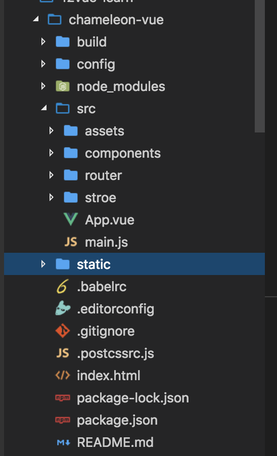

# 迁移 Vue 项目到 CML

## 迁移原则：

以小逻辑块为单位，对照老代码，以 cml 语法重写，报错可修正

这样可避免以下问题：

1、大块逻辑迁移会导致报错无法追查

2、直接 copy 会导致语法隐藏 bug 不可控（虽然 ide 没有问题，但真机调试出问题）

请尽量按照 cml 语法或者类 vue 语法重写迁移，避免语法纠错浪费时间

## 项目初始化

```
cml init project
```

初始化后，CML 项目如下：


依具体情况配置构建平台和配置平台基础样式。

可修改 `chameleon.config.js` 的 `platforms` 和 `baseStyle` 字段，如下：


假设有下面 👇 结构的 vue 项目（vue-cli 2 版本生成的）



components 下包含各个组件代码，router 下是路由配置，store 是数据管理中心，config 和 build 下是 vue 项目的 webpack 构建的基本配置

接下来就一步步展示如何将这个项目迁移到 CML

## 工程层面的迁移

#### 迁移 —— webpack 配置

CML 的工程配置具体[参考](config.md)

CML 命令行工具，提供了 `dev` `build` 两种构建模式，可以对应到 Vue 项目中的 `dev` `build`

| vue 项目      | CML 项目  |
| ------------- | --------- |
| npm run dev   | cml dev   |
| npm run build | cml build |

chameleon 内置了对于 webpack 和项目的构建，[参考这里修改 CML 内置 webpack 构建](config.md#修改-webpack-配置)

#### 迁移 —— store

CML 中的 store 使用[参考](store.md)

CML 项目中的`store`和 vue 项目中的`store`文件下是对应的；

假设 vue 项目中某个组件

```javascript
import { mapState } from 'vuex';
export default {
  computed: mapState(['count']),
};
```

那么在 CML 项目中

```javascript
import store from '../path/to/store';

class Index {
  computed = store.mapState(['count']);
}
export default new Index();
```

#### 迁移 —— router

`router-view`出口的的对应关系

假设`vue项目`中入口文件 `src/App.vue`

```vue
<template>
  <div id="app">
    <router-view />
  </div>
</template>
```

那么对应着`cml项目`中的`src/app/app.cml`,这里的`<app>`会渲染成`<router-view>`对应的某个路由；

```vue
<template>
  <app store="{{store}}" router-config="{{routerConfig}}"></app>
</template>
```

路由配置对应关系

`vue项目`中的路由 `src/router/index.js`

```javascript
import Vue from 'vue';
import Router from 'vue-router';
import HelloWorld from '@/components/HelloWorld';

Vue.use(Router);

export default new Router({
  routes: [
    {
      path: '/helloworld',
      name: 'HelloWorld',
      component: HelloWorld,
    },
  ],
});
```

对于`router.js`中配置的一级路由，需要通过 `cml init page` 去生成对应的组件

`cml项目`中 `src/router.config.json`

```javascript
{
  "mode": "history",
  "domain": "https://www.chameleon.com",
  "routes":[
    {
      "url": "/helloworld",
      "path": "/pages/HelloWorld/HelloWorld",
      "name": "helloworld",
      "mock": "index.php"
    }
  ]
}

```

其中：

`url`字段 对应 vue 中的 path 字段；

`path`字段对应着 vue 中 `import Comp from '/path/to/Comp'`中的组件路径

chameleon 会自动引入 component 字段配置的组件,不需要再配置 component 字段；

**总结**

**1 注意 CML 项目中不支持路由嵌套,如果有路由嵌套的情况需要考虑转化成组件去实现**

**2 在迁移路由的时候，要一个一个路由对应着去迁移**

**3 vue 项目中的一级路由的组件都通过 `cml init page`去初始化这个组件**

## 迁移页面/组件

假如 vue 项目中 `src/components/HelloWorld.vue`组件内有个子组件 `comp`;

首先我们修改下这两个组件，使其有一些简单的新增 todolist 的功能

`HelloWorld.vue`

```vue
<template>
  <div class="demo-com">
    <div class="title">this is helloworld</div>
    <comp @parentClick="handleParentClick"></comp>
  </div>
</template>

<script>
import lodash from 'lodash';

import comp from './comp.vue';
export default {
  name: 'HelloWorld',
  data() {
    return {};
  },
  methods: {
    handleParentClick(...args) {
      console.log('parentClick', ...args);
    },
  },
  components: {
    comp,
  },
};
</script>

<!-- Add "scoped" attribute to limit CSS to this component only -->
<style scoped>
.demo-com {
  display: flex;
  flex-direction: column;
  align-items: center;
  height: 400px;
  justify-content: center;
}
.title {
  align-self: center;
  color: #61c7fc;
  font-size: 72px;
  margin-bottom: 20px;
}
</style>
```

注意：如果第三方仓库中的某些 API 依赖该平台的全局变量，那么这些 API 只能在该平台使用，在其他平台是无效的；

`comp.vue`

```vue
<template>
  <div>
    <input type="text" v-model="todo" />
    <div v-for="(item, index) in todos">
      {{ item }}
    </div>
    <div @click="addTodo">addTodo</div>
    <div @click="handleClick">触发父组件事件</div>
  </div>
</template>

<script>
export default {
  name: 'HelloWorld',
  data() {
    return {
      todo: 'todo1',
      todos: [],
    };
  },
  methods: {
    addTodo() {
      this.todos.push(this.todo);
    },
    handleClick() {
      console.log('click');
      this.$emit('parentClick', {
        value: 1,
      });
    },
  },
};
</script>

<!-- Add "scoped" attribute to limit CSS to this component only -->
<style scoped></style>
```

### 新建页面/组件

```
cml init page

输入 HelloWorld

```

利用命令行命令，在`src/pages`中生成对应的页面

```vue
<template>
  <view><text>HelloCML</text></view>
</template>

<script>
class HelloWorld {
  //...
}

export default new HelloWorld();
</script>

<style></style>

<script cml-type="json">
{
  "base": {
    "usingComponents": {}
  },
  "wx": {
    "navigationBarTitleText": "index",
    "backgroundTextStyle": "dark",
    "backgroundColor": "#E2E2E2"
  },
  "alipay": {
    "defaultTitle": "index",
    "pullRefresh": false,
    "allowsBounceVertical": "YES",
    "titleBarColor": "#ffffff"
  },
  "baidu": {
    "navigationBarBackgroundColor": "#ffffff",
    "navigationBarTextStyle": "white",
    "navigationBarTitleText": "index",
    "backgroundColor": "#ffffff",
    "backgroundTextStyle": "dark",
    "enablePullDownRefresh": false,
    "onReachBottomDistance": 50
  }
}
</script>
```

```
cml init component
选择 Normal component
输入 comp
```

利用命令行命令，在`src/components`中生成对应的组件

```vue
<template>
  <view><text>HelloCML</text></view>
</template>

<script>
class Comp {
  //...
}

export default new Comp();
</script>
<style></style>
<script cml-type="json">
{
  "base": {
    "usingComponents": {}
  }
}
</script>
```

### 迁移组件引用

假设 vue 项目`src/components/HelloWorld.vue`中引用了其他组件 `import comp from './comp.vue';`

对应到 CML 项目 组件需要在 usingComponents 引用，不需要在配置 `components`字段

修改`src/pages/HelloWorld/HelloWorld.cml` 页面配置，如下：

```javascript
<script cml-type="json">
{
  "base": {
    "usingComponents": {
      "comp":"/components/comp/comp"
    }
  }
}
</script>
```

**总结**

**1 `router.js`中对应的组件需要通过 `cml init page`生成，然后在 `router.config.js`中配置对应路由**

**2 组件内部引用的子组件要通过`cml init component` 生成 ，然后通过`usingComponents`字段去引用**

**3 组件内引用的其他 js 库，比如`import lodash from 'lodash'`仍然通过`import`的形式引用**

## 页面&&组件迁移细节

### `template`模板迁移

这里以 CML 的 Vue 语法为例：[CML 类 Vue 基础语法](cml-vue.md)

#### 数据绑定、条件渲染、循环、事件绑定的迁移

假设，原有 vue 项目代码，如下：

```vue
<div class="scroller-wrap">
  数据绑定
  <div>{{}}</div>
  条件渲染
  <div v-if="condition">v-if</div>
  <div v-else-if="condition1">v-else-if</div>
  <div v-else>v-else</div>
  循环
  <div v-for="(item ,index) in array"></div>
  事件绑定
  <div id="tapTest" @click="handleClick">Click me!</div>
</div>
```

那么，使用 CML 的类 Vue 语法后：整体基本上不用变，只需要将标签改成 CML 的内置标签即可。

注意需要声明`<template lang="vue"></template>`

```vue
<template lang="vue">
<view class="scroller-wrap">
    数据绑定
    <view>{{}}</view>
    条件渲染
    <view v-if="condition">v-if</view>
    <view v-else-if="condition1">v-else-if</view>
    <view v-else>v-else</view>
    循环
    <view v-for="(item ,index) in array"></view>
    事件绑定
    <view id="tapTest" @click="handleClick">Click me!</view>
</view></template>
```

#### vue 项目标签 -> cml 标签

| vue 项目  | cml                                       |
| --------- | ----------------------------------------- |
| div       | view                                      |
| text span | text                                      |
| img       | image                                     |
| input     | input[组件](../components/input.md)       |
| button    | button[组件](../components/button.md)     |
| textarea  | textarea[组件](../components/textarea.md) |
| switch    | switch[组件](../components/switch.md)     |
| radio     | radio[组件](../components/radio.md)       |
| checkbox  | checkbox[组件](../components/checkbox.md) |
| image     | image[组件](../components/image.md)       |
| video     | video[组件](../components/video.md)       |
|           |                                           |

没有列出来的标签比如`head p main`等等只能在多态组件中使用，不支持跨多端

对于 `a`标签的 href,如果想要达到跨多端的效果，需要通过绑定事件使用 `cml.open()` 去跳转。

#### CML 对于语法的扩展支持

指令的扩展 c-show、c-model、c-show[参考](cml.md#指令)

component is 动态组件的扩展[参考](cml.md#动态组件)

事件绑定支持内联事件传参数[参考](cml.md#事件)

#### 迁移注意点

- [CML 支持的类 Vue 语法](cml-vue.md),只有在文档中列出的语法才支持多端，其他没有列出的语法仅可以在 Web 端使用，跨端没有支持，比如 `v-html` `class` 的对象语法 数组语法等。

根据以上教程，我们可以迁移 `HelloWorld.vue` 和 `comp.vue` 中的模板内容了

`HelloWorld.cml`

```vue
<template lang="vue">
  <view>
    <text>this is helloworld</text>
    <comp @parentClick="handleParentClick"></comp>
  </view>
</template>
```

`comp.cml`

```vue
<template lang='vue'>
  <view>
    <input type="text" v-model="todo" ></input>
    <div v-for="(item,index) in todos">
      {{item}}
    </div>
    <div @click="addTodo">addTodo</div>
    <view @click="handleClick"><text>触发父组件事件</text></view>
  </view>
</template>

```

### JS 内容迁移

#### 生命周期迁移 ：和 vue 保持一致

#### 数据的迁移[参考](logic.md)

#### vue 项目 API 的迁移

API 迁移包括 http 请求 路由跳转 本地存储等
参考：[chameleon-api 的文档](../api/)

假设，原有 vue 项目代码，如下：

```javascript
router.push({ path: '/pages/navigateBack/index' });
```

跨多端的路由仅支持 传入 path 字段进行路由，不支持路由 `name`字段的路由

那么，使用 CML 语法后：

```javascript
import cml from 'chameleon-api';
cml.redirectTo({
  path: '/pages/navigateBack/index',
});
```

#### 事件的触发机制，映射如下：

| vue 项目             | cml                     |
| -------------------- | ----------------------- |
| this.\$emit(xxx,xxx) | this.\$cmlEmit(xxx,xxx) |

事件对象参数

CML 对 `web` `native` `wx` 各个端的事件对象进行了统一代理[参考](cml.md#事件)。

对于灰度区组件（多态组件）各个端的事件对象还是**对应端的事件对象**，CML 框架不会对灰度区`origin-`开头的标签和第三方组件标签上绑定的事件进行事件代理。

事件冒泡

#chameleon 生成的 Weex 项目默认都是开启了支持事件冒泡的机制

#同时扩展了阻止事件冒泡的语法；

vue 语法(仅仅支持 `.stop`)

```vue
<view @click.stop="handleClick"></view>
```

cml 语法

```vue
<view c-catch:click="handleClick"></view>
```

**总结**

**1 由于 CML 是跨多端框架，所以在 Web 端特有的全局变量，比如 `window document history location`等在 CML 中是不支持的**

**2 对于 vue 的一些全局 API 比如`Vue.extend Vue.set`以及一些文档中没有列出的指令，比如`v-html v-pre`等都是不支持跨多端的**

根据以上教程，我们可以迁移`HelloWorld.vue`和`comp.vue`中的 js 内容了

`HelloWorld.cml`

```vue
<script>
import lodash from 'lodash';
class HelloWorld {
  methods = {
    handleParentClick(...args) {
      console.log('parentClick', ...args);
    },
  };
}

export default new HelloWorld();
</script>
```

`comp.cml`

```vue
<script>
class Comp {
  data = {
    todo: 'todo1',
    todos: [],
  };

  methods = {
    addTodo() {
      this.todos.push(this.todo);
    },
    handleClick() {
      this.$cmlEmit('parentClick', {
        value: 1,
      });
    },
  };
}

export default new Comp();
</script>
```

### style 内容的迁移

#### 页面布局的迁移

由于 CML 应用是 跨多端 Web Native 小程序框架，如果需要跨 Native，必须使用 `flexbox` 进行样式布局，其他场景可以参考[只跨 Web 和小程序的应用](../tutorial/web-wx-only-app.md)

关于样式的使用教程[参考](cmss.md)

模板上的样式语法[参考](cmss.md)

#### 样式单位的迁移

如果样式想要适配多端，需要将单位改成`cpx`;

👉 根据以上教程，我们可以迁移`HelloWorld.vue`和`comp.vue`中的 js 内容了

`HelloWorld.cml`

```vue
.demo-com { display: flex; flex-direction: column; align-items: center; height:400cpx;
justify-content: center; } .title { align-self: center; color: #61c7fc; font-size: 72cpx;
margin-bottom: 20cpx; }
```

以上，简单的介绍了 vue 项目迁移到 CML 的步骤，如果还有任何疑问，欢迎随时在 CML 官方微信和官方 QQ 群里进行反馈，我们将随时解答你的困惑，再次感谢你对 CML 的支持~

​ Best wishes

​ CML 团队
