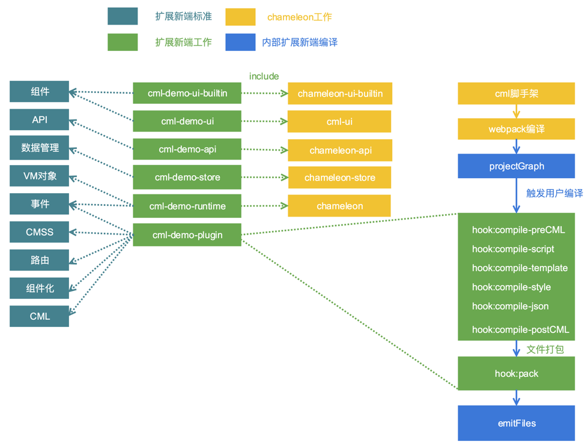

# 定制扩展端

基于 **`chameleon-tool@1.0.3`**

新框架太多？学不动啦？有这一套跨端标准，今后再也不用学习新框架了。

如今前端比较流行的 React Native、Weex、Flutter 等跨平台开发框架，对于开发来说属于技术方案的选择，比如，我们会考虑用这个技术开发，性能会不会超过 h5，开发效率会不会超过原生开发等等。

但是从 2017 年微信推出小程序，到至今各大厂商都推出自己的小程序，跨端开发就不仅仅是技术的问题了。已经变成了必争的流量入口。现在的小程序大战像极了当前的浏览器大战。大战中受苦的是我们一线开发者，同样的应用要开发 N 次，面对了前所未有的挑战，所以跨端框架的产生是大趋势下的必然产物。

## MVVM+ 协议

chameleon 基于对跨端工作的积累， 规范了一套跨端标准，称之为 MVVM+ 协议；开发者只需要按照标准扩展流程，即可快速扩展任意 MVVM 架构模式的终端。并让已有项目无缝运行新端。所以如果你希望让 CML 快速支持淘宝小程序、React Native？只需按标准实现即可扩展。

最终让开发者只需要用 CML 开发，就可以在任意端运行，再也不用学习新平台框架啦。

### 新端接入情况

滴滴、芒果 TV、阿里的同学合作，按照跨端协议流程，目前已完成**字节跳动小程序**的共建开发

- 分工排期如下：https://github.com/didi/chameleon/issues/157
- 仓库地址： https://github.com/chameleon-team/cml-tt-sets

**快应用官方研发团队**目前也接入完成

- 分工排期如下：https://github.com/didi/chameleon/issues/185
- 仓库地址： https://github.com/quickappcn/cml-extplatform-quickapp

### 跨端原理

跨端框架最核心的工作是统一，chameleon 定义了标准的跨端协议，通过编译时+运行时的手段去实现各端的代码和功能，其实现原理如下图所示。


其中运行时和基础库部分利用多态协议实现各端的独立性与框架的统一性。chameleon 目前支持的端都是采用这种方式，我们定义了扩展一个新端所需要实现的所有标准，用户只需要按照这些标准实现即可完成一个新端的扩展。

### 跨端标准协议

我们再来看一张 CML 的设计图，能够实现标准化的扩展新端，得益于多态协议中对各层代码进行了接口的定义，各端代码按照接口定义进行实现，向用户代码提供统一调用，同时还提供”多态协议“让用户代码保障可维护性的前提下，直接触达各端原生能力的方式。


- API 接口协议：定义基础接口能力标准。
- 内置组件协议：定义基础 UI 组件标准。
- 框架协议：定义生命周期、路由等框架标准。
- DSL 协议：定义视图和逻辑层的语法标准。
- 多态实现协议：定义允许用户使用差异化能力标准。


### 如何扩展新端？

简单来说只需要实现 6 个 npm 包。



#### 实现 API 接口协议

`chameleon-api`提供了网络请求，数据存储，获取系统信息，交互反馈等方法，用户需要创建一个 npm 包，结构参考[cml-demo-api](https://github.com/chameleon-team/cml-extplatform-demo/tree/master/packages/cml-demo-api)。将 `chameleon-api` 中提供的每个方法利用多态接口扩展语法扩展新端的实现。
以扩展一个`alert`方法为例,`chameleon-api`中`alert`方法的接口定义文件为`chameleon-api/src/interfaces/alert.interface`，其中的接口定义内容如下：

```
<script cml-type="interface">
type alertOpt = {
  message: String,
  confirmTitle: String
}
type successCallBack = (result: String) => void;
type failCallBack = (result: String) => void;
interface uiInterface {
  alert(opt: alertOpt, successCallBack: successCallBack, failCallBack: failCallBack): void,
}
</script>
```

用户实现的`interface`文件中采用`<include></include>`语法引入`chameleon-api`中`alert`方法的 interface 文件, 实现`uiInterface`。

```js
// 引入官方标准interface文件
<include src="chameleon-api/src/interfaces/alert/index.interface"></include>
// 扩展实现新端（以头条小程序为例，假设端扩展标识为：tt）
<script cml-type="tt">
class Method implements uiInterface {
  alert(opt, successCallBack, failCallBack) {
    // 根据头条小程序实现alert弹窗
    let { message, confirmTitle} = opt;
    tt.showModal({
      content: message,
      confirmText: confirmTitle,
      ......
    });
  }
}
export default new Method();
</script>
```

#### 实现内置组件协议

组件分为内置组件 `chameleon-ui-builtin` 和扩展组件 `cml-ui`。所以用户需要创建两个 npm 包分别实现这两个组件库，结构参考[cml-demo-ui-builtin](https://github.com/chameleon-team/cml-extplatform-demo/tree/master/packages/cml-demo-ui-builtin)和[cml-demo-ui](https://github.com/chameleon-team/cml-extplatform-demo/tree/master/packages/cml-demo-ui)。利用多态组件扩展语法，对原有组件库中的每一个组件进行新端的实现。

原有组件库中的组件也分为两种，一种为各端都有分别实现的多态组件，例如`chameleon-ui-builtin`中的`button`组件。实现起来新端基本上也是要单独实现。另一种例如`chameleon-ui-builtin`中的`radio`组件，各端的实现都是用的`chameleon-ui-builtin/components/radio/radio.cml`。所以新端基本也可以复用这个实现，(还需要测试情况确实是否可以复用)。

**新端独立实现**

例如：

编写 `my-ui-builtin/components/button/button.interface`

```js
// 引入官方标准interface文件
<include src="chameleon-ui-builtin/components/button/button.interface" />
```

编写 `my-ui-builtin/components/button/button.demo.cml`

```vue
<template>
  <origin-button c-bind:tap="onclick" open-type="{{openType}}"> </origin-button>
</template>
<script>
// js实现部分
</script>
<style scoped>
// 样式部分
</style>
<script cml-type="json">
// json配置
</script>
```

独立实现的 `my-ui-builtin/components/button/button.demo.cml` 文件属于多态组件的灰度层，可以调用各端底层组件和 api，具体例子参见 [`button`](https://github.com/chameleon-team/chameleon-ui-builtin/tree/master/src/components/button) 和 [`scroller`](https://github.com/chameleon-team/chameleon-ui-builtin/tree/master/src/components/scroller) 的实现。

**新端复用现有组件**

编写 `my-ui-builtin/components/radio/button.interface`

```js
// 引入官方标准interface文件
<include src="chameleon-ui-builtin/components/radio/radio.interface"></include>
// 复用官方的实现
<script cml-type="demo" src="chameleon-ui-builtin/components/radio/radio.cml"></script>
```

#### 实现 DSL 协议（编译时插件）

chameleon 内部会将整个项目文件编译为如下编译图结构，节点中的内容经过了标准编译，比如`script`节点的`babel`处理，`style`节点的`less`与`stylus`处理等等。


节点的数据结构如下：

```
class CMLNode {
  constructor(options = {}) {
    this.realPath; // 文件物理地址  会带参数
    this.moduleType; // template/style/script/json/asset
    this.dependencies = []; // 该节点的直接依赖       app.cml依赖pages.cml pages.cml依赖components.cml js依赖js
    this.childrens = []; // 子模块 cml文件才有子模块
    this.source; // 模块源代码
    this.output; // 模块输出  各种过程操作该字段
    ......
  }
}

```

用户只需要实现一个[编译插件类](https://github.com/chameleon-team/cml-extplatform-demo/blob/master/packages/cml-demo-plugin/index.js)，利用钩子方法实现对节点的编译，所有节点编译完后再进行文件的组织。编译类如下：

```
module.exports = class DemoPlugin {
  constructor(options) {
    ......
  }
  /**
   * @description 注册插件
   * @param {compiler} 编译对象
   * */
  register(compiler) {
    // 编译script节点，比如做模块化
    compiler.hook('compile-script', function(currentNode, parentNodeType) {
    })
    // 编译template节点 语法转义
    compiler.hook('compile-template', function(currentNode, parentNodeType) {
    })
    // 编译style节点  比如尺寸单位转义
    compiler.hook('compile-style', function(currentNode, parentNodeType) {
    })
    // 编译结束进入打包阶段
    compiler.hook('pack', function(projectGraph) {
      // 遍历编译图的节点，进行各项目的拼接
      // 调用writeFile方法写入文件
      // compiler.writeFile()
    })
    ......
  }
}

```

#### 实现框架协议

运行时主要是对 cml 文件的逻辑对象进行适配，chameleon 内部将 cml 文件的逻辑对象分为三类 App、Page、Component。对应会调用用户运行时 npm 包的`createApp、createPage、createComponent`方法，所以对外只需要实现这三个方法。

例如一个 Page 的逻辑对象如下：

```
class PageIndex {
  data = {
    name: 'chameleon'
  }
  computed = {
    sayName () {
      return 'Hello' + this.name;
    }
  }
  mounted() {
  }
}
export default new PageIndex();
```

编译时就会自动插入用户的运行时方法处理逻辑对象，例如`cml-demo-runtime`：

```
class PageIndex {
  ......
}
export default new PageIndex();

// 编译时自动插入用户配置的运行时方法
import {createPage} from 'cml-demo-runtime';
createPage(exports.default);
```

`createApp、createPage、createComponent`方法,参考 [cml-demo-runtime](https://github.com/chameleon-team/cml-extplatform-demo/tree/master/packages/cml-demo-runtime) 的结构进行实现，需要 `include` 中相应的接口进行实现，才能够实现对 `chameleon-runtime` 的扩展。用户的工作量主要在于对逻辑对象的处理，可以参考 [`chameleon-runtime`](https://github.com/chameleon-team/chameleon-runtime/tree/master/src/interfaces) 中的实现方式，一般需要如下方面的适配工作。

从宏观来看，运行时处理可分为：

- 输入 Options 对象的适配，[参考](https://github.com/chameleon-team/chameleon-runtime/blob/master/src/platform/common/proto/MiniVmAdapter.js)
- 跨端运行时能力注入，[参考](https://github.com/chameleon-team/chameleon-runtime/blob/master/src/platform/common/proto/MiniRuntimeCore.js)

从微观来看，有以下处理：

- 生命周期：[映射表参考](https://github.com/chameleon-team/chameleon-runtime/blob/master/src/platform/common/util/lifecycle.js) 和[实现参考](https://github.com/chameleon-team/chameleon-runtime/blob/master/src/platform/common/proto/MiniVmAdapter.js#L91)
- 组件 props 属性：[适配参考](https://github.com/chameleon-team/chameleon-runtime/blob/master/src/platform/common/proto/MiniVmAdapter.js#L89) 和[变化监听参考](https://github.com/chameleon-team/chameleon-runtime/blob/master/src/platform/common/proto/MiniVmAdapter.js#L48)
- 数据响应：[数据响应实现参考](https://github.com/chameleon-team/chameleon-runtime/blob/master/src/platform/common/proto/MiniRuntimeCore.js#L63)
- computed 计算能力：[实现参考](https://github.com/chameleon-team/chameleon-runtime/blob/master/src/platform/common/proto/MiniRuntimeCore.js#L85)
- watch 监听能力：[适配参考](https://github.com/chameleon-team/chameleon-runtime/blob/master/src/platform/common/proto/MiniRuntimeCore.js#L126) 和[实现参考](https://github.com/chameleon-team/chameleon-runtime/blob/master/src/platform/common/proto/MiniRuntimeCore.js#L97)
- methods 方法属性：[适配参考](https://github.com/chameleon-team/chameleon-runtime/blob/master/src/platform/common/proto/MiniVmAdapter.js#L46)
- mixins 能力：[适配参考](https://github.com/chameleon-team/chameleon-runtime/blob/master/src/platform/common/proto/MiniVmAdapter.js#L31) 和[合并参考](https://github.com/chameleon-team/chameleon-runtime/blob/master/src/platform/common/proto/MiniVmAdapter.js#L42)
- [生命周期多态](https://github.com/chameleon-team/chameleon-runtime/blob/master/src/platform/common/proto/MiniVmAdapter.js#L34)

例如： createPage 方法的实现

```
<include src="chameleon-runtime/src/interfaces/createPage/index.interface"></include>
<script cml-type="demo">
  class Method implements createPageInterface {
    createPage(options) {
      // 各端自行实现adapter
      adapter(options);
      //例如调用小程序原生页面构造函数
      Page(options);
      return {};
    }
  }

  export default new Method();
</script>
```

#### 实现框架数据管理

`chameleon-store` 提供了类似 Vuex 的数据管理解决方案，具体标准参见[数据管理](store.md)。同样利用多态协议实现其功能。

#### 更多

- 扩展新端 Demo 示例仓库: https://github.com/chameleon-team/cml-extplatform-demo。 实现了微信端的基本扩展，用户可以以此为模板进行开发。

- 更详细的教程参见[扩展新端操作教程](mvvm.md#扩展新端)。

期待更多人的加入开源。

## 扩展新端

### 开发示例体验

扩展新端 Demo 示例仓库: https://github.com/chameleon-team/cml-extplatform-demo。 实现了微信端的基本扩展。

#### 运行项目

- 首先全局安装支持扩展新端的命令行`npm i chameleon-tool@1.0.3 -g`。
- 全局安装`lerna` 对本项目进行管理 `npm i lerna -g`。
- 在本仓库根目录执行`lerna bootstrap`，这一步是安装外部依赖与建立本仓库 npm 包之间的依赖。
- 在`cml-demo-project`目录执行`cml demo dev`, 用微信开发者工具打开`cml-demo-project/dist/demo`目录。

### 开发流程

采用 lerna 对开发的 npm 包进行管理，解决本地开发时多个 npm 包之间相互依赖的问题。lerna init 即可创建一个 lerna 项目，建议直接用[示例仓库](https://github.com/chameleon-team/cml-extplatform-demo)进行修改。

#### 确定名称，创建 npm 包

- 端标识，扩展一个新端首先要确定这个端的标识名称，例如微信小程序端为`wx`,百度小程序端为`baidu`，这个标识决定了构建命令的名称、多态协议中的 cmlType, 配置对象中的 cmlType 等。 示例中确定为`demo`。

- 运行时 npm 包名称， 建议以`cml-${端标识名称}-runtime`格式命名，示例中为`cml-demo-runtime`。

- api 库 npm 包名称， 建议以`cml-${端标识名称}-api`格式命名，示例中为`cml-demo-api`。

- 内置组件 npm 包名称， 建议以`cml-${端标识名称}-ui-builtin`格式命名，示例中为`cml-demo-ui-builtin`。

- 扩展组件 npm 包名称， 建议以`cml-${端标识名称}-ui`格式命名，示例中为`cml-demo-ui`。

- 数据管理 npm 包名称， 建议以`cml-${端标识名称}-store`格式命名，示例中为`cml-demo-store`。

- 编译插件 npm 包名称， 建议以`cml-${端标识名称}-plugin`格式命名，示例中为`cml-demo-plugin`。

在`packages`目录创建上述的 6 个 npm 包。

#### 创建开发 CML 项目

在`packages`目录创建一个 CML 的项目作为测试项目，开发过程中可以进行调试代码。示例中为`cml-demo-project`。

1 `cml-demo-project`的`chameleon.config.js`需要 添加 extPlatform，babelPath，builtinNpmName 字段的配置，配置如下：

```

cml.config.merge({
  builtinNpmName: 'cml-demo-ui-builtin',
  extPlatform: {
    demo: 'cml-demo-plugin',
  },
  babelPath: [
    path.join(__dirname,'node_modules/cml-demo-ui-builtin'),
    path.join(__dirname,'node_modules/cml-demo-runtime'),
    path.join(__dirname,'node_modules/cml-demo-api'),
  ]
})

```

<b>你的项目中注意把示例 npm 包名称改成你命名的 npm 包名称</b>。

- builtinNpmName 字段是你定义的内置 npm 包名称
- extPlatform 是配置扩展新端的编译插件，key 值为端标识，value 为编译插件 npm 包名称。
- babelPath 配置运行时相关的三个 npm 包需要过 babel

2 `cml-demo-project`的`package.json`的`dependencies`中添加这几个开发 npm 包。

```
"cml-demo-api": "1.0.0",
"cml-demo-plugin": "1.0.0",
"cml-demo-runtime": "1.0.0",
"cml-demo-ui-builtin": "1.0.0"
```

3 在仓库的根目录执行`lerna bootstrap`安装依赖，建立关联，这样`cml-demo-project`的`node_modules`下的这几个 npm 包会符号链接到`packages`下的同名 npm 包。

### 如何进行开发分工

- api 的工作是独立的 不依赖其他 npm 包的开发
- runtime 运行时的工作也是独立的 不依赖其他 npm 包
- plugin 中的模板编译 在事件绑定的代理函数中依赖 runtime 其他的工作不依赖
- ui-builtin 和 ui 依赖 runtime 和 plugin 的完成 才能正确执行。
  cml-tt-store 的工作也是独立的，基本上小程序端实现是相同的。

### 开发编译插件

参考`cml-demo-plugin/index.js`文件 实现编译类。对项目中的每一个文件或者部分进行编译处理。处理节点的`source`字段，编译后结果放入`output`字段。

#### 模板编译

监听`compile-template`事件
参数列表：(currentNode，parentNodeType)

- currentNode 当前处理的节点
- parentNodeType 父节点的 nodeType，如果是 app/page/component 节点的子节点会有值，否则为 undefined

说明：
这个钩子用于处理`.cml` 文件的模板部分，如果模板是类 vue 语法，内部已经将其转为标准的 cml 语法，这个阶段用于对模板语法进行编译，生成目标代码。

```
compiler.hook('compile-template', function(currentNode, parentNodeType) {
    currentNode.output = templateParser(currentNode.source)
})
```

<b>`mvvm-template-parser`这个 npm 包提供了模板编译的方法。</b>
`const {cmlparse, generator, types: t, traverse} = require('mvvm-template-parser');`

- cmlparse 将字符串转为 ast 语法树
- traverse 对语法树进行遍历
- types 语法树节点类型判断
- generator 语法树生成字符串

例如模板编译方法如下：

```
const {cmlparse, generator, types: t, traverse} = require('mvvm-template-parser');

module.exports = function(content) {
  let ast = cmlparse(content);
  traverse(ast, {
    enter(path) {
      let node = path.node;
      if (t.isJSXElement(node)) {
        let attributes = node.openingElement.attributes;
        attributes.forEach(attr=>{
          if(t.isJSXIdentifier(attr.name) && attr.name.name === 'c-for') {
            attr.name.name = 'wx:for'
          }
          if(t.isJSXIdentifier(attr.name) && attr.name.name === 'c-if') {
            attr.name.name = 'wx:if'
          }
        })
        let tagName = node.openingElement.name.name;
        if(/^origin\-/.test(tagName)) {
          let newtagName = tagName.replace(/^origin\-/,'');
          node.openingElement.name.name = newtagName;
          node.closingElement.name.name = newtagName;
        }
      }
    }
  });
  return generator(ast).code;
}

```

上面的方法就可以将 模板

```
<view>
  <view c-for="{{array}}">
  </view>
  <view c-if="{{condition}}"> True </view>
  <origin-button></origin-button>
</view>
```

编译为

```
<view>
  <view wx:for="{{array}}">
  </view>
  <view wx:if="{{condition}}"> True </view>
  <button></button>
</view>
```

对模板 ast 的编译本质上是对目标节点的增删改，通过类型判断确定目标节点.
可以使用网站`https://astexplorer.net/` 方便我们确定节点类型。该网站是将 ast 中的节点图形化展示出来，注意选择`javascript`,`babylon7` `jsx`。

增删改的 api 参考 babel 插件编写文档`https://github.com/jamiebuilds/babel-handbook/blob/master/translations/zh-Hans/plugin-handbook.md#toc-replacing-a-node-with-multiple-nodes`。

我们没有直接让用户采用 babel 系列 是因为对`generator和parser`内部都有做针对 CML 的改造。

##### 原生组件的处理

chameleon 中规定，在模板中使用`origin-组件名称`作为组件名称，代表使用各端原生组件。例如

```
<template>
  <origin-button></origin-button>
</tempalte>
```

代表使用原生的`<button></button>`组件，CML 对于模板的标准编译没有处理`origin-组件名称`这种标签名称，原因是能够让用户根据组件的名称区别组件是否是原生组件而做不同的处理，例如原生组件的事件不做代理。所以最后用户的模板编译中应该对`origin-组件名称`这种组件名称进行替换。替换方法如下：

```
traverse(ast, {
    enter(path) {
      let node = path.node;
      if (t.isJSXElement(node)) {
        let tagName = node.openingElement.name.name;
        if(/^origin\-/.test(tagName)) {
          let newtagName = tagName.replace(/^origin\-/,'');
          node.openingElement.name.name = newtagName;
          node.closingElement.name.name = newtagName;
        }
      }
    }
  });
```

##### 注

模板编译总体上是要将所有的[CML 的语法](cml.md)编译成目标端的语法，可以参考 [`chameleon-template-parse`](ttps://github.com/didi/chameleon/tree/master/packages/chameleon-template-parse) 中的编译实现。
比如微信端包括如下几方面的实现：

- 标签的替换，比如`slider-item` 标签替换成`swiper-item`。
- 属性的替换，c-if c-else c-else-if c-show c-for c-text c-key。
- 动态组件，component is 动态组件的支持。
- style 与 class 的编译处理
- c-model 的实现 配合运行时 mixins 代理事件与处理事件对象
- c-animation 的处理
- c-bind 事件绑定 配合运行时 mixins 代理事件与处理事件对象

#### 样式编译

监听`compile-style`事件
参数列表：(currentNode，parentNodeType)

- currentNode 当前处理的节点
- parentNodeType 父节点的 nodeType，如果是 app/page/component 节点的子节点会有值，否则为 undefined

说明：
这个钩子用于处理所有的 `style` 节点，内部已经对 less stylus 等语法进行编译处理，这里得到的已经是标准的 css 格式，可以转成对应端的样式，比如对尺寸单位 cpx 的转换，将 css 转成对象形式等。

```
compiler.hook('compile-style', function(currentNode, parentNodeType) {
  currentNode.output = styleParser(currentNode.source);
})
```

推荐用户使用`postcss`或者`rework`进行编译，参考`cml-demo-plugin/styleParser.js`的实现。利用了`chameleon-css-loader`中的 postcss 插件进行编译。例如：

```
const postcss = require('postcss');
const cpx = require('chameleon-css-loader/postcss/cpx.js')
const weexPlus = require('chameleon-css-loader/postcss/weex-plus.js')

module.exports = function(source) {
  let options = {
    cpxType: 'rpx'
  }
  return postcss([cpx(options), weexPlus()]).process(source).css;
}

```

上面方法可以将 内容

```
.test {
  font-size: 24cpx;
  lines: 1;
}
```

编译为：

```
.test {
  font-size: 24rpx;
  lines: 1;
  overflow: hidden;
  text-overflow: ellipsis;
  display: -webkit-box;
  -webkit-line-clamp: 1;
  -webkit-box-orient: vertical;
}

```

#### script 编译

参数列表：(currentNode，parentNodeType)

- currentNode 当前处理的节点
- parentNodeType 父节点的 nodeType，如果是 app/page/component 节点的子节点会有值，否则为 undefined

说明：
这个钩子用于处理`script`节点，内部已经对 js 文件进行了 babel 处理，这个阶段用于做模块的包装，`compiler.amd`对象提供了 amd 模块的包装方法，模块 id 使用节点的`modId`字段。例如：

```
compiler.hook('compile-script', function(currentNode, parentNodeType) {
  currentNode.output = compiler.amd.amdWrapModule(currentNode.source, currentNode.modId);
})
```

例如一个节点 source 如下，modId 为 './component/test.js'：

```
module.exports = function() {
  return 'test';
}
```

经过`compiler.amd.amdWrapModule(currentNode.source, currentNode.modId)`处理后成为

```
cmldefine('./component/test.js', function(require, exports, module) {
  module.exports = function() {
    return 'test';
  }
})

```

#### asset 编译

静态资源的编译和`script`节点的编译相同，因为 cml 内部已经将静态资源节点变成了资源的 publicPath 字符串。
例如`src/assets/img/chameleon.png`这个节点的 source 为

```
 module.exports = 'http://168.1.1.1:8000/static/img/chameleon.png'
```

经过`compiler.amd.amdWrapModule(currentNode.source, currentNode.modId)`处理后成为

```
cmldefine('./component/test.js', function(require, exports, module) {
  module.exports = 'http://168.1.1.1:8000/static/img/chameleon.png';
})

```

#### 编译打包与文件输出

参考`cml-demo-plugin/index.js`中对`compiler.hook('pack', function(projectGraph) {})` `pack`事件的实现，编译编译图，拼接目标文件，调用`compiler.writeFile`输出文件。

### 开发 api 库

用户需要创建一个 npm 包，结构参考[cml-demo-api](https://github.com/chameleon-team/cml-extplatform-demo/tree/master/packages/cml-demo-api)。将`chameleon-api`中提供的每个方法利用多态接口扩展语法扩展新端的实现。

** 扩展新端 API（以头条小程序为例，假设端扩展标识为：tt）**

```js
// 引入官方标准interface文件
<include src="chameleon-api/src/interfaces/alert/index.interface"></include>

// 扩展实现新端（以头条小程序为例，假设端扩展标识为：tt）
<script cml-type="tt">
class Method implements uiInterface {
  alert(opt, successCallBack, failCallBack) {
    // 根据头条小程序实现alert弹窗
    let { message, confirmTitle} = opt;
    tt.showModal({
      showCancel: false,
      title: '',
      content: message,
      confirmText: confirmTitle,
      success() {
        successCallBack(confirmTitle);
      },
      fail() {
        failCallBack(confirmTitle);
      }
    });
  }
}

export default new Method();
</script>

// 想覆写某已有端的方法实现（以微信小程序为例）
<script cml-type="wx">
class Method implements uiInterface {
  alert(opt, successCallBack, failCallBack) {
    // 按你的想法重新实现
  }
}
export default new Method();
</script>
```

需要注意的是，为了方便结合异步流程控制如 async、await 等进行操作，chameleon 官方提供的 api 接口均以 promise 形式进行返回。所以你也需要在外层使用 js 文件进行包装，将 interface 实现进行 promise 化或进行其他操作（如传入默认值）。

```js
import ui from './index.interface';

export default function alert(opt) {
  let { message = '操作成功', confirmTitle = '我知道了' } = opt;
  return new Promise((resolve, reject) => {
    ui.alert({ message, confirmTitle }, resolve, reject);
  });
}
```

### 开发运行时

运行时主要是对 cml 文件的逻辑对象进行适配，chameleon 内部将 cml 文件的逻辑对象分为三类 App、Page、Component。对应会调用用户运行时 npm 包的`createApp、createPage、createComponent`方法，所以对外只需要实现这三个方法。

例如一个 Page 的逻辑对象如下：

```
class PageIndex {
  data = {
    name: 'chameleon'
  }
  computed = {
    name2 () {
      return 'Hello' + this.name;
    }
  }
  beforeCreated() {
  }
  mounted() {
  }
}

export default new PageIndex();
```

在[编译插件](https://github.com/chameleon-team/cml-extplatform-demo/blob/master/packages/cml-demo-plugin/index.js)的构造函数中添加上运行时 npm 包名称，`cml-demo-runtime`。

```
  constructor(options) {
    this.runtimeNpmName = 'cml-demo-runtime';
  }
```

编译时就会自动插入`cml-demo-runtime`处理逻辑对象的方法：

```
class PageIndex {
  data = {
    name: 'chameleon'
  }
  computed = {
    name2 () {
      return 'Hello' + this.name;
    }
  }
  beforeCreated() {
  }
  mounted() {
  }
}
export default new PageIndex();

// 编译时自动插入用户配置的运行时方法
import {createPage} from 'cml-demo-runtime';
createPage(exports.default);
```

`createApp`、`createPage`、`createComponent` 方法，参考 [`cml-demo-runtime`](https://github.com/chameleon-team/cml-extplatform-demo/tree/master/packages/cml-demo-runtime) 的结构进行实现，需要 `include` `chameleon-runtime` 中相应的接口进行实现，才能够实现对 `chameleon-runtime` 的扩展。用户的工作量主要在于对逻辑对象的处理，可以参考 [chameleon-runtime](https://github.com/chameleon-team/chameleon-runtime/tree/master/src/interfaces) 中的实现方式，一般需要如下方面的适配工作。

从宏观来看，运行时处理可分为：

- 输入 Options 对象的适配，[参考](https://github.com/chameleon-team/chameleon-runtime/blob/master/src/platform/common/proto/MiniVmAdapter.js)
- 跨端运行时能力注入，[参考](https://github.com/chameleon-team/chameleon-runtime/blob/master/src/platform/common/proto/MiniRuntimeCore.js)

从微观来看，有以下处理：

- 生命周期：[映射表参考](https://github.com/chameleon-team/chameleon-runtime/blob/master/src/platform/common/util/lifecycle.js) 和[实现参考](https://github.com/chameleon-team/chameleon-runtime/blob/master/src/platform/common/proto/MiniVmAdapter.js#L91)
- 组件 props 属性：[适配参考](https://github.com/chameleon-team/chameleon-runtime/blob/master/src/platform/common/proto/MiniVmAdapter.js#L89) 和[变化监听参考](https://github.com/chameleon-team/chameleon-runtime/blob/master/src/platform/common/proto/MiniVmAdapter.js#L48)
- 数据响应：[数据响应实现参考](https://github.com/chameleon-team/chameleon-runtime/blob/master/src/platform/common/proto/MiniRuntimeCore.js#L63)
- computed 计算能力：[实现参考](https://github.com/chameleon-team/chameleon-runtime/blob/master/src/platform/common/proto/MiniRuntimeCore.js#L85)
- watch 监听能力：[适配参考](https://github.com/chameleon-team/chameleon-runtime/blob/master/src/platform/common/proto/MiniRuntimeCore.js#L126) 和[实现参考](https://github.com/chameleon-team/chameleon-runtime/blob/master/src/platform/common/proto/MiniRuntimeCore.js#L97)
- methods 方法属性：[适配参考](https://github.com/chameleon-team/chameleon-runtime/blob/master/src/platform/common/proto/MiniVmAdapter.js#L46)
- mixins 能力：[适配参考](https://github.com/chameleon-team/chameleon-runtime/blob/master/src/platform/common/proto/MiniVmAdapter.js#L31) 和[合并参考](https://github.com/chameleon-team/chameleon-runtime/blob/master/src/platform/common/proto/MiniVmAdapter.js#L42)
- [生命周期多态](https://github.com/chameleon-team/chameleon-runtime/blob/master/src/platform/common/proto/MiniVmAdapter.js#L34)

例如： createPage 方法的实现

```
<include src="chameleon-runtime/src/interfaces/createPage/index.interface"></include>
<script cml-type="demo">
  class Method implements createPageInterface {
    createPage(options) {
      // 各端自行实现PageRuntime
      let pageRuntime = new PageRuntime(options);

      // 处理props
      pageRuntime.initProps();

      // 处理data
      pageRuntime.initData();

      // 处理computed
      pageRuntime.initComputed();

      // 处理methods
      pageRuntime.initMethods();

      // 处理生命周期映射
      pageRuntime.initLifeCycle();

      //调用小程序原生页面构造函数
      Page(options);
      return {};
    }
  }

  export default new Method();
</script>
```

### 开发组件库

组件分为内置组件 `chameleon-ui-builtin` 和扩展组件 `cml-ui`。所以用户需要创建两个 npm 包分别实现这两个组件库，结构参考[cml-demo-ui-builtin](https://github.com/chameleon-team/cml-extplatform-demo/tree/master/packages/cml-demo-ui-builtin)和[cml-demo-ui](https://github.com/chameleon-team/cml-extplatform-demo/tree/master/packages/cml-demo-ui)。利用多态组件扩展语法，对原有组件库中的每一个组件进行新端的实现。

原有组件库中的组件也分为两种，一种为各端都有分别实现的多态组件，例如`chameleon-ui-builtin`中的`button`组件。实现起来新端基本上也是要单独实现。另一种例如`chameleon-ui-builtin`中的`radio`组件，各端的实现都是用的`chameleon-ui-builtin/components/radio/radio.cml`。所以新端基本也可以复用这个实现，(还需要测试情况确实是否可以复用)。

#### 新端独立实现

例如：

编写 `my-ui-builtin/components/button/button.interface`

```js
// 引入官方标准interface文件
<include src="chameleon-ui-builtin/components/button/button.interface"></include>
```

编写 `my-ui-builtin/components/button/button.demo.cml`

```vue
<template>
  <origin-button
    class="cml-btn"
    c-bind:tap="onclick"
    style="{{mrBtnStyle}}"
    open-type="{{openType}}"
    lang="{{lang}}"
    session-from="{{sessionFrom}}"
    send-message-title="{{sendMessageTitle}}"
    send-message-path="{{sendMessagePath}}"
    send-message-img="{{sendMessageImg}}"
    show-message-card="{{showMessageCard}}"
    app-parameter="{{appParameter}}"
    c-bind:getuserinfo="getuserinfo"
    c-bind:contact="contact"
    c-bind:getphonenumber="getphonenumber"
    c-bind:error="error"
    c-bind:opensetting="opensetting"
  >
    <text class="btn-text" style="{{mrTextStyle}}">{{ text }}</text>
  </origin-button>
</template>
<script>
// js实现部分
</script>
<style scoped>
// 样式部分
</style>
<script cml-type="json">
// json配置
</script>
```

#### 新端复用现有组件

编写 `my-ui-builtin/components/radio/button.interface`

```js
// 引入官方标准interface文件
<include src="chameleon-ui-builtin/components/radio/radio.interface"></include>
// 复用官方的实现
<script cml-type="demo" src="chameleon-ui-builtin/components/radio/radio.cml"></script>
```

### 开发数据管理

## 标准实现

### 逻辑对象协议

逻辑层负责反馈用户对界面操作的处理中心。

而 `逻辑对象` 是逻辑层规范的输入口，是运行时方法(`ceateApp`、`createComponent`、`createPage`)的输入，包括

<table>
<tr>
  <th>字段名</th><th>类型</th><th>说明</th>
</tr>
<tr>
  <td>props</td><td>Object</td>
  <td>
  声明当前组件可接收数据属性 <br/>
  props = { type, default } <br/>
  type为数据类型，default为数据默认值
  </td>
</tr>
<tr>
  <td>data</td><td>Object</td><td>CML模板可直接使用的响应数据，是连接视图层的枢纽</td>
</tr>
<tr>
  <td>methods</td><td>Object</td><td>处理业务逻辑与交互逻辑的方法</td>
</tr>
<tr>
  <td>watch</td><td>Object</td><td>侦听属性，监听数据的变化，触发相应操作</td>
</tr>
<tr>
  <td>computed</td><td>Object</td><td>CML模板可直接使用的计算属性数据,也是连接视图层的枢纽</td>
</tr>
<tr>
  <td>beforeCreate</td><td>Function</td><td>例初始化之后，数据和方法挂在到实例之前
    一个页面只会返回一次</td>
</tr>
<tr>
  <td>created</td><td>Function</td><td>数据及方法挂载完成</td>
</tr>
<tr>
  <td>beforeMount</td><td>Function</td><td>开始挂载已经编译完成的cml到对应的节点时</td>
</tr>
<tr>
  <td>mounted</td><td>Function</td><td>cml模板编译完成,且渲染到dom中完成</td>
</tr>
<tr>
  <td>beforeDestroy</td><td>Function</td><td>实例销毁之前</td>
</tr>
<tr>
  <td>destroyed</td><td>Function</td><td>实例销毁后</td>
</tr>
</table>

理解了每个输入字段代表的含义后，可以扩展(`ceateApp`、`createComponent`、`createPage`)处理`逻辑对象`，将`逻辑对象`转换成当前平台可接收的格式。

#### 运行时能力注入

映射，并且在各生命周期中，注入新端到 cml 框架的运行时能力

#### 生命周期 hook 映射

每个 CML 实例(App、Page、Component)在被创建时都要经过一系列的初始化过程 ————

例如，需要设置数据监听、编译模板、将实例挂载到 CML 节点并在数据变化时更新 CML 节点等。同时在这个过程中也会运行一些叫做生命周期钩子的函数，这给开发者在不同阶段添加自己的代码的机会。

CML 为 App、Page、Component 提供了一系列生命周期事件，保障应用有序执行。

另外，你还需要实现生命周期多态。

#### methods

应用程序运行过程中，提供给上下文`this`可调用的方法

#### 数据驱动能力

当做数据修改的时候，只需要在逻辑层修改数据，视图层就会做相应的更新。

注入的核心是：赋予生命周期 hook `mixins扩展能力`，并且在特定 hook 中，赋予`this`响应数据变化的能力

#### data 数据属性

#### watch 监听属性

#### computed 计算属性

### 组件化标准

MVVM 标准中将`.cml`文件分为三类，`src/app/app.cml`为 app，`router.config.json`中配置的路由对应的文件为 page，其他的`.cml`文件为 component。

#### 组件引用

在`.cml`文件的`<script cml-type="json"></script>`json 部分，`usingComponents`字段中声明组件的引用。
例如：

```
{
  "base":{
    "usingComponents": {
      "navi": "/components/navi/navi",
      "c-cell": "../components/c-cell/c-cell",
      "navi-npm": "cml-test-ui/navi/navi"
    }
  }
}
```

`usingComponents`对象中，key 为组件名称，组件名称为小写字母、中划线和下划线组成。value 为组件路径，组件路径的规则如下：

- 相对当前文件的相对路径
- src 下的绝对路径
- node_modules 下的组件直接从 npm 的包名称开始写例如 cml-test-ui/navi/navi
- 组件的路径禁止包含后缀扩展名，查找的优先级为
  - 1.interface 文件指向的多态组件
  - 2 .cml 文件
  - 3 用户通过 hook: find-component 找到的组件

#### 组件使用

组件在 CML 模板中使用，组件名为 usingComponents 中的 key 值，组件使用形式为闭合标签，标签名为组件名。例如：

```vue
<template>
  <c-cell><c-cell>
</template>
<script cml-type="json">
{
  "base":{
    "usingComponents": {
      "c-cell": "../components/c-cell/c-cell"
    }
  }
}
</script>
```

### 事件系统标准

`Chameleon` 支持一些基础的原生事件和自定义事件，保障各端效果一致运行。

- 事件是视图层到逻辑层的通讯方式。
- 事件可以将用户的行为反馈到逻辑层进行处理。
- 事件可以绑定在组件上，当达到触发事件，就会执行逻辑层中对应的事件处理函数。

#### 原生事件标准

当用户点击该组件的时候会在该组件逻辑 VM 对象的 `methods` 中寻找相应的处理函数，该处理函数会收到一个事件对象。

##### 原生基础事件的类型

<table>
  <tr>
    <th>类型</th>
    <th>触发条件</th>
  </tr>
  <tr>
    <td>tap</td>
    <td>手指触摸后马上离开</td>
  </tr>
  <tr>
    <td>touchstart</td>
    <td>手指触摸动作开始</td>
  </tr>
  <tr>
    <td>touchmove</td>
    <td>手指触摸后移动</td>
  </tr>
  <tr>
    <td>touchend</td>
    <td>手指触摸动作结束</td>
  </tr>
</table>

##### 原生事件对象

它有以下属性：

<table>
  <tr>
    <th>名称</th>
    <th>类型</th>
    <th>说明</th>
  </tr>
  <tr>
    <td>type</td>
    <td>String</td>
    <td>事件类型</td>
  </tr>
  <tr>
    <td>timeStamp</td>
    <td>Number</td>
    <td>页面打开到触发事件所经过的毫秒数</td>
  </tr>
  <tr>
    <td>target</td>
    <td>Object</td>
    <td>
      触发事件的目标元素
      且 target = { id, dataset }
    </td>
  </tr>
  <tr>
    <td>currentTarget</td>
    <td>Object</td>
    <td>
      绑定事件的目标元素
      且 currentTarget = { id, dataset }
    </td>
  </tr>
  <tr>
    <td>touches</td>
    <td>Array</td>
    <td>
      触摸事件中的属性，当前停留在屏幕中的触摸点信息的数组
      且 touches = [{
        identifier,
        pageX,
        pageY,
        clientX,
        clientY
      }]
    </td>
  </tr>
  <tr>
    <td>changedTouches</td>
    <td>Array</td>
    <td>
      触摸事件中的属性，当前变化的触摸点信息的数组
      且 changedTouches = [{
        identifier,
        pageX,
        pageY,
        clientX,
        clientY
      }]
    </td>
  </tr>
  <tr>
    <td>detail</td>
    <td>Object</td>
    <td>
      自定义事件所携带的数据。
      通过`$cmlEmit`方法触发自定义事件，可以传递自定义数据即detail。具体下面`自定义事件`。
    </td>
  </tr>
  <tr>
    <td>_originEvent</td>
    <td>Object</td>
    <td>
      CML 对各平台的事件对象进行统一，会把原始的事件对象放到_originEvent属性中，当需要特殊处理的可以进行访问。
    </td>
  </tr>
</table>

**target && currentTarget 事件属性**

<table>
<tr><th>属性</th><th>类型</th><th>说明</th></tr>
<tr><td>id</td><td>String</td><td>事件源组件的id</td></tr>
<tr><td>dataset</td><td>Object</td><td>事件源组件上由`data-`开头的自定义属性组成的集合</td></tr>
<!-- <tr><td>offsetLeft</td><td>Number</td><td>事件源组件相对于窗口左侧的距离</td></tr>
<tr><td>offsetTop</td><td>Number</td><td>事事件源组件相对于窗口上侧的距离</td></tr> -->
</table>

**touches && changedTouches 事件属性**

数组中的对象具有如下属性：

<table>
<tr>
<th>属性</th><th>类型</th><th>说明</th>
</tr>
<tr>
<td>identifier</td><td>Number</td><td>触摸点的标识符</td>
</tr>
<tr>
<td>pageX, pageY</td><td>Number</td><td>距离文档左上角的距离，文档的左上角为原点 ，横向为X轴，纵向为Y轴</td>
</tr>
<tr>
<td>clientX, clientY</td><td>Number</td><td>距离页面可显示区域（屏幕除去导航条）左上角距离，横向为X轴，纵向为Y轴</td>
</tr>
</table>

#### 自定义事件标准

自定义事件用于父子组件之间的通信，父组件给子组件绑定自定义事件，子组件内部触发该事件。绑定事件的方法是以`bind+事件名称="事件处理函数`的形式给组件添加属性，<b>规定事件名称不能存在大写字母</b>触发事件的方法是调用`this.$cmlEmit(事件名称,detail对象)`。

### 状态管理

#### 数据管理 createStore

创建返回数据 store 实例

#### store 实例方法

##### `Store.commit(type: string, payload?: any)`

提交 mutation。[详细介绍](../api/#store-commit)

##### `Store.dispatch(type: string, payload?: any)`

分发 action。[详细介绍](../api/#store-dispatch)

##### `Store.mapState(map:Array\<string\>|Object\<string\>): Object`

为组件创建计算属性以返回 store 中的状态。[详细介绍](../api/#store-mapstate)

##### `Store.mapGetters(map:Array\<string\>|Object\<string\>): Object`

为组件创建计算属性以返回 getter 的返回值。[详细介绍](../api/#store-mapgetters)

##### `Store.mapMutations(map:Array\<string\>|Object\<string\>): Object`

创建组件方法提交 mutation。[详细介绍](../api/#store-mapmutations)

##### `Store.mapActions(map:Array\<string\>|Object\<string\>): Object`

创建组件方法分发 action。[详细介绍](../api/#store-mapactions)

##### `Store.registerModule(path: String, module: Module)`

注册一个动态模块。[详细介绍](../api/#store-registermodule)

## 多态扩展

### 多态接口扩展

<b>(chameleon-tool@0.4.0 以上开始支持)</b>

多态接口一节讲解了多态接口的使用，这一节讲解多态接口的一些扩展语法，更适用于扩展新端使用。

#### 扩展语法

#### `include`标签

当前 interface 文件用`<include>`标签可以引入其他`.interface`文件，代表继承该文件的接口定义和实现。然后在当前文件中去实现引入的接口定义，可以覆写引入的某一端实现，也可以去扩展新端的实现。 语法是`<include src="${引用路径}.interface"></include>`，有如下规则：

- src 属性指向的文件路径不支持 webpack 别名，只能是相对路径或者 npm 包名开始。

##### 例如扩展新端 API（以头条小程序为例，假设端扩展标识为：toutiao）:

```js
// 引入官方标准interface文件
<include src="chameleon-api/src/interfaces/alert/index.interface"></include>

// 扩展实现新端（以头条小程序为例，假设端扩展标识为：toutiao）
<script cml-type="toutiao">
class Method implements uiInterface {
  alert(opt, successCallBack, failCallBack) {
    // 根据头条小程序实现alert弹窗
    let { message, confirmTitle} = opt;
    tt.showModal({
      showCancel: false,
      title: '',
      content: message,
      confirmText: confirmTitle,
      success() {
        successCallBack(confirmTitle);
      },
      fail() {
        failCallBack(confirmTitle);
      }
    });
  }
}

export default new Method();
</script>

// 想覆写某已有端的方法实现（以微信小程序为例）
<script cml-type="wx">
class Method implements uiInterface {
  alert(opt, successCallBack, failCallBack) {
    // 按你的想法重新实现
  }
}
export default new Method();
</script>
```

#### `script` src 属性

`<script></script>`标签可以通过指定`src`的方式引用外部 js 文件为某一平台或某几个的实现或者接口定义。
有如下规则：

- src 属性指向的文件路径不支持 webpack 别名，只能是相对路径或者 npm 包名开始。
- cml-type 属性为字符串，如果多个端可以用英文逗号 , 进行分割，例如 cml-type="web,wx".

例如：

```
<script cml-type="interface">
interface FirstInterface {
  getMsg(msg: String): String;
}

</script>

<script cml-type="web" src="./web.js"></script>

<script cml-type="wx,alipay" src="./miniapp.js"></script>
```

`web.js`文件内容如下：

```
class Method implements FirstInterface {
  getMsg(msg) {
    return 'web:' + msg;
  }
}

export default new Method();
```

#### 多态 API 查找优先级

没有扩展语法之前，每个端的实现都在同一个文件中，没有优先级的问题，但是有了扩展语法之后，就会有优先级问题。查找优先级如下：

- 文件内部的定义, 包括采用 src 的形式指定其他文件
- `<include>src`属性指向的 interface 文件中继续查找该部分

例如有如下两个 interface 文件：

```
├── first
│   └── first.interface
└── second
    └── second.interface

```

`first.interface` 包括接口定义，web 和 Weex 端的实现，内容如下：

```vue
<script cml-type="interface">
interface FirstInterface {
  getMsg(msg: String): String;
}
</script>
<script cml-type="web">
class Method implements FirstInterface {
  getMsg(msg) {
    return 'first web:' + msg;
  }
}
export default new Method();
</script>
<script cml-type="weex">
class Method implements FirstInterface {
  getMsg(msg) {
    return 'first weex:' + msg;
  }
}
export default new Method();
</script>
```

`second.interface` 包括对`first.interface`的`include` Weex 端和 wx 端的实现，内容如下：

```vue
<include src="../first/first.interface"></include>
<script cml-type="weex">
class Method implements FirstInterface {
  getMsg(msg) {
    return 'second weex:' + msg;
  }
}
export default new Method();
</script>
<script cml-type="wx">
class Method implements FirstInterface {
  getMsg(msg) {
    return 'second wx:' + msg;
  }
}
export default new Method();
</script>
```

当外部引用`second.interface`文件并调用 getMsg 方法时 各端编译获取方法如下：

- Web 端，因为`second.interface`中没有 Web 端实现 所以查找到`first.interface`中 Web 端 getMsg 方法
- Weex 端，因为`second.interface`中有 Weex 端实现 所以使用`second.interface`中 Weex 端 getMsg 方法
- wx 端，因为`second.interface`中有 wx 端实现 所以使用`second.interface`中 wx 端 getMsg 方法

##### 注意 cml-type interface 部分必须是唯一的

例 1：

```
// 引入chameleon-api interface文件
<include src="chameleon-api/src/interfaces/alert/index.interface"></include>

// 错误实现interface部分
<script cml-type="interface">
......
</script>

// 扩展实现新端
<script cml-type="demo">
......
</script>
```

`<include>`的`chameleon-api/src/interfaces/alert/index.interface`文件中已经有`cml-type="interface"`的定义，所以当前文件中`<script cml-type="interface"></script>`定义部分是错误的。

例 2：

```
// 引入cml-tt-api interface文件
<include src="cml-tt-api/src/interfaces/alert/index.interface"></include>

// 引入cml-quickapp-api interface文件
<include src="cml-quickapp-api/src/interfaces/alert/index.interface"></include>

// 扩展实现新端
<script cml-type="demo">
......
</script>
```

文件中引入了两个`interface`文件，但是他们内部找到的`<script cml-type="interface"></script>`定义部分都在`chameleon-api/src/interfaces/alert/index.interface`中，是同一文件。所以不认为是错误的。

### 多态组件扩展

<b>(chameleon-tool@0.4.0 以上开始支持)</b>

多态组件一节讲解了多态组件的使用，这一节讲解多态组件的一些扩展语法，更适用于扩展新端使用。

#### 扩展语法

#### `include`标签

多态组件的`.interface`文件内部可以用`<include>`标签引入其他多态组件的`.interface`文件，代表采用该文件的接口定义和对应的各端实现。
语法是`<include src="${引用路径}.interface"></include>`，有如下规则：

- src 属性指向的文件路径不支持 webpack 别名，只能是相对路径或者 npm 包名开始。
- cml-type interface 部分必须是唯一的

##### 例如扩展新端组件（以头条小程序为例，假设端扩展标识为：toutiao）:

编写 `my-ui-builtin/button/button.interface`

```js
// 引入官方标准interface文件
<include src="chameleon-ui-builtin/components/button/button.interface"></include>
```

再编写 `my-ui-builtin/button/button.toutiao.cml`

```vue
//
扩展实现新端（以头条小程序为例，假设端扩展标识为：toutiao），具体代码可参考在其他端的实现如：chameleon-ui-builtin/components/button/button.wx.cml
<template>
  <button
    class="cml-btn"
    c-bind:tap="onclick"
    style="{{mrBtnStyle}}"
    open-type="{{openType}}"
    lang="{{lang}}"
    session-from="{{sessionFrom}}"
    send-message-title="{{sendMessageTitle}}"
    send-message-path="{{sendMessagePath}}"
    send-message-img="{{sendMessageImg}}"
    show-message-card="{{showMessageCard}}"
    app-parameter="{{appParameter}}"
    c-bind:getuserinfo="getuserinfo"
    c-bind:contact="contact"
    c-bind:getphonenumber="getphonenumber"
    c-bind:error="error"
    c-bind:opensetting="opensetting"
  >
    <text class="btn-text" style="{{mrTextStyle}}">{{ text }}</text>
  </button>
</template>
<script>
// js实现部分
</script>
<style scoped>
// 样式部分
</style>
<script cml-type="json">
// json配置
</script>
```

这样在引用`my-ui-builtin/button/button`这个多态组件时，就会有`chameleon-ui-builtin`中 button 支持的端和自己扩展的端。

#### `script` src 属性

`<script></script>`标签可以通过指定`src`的方式引用 cml 文件作为某一平台或某几个平台的实现或者接口定义。
有如下规则：

- src 属性指向的文件路径不支持 webpack 别名，只能是相对路径或者 npm 包名开始。
- cml-type 属性为字符串，如果多个端可以用英文逗号 , 进行分割，例如 cml-type="web,wx"。

例如上面扩展 button 的例子可以写成 下面的形式
编写 `my-ui-builtin/button/button.interface`

```js
// 引入官方标准interface文件
<include src="chameleon-ui-builtin/components/button/button.interface"></include>
<script cml-type="toutiao" src="./mybutton.cml"></script>
```

再编写 `my-ui-builtin/button/mybutton.cml`

```vue
//
扩展实现新端（以头条小程序为例，假设端扩展标识为：toutiao），具体代码可参考在其他端的实现如：chameleon-ui-builtin/components/button/button.wx.cml
<template>
  <button
    class="cml-btn"
    c-bind:tap="onclick"
    style="{{mrBtnStyle}}"
    open-type="{{openType}}"
    lang="{{lang}}"
    session-from="{{sessionFrom}}"
    send-message-title="{{sendMessageTitle}}"
    send-message-path="{{sendMessagePath}}"
    send-message-img="{{sendMessageImg}}"
    show-message-card="{{showMessageCard}}"
    app-parameter="{{appParameter}}"
    c-bind:getuserinfo="getuserinfo"
    c-bind:contact="contact"
    c-bind:getphonenumber="getphonenumber"
    c-bind:error="error"
    c-bind:opensetting="opensetting"
  >
    <text class="btn-text" style="{{mrTextStyle}}">{{ text }}</text>
  </button>
</template>
<script>
// js实现部分
</script>
<style scoped>
// 样式部分
</style>
<script cml-type="json">
// json配置
</script>
```

#### 多态组件查找优先级

没有扩展语法之前，采用的是各端的实现和`.interface`文件保持同名的方式，各端有各自的端标识后缀，有了扩展语法之后这种约定同名的方式被打破。 多态组件的查找从 interface 作为入口进行查找，多态组件的查找，包含在组件的查找内，所以这里直接讲组件的查找优先级。
以一个例子进行说明
组件引用

```
{
  "usingComponents": {
    "demo-com": "/componnets/button/button"
  }
}
```

文件结构

```
├── components
  ├── button
    └── button.interface
    └── custombutton.cml
    └── button.toutiao.cml
    └── button.cml
```

`button.interface`内容如下：

```js
// 引入官方标准interface文件
<include src="chameleon-ui-builtin/components/button/button.interface"></include>
<script cml-type="toutiao" src="./custombutton.cml"></script>
```

当前端标识为`toutiao`查找优先级如下：

- 1 找`/componnets/button/button.interface`文件，如果里面`<script>`的 cmltype 等于当前端标识 toutiao,则找到`<script>`的 src 属性指向的 cml 文件。本例子中是`custombutton.cml`

- 2 找`/componnets/button/button.interface`文件 对应同名的带有当前端标识的 cml 文件，本例子中是`button.toutiao.cml`

- 3 找`/componnets/button/button.interface`文件，里面的`<include></include>`标签的 src 指向的`.interface`文件，以该文件进行递归执行 1，2 步的查找。

- 3 找非多态组件`/componnets/button/button.cml`文件

- 4 找各平台的原生组件例如`/componnets/button/button.vue`,`/componnets/button/button.wxml` ，还有扩展新端中用户可以自定义查找

##### 注意 cml-type interface 部分必须是唯一的

例 1：

```
// 引入cml-ui interface文件
<include src="cml-ui/src/components/c-tab/c-tab.interface"></include>

// 错误实现interface部分
<script cml-type="interface"></script>

// 扩展实现新端
<script cml-type="demo" src="......"></script>
```

`<include>`的`cml-ui/src/components/c-tab/c-tab.interface`文件中已经有`cml-type="interface"`的定义，所以当前文件中定义`<script cml-type="interface"></script>`部分是错误的。

例 2：

```
// 引入cml-tt-ui interface文件
<include src="cml-tt-ui/src/components/c-tab/c-tab.interface"></include>

// 引入cml-quickapp-ui interface文件
<include src="cml-quickapp-ui/src/components/c-tab/c-tab.interface"></include>

// 扩展实现新端
<script cml-type="demo" src="......"></script>
```

文件中引入了两个`interface`文件，但是他们内部找到的`<script cml-type="interface"></script>`定义部分都在`cml-ui/src/components/c-tab/c-tab.interface`中，是同一文件。所不认为是错误的。

## 新端编译插件扩展

### 命令行

<b>安装`chameleon-tool@1.0.3` 进行扩展新端的开发。</b>

### 扩展新端总体编译流程

扩展新端 首先要了解扩展新端总体的编译流程，理解用户扩展新端的工作处于编译的什么阶段。

- 黄色部分表示 cml 命令行及 webpack 编译
- 蓝色部分表示扩展的 mvvm+编译
- 绿色部分表示用户要实现的部分，整个项目的文件会用一张编译图表示，用户提供针对每一个节点的编译处理，全部编译完成后，进行文件的拼接打包。


### 编译图与编译节点

在总体编译流程中，webpack 编译完成后，会将 webpack 编译的结果转成标准的 mvvm 编译图 projectGraph，这个图由 CMLNode 节点构成，先理解编译图的组织形式和节点的数据结构，对用户写编译插件有很大帮助。

#### 编译节点

编译节点是 CMLNode 类的实例，CMLNode 定义如下:

```
class CMLNode {
  constructor(options = {}) {
    this.ext;
    this.realPath; // 文件物理地址  会带参数
    this.nodeType; // app/page/component/module // 节点类型     app/page/component  其他的为module  cml文件中的每一个部分也是一个Node节点
    this.moduleType; // template/style/script/json/asset
    this.dependencies = []; // 该节点的直接依赖       app.cml依赖pages.cml pages.cml依赖components.cml js依赖js
    this.childrens = []; // 子模块 cml文件才有子模块
    this.parent; // 父模块 cml文件中的子模块才有
    this.source; // 模块源代码
    this.convert; // 源代码的格式化形式
    this.output; // 模块输出  各种过程操作该字段
    this.identifier; // 节点唯一标识
    this.modId; // 模块化的id requirejs
    this.extra; // 节点的额外信息
    Object.keys(options).forEach(key => {
      this[key] = options[key];
    })
  }
}

```

具体字段含义如下:

<table>
  <tr>
    <th>字段</th>
    <th>含义</th>
  </tr>
  </tr>
    <tr>
    <td style="color: red;">nodeType</td>
    <td>节点类型，分为app/page/component/module，其中只有src/app/app.cml类型为app， router.config.json中配置的cml文件为page，其他的cml文件为component。非cml文件为Module</td>
  </tr>
  </tr>
    <tr>
    <td style="color: red;">moduleType</td>
    <td>
      模块类型，当节点的nodeType为app/page/component时，其moduleType为undefined。cml文件中四个部分的moduleType分别为template、script、style、json。其他节点的nodeType为module时，根据文件后缀判断moduleType。
      <table>
        <tr>
          <td>后缀</td>
          <td>moduleType值</td>
        </tr>
        <tr>
          <td>/\.css|\.less|\.stylus|\.styls$/</td>
          <td>style</td>
        </tr>
        <tr>
          <td>/\.js|\.interface$/</td>
          <td>script</td>
        </tr>
        <tr>
          <td>/\.json$/</td>
          <td>json</td>
        </tr>
        <tr>
          <td>/\.(png|jpe?g|gif|svg|mp4|webm|ogg|mp3|wav|flac|aac|woff|woff2?|eot|ttf|otf)(\?.*)?$</td>
          <td>asset</td>
        </tr>
        <tr>
          <td>其他后缀</td>
          <td>other</td>
        </tr>
      </table>
    </td>
  </tr>
  <tr>
    <td>dependencies</td>
    <td>节点的依赖节点，app依赖page page依赖component script节点中依赖require的节点</td>
  </tr>
  <tr>
    <td>childrens</td>
    <td>节点的子节点，只有cml文件才会有子节点，子节点为cml文件的四个部分，分别为四个节点</td>
  </tr>
  <tr>
    <td>parent</td>
    <td>节点的父节点，只有cml文件节点的子节点才有父节点</td>
  </tr>
  <tr>
    <td>originSource</td>
    <td>节点编译前源代码（目前只有script节点有该字段）</td>
  </tr>
  <tr>
    <td>source</td>
    <td>经过mvvm标准编译之后节点的代码</td>
  </tr>
  <tr>
    <td>convert</td>
    <td>source的转换格式，source均为字符串，convert可能装成AST或者JSON对象</td>
  </tr>
  <tr>
    <td>output</td>
    <td>节点的输出内容，建议用户编译可以将编译结果放在output字段用于输出</td>
  </tr>
  <tr>
    <td>identifier</td>
    <td>节点的唯一标识，是webpack module中的request字段，保证了唯一性</td>
  </tr>
  <tr>
    <td>modId</td>
    <td>节点的模块id，用于js的模块化id标识</td>
  </tr>
  <tr>
    <td>extra</td>
    <td>节点的额外信息，例如template节点就会添加上模板使用的原生组件和内置组件信息</td>
  </tr>
  <tr>
    <td>ext</td>
    <td>文件后缀，例如.js 注意如果引用资源后有参数也会带着，例如 .png?__inline</td>
  </tr>
  <tr>
    <td>realPath</td>
    <td>节点对应的文件路径，注意如果引用资源后有参数也会带着，例如 /user/didi/yyl/project/chameleon.png?__inline</td>
  </tr>
</table>

#### 编译图组织结构

编译图由上节介绍的编译节点组成，以 nodeType 为 app 的节点开始形成编译图，内部会递归编译节点，根据节点的类型触发相应的用户编译。


### 如何编写用户插件

扩展内置组件库和内置 API 库是独立的两个 NPM 包，其他编译相关的工作都放在用户插件中。

#### 确定端标识名称

扩展一个新端首先要确定这个端的标识名称，例如微信小程序端为`wx`,百度小程序端为`baidu`，这个标识决定了构建命令的名称、多态协议中的 cmlType, 配置对象中的 cmlType 等。

#### 配置插件

在项目的 chameleon.config.js 中配置构建目标端命令时要执行的插件,这里配置的只是插件的名称，后面会讲解插件的写法。配置的字段为`extPlatform` Object 类型,<b>key 值为上一步确定的端标识名称</b>,<b>value 为要实现的插件的 npm 包名称</b>, 例如要扩展头条小程序，确定标识为`toutiao`。

```
cml.config.merge({
  extPlatform: {
    toutiao: 'cml-toutiao-plugin'
  }
})
```

当执行`cml 端标识名称 dev|build`时将走用户插件进行编译。

#### 扩展新端插件

上一步讲解了如何配置端标识命令对应的用户插件，这里讲一下插件该如何编写。插件是一个`类`，要求是 npm 包的入口。下面展示出这个类的属性和方法。

```

module.exports = class ToutiaoPlugin {
    constructor(options) {
      let { cmlType, media} = options;
      this.webpackRules = []; // webpack的rules设置  用于当前端特殊文件处理
      this.moduleRules = []; // 文件后缀对应的节点moduleType
      this.logLevel = 3;
      this.originComponentExtList = ['.wxml']; // 用于扩展原生组件的文件后缀查找
      this.runtimeNpmName = 'cml-demo-runtime'; // 指定当前端的运行时库
      this.builtinUINpmName = 'cml-demo-ui-builtin'; // 指定当前端的内置组件库
      this.cmlType = cmlType;
      this.media = media;
      this.miniappExt = {  // 小程序原生组件处理
        rule: /\.wxml$/,
        mapping: {
          'template': '.wxml',
          'style': '.wxss',
          'script': '.js',
          'json': '.json'
        }
      }
      // 需要压缩文件的后缀
      this.minimizeExt = {
        js: ['.js'],
        css: ['.css','.wxss']
      }
    }
  /**
   * @description 注册插件
   * @param {compiler} 编译对象
   * */
  register(compiler) {
      /**
       * cml节点编译前
       * currentNode 当前节点
       * nodeType 节点的nodeType
       */
      compiler.hook('compile-preCML', function(currentNode, nodeType) {

      })
      /**
       * cml节点编译后
       * currentNode 当前节点
       * nodeType 节点的nodeType
       */
      compiler.hook('compile-postCML', function(currentNode, nodeType) {

      })

      /**
       * 编译script节点，比如做模块化
       * currentNode 当前节点
       * parentNodeType 父节点的nodeType
       */
      compiler.hook('compile-script', function(currentNode, parentNodeType) {

      })

      /**
       * 编译template节点 语法转义
       * currentNode 当前节点
       * parentNodeType 父节点的nodeType
       */
      compiler.hook('compile-template', function(currentNode, parentNodeType) {

      })

      /**
       * 编译style节点  比如尺寸单位转义
       * currentNode 当前节点
       * parentNodeType 父节点的nodeType
       */
      compiler.hook('compile-style', function(currentNode, parentNodeType) {

      })

      /**
       * 编译json节点
       * currentNode 当前节点
       * parentNodeType 父节点的nodeType
       */
      compiler.hook('compile-json', function(currentNode, parentNodeType) {

      })

      /**
       * 编译other类型节点
       * currentNode 当前节点
       */
      compiler.hook('compile-other', function(currentNode) {

      })


      /**
       * 编译结束进入打包阶段
       */
      compiler.hook('pack', function(projectGraph) {
        // 遍历编译图的节点，进行各项目的拼接
        //调用writeFile方法写入文件
        // compiler.writeFile()
      })
  }
}
```

下面对插件类中的每一个属性和方法的使用进行介绍。

#### 插件构造函数参数

```
  constructor(options) {
    let { cmlType, media} = options;
  }
```

用户插件的构造函数会接受`options`参数,`cmlType`是当前端标识名称，例如`web|wx|weex`, `media`是构建的模式，`dev|build`。

##### this.logLevel

类型：Number
日志的等级, 可取值 0，1，2，3，默认值为 2，值越大显示日志越详细。

##### this.originComponentExtList

类型：Array
用于设置原生组件的文件后缀，适用于多态组件的查找。
例如 usingComponents 中对于组件的引用是没有后缀的，用户可以对其进行扩展，再进行组件查找时会尝试用户设置的后缀，一般用于多态组件调用底层原生组件。
例如微信小程序中：

```
this.originComponentExtList = ['.wxml']; // 用于扩展原生组件的文件后缀查找
```

##### this.runtimeNpmName

类型：String
用于设置当前端运行时 npm 包名称。

##### this.builtinUINpmName

类型：String
用于设置当前端内置组件 npm 包名称。

##### this.minimizeExt

类型：Object

```
  {
    js: Array,
    css: Array
  }
```

内置了两种代码压缩，一种是 js 一直是 css，用户指定输出文件后缀对应的压缩类型。例如微信小程序中：

```
  this.minimizeExt = {
    js: ['.js'],
    css: ['.css','.wxss']
  }
```

##### this.miniappExt

类型：Object
chameleon 内置了针对小程序类的原生组件的处理方法，只需要用户进行文件后缀的配置。例如微信小程序：

```
this.miniappExt = {  // 小程序原生组件处理
  rule: /\.wxml$/,
  mapping: {
    'template': '.wxml',
    'style': '.wxss',
    'script': '.js',
    'json': '.json'
  }
}
```

rule 的正则匹配文件后缀和`this.originComponentExtList`中的设置的文件后缀保持一致。
mapping 中的四个部分配置小程序对应的文件后缀。

##### this.webpackRules

类型：Array
当用户有其他文件类型的原生组件要处理，可以通过配置 weback 的 module.rules 字段，用于扩展目标端特殊文件类型的处理，用户可以扩展 webpack 编译过程的 loader。例如：

```
this.webpackRules = [{
  test: /\.vue$/,
  use: [{
    loader:'vue-loader',
    options: {}
  }]
}]
```

在 loader 中可以设置 this.\_module 中的一些字段控制生成的`CMLNode`的内容。

- this.\_module.\_cmlSource 设置`CMLNode`的 source 字段
- this.\_module.\_nodeType 设置`CMLNode`的 nodeType 字段
- this.\_module.\_moduleType 设置`CMLNode`的 moduleType 字段
- this.\_module.\_cmlExtra 设置`CMLNode`的 extra 字段

##### this.moduleRules

类型：Array
设置文件类型对应的 moduleType，可以配合 webpackRules 使用，内置对应关系如下：

```
 [ // 文件后缀对应module信息
  {
    test: /\.css|\.less|\.stylus|\.styls$/,
    moduleType: 'style'
  },
  {
    test: /\.js|\.interface$/,
    moduleType: 'script'
  },
  {
    test: /\.json$/,
    moduleType: 'json'
  },
  {
    test: /\.(png|jpe?g|gif|svg|mp4|webm|ogg|mp3|wav|flac|aac|woff|woff2?|eot|ttf|otf)(\?.*)?$/,
    moduleType: 'asset'
  }
]
```

例如用户可以扩展`.vue`类型的 moduleType 为`vue`。

```
this.webpackRules = [{
  test: /\.vue$/,
  moduleType: 'vue'
}]
```

在递归触发用户编译阶段的钩子名称，也是根据节点的`moduleType`决定，所以用户扩展了节点的`moduleType`，相应这个节点触发的编译钩子也为`compile-${moduleType}`, 上面的例子中触发`compile-vue`。

#### register 方法

register 方法中接受`compiler`对象，该对象是编译的核心对象，用户通过该对象注册编译流程。

#### compiler.hook 方法

使用该方法可以注册编译流程，第一个参数是钩子名称，第二个参数是处理函数，处理函数中会接收编译流程对应的参数，下面说明每一个钩子的作用和参数。

```
compiler.hook(钩子名称, function(参数) {

})
```

**compile-preCML**

参数列表：(currentNode，nodeType)

- currentNode 当前处理的节点
- nodeType 当前节点的 nodeType，app/page/component

说明：

这个钩子是编译 cml 文件节点之前触发，并且传递 cml 文件节点，可以通过该钩子去处理 cml 文件节点的`template、json、style、script`四个子节点之前需要的联系。

**compile-postCML**

参数列表：(currentNode，nodeType)

- currentNode 当前处理的节点
- nodeType 当前节点的 nodeType，app/page/component

说明：

这个钩子是编译完 cml 文件节点的依赖和子节点后触发，传递 cml 文件节点，可以通过该钩子去处理 cml 文件节点编译之后的处理。

**compile-script**

参数列表：(currentNode，parentNodeType)

- currentNode 当前处理的节点
- parentNodeType 父节点的 nodeType，如果是 app/page/component 节点的子节点会有值，否则为 undefined

说明：
这个钩子用于处理`nodeType='module'`,`moduleType='script'`的节点，内部已经对 js 文件进行了 babel 处理，这个阶段用于做模块的包装，`compiler.amd`对象提供了 amd 模块的包装方法，模块 id 使用节点的`modId`字段。例如：

```
compiler.hook('compile-script', function(currentNode, parentNodeType) {
  currentNode.output = compiler.amd.amdWrapModule(currentNode.source, currentNode.modId);
})

```

**compile-template**

参数列表：(currentNode，parentNodeType)

- currentNode 当前处理的节点
- parentNodeType 父节点的 nodeType，如果是 app/page/component 节点的子节点会有值，否则为 undefined

说明：
这个钩子用于处理`nodeType='module'`,`moduleType='template'`的节点，如果模板是类 vue 语法，内部已经将其转为标准的 cml 语法，这个阶段用于对模板语法进行编译，生成目标代码，转义可以采用`mvvm-template-parser`npm 包提供的方法，可以将模板字符串转为 ast 语法树进行操作。例如：

```
const {cmlparse,generator,types,traverse} = require('mvvm-template-parser');
compiler.hook('compile-template', function(currentNode, parentNodeType) {
    let ast = cmlparse(currentNode.source);
    traverse(ast, {
      enter(path) {
        //进行转义
      }
    });
    currentNode.output =  generate(ast).code;
})

```

**compile-style**

参数列表：(currentNode，parentNodeType)

- currentNode 当前处理的节点
- parentNodeType 父节点的 nodeType，如果是 app/page/component 节点的子节点会有值，否则为 undefined

说明：
这个钩子用于处理`nodeType='module'`,`moduleType='style'`的节点，内部已经对 less stylus 等语法进行编译处理，这里得到的已经是标准的 css 格式，可以转成对应端的样式，比如对尺寸单位 cpx 的转换，将 css 转成对象形式等。例如：

```
compiler.hook('compile-style', function(currentNode, parentNodeType) {
   //利用编写postcss插件的形式进行转义
    let output = postcss([cpx()]).process(currentNode.source).css;
    currentNode.output =  output;
})

```

**compile-json**

参数列表：(currentNode，parentNodeType)

- currentNode 当前处理的节点
- parentNodeType 父节点的 nodeType，如果是 app/page/component 节点的子节点会有值，否则为 undefined

说明：
这个钩子用于处理`nodeType='module'`,`moduleType='json'`的节点。例如：

```
compiler.hook('compile-json', function(currentNode, parentNodeType) {
  let jsonObj = currentNode.convert;
  jsonObj.name = "用户自定义操作"
  currentNode.output = JSON.stringify(jsonObj);
})

```

**compile-other**

参数列表：(currentNode)

- currentNode 当前处理的节点

说明：
这个钩子用于处理`nodeType='module'`,`moduleType='other'`的节点。对于不是 cml 识别的模块类型进行编译。

**compile-asset**

参数列表：(currentNode，parentNodeType)

- currentNode 当前处理的节点
- parentNodeType 父节点的 nodeType，如果是 app/page/component 节点的子节点会有值，否则为 undefined

说明：
这个钩子用于处理`nodeType='module'`,`moduleType='asset'`的节点，资源节点内部已经将其 source 转为 js 语法，返回资源的`publichPath`,所以将其等同于`script`节点进行处理。例如：

```
compiler.hook('compile-script', function(currentNode, parentNodeType) {
  currentNode.output = compiler.amd.amdWrapModule(currentNode.source, currentNode.modId);
})

```

**pack**

参数列表：(projectGraph)

- projectGraph 编译图根节点

说明：
所有编译结束之后触发这个钩子，在这个钩子中编译图，拼接目标端的文件内容，调用`compiler.writeFile()`方法写入要生成的文件路径及内容。

```
compiler.hook('pack', function(projectGraph) {
  // 遍历编译图的节点，进行各项目的拼接
  //调用writeFile方法写入生成文件
  compiler.writeFile('/app.json',projectGraph.output)
})
```

##### compiler.amd

compiler.amd 对象提供了 js 语言的 AMD 模块化方案供开发者使用，

**ompiler.amd.amdWrapModule**

参数列表 ({content, modId})

- content js 模块的内容
- modId 该模块的 Id

说明： 将 js 模块包装成 amd 模块。
例如 modId 为`src/pages/index/index.cml`,content 为如下的模块：

```
class Index  {
  data = {
    title: "chameleon",
    chameleonSrc: require('../../images/images/chameleon.png')
  }
}

export default new Index();
```

调用 compiler.amd.amdWrapModule 后返回的结果为：

```
cmldefine('src/pages/index/index.cml', function(require, exports, module) {
  class Index  {
    data = {
      title: "chameleon",
      chameleonSrc: require('../../images/images/chameleon.png')
    }
  }

  export default new Index();
})
```

**compiler.amd.getGlobalBootstrap**

参数列表 (globalName)

- globalName 环境的全局变量

说明: 该方法返回 js amd 模块方案的启动脚本，这个脚本是将 cmldefine 和 cmlrequire 都放到用户传递的全局变量上。返回代码如下：

```

(function(cmlglobal) {
  cmlglobal = cmlglobal || {};
  cmlglobal.cmlrequire;

  var factoryMap = {};

  var modulesMap = {};
  cmlglobal.cmldefine = function(id, factory) {
    factoryMap[id] = factory;
  };

  cmlglobal.cmlrequire = function(id) {
    var mod = modulesMap[id];
    if (mod) {
      return mod.exports;
    }

    var factory = factoryMap[id];
    if (!factory) {
      throw new Error('[ModJS] Cannot find module `' + id + '`');
    }

    mod = modulesMap[id] = {
      exports: {}
    };

    var ret = (typeof factory == 'function')
      ? factory.apply(mod, [require, mod.exports, mod])
      : factory;

    if (ret) {
      mod.exports = ret;
    }
    return mod.exports;
  };

})($GLOBAL); // 全局变量
```

**compiler.amd.getModuleBootstrap**

无参数。

说明： 某些平台没有提供全局变量，所有 amd 的启动脚本也提供了模块化的方案。返回如下代码：

```

/**
 * 模块型
 */
(function() {

  var factoryMap = {};

  var modulesMap = {};
  var cmldefine = function(id, factory) {
    factoryMap[id] = factory;
  };

  var cmlrequire = function(id) {
    var mod = modulesMap[id];
    if (mod) {
      return mod.exports;
    }

    var factory = factoryMap[id];
    if (!factory) {
      throw new Error('[ModJS] Cannot find module `' + id + '`');
    }

    mod = modulesMap[id] = {
      exports: {}
    };

    var ret = (typeof factory == 'function')
      ? factory.apply(mod, [require, mod.exports, mod])
      : factory;

    if (ret) {
      mod.exports = ret;
    }
    return mod.exports;
  };

  module.exports = {
    cmldefine,
    cmlrequire
  }
})();

```

##### compiler.writeFile

参数列表 (filePath, content)

- filePath 文件路径相对路径，会在项目根目录`dist/${端标识}`下拼接上 filePath。
- content 输出的文件内容 `String or Buffer`

说明： 在`pack`钩子中通知用户所有节点已经编译完成，用户可以遍历`projectGraph`编译图，进行目标文件的拼接，调用`compiler.writeFile`方法进行写出，`pack`钩子执行完毕后，内部编译将输出文件。例如：

```
let appJson = {
  window: {
    "navigationBarTitleText": "Chameleon"
  }
}
compiler.writeFile('/app.json', JSON.stringify(appJson))
```

##### compiler.getRouterConfig

参数列表： 无参数
返回值结构：

```
{
  projectRouter,
  subProjectRouter
}
```

说明：projectRouter 为当前项目的 router.config.json 的对象形式。
subProjectRouter 为包含所有子项目的 router.config.json 对象，例如如下配置子项目：

```
cml.config.merge({
  subProject: ['cml-subproject']
})
```

compiler.getRouterConfig() 返回值结构如下：

```
{
  projectRouter: {
    "mode": "history",
    "domain": "https://www.chameleon.com",
    "routes":[
      {
        "url": "/cml/h5/index",
        "path": "/pages/page1/page1",
        "name": "主项目",
        "mock": "index.php"
      }
    ]
  },
  subProjectRouter: {
    // 子项目npm包名称为key，value为子项目的router.config.json
    "cml-subproject": {
      "mode": "history",
      "domain": "https://www.chameleon.com",
      "routes":[
        {
          "url": "/cml/h5/index",
          "path": "/pages/page1/page1",
          "name": "主项目",
          "mock": "index.php"
        }
      ]
    }
  }

}
```

利用这个方法可以获取路由配置，用户可以根据这些配置进行路由实现，同时 app 节点的`dependencies`字段中的节点都是页面节点。

#### 组件化相关信息

1 cml 文件的 extra 字段 (0.4.0 以上开始生效)
CMLNode 中的 extra 字段用于存放节点的额外信息，cml 文件对应的节点，extra 中的 componentFiles 字段记录 cml 文件引用的组件信息,结构如下：

```
{
  componentFiles: {
    demo-com: "/user/cml/demo-project/src/components/demo-com/demo-com.cml"
  }
}
```

key 为组件名称，value 为组件的绝对路径。

2 cml 文件节点的 dependencies 字段
cml 文件节点的 dependencies 字段记录的就是这个 cml 文件引用的组件节点，其中如果 cml 文件是 app 节点 则`dependencies`中还包含页面节点。通过`componentFiles`字段中的组件绝对路径匹配`dependencies`中节点的`realPath`字段，就能找到组件名对应的节点。

3 cml 节点的 json 子节点
cml 节点的 children 字段存放 cml 文件的四个子节点，其中 moduleType 为 json 的节点 convert 字段为编译后的 json 对象。

扩展新端 Demo 仓库: https://github.com/chameleon-team/cml-extplatform-demo

## CML 模板语言标准

**CML 支持两种语法，在模板 `template` 标签中声明 `lang` 属性即可**

声明模板中用 CML 语法

```vue
<template lang="cml"> </template>
```

声明模板中用类 `vue` 的语法

```vue
<template lang="vue"> </template>
```

如果不声明的话默认就是 cml 语法

### CML 语法协议

#### 数据绑定

模板中的数据要使用 Mustache`{{}}`将变量包起来，可以作用于

##### 标签内容

```vue
<view>{{message}}</view>
```

```javascript
class Index {
  data = {
    message: 'helloCML,
  };
}
```

##### 组件属性

简单属性

```vue
<view id="item-{{id}}"></view>
```

```javascript
class Index {
  data = {
    id: 0,
  };
}
```

控制属性

```vue
<view c-if="{{condition}}"></view>
```

##### 运算：可以在 `{{}}`中进行简单的运算，支持如下几种形式

三元运算

```vue
<view class="{{true ? 'cls1':'cls2'}}"></view>
```

逻辑判断

```vue
<view c-if="{{length > 5}}"> </view>
```

字符串运算

```vue
<view>{{'hello' + name}} </view>
```

```javascript
class Index {
  data = {
    name: 'chameleon',
  };
}
```

数据路径运算

```vue
<view>{{object.key}} {{array[0]}}</view>
```

```javascript
class Index {
  data = {
    object: { key: 'Hello' },
    array: ['Chameleon'],
  };
}
```

##### 组合

可以在 `{{}}`中直接写数组；

```vue
<view c-for="{{[{name:'apple'},{name:'orange'}]}}">
  {{item.name}}
</view>
```

#### 列表渲染

默认数组的当前项的下标变量名为 `index`,数组当前项的变量名为`item`

```vue
<view c-for="{{array}}">
{{index}}:{{item.message}}
</view>
```

```javascript
class Index {
  data = {
    array: [
      {
        message: 'foo',
      },
      {
        message: 'bar',
      },
    ],
  };
}
```

使用 `c-for-item`可以用来指定数组当前元素的变量名

使用`c-for-index`可以指定数组当前下标的变量名

```vue
<view c-for="{{array}}" c-for-item="itemName" c-for-index="idx">
{{idx}}:{{itemName.message}}
</view>
```

如果列表中项目的位置会动态改变或者有新的项目添加到列表中，并且希望列表中的项目保持自己的特征和状态

`c-key` 的值以两种形式提供

字符串，代表在 for 循环的 array 中 item 的某个 property，该 property 的值需要是列表中唯一的字符串或数字，且不能动态改变。
保留关键字 \*this 代表在 for 循环中的 item 本身，这种表示需要 item 本身是一个唯一的字符串或者数字，如：
当数据改变触发渲染层重新渲染的时候，会校正带有 key 的组件，框架会确保他们被重新排序，而不是重新创建，以确保使组件保持自身的状态，并且提高列表渲染时的效率。

`c-key`等于 item 项中某个 property

```vue
<view c-for="{{array}}" c-key="id">
</view>
```

```javascript
class Index {
  data = {
    array: [
      {
        id: 'foo',
      },
      {
        id: 'bar',
      },
    ],
  };
}
```

`c-key`等于关键字 `*this`

```vue
<view c-for="{{array}}" c-key="*this">
</view>
```

```javascript
class Index {
  data = {
    array: [1, 2, 3],
  };
}
```

#### 条件渲染

```vue
<view c-if="{{condition}}"></view>
```

结合`c-else-if c-else`

```vue
<view c-if="{{condition}}"></view>
<view c-else-if="{{condition}}"></view>
<view c-else></view>
```

#### 事件绑定

`c-bind`表示可以冒泡的事件

```vue
<view c-bind:click="handleClick"></view>
```

```javascript
class Index {
  methods = {
    handleClick(e) {
      console.log(e); //默认传递一个事件对象参数
    },
  };
}
```

`c-catch`表示阻止冒泡的事件

```vue
<view c-catch:click="handleClick"></view>
```

内联事件

内联事件可以直接传递参数，特殊的参数 `$event`代表事件对象参数

```vue
<view c-for="{{array}}">
  <view c-bind:click="handleClick1(1,'string',item,index)"></view>
  <view c-bind:click="handleClick2(1,'string',item,index,$event)"></view>
</view>
```

```javascript
class Index{
  data = {
    array:[{name:'apple'},{name:'orange'}]
  }
  methods = {
    handleClick1(...args){
      console.log(...args)
    }
    handleClick1(...args){
      console.log(...args)
    }
  }
}
```

### 类 Vue 语法协议

#### 数据绑定

##### 标签内容

模板中的标签内容中的变量要使用 Mustache`{{}}`包起来

```vue
<view>{{message}}</view>
```

```javascript
class Index {
  data = {
    message: 'helloCML,
  };
}
```

标签中的内容支持简单的运算

字符串运算

```vue
<view>{{'hello' + name}} </view>
```

```javascript
class Index {
  data = {
    name: 'chameleon',
  };
}
```

数据路径运算

```vue
<view>{{object.key}} {{array[0]}}</view>
```

```javascript
class Index {
  data = {
    object: { key: 'Hello' },
    array: ['Chameleon'],
  };
}
```

##### 组件属性

简单属性

模板中组件属性中的变量要通过 `:id="value"`或者 `v-bind:id="value"`这种形式去使用。

```vue
<view :id="'item-' + id"></view>
```

```javascript
class Index {
  data = {
    id: 0,
  };
}
```

控制属性

```vue
<view v-if="condition"></view>
```

#### 列表渲染

`v-for`指令根据一组数组的选项列表进行渲染。`v-for` 指令需要使用 `（item,index) in items` 形式的特殊语法，`items` 是源数据数组并且 `item`是数组元素迭代的别名,`index`是数组元素的下标

```vue
<view v-for="(item, index) in array">
{{index}}:{{item.message}}
</view>
```

```javascript
class Index {
  data = {
    array: [
      {
        message: 'foo',
      },
      {
        message: 'bar',
      },
    ],
  };
}
```

如果列表中项目的位置会动态改变或者有新的项目添加到列表中，并且希望列表中的项目保持自己的特征和状态

`:key` 的值以两种形式提供

```vue
<view v-for="(item, index) in array" :key="item.id">
</view>
```

```javascript
class Index {
  data = {
    array: [
      {
        id: 'foo',
      },
      {
        id: 'bar',
      },
    ],
  };
}
```

`:key`等于 数组元素

```vue
<view v-for="(item, index) in array" :key="item">
</view>
```

```javascript
class Index {
  data = {
    array: [1, 2, 3],
  };
}
```

#### 条件渲染

```vue
<view v-if="condition"></view>
```

结合`v-else-if v-else`

```vue
<view v-if="length < 5"></view>
<view v-else-if="length > 5"></view>
<view v-else></view>
```

```javascript
class Index {
  data = {
    length: 5,
  };
}
```

#### 事件绑定

`@eventName`或者 `v-on:eventName` 表示可以冒泡的事件

```vue
<view @click="handleClick"></view>
```

```javascript
class Index {
  methods = {
    handleClick(e) {
      console.log(e); //默认传递一个事件对象参数
    },
  };
}
```

`@eventName.stop`或者`v-on:eventName.stop`表示阻止冒泡的事件

```vue
<view @click.stop="handleClick"></view>
```

内联事件

内联事件可以直接传递参数，特殊的参数 `$event`代表事件对象参数

```vue
<view v-for="(item, index) in array">
  <view @click="handleClick1(1,'string',item,index)"></view>
  <view @click.stop="handleClick2(1,'string',item,index,$event)"></view>
</view>
```

```javascript
class Index{
  data = {
    array:[{name:'apple'},{name:'orange'}]
  }
  methods = {
    handleClick1(...args){
      console.log(...args)
    }
    handleClick1(...args){
      console.log(...args)
    }
  }
}
```
