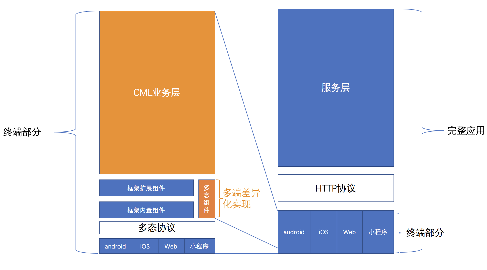

# 多态协议

定义标准接口(interface)，各端模块各自独立实现，编译时和运行时对实现的接口输入输出做检查。

主要 2 个目标：

- 保障多端可维护性
- 编译时拆分多端代码



## 介绍

CML 的是多端的上层应用语言，在这样的目标下，用户扩展功能时，保障业务代码和各端通信一致性变得特别重要。

> 用户也许只实现一个 API 跨 2 端，保障一致很简单，在一个超过 5 万行代码的复杂应用里，用户扩展了 100 个接口呢，如果你觉得还很简单，那跨 6 个端呢，在应用持续高速迭代中让用户人肉保障多端一致性实在太艰难，即使能做到，可维护性也会极差，跨端也会失去意义。

以上，跨端很美好，最大风险是可维护性问题。多态协议是 CML 业务层代码和各端底层组件和接口的分界点，CML 会严格“管制”输入输出值的类型和结构，同时会严格检查业务层 JS 代码，避免直接使用某端特有的接口，不允许在公共代码处使用某个端特定的方法，即使这段代码不会执行，例如禁止使用`window`、`wx`、`my`、`swan`、 `weex` 等方法。

统一多态协议设计的灵感来自于[Apache Thrift - 可伸缩的跨语言服务开发框架](https://zh.wikipedia.org/zh-hans/Thrift)，本质上跨端也属于跨语言。
**它能让 CML 开发者快速接入各个客户端底层功能，且不会因为各端接口差异、产品需求差异导致正常业务代码被打散，变得可读性差、难以维护，避免结果适得其反**，[具体 Case](../tutorial/normal-vs-cml.md)；各个客户端底层功能实现可以一部分来自 CML 提供的基础组件和基础 api 库，一部分来自 CML 开发者，一部分来自各端生态开源库（Chameleon 拥抱开源社区，你可以直接安装某个端的组件在使用多态协议扩展到某个端使用）。

## 多态接口

### 初始化多态接口

项目根目录下执行`cml init component`，选择`Polymorphic function`，输入文件名称，例如`utils`，生成如下文件结构

```bash
├── components
    └──utils
      └── utils.interface
```

初始化文件内容如下：

```vue
<script cml-type="interface">
interface UtilsInterface {
  getMsg(msg: string): void;
}
</script>
<script cml-type="web">
class Method implements UtilsInterface {
  getMsg(msg) {
    return 'web:' + msg;
  }
}
export default new Method();
</script>
<script cml-type="weex">
class Method implements UtilsInterface {
  getMsg(msg) {
    return 'weex:' + msg;
  }
}
export default new Method();
</script>
<script cml-type="wx">
class Method implements UtilsInterface {
  getMsg(msg) {
    return 'wx:' + msg;
  }
}
export default new Method();
</script>
<script cml-type="alipay">
class Method implements UtilsInterface {
  getMsg(msg) {
    return 'alipay:' + msg;
  }
}
export default new Method();
</script>
<script cml-type="baidu">
class Method implements UtilsInterface {
  getMsg(msg) {
    return 'baidu:' + msg;
  }
}
export default new Method();
</script>
```

文件中利用<script></script>标签将各端代码进行物理隔离，利用 cml-type 属性指定平台。
`cml-type="interface"`为接口定义部分，利用接口校验语法定义这个接口的方法及方法的参数与返回值。

`cml-type="web|wx|weex|alipay|baidu"`为各端实现部分，按照 interface 接口的定义进行方法的实现输入输出。<b>注意要以`export default`的形式导出对象</b>。

- cml-type="web"
  可以调用 Web 端任意方法和全局变量

- cml-type="wx"
  可以调用微信小程序端任意方法和全局变量

- cml-type="alipay"
  可以调用支付宝小程序端任意方法和全局变量

- cml-type="baidu"
  可以调用百度小程序端任意方法和全局变量

- cml-type="weex"
  可以调用 Weex 端任意方法和全局变量

- cml-type="qq"
  可以调用 QQ 小程序端任意方法和全局变量

- cml-type="tt"
  可以调用头条小程序端任意方法和全局变量

#### 调用多态接口

在需要使用多态接口的组件中引入，例如`src/pages/index/index.cml`中引用，代码如下：

```js
import utils from '../../components/utils/utils.interface';
let message = utils.getMsg();
```

### 场景举例

[ 实现多态 API ](../tutorial/poly-api.md)

### 扩展阅读

#### 什么时候用到多态接口？

<b>多态接口适用于因为端的不同而进行不同接口的调用或者不同业务逻辑处理的场景。</b>
例如:我们的页面现在需要一个本地存储功能的需求，我们已知各端的接口调用方法

- Web 端接口是`localStorage.setItem`
- 微信小程序端的接口是`wx.setStorageSync`
- Weex 端的接口是`storage.setItem`

如果不使用多态接口我们只能根据不同环境去调用各自的接口

```javascript
if (process.env.platform === 'web') {
  localStorage.setItem(key, value, function(e) {});
} else if (process.env.platform === 'wx') {
  wx.setStorageSync(key, value);
} else if (process.env.platform === 'alipay') {
  my.setStorageSync(key, value);
} else if (process.env.platform === 'baidu') {
  swan.setStorageSync(key, value);
} else if (process.env.platform === 'weex') {
  storage.setItem(key, value, function(e) {});
}
```

这样的代码有如下  待解决问题：

1. 增加代码复杂度，难以维护
2. 各端接口的参数不一致， 写多种逻辑
3. 各端接口耦合在一起，bug 风险极高
4. 没有做到各端代码的分离，增大代码体积

利用了多态接口之后的使用方式如下：

```javascript
import utils from 'utils.interface';

utils.setStorage(key, value, cb);
```

`utils.interface`对 setStorage 进行了封装,文件内容如下：

```vue
<script cml-type="interface">
// 定义一个传参为string类型，返回值为undefine的函数类型
type Callback = (state: string) => undefined;

// 定义模块的interface
interface UtilsInterface {
  // 定义setStorage方法 参数个数及返回值类型
  setStorage(key: string, value: string, cb: Callback): undefined;
}
</script>
<script cml-type="web">
// web端接口实现
class Method implements UtilsInterface {
  setStorage(key, value, cb) {
    try {
      localStorage.setItem(key, value);
      cb('success');
    }
    cache(e) {
      cb('fail');
    }
  }
}
export default new Method();
</script>
<script cml-type="weex">
// weex端接口实现
class Method implements UtilsInterface {
  setStorage(key, value, cb) {
    storage.setItem(key, value,
    function(e) {
        if (e.result == "success") {
          cb('success');
        } else {
          cb('fail');
        }
    });
  }
}
export default new Method();
</script>
<script cml-type="wx">
// wx端接口实现
class Method implements UtilsInterface {
  setStorage(key, value, cb) {
    try {
      wx.setStorageSync(key, value);
      cb('success');
    }
    catch(e) {
      cb('fail');
    }
  }
}
export default new Method();
</script>
<script cml-type="alipay">
// alipay端接口实现
class Method implements UtilsInterface {
  setStorage(key, value, cb) {
    try {
      my.setStorageSync(key, value);
      cb('success');
    }
    catch(e) {
      cb('fail');
    }
  }
}
export default new Method();
</script>
<script cml-type="baidu">
// baidu端接口实现
class Method implements UtilsInterface {
  setStorage(key, value, cb) {
    try {
      swan.setStorageSync(key, value);
      cb('success');
    }
    catch(e) {
      cb('fail');
    }
  }
}
export default new Method();
</script>
```

#### 多态接口的优势

- **保证接口一致性**
  CML 的目标是跨多端，多态接口的作用就是屏蔽各端差异，调用多态接口的代码运行在多端，如果保证不了一致性，很可能出现某一端的需求引起的接口改动影响到其他端的功能，导致线上问题。
  我们  设计了`cml-type="interface"`接口定义部分，目的就是做一致性的校验，各端模块的构造函数要实现该接口，我们在开发环境运行时提供了接口的校验。

- **代码独立性**
   多态接口中利用`<script></script>`标签对各端代码进行物理隔离，独立实现，每一端的编译只编译该端的代码，不会有任何影响。

- ** 充分扩展性**
  在独立性的基础上，就可以在各端的代码中完全使用各端的接口，以及引用各自端的第三方 npm 包。

## 多态组件

CML 在跨端的统一性上做了很多的工作，但即使是做到了 99%的统一，仍然存在着 1%的差异，基于代码可维护性的考量，CML 引入了多态协议。


### 多态组件的使用

项目根目录下执行`cml init component`，选择`Polymorphic component`，输入组件名称，例如`c-list`，生成如下文件结构

```
├── components
│   ├── c-list
│   │   ├── c-list.interface
│   │   ├── c-list.web.cml
│   │   ├── c-list.weex.cml
│   │   ├── c-list.wx.cml
│   │   ├── c-list.alipay.cml
│   │   ├── c-list.baidu.cml
│   │   └── ...
```

### interface 文件

`.interface`文件利用接口校验语法对组件的属性和事件进行类型定义， 保证各端的组件和事件一致，框架在开发环境的运行时做校验。例如`c-list.interface`

```javascript
type eventType = 'change';
type eventDetail = {
  value: string
}
type changeEvent = (a: eventType, detail: eventDetail) => void;

export default Interface Clist {
  name: string,
  age: number,
  changeEvent: changeEvent
}
```

### \*.[web|weex|wx|alipay|baidu].cml

`c-list.web.cml`、`c-list.weex.cml`、`c-list.wx.cml`、`c-list.alipay.cml`、`c-list.baidu.cml`、`...`
文件是灰度区，它是唯一可以调用下层端组件的 CML 文件，分别是 web、weex、wx、alipay、baidu 五个端的调用入口。建议这一块代码尽量薄，只是用来调用下层端代码，不要编写过于重的代码。

- 在灰度区的 template 模板中：
  - 调用下层全局组件或者引入的下层组件时，该组件传入的属性是各自下层端的语法，绑定的函数回调事件对象也是原始对象
    - 引入的下层组件通过可以直接调用，传递各端下层属性语法
    - 下层全局组件需添加`origin-`前缀，例如`<组件/>`改成`<origin-组件名/>`，传递各端下层语法
  - 调用普通 CML 内置组件或者引入的 cml 组件时，正常使用 cml 模板属性语法

* 在灰度区的 script 逻辑代码中：

  - 可以调用下层端的全局变量和任意方法，以及下层端的生命周期。
  - 也可以正常使用普通 cml 逻辑代码。

* 在灰度区的 style 样式代码中：

  - 可以使用下层端 css 语法。
  - 也可以正常调用 cmss 语法。

* 在灰度区的 json 配置代码中：
  - \*web.cml：`base.usingComponents`可以引入任意`.vue`扩展名的普通 vue 组件文件，路径规则见组件配置
  - \*wx.cml：`base.usingComponents`可以引入普通[微信小程序组件](https://developers.weixin.qq.com/miniprogram/dev/framework/custom-component/)，路径规则见组件配置
  - \*alipay.cml：`base.usingComponents`可以引入普通[支付宝小程序组件](https://docs.alipay.com/mini/framework/custom-component-overview)，路径规则见组件配置
  - \*baidu.cml：`base.usingComponents`可以引入普通[百度小程序组件](https://smartprogram.baidu.com/docs/develop/framework/custom-component/)，路径规则见组件配置
  - \*weex.cml：`base.usingComponents`可以引入支持 `.vue` 扩展名的普通 Weex 组件文件，路径规则见组件配置

### 使用举例

[实现多态 ECharts](../tutorial/poly-component.md)

### 扩展阅读

#### 什么时候用到多态组件？

CML 中的组件是采用单文件格式的 cml 文件，其中包括了一个组件所拥有的视图层、逻辑层及配置信息。考虑以下两种场景：

- 场景一：当某个功能组件需要调用各端的原生组件，各端原生组件的属性不一致，或者一端有原生组件，其他端需要组合实现等。
- 场景二：产品在需求上导致某一个组件在各端的结构表现不同。

#### 为什么要引入多态协议

以场景一为例，先看一个最容易理解的跨端组件实现：

```vue
<template c-if="{{ENV === 'web'}}">
  <ul c-for="{{list}}">
    <li>{{ item.name }}</li>
  </ul>
</template>
<template c-else-if="{{ENV === 'wx'}}">
  // 假设wx-list 是微信小程序原生的组件
  <wx-list data="{{list}}"></wx-list>
</template>
<template c-else-if="{{ENV === 'alipay'}}">
  // 假设alipay-list 是微信小程序原生的组件
  <alipay-list data="{{list}}"></alipay-list>
</template>
<template c-else-if="{{ENV === 'baidu'}}">
  // 假设baidu-list 是微信小程序原生的组件
  <baidu-list data="{{list}}"></baidu-list>
</template>
<template c-else-if="{{ENV === 'weex'}}">
  // 假设list 是weex端原生的组件
  <list source="{{list}}"></list>
</template>
```

上面的代码块是一个简单的列表实现，wx 和 weex 都是使用了各自的原生组件，这样的实现方法其实是把三端或者 N 端的模版放在了同一个文件中，当然，这里只是展示了模版的复杂，假设在 js 代码块中也存在着端的判断，那代码的复杂可想而知。

总结下来，这样的代码有如下  待解决问题：

1. 增加代码复杂度，难以维护
2. 各端组件的属性和事件定义可能不一致
3. 各端组件耦合在一起，bug 风险极高
4. 没有做到各端代码的分离，增大体积

而利用了多态组件之后的使用方式如下：

```vue
<c-list data="{{list}}"><c-list></c-list></c-list>
```

可以看到我们只引用了一个`c-list`组件，该组件提供了统一的属性。

## 多态模板

`chameleon-tool@1.0.4-alpha.2` 开始支持

### 多态模板的基本使用方式如下

```vue
<template class="demo-com">
  <cml type="weex">
    <view>weex端代码以这段代码进行渲染</view>
    <demo-com title="我是标题weex"></demo-com>
  </cml>
  <cml type="alipay,baidu">
    <view>alipay和baidu端以这段代码进行渲染</view>
    <demo-com title="我是标题2"></demo-com>
  </cml>
  <cml type="wx">
    <view>wx端以这段代码进行渲染</view>
    <demo-com title="我是标题wx"></demo-com>
  </cml>
  <cml type="base">
    <view
      >如果找不到对应端的代码，则以type='base'这段代码进行渲染，比如这段代码会在web端进行渲染</view
    >
    <demo-com title="我是标题base"></demo-com>
  </cml>
</template>
```

### 语法要求如下

1.必须符合如上结构，`template` 标签下第一层并列标签必须是 `cml` 标签；

2.cml 标签是必须有 `type` 属性，表明应用于哪端，cml 标签最终会被替换为 `view` 标签
