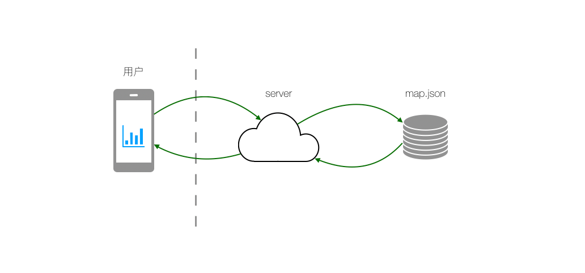

# Chameleon SDK

native sdk 目标让客户端上趋近于各类小程序引擎，使同一套代码平滑在客户端上运行。

使用 Chameleon 的渲染能力，需要集成对应平台的 SDK。请在左侧目录中根据你需要接入的平台来查看文档。

## iOS SDK

Chameleon iOS SDK 使用 Weex、ReactNative 与 WebView 作为基础渲染引擎，提供了基础的组件功能之外，还支持用户扩展自己的功能组件。

### 环境要求

Chameleon 最低支持的 iOS deployment target 为：**`iOS 9.0`**
Chameleon 使用`Cocoapods`进行管理，使用`npm`管理`react_native`。

| 组件名       | 依赖版本       | 备注 |
| ------------ | -------------- | ---- |
| Cocoapods    | **`1.3.1`**    | -    |
| npm          | 最新版本即可   | -    |
| WeexSDK      | **`0.19.0.2`** | -    |
| react_native | **`0.57.6`**   | -    |
| react        | **`16.6.1`**   | -    |

### 详细集成

当 sdk 下载下来后，首先进入`/chameleon-sdk-iOS/Chameleon/react_native`,并运行`npm install`进行更新。（这也是 react_native 的更新办法。）

接下来我们以 demo 工程为例（要注意工程路径位置,在工程实际配置中需要注意 :path 的内容）。
在 Podfile 中，写入：

    platform :ios, '9.0'

    target 'Chameleon_Example' do

        ## Chameleon
        pod 'Chameleon', :path => '../Chameleon/'

        ## 如果需要Weex，则写入weex依赖。
        pod 'WeexSDK', '~> 0.19.0.2'

        ## 如果需要react_native，则写入react_native依赖。
        pod 'React', :path => '../Chameleon/react_native/node_modules/react-native', :subspecs => [
        'Core',
        'CxxBridge', ##  如果RN版本 >= 0.45则加入此行
        'DevSupport', ##  如果RN版本 >= 0.43，则需要加入此行才能开启开发者菜单
        'RCTText',
        'RCTNetwork',
        'RCTWebSocket', ##  这个模块是用于调试功能的
        ]

        pod 'yoga', :path => '../Chameleon/react_native/node_modules/react-native/ReactCommon/yoga'
        pod 'DoubleConversion', :podspec => '../Chameleon/react_native/node_modules/react-native/third-party-podspecs/DoubleConversion.podspec'
        pod 'glog', :podspec => '../Chameleon/react_native/node_modules/react-native/third-party-podspecs/GLog.podspec'
        pod 'Folly', :podspec => '../Chameleon/react_native/node_modules/react-native/third-party-podspecs/Folly.podspec'

    end

将 podfile 保存，并运行 pod install。

### 常见问题

- Multiple commands produce

        Showing All Messages
        :-1: Multiple commands produce 'XXXXX':
        1) Target 'Chameleon_Example' has create directory command with output 'XXXXp'
        2) That command depends on command in Target 'Chameleon_Example': script phase “[CP] Copy Pods Resources”

解决办法：删除 `工程->Build Phrases->[CP] Copy Pods Resources->Output files`下的 copy 路径。

### 项目目录

| 描述      | 作用                 |
| --------- | -------------------- |
| Chameleon | SDK 源码与依赖文件夹 |
| Example   | react_native 依赖    |

#### Chameleon/sdk_src

| 目录            | 功能描述                                                           |
| --------------- | ------------------------------------------------------------------ |
| CMLSDKEngine 类 | 初始化 SDK、注册自定义的 Module 等功能                             |
| CMLCommon       | Chameleon 抽象层。抽象了基础的渲染页面、缓存、配置、预加载等功能。 |
| CMLReactNative  | 针对 ReactNative 额外配置的部分                                    |
| CMLWeex         | 针对 Weex 额外配置的部分                                           |
| CMLWeb          | 针对 WebView 额外配置的部分                                        |

### 提供功能

#### Bundle 预加载

1.  先设置预加载地址

    >     [CMLEnvironmentManage chameleon].weexService.config.prefetchContents = @[@"http%3A%2F%2F172.22.139.32%3A8000%2Fweex%2Fchameleon-bridge.js%3Ft%3D1546502643623"];

1.  开始预加载
    >         [[CMLEnvironmentManage chameleon].weexService setupPrefetch];

#### 自动降级

当 Bundle 下载失败、渲染出现严重错误时，会自动降级至 H5。

降级设计图

##### 本地 bundle 降级

当 H5 渲染失败时，倘若设置了默认的本地 bundle，会使用本地 bundle 进行降级。

##### 主动降级

当渲染出现错误时，FE 可以通过 JSBridge 通知客户端触发降级。

#### 功能扩展

使用`+ (void)registerModule:(NSString *)moduleName className:(NSString *)className;`注册自己的扩展。

### 使用说明

1.  初始化 SDK

    >     [CMLSDKEngine initSDKEnvironment];

2.  设置渲染引擎类型

    >     [CMLEnvironmentManage chameleon].serviceType = CMLServiceTypeWeex;

3.  设置预加载环境

    >     [CMLEnvironmentManage chameleon].weexService.config.prefetchContents = @[@"http%3A%2F%2F172.22.139.32%3A8000%2Fweex%2Fchameleon-bridge.js%3Ft%3D1546502643623"];

4.  设置预加载
    >     [[CMLEnvironmentManage chameleon].weexService setupPrefetch];

### Module 的使用

#### 什么是 Module

module 是 Native 提供给前端页面调用的，完成一组操作的方法集合，用于扩展 Native 的能力。在 Chameleon 页面中，开发者引入相关 js 库后即可调用 Module 中的方法。

```
import bridge from 'chameleon-bridge';

// 主动调用客户端方法
export function sayHello() {
    bridge.callNative(
        'moduleDemo', // 模块名
        'sayHello', // 方法名
        {}, // 参数
        res => {} // 回调方法
    );
}
```

#### 使用 Module

Module 的使用分两种情况，一种是使用 Chameleon SDK 内置的 Module，一种是用户自定义实现自己的 Module。

##### 使用内置的 Module

内置的 Module 在 js 前端代码里直接使用即可，目前内置的 Module 有：

- clipboard
- cml
- modal
- storage
- stream
- webSocket

API 文档里描述的能力，部分实现就是由上述 Module 支撑的。

##### 自定义实现自己的 Module

示例可参看 [CMLStorageModule 示例](../tutorial/use-ios-sdk.md)

注册自己的 Module 关联文件:

- CMLSDKEngine
- CMLConstants
- CMLUtility
- CMLModuleProtocol 非必须（该协议可获取 CMLInstance）

详细说明

- 功能：通过注册 Module 提供原生能力的扩展
- 原理：依赖 bridge 进行协议通信，根据不同 Module 进行协议处理分发
- Module，扩展原生能力

  - Module 注册

    ```
    [CMLSDKEngine registerModule:@"module名" className:@"类名"];
    ```

    - Module 名:两端及前端同学定义的一个名字

  - Module 方法实现

    ```
      #import "CMLConstants.h"
      #import "CMLUtility.h"

      CML_EXPORT_METHOD(@selector(xxx:callBack:))

      - (void)xxx:(NSDictionary *)param callBack:(CMLMoudleCallBack)callback {

      }
    ```

    - xxx:方法名，协商定义，需要跟前端一致
    - param：所带参数，字典类型
    - callback：回调 block (非必须)

  - 遵循 CMLModuleProtocol 的作用

    - CMLModuleProtocol 协议可获取到 CMLInstance
    - 通过 CMLInstance 可获取当前运行环境、viewController

### 预加载和缓存

#### 预加载和缓存概念

预加载和缓存都是为了节省 JSBundle 下载的时间，加快 UI 的渲染。

##### 预加载

预加载是将下载 JSBundle 的动作提前完成，在需要用到的时候直接从本地读取并渲染。实际项目使用中，可以将需要预加载的 url 配置到预加载地址列表里，在 app 启动时提前从服务端获取，通过 Chameleon SDK 提供的预加载能力提前下载下来。

##### 缓存

对于没有预加载的 JSBundle 在渲染前需要先下载，下载完成后 Chameleon SDK 会缓存此 JSBundle，下次渲染同一个 JSBundle 时，如果此 JSBundle 没有更新则不会下载新的，达到节省时间和流量提升渲染速度的目的。

#### CMLCache

CMLCache 是一个对 js 进行下载、缓存的一个模块，根据协议来实现 js 增量更新功能。主要有以下内容

```
 |
 |——CMLWeexCache   缓存模块接口类
 |——CMLCacheInfo     JsBundle文件缓存实现逻辑
 |——CMLCacheItem    jsBundle文件内存对象，描述每一个jsBundle文件的缓存状态
 |——CMLConfig    配置类，业务方可通过这个类设置是否开启缓存功能、预加载js路径、缓存大小限制、默认兜底页链接等
```

---

##### CMLCache

对 jsBundle 进行预加载、获取、缓存的处理对外接口。

在该文件里，我们将拿到的 URL 解析出此页面需要加载的 jsbundle 标识，然后根据 jsBundle 标识来检测是否在本地已预加载，如果此 jsBundle 已预加载成功，则直接读本地缓存渲染；否则先从网络下载 jsBundle，然后渲染并缓存本地。

后续我们将支持在一个 URL 中下发多段 jsbundle 标识，每段 jsbundle 标识代表这个页面的一部分，然后在根据每段 jsbundle 标识，分别从本地缓存里获取去寻找对应的 js 代码，如果不存在则从网络去下载这一段 jsBundle 并保存在本地，然后 SDK 中会将最终得到的多段 jsBundle，组合成一个完整页面的 jsBundle 加载出来。

##### CMLCacheInfo

jsBundle 的内存管理器，是加载、获取、缓存等处理的实际操作者。
对本地缓存 jsBundle 的 maxSize 加以限制，如果超过 maxSize，则优先清除老的 jsBundle 缓存

#### CMLCacheItem

对 jsBundle 的封装，包括 jsBundle 文件在本地存储的路径、内存索引；CMLCacheInfo 就是通过 CMLCacheItem 来对 jsBundle 进行操作。

##### 使用（以 weex 为例）

###### 缓存相关配置

缓存相关配置定义位于 CMLWeexConfig （CMLConfig）

    //设置服务类型为weex
    [CMLEnvironmentManage chameleon].serviceType = CMLServiceTypeWeex;
    //设置默认错误web链接
    [CMLEnvironmentManage chameleon].weexService.config.defaultErrUrl = @“defaultErrUrl”

Chameleon 功能和缓存功能都是默认开启的，如果有特殊需要，可以手动关闭；另外在这里还有缓存限制 maxSize、缓存目录等配置

    [CMLEnvironmentManage chameleon].weexService.config.isFeatureAvailable = NO；
    [CMLEnvironmentManage chameleon].weexService.config.isEnableCacheFeature = NO;

###### 预加载

//设置预加载 URL 列表

```
 [CMLEnvironmentManage chameleon].weexService.config.prefetchContents = @[@"http%3A%2F%2F172.22.139.32%3A8000%2Fweex%2Fchameleon-bridge.js%3Ft%3D1546502643623"];
 //开启预加载
 [[CMLEnvironmentManage chameleon].weexService setupPrefetch];
```

###### 获取加载 jsBundle 的 URL

```
CMLWeexCache *cache = (CMLWeexCache *)[CMLEnvironmentManage chameleon].weexService.cache;
  //在缓存中获取JSBundle的URL（本地有缓存则获取到本地缓存的URL，本地无缓存则获取到远端的URL）
        [cache getBundleCacheOfJSBundleUrl:self.bundleUrl completion:^(NSString *url, NSDictionary *parameter) {
  //加载jsBundle
  [self.render renderWithURL:[NSURL URLWithString:url] options:@{@"query" : [param copy]} data:nil];
}
```

## Android SDK

github 地址[点这里](https://github.com/beatles-chameleon/chameleon-sdk-android)

Chameleon android SDK 是 Chameleon 整体框架的一部分，主要任务是完成 Chameleon JsBundle 在 android 端的本地渲染。SDK 底层采用 weex 作为渲染引擎，同时扩展一些一般工程通用的基础能力，如缓存能力、降级能力等。

### 项目结构

项目一级目录结构如下：

```
|+ app SDK使用示例
|+ cmlsdk SDK接入层，抽象 Chameleon 引擎能力、实现通用扩展能力
|+ cmlweex 包装 weex 渲染引擎
|+ cmlweb 包装 web 渲染引擎
|+ js-bundle-mgr 实现 js bundle 预加载、缓存
|+ rich-text-component 富文本组件
|+ sdk-image 图片选择、图片拍摄组件
|+ sdk-location 位置组件
```

cmlsdk 模块单独拿出来看下目录结构：

```
|- cmlsdk
    |+ adapter 定义了扩展能力的接口以及默认实现，无默认实现的能力需要第三方项目根据自己的实际业务需求去实现
    |+ bridge 定义了 js 和 native 通信的接口，实现协议相关的处理能力，以及实现了协议层使用入口
    |+ bundle js bundle 相关定义，目前只有一个类用来描述 js bundle 相关信息
    |+ common 通用能力的基础封装类
    |+ container 渲染容器的抽象能力定义
    |+ extend Chameleon 提供的一些能力
    |+ Module 扩展能力管理，收集 sdk 默认提供的以及第三方用户自己实现的 Module，根据 bridge 层指令执行具体某个 Module 的某个 method
    |+ utils 工具类集合
    |+ widget 自定义的widget，目前只有一个 title bar，用做 webview 渲染容器的action bar
    |- CmlBaseLifecycle 生命周期的接口定义
    |- CmlConstant 常量定义
    |- CmlEngine Chameleon SDK 使用入口
    |- CmlEnvironment 运行环境和运行参数配置入口、扩展能力设置入口
    |- CmlInstanceManage 页面运行实例的管理类，每一个容器实例运行时，其对应的Instance会注册到这里
    |- ICmlEngine 引擎的抽象接口
    |- ICmlInstance 容器实例抽象接口
    |- ICmlActivityInstance 全屏容器实例抽象接口
    |- ICmlViewInstance 视图容器实例抽象接口
```

项目整体架构如下图所示：


### Chameleon 使用

Chameleon android SDK 的使用步骤如下:

- 引用 Chameleon 及工程需要的相关类库
- 在项目中初始化 Chameleon SDK
- 加载 JS Bundle

详细的使用方式可以参看手把手系列之 [CML Android SDK 使用范例](../tutorial/use-android-sdk.md)，建议<font color=#FF0000>先看使用范例</font>再阅读其他章节。

如果需要自定义自己的 adapter，参看 [Adapter 的使用](#adapter-的使用) 一节。如果需要扩展 Module，参看 [Module 的使用](#module-的使用) 一节。

### 基础类说明

#### CmlEngine

此类是 <em>Chameleon/kəˈmiːlɪən/</em> SDK 的入口类，提供基本的初始化入口和 <em>Chameleon</em>容器的调起能力。具体包含以下能力

- SDK 初始化入口
- 调起渲染容器
- 初始化预加载列表
- 注册扩展 Module

#### CmlEnvironment

CmlEnvironment 主要提供了开发期间需要的一些能力，如

- 调试开关
- 降级开关
- 缓存开关

以及一些常量的定义，如

- 预加载的最大缓存
- 运行时的最大缓存

adapter 设置和获取，详情参看 [Adapter 的使用](#adapter-的使用) 一节

- 各种能力的自定义实现配置入口

### 富文本组件

富文本是 Chameleon 里唯一一个默认注册的组件，主要有以下内容

```
 |
 |-richinfo     主要是富文本需要定义的协议、点击事件的回调等
 |-utils    工具类，主要是加载assets下默认的字体
 |-CmlRichTextComponent     继承与与CmlComponent的富文本组件
 |-CmlRichTextEngine     富文本入口类，
```

---

#### richinfo

- CmlClickSpanListener：富文本点击事件回调
- CmlCustomTypefaceSpan：加载自定义字体
- CmlRichInfo：富文本协议及实现
- CmlRichInfoSpan：配合 CmlRichInfo 显示富文本文字，可直接设置给 TextView

#### utils

- CmlFontUtil：主要就是加载自定义字体，如 assets 下 fonts 包下的 Barlow-Medium.ttf 字体

### Module 的使用

github 地址[点这里](https://github.com/beatles-chameleon/chameleon-sdk-android)

<font color=#FF0000>根目录 assets 目录下的 cml-demo-say.zip</font> 是个简单的示例工程，用来演示 native 和 weex 容器或 web 容器的双向通信

#### 什么是 Module

module 是 Native 提供给前端页面调用的，完成一组操作的方法集合，用于扩展 Native 的能力。在 Chameleon 页面中，开发者引入相关 js 库后即可调用 Module 中的方法。

```
import bridge from 'chameleon-bridge';

// 主动调用客户端方法
export function sayHello() {
    bridge.callNative(
        'moduleDemo', // 模块名
        'sayHello', // 方法名
        {}, // 参数
        res => {} // 回调方法
    );
}
```

#### 使用 Module

Module 的使用分两种情况，一种是使用 Chameleon SDK 内置的 Module，一种是用户自定义实现自己的 Module。

##### 使用内置的 Module

内置的 Module 在 js 前端代码里直接使用即可，目前内置的 Module 有：

- clipboard
- cml
- modal
- storage
- stream
- webSocket

API 里描述的能力，部分实现就是由上述 Module 支撑的。

##### 自定义实现自己的 Module

示例可参看 [CML Android SDK 使用范例](../tutorial/use-android-sdk.md#初始化入口)

module 扩展 3 个重要的注解

- @CmlModule 标注这个类是扩展模块
- @CmlMethod 标注可供 JS 侧调用的方法
- @CmlParam 标注调用的参数

详细说明

- 功能：通过注册 Module 提供原生能力的扩展
- 原理：依赖 bridge 进行协议通信，根据不同 Module 进行协议处理分发
- Module，扩展原生能力
  - Module 注册
    - 必须注册 CmlEngine.registerModule(Class<?> moduleClass)
    - 不强制要求添加@CmlModule,未添加时会使用默认设置
    - 不建议在运行中动态注册 Module
  - Module 名称
    - 默认使用 Module 的类名
    - 配置 Module 名称，添加注解@CmlModule(alias = "name")
  - Module 实例
    - 默认为实例全局唯一，即无论有多少 instance 都会使用同一个 Module 实例
    - 配置全局性，添加注解@CmlModule(global = false)
  - Module 组合
    - 针对极特殊情况，允许多个 class 共用一个 Module 名称
    - 必须有且只有一个 class 作为 Module，所有相关 class 均会使用该 moduel 配置
    - 其余 class 必须使用@CmlJoin(name = "name")，指定需要关联的 moduel 名称
    - 每个 class 实例之间无关联，仅会在使用时再创建实例
- method，提供原生能力方法
  - method 注册
    - 自动注册 Module 类中所有的 public 方法
    - 不强制要求添加@CmlMethod,未添加时会使用默认设置
    - 如果不希望方法被误添加，需要在方法上添加@CmlIgnore
  - method 名称
    - 默认使用 method 方法名
    - 配置 method 名称，添加注解@CmlMethod(alias = "name")
  - method 线程
    - 默认运行在主线程
    - 配置 method 线程，添加注解@CmlMethod(uiThread = false)
- param，原生能力方法所需要的参数

  - param 类型
    - 针对 Context、ICmlInstance 等上下文类型，会根据调用环境进行查找替换
    - 对于 CmlCallback 的类型，会构建对应的回调，需要自行处理回调
    - 其余类型会根据 bridge 传递的参数进行处理
  - param 参数
    - 根据 birdge 传递的数据，根据参数类型进行转化
    - 目前可转化的类型为 JSONObject、String
    - 如果要直接转为对象，需要设置 CmlJsonAdapter 或接入相应 json 库
  - param 字段
    - 只想获取传递数据中的某一个对象时，可以使用@CmlParam
    - 添加@CmlParam(name = "name")，设置该参数获取的字段
    - 添加@CmlParam(admin = "admin")，设置该参数默认值

### Adapter 的使用

#### 初步认识 Adapter

先看个例子，对 Adapter 有个直观印象和基本概念。Chameleon SDK 里打印日志使用的是默认的 android.util.Log, 如果想替换它可以按照如下步骤实行：

##### 替换和注册

如果用户想替换 SDK 默认提供的日志打印，可以实现 CmlLoggerAdapter 接口，并按如下方式注册进 SDK:

```
// 接口实现
public class MyLoggerDefault implements CmlLoggerAdapter {
	@Override
    public void d(String tag, String msg) {
        // 这里实现自己的日志打印
    }
	...
}

// 接口注册
public class MyApplication extends Application implements ICmlConfig {
    @Override
    public void onCreate() {
        super.onCreate();
        CmlEngine.getInstance().init(this, this);
    }

    @Override
    public void configAdapter() {
        CmlEnvironment.setLoggerAdapter(new MyLoggerDefault()); // 注册自己的Adapter
        ...
    }
	...
}

```

以上就完成了日志打印能力的替换。

##### 原理说明

SDK Adapter 定义和默认实现如下：

```
// 日志接口定义
public interface CmlLoggerAdapter {
	void d(String tag, String msg);
	...
}

// 日志接口默认实现
public class CmlLoggerDefault implements CmlLoggerAdapter {
	@Override
    public void d(String tag, String msg) {
        Log.d(tag, msg);
    }
	...
}
```

如果用户注册了自己的 Log Adapter 实现则优先使用，否则使用 SDK 默认提供的实现。

##### 日志打印的使用

日志打印通过 CmlLogUtil 类调用，注册自己的 Logger Adapter 后，打印日志的相关方法就会回调到自定义的方法实现里，使用示例：

```
    // 日志打印
    public void launchPage(@NonNull Activity activity, String url, HashMap<String, Object> options) {
        if (TextUtils.isEmpty(url)) {
            CmlLogUtil.e(TAG, "CmlEngine launchPage, url is empty.");
            return;
        }
        ...
    }
```

#### Adapter 基本概念

Adapter 的目的是定义一系列能力接口来隔离具体的实现，方便 SDK 使用者在需要时灵活替换成自己的实现。Chameleon SDK 框架层在使用 Adapter 相关能力时都是面向接口的，使用者只需要实现相关能力的 Adapter 接口并通过 SDK 注册接口进行注册，即可轻松替换成自己的实现并进行能力扩展。

Chameleon SDK 并没有完整的实现所有 Adapter 接口，也就是说一部分有默认实现的 Adapter 可以直接使用，未提供默认实现的需要使用者自己实现，否则框架将无法使用对应的接口能力。

Chameleon SDK 定义了如下的 Adapter 接口

| 接口                  | 功能            | 默认实现 |
| :-------------------- | :-------------- | :------- |
| ICmlDegradeAdapter    | 降级            | 无       |
| ICmlImgLoaderAdapter  | 图片加载        | 有       |
| CmlLoggerAdapter      | 日志            | 有       |
| ICmlNavigatorAdapter  | url 跳转        | 有       |
| ICmlStatisticsAdapter | 统计信息输出    | 无       |
| ICmlWebSocketAdapter  | WebSocket       | 有       |
| CmlHttpAdapter        | Http 请求       | 有       |
| CmlJsonAdapter        | json 解析       | 有       |
| CmlDialogAdapter      | 对话框          | 有       |
| CmlToastAdapter       | 提示浮层        | 有       |
| CmlStorageAdapter     | key->value 存储 | 有       |
| CmlThreadAdapter      | 线程            | 有       |

##### 重点 Adapter 说明

降级、对话框、提示浮层 Adapter 在 SDK 实际使用时替换可能性较大，分别说明。

###### 降级

ICmlDegradeAdapter 降级接口没有提供默认实现，[CML Android SDK 使用范例](../tutorial/use-android-sdk.md) 示例里示范了如何实现一个降级处理类 CmlDegradeDefault。
CmlDegradeDefault 默认会关闭 native 渲染容器，并打开 Web 容器加载降级 url。

```
public class CmlDegradeDefault implements ICmlDegradeAdapter {

    @Override
    public DegradeViewWrapper getDegradeView(int degradeCode) {
        return new DegradeViewWrapper() {
            CmlWebView webView;

            @Override
            public View getView(@NonNull Context context) {
                webView = new CmlWebView(context);
                webView.onCreate();
                return webView;
            }

            @Override
            public void onDestroy() {
                if (null != webView) {
                    webView.onDestroy();
                }
            }

            @Override
            public void loadURL(@NonNull Context context, @NonNull String url, @Nullable HashMap<String, Object> options) {
                if (null != webView) {
                    webView.render(url, null);
                }
            }
        };
    }

    @Override
    public void degradeActivity(@NonNull Activity activity, @NonNull String url, @Nullable HashMap<String, Object> options, int degradeCode) {
        if (url.contains("?")) {
            url = url.substring(0, url.indexOf("?"));
        }
        CmlEngine.getInstance().launchPage(activity, url, null);
    }
}
```

degradeActivity 会在如下降级场景发生时回调

- 下载 JSBundle 失败
- 解析 JSBundle 发生异常
- 降级调试开关打开(在 CmlEnvironment 里设置)
- 前端代码手动降级

###### 对话框

此接口定义以下两种对话框能力

- showAlert
- showConfirm

CmlModalTip 实现了此接口，通过 CmlModalModule 类暴露给 JS 侧调用，前端用法参考 API [交互反馈](../api/#交互反馈)

###### 提示浮层

此接口定义以下浮层提示能力

- showToast

CmlModalTip 实现了此接口，通过 CmlModalModule 类暴露给 JS 侧调用，前端用法参考 API [交互反馈](../api/#交互反馈)

##### 其他 Adapter 说明

###### 图片加载

CmlDefaultImgLoaderAdapter ，默认使用 Glide，需要用户手动集成 Glide

###### 日志打印

CmlLoggerDefault，默认使用系统 log 输出

###### 跳转

默认使用 Intent.ACTION_VIEW 处理

###### 统计信息输出

没有默认实现，不关心可以不用实现

###### WebSocket

CmlDefaultWebSocketAdapter，默认使用 OkHttp3，需要用户手动集成 OkHttp3

###### Http 请求

执行 http 请求，并监听 http 响应

###### json 解析

转换成 json 字符串和反解成 json 对象

###### key->value 存储

前端用法参考 API [数据存储](../api/#数据存储)

###### 线程

定义工作线程和 ui 线程

### 预加载和缓存

#### 预加载和缓存概念

预加载和缓存都是为了节省 JSBundle 下载的时间，加快 UI 的渲染。

##### 预加载

预加载是将下载 JSBundle 的动作提前完成，在需要用到的时候直接从本地读取并渲染。实际项目使用中，可以将需要预加载的 url 地址列表在 app 启动时提前从服务端获取，通过 Chameleon SDK 提供的预加载能力提前下载下来。

##### 缓存

对于没有预加载的 JSBundle 在渲染前需要先下载，下载完成后 Chameleon SDK 会缓存此 JSBundle，下次渲染同一个 JSBundle 时，如果此 JSBundle 没有更新则不会下载新的，达到节省时间和流量提升渲染速度的目的。

#### JsBundleMgr

JsBundleMgr 是一个对 js 进行下载、缓存的一个模块，根据协议来实现 js 增量更新功能。主要有以下内容

```
 |
 |——cache    基于DiskLrucache来实现缓存功能
 |——code     js代码的获取及管理
 |——net      采用httpUrlConnect实现下载功能
 |——utils    工具包
 |——CmlJsBundleConstant  常量的管理
 |——CmlJsBundleEngine    实现了CmlJsBundleManager接口，入口类
 |——CmlJsBundleEnvironment   当前环境的设置，如debug环境等
 |——CmlJsBundleManager   实现此接口可自己定义JsBundle的管理
 |——CmlJsBundleMgrConfig    配置类，设置预加载js路径、缓存大小等，默认预加载及运行时缓存大小是4M，可自行设置
```

---

##### code

对 js 代码进行预加载、获取、缓存的管理。在该包里，我们将拿到的 url 根据协议来拆分成多个 url1、url2 等，然后在根据 url1、url2 等来获取对应的 js 代码，首先从本地缓存里获取去寻找对应的 js 代码，如果不存在则从网络去下载并保存在本地

##### utils

一些文件管理、拆分 url、网络判断的工具类

- CmlCodeUtils：获取到的 url、code 的拆解及合并
- CmlFileUtils：sd 卡及缓存目录的判断
- CmlLogUtils：Log 的实现
- CmlNetworkUtils：当前网络状态的判断，如 Wi-Fi、4g 等
- CmlUtils：Md5 的生成、主线程判断等等

##### CmlJsBundleConstant

缓存文件名、预加载优先级的管理，预加载优先级有以下三种类型

- 普通（PRIORITY_COMMON）：非 Wi-Fi 情况不预加载
- 强预加载（PRIORITY_FORCE）：无论什么网络情况都预加载
- 强预加载+预解析（PRIORITY_FORCE_MAX）：目前未用到

##### CmlJsBundleEngine

实现了 CmlJsBundleManager 接口，主要有以下三个方法

- initConfig(Context,CmlJsBundleMgrConfig)：初始化 config，主要是设置预加载 url、预加载缓存、运行时缓存的设置，预加载及运行时缓存默认为 4M
- startPreload()：开始预加载，目前预加载成功或者失败并没有任何信息返回，只能查看 log 进行分析
- getWXTemplate(String,CmlGetCodeStringCallback)：获取 js 代码

##### CmlJsBundleManager

实现此接口可以自己定义 JsBundleMgr 的实现

##### 使用

###### 添加依赖

```gradle
compile 'com.didiglobal.chameleon:js-bundle-mgr:latest.version'
```

###### 预加载

```java
        CmlJsBundleEnvironment.DEBUG = true;
        List<CmlModel> cmlModels = new ArrayList<>();
        CmlModel model = new CmlModel();
        model.bundle = CmlUtils.parseWeexUrl(url1);
        model.priority = 2;
        cmlModels.add(model);
        model = new CmlModel();
        model.priority = 2;
        model.bundle = CmlUtils.parseWeexUrl(url2);
        cmlModels.add(model);
        CmlJsBundleMgrConfig config = new CmlJsBundleMgrConfig.Builder().setPreloadList(cmlModels).build();
        CmlJsBundleEngine.getInstance().initConfig(this, config);
        CmlJsBundleEngine.getInstance().startPreload();
```

###### 获取 Js 代码

```java
        CmlJsBundleEngine.getInstance().initConfig(this, new CmlJsBundleMgrConfig.Builder().build());
        String url = CmlUtils.parseWeexUrl(url);
        CmlJsBundleEngine.getInstance().getWXTemplate(url, new CmlGetCodeStringCallback() {
            @Override
            public void onSuccess(String codes) {
                Log.i(TAG, "onSuccess: " + codes);
            }

            @Override
            public void onFailed(String errMsg) {
                Log.i(TAG, "onFailed: " + errMsg);
            }
        });
```

## SDK 独有方法

### getSDKInfo

获得 SDK 信息

#### 参数

无

#### 返回值

返回 promise

| 返回值  |  类型  |  说明  |
| :-----: | :----: | :----: |
| version | String | 版本号 |

### inSDK

同步方法，判断 webview 或 native 页面是否在 sdk 环境中，目前只用于内部封装方法使用。

#### 参数

无

#### 返回值

| 返回值 |  类型   |                    说明                     |
| :----: | :-----: | :-----------------------------------------: |
| value  | Boolean | true：在 sdk 环境中；false：不在 sdk 环境中 |

```
import bridge from 'chameleon-bridge';
const inSDK = bridge.inSDK(); // true/false
```

### rollbackWeb

降级到[chameleon url](../framework/chameleon_url.md)对应的 h5 地址。

### callNative(module:String, method:String, args:Object, callback:Function)

js 调用 native sdk

```
import bridge from 'chameleon-bridge';

// 主动调用客户端方法
export function sayHello() {
    bridge.callNative(
        'moduleDemo', // 模块名
        'sayHello', // 方法名
        {}, // 参数
        res => {} // 回调方法
    );
}
```

### listenNative(module:String, method:String, callback:Function)

监听客户端调用 js

```
import bridge from 'chameleon-bridge';

// 监听客户端调用js
export function listenTell() {
    bridge.listenNative(
        'moduleDemo', // 模块名
        'NaTellJS', // 方法名
        res => {
         // 回调方法中处理返回的数据
        }
    );
}
```

## 端 JS 包缓存、更新、预加载

### 缓存策略

浏览器在加载静态资源的时候一般的话会使用两种 HTTP 缓存管理机制：

- 强制缓存(Cache-Control、Expires)
- 协商式缓存(ETag、Last-Modified)

类似的，在使用`chameleon sdk`加载 JS 包的时候也会提供两种缓存管理机制：

- 基于 LRU 的强制缓存
- 类 HTTP 的协商式缓存(后续发布)

#### 基于 LRU 的强制缓存

基于[LRU](https://baike.baidu.com/item/LRU)的`缓存策略`，简单来说就是实现了一个`缓存池`，每次请求先从缓存池中搜索一下，如果有就直接使用缓存池中的 JS 包，如果没有，就从网络上请求 JS 包并将其缓存在缓存池中，每一份 JS 包缓存按照`最后使用时间`排序，当缓存池满了以后，将最早使用过的缓存从缓存池中`清理`出去，保证客户端上的资源占用可控。

##### 如何配置

- iOS
- android

#### 类 HTTP 的协商式缓存(后续发布)

与普通浏览器实现的协商式缓存类似，用户只需在静态资源服务端配置好静态资源的协商式缓存头部，即可实现与普通浏览器一致的方式使用协商式缓存。

### 更新策略

当 JS 包升级迭代需要在客户端内使用最新的包时，在使用两种缓存方式下，相应的存在两周更新方式，下面会详细介绍

#### 强制缓存下的更新：

由于强制缓存，客户端不会主动的去向服务器请求最新的更新包，会导致客户端一直使用老的版本。

为了能够打到规避这种情况，我们提供了一种可供参考的解决方案：

1. 配置文件指纹

设置`chameleon.config.js`中的`hash: true`，具体可参考工程化配置之[文件指纹](../framework/config.md)，`chameleon`项目构建出的 JS 包文件名会类似如下

```bash
test_project_c6bdf9074a821f01e70f.js
```

2. 上线打包出来的 JS 包

得到以下可以访问的资源地址

```bash
https://www.static.com/test_project_c6bdf9074a821f01e70f.js
```

3. 替换入口资源地址

将入口页面中的[chameleon url](../framework/chameleon_url.md)`cml_addr`替换成 encodeURIComponent 后的最新资源地址即可，比如

原 chameleon url:

```bash
https://www.static.com/test_project.html?cml_addr=https%3A%2F%2Fwww.static.com%2Ftest_project_21f01e70fc6bdf9074a8.js
```

新的 chameleon url

```bash
https://www.static.com/test_project.html?cml_addr=https%3A%2F%2Fwww.static.com%2Ftest_project_c6bdf9074a821f01e70f.js
```

**最佳实践**

由于强制缓存下每次修改都需要修改入口页面的 chameleon url 中的 cml_addr 参数，可能会导致修改频繁影响效率，所以建议通过后端读取[map.json](../framework/config.html#%E6%9E%84%E5%BB%BA%E7%BB%93%E6%9E%9C%E4%BF%A1%E6%81%AF)的方式下发跳转`chameleon url`进行统一管理。

具体请求过程如下图所示:



1. JS 包修改上线后，同时将`map.json`上线到服务器上
2. 入口页面加载数据时，服务器从`map.json`文件中查询到要跳转的`chameleon url`，并与初始化数据合并和下发给入口页面。
3. 入口页面逻辑将接受到的`chameleon url`作为需要跳转的链接进行使用。

这样每次 bundle 修改后可以自动完成更新

#### 协商式缓存下的更新：

可以直接使用 http 的缓存更新策略，不需额外的配置。

### 预加载

在某些场景下，为了能够让页面更快的呈现在用户面前，需要让客户端提前下载一些 js 包，这时就需要用到预加载。

#### 如何配置

- iOS
- android 参考 [CML Android SDK 使用范例](../tutorial/use-android-sdk.md) 第 6 节
