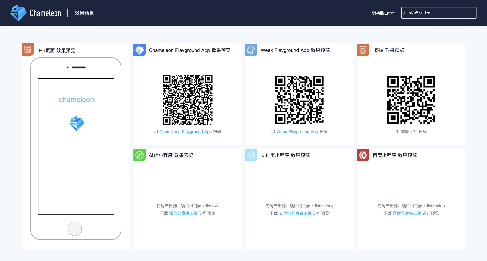
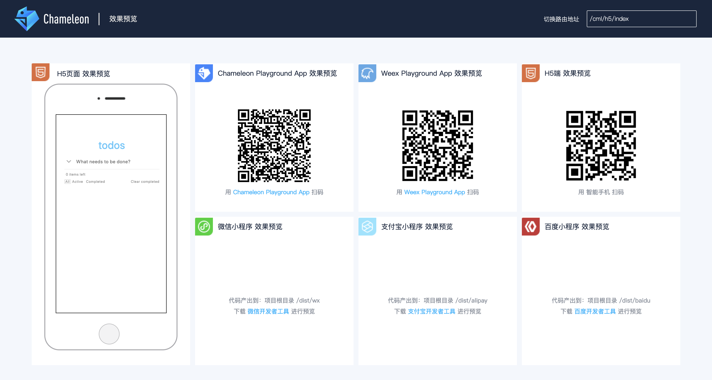

# 起步

## 初始化

### 安装 chameleon-tool

依赖环境：node >= 8.10.0、npm >= 5.6.0

建议使用 [nvm](https://github.com/creationix/nvm) 管理 Node 版本，**暂不支持使用 yarn、cnpm 等进行安装。**

```shell
npm i -g chameleon-tool
```

安装成功后，执行 `cml -v` 查看当前版本， `cml -h` 查看帮助文档。

### 创建项目与启动

- 执行 `cml init project`
- 输入项目名称
- 等待自动执行 npm install 依赖
- 切换到项目根目录执行`cml dev`
- 会自动打开预览界面 预览界面如下：



web 端可以点击模拟器内页面右上角打开  新的浏览器窗口。

native 端的效果请  下载[chameleon playground](https://beatles-chameleon.github.io/playground/download.md)(目前可下载 Android 端，IOS 端即将发布)或者下载[weex playground](http://weex.apache.org/cn/tools/playground.md)扫码预览

小程序端请下载对应小程序开发工具，打开项目根目录下的<a href="../framework/platform-list.html">`/dist/[wx|alipay|baidu|其他]`</a>目录预览。

[微信开发者工具](https://developers.weixin.qq.com/miniprogram/dev/devtools/devtools.md)、
[支付宝开发者具](https://docs.alipay.com/mini/ide/download)、
[百度开发者工具](https://smartprogram.baidu.com/docs/develop/tutorial/index_first/)
[QQ 开发者工具](https://q.qq.com/wiki/#编码开发小程序)

对于字节跳动小程序，需要按照 [字节跳动小程序接入教程](https://cml.js.org/doc/tutorial/migrate-bytedance-to-cml.md)配置完毕之后，可以在 `dist/tt`下用[字节跳动小程序开发者工具](https://microapp.bytedance.com/docs/devtool/versionUpdate.md)打开对应的应用程序

### 目录与文件结构

生成的目录结构如下，详细介绍参见 [目录结构](folder.md)。

```bash
├── chameleon.config.js                 // 项目的配置文件
├── dist                                // 打包产出目录
  ├── alipay                            // 支付宝小程序代码
  ├── baidu                             // 百度小程序代码
  ├── wx                                // 微信小程序代码
  ├── tt                                // 头条小程序代码
  ├── qq                                // QQ小程序代码
  ├── xx                                // 其他终端
├── mock                                // 模拟数据目录
├── node_modules                        // npm包依赖
├── package.json
└── src                                 // 项目源代码
    ├── app                             // app启动入口
    ├── components                      // 组件文件夹
    ├── pages                           // 页面文件夹
    ├── router.config.json              // 路由配置
    └── store                           // 全局状态管理
```

>  编辑器中使用`.cml`的插件语法高亮，参见<a href="../tutorial/use-editor-plugin.html">编辑器插件</a>，插件持续覆盖更多编辑器。

## 编辑器插件

- Idea、Webstorm 插件`cml-language-support`
- Vscode 插件`cml`
- Atom 插件`language-cml`
- sublime 插件审核中，敬请期待...

## 语法体验

替换`src/pages/index/index.cml`文件，删除`src/pages/index/index.cml`文件中的所有代码，然后替换为下面的代码，体验 chameleon 语法。

### 数据绑定

```vue
<template>
  <view>
    <!-- 数据绑定与计算属性 -->
    <text>{{ message }}</text>
    <text class="class1">{{ message2 }}</text>

    <!-- 条件与循环渲染 -->
    <view c-if="{{showlist}}">
      <view c-for="{{array}}" c-for-index="idx" c-for-item="itemName" c-key="city">
        <text> {{ idx }}: {{ itemName.city }}</text>
      </view>
    </view>

    <!-- 事件绑定 -->
    <view c-bind:tap="changeShow"><text>切换展示</text></view>
  </view>
</template>

<script>
class Index {
  data = {
    message: 'Hello Chameleon!',
    array: [
      {
        city: '北京',
      },
      {
        city: '上海',
      },
      {
        city: '广州',
      },
    ],
    showlist: true,
  };

  computed = {
    message2: function() {
      return 'computed' + this.message;
    },
  };

  watch = {
    showlist(newVal, oldVal) {
      console.log(`showlist changed:` + newVal);
    },
  };

  methods = {
    changeShow() {
      this.showlist = !this.showlist;
    },
  };

  created() {
    console.log('生命周期');
  }
}

export default new Index();
</script>
<style scoped>
.class1 {
  color: #f00;
}
</style>
<script cml-type="json">
{
}
</script>
```

## 创建页面与组件

项目根目录下  执行 `cml init page`, 输入页面名称 `first-page`

```shell
$ cml init page
? Please input page name:
```

回车，即可生成页面  组件`src/pages/first-page/first-page.cml`。

项目根目录下  执行 `cml init component`，选择`Normal component`,输入 first-com， 回车，即可生成文件`components/first-com/first-com.cml`。 组件也是 cml 文件  结构上与页面相同。

拷贝如下代码到`first-com.cml`

```vue
<template>
  <view>
    <text class="first-com-text">我是组件first-com</text>
  </view>
</template>
<script>
class FirstCom {}
export default new FirstCom();
</script>
<style scoped>
.first-com-text {
  color: #0f0;
}
</style>
<script cml-type="json">
{
}
</script>
```

然后在刚才的`src/pages/index/index.cml`中引用`first-com`

```vue
<script cml-type="json">
{
  "base": {
    "usingComponents": {
      "first-com": "components/first-com/first-com"
    }
  }
}
</script>
```

template 中使用 first-com 组件。

```vue
<template>
  <view>
    <first-com></first-com>
  </view>
</template>
```

经过以上操作，你已经学会了组件的引用，[丰富的组件](../components/base/)等待着你去学习!

## 项目配置

`chameleon.config.js`为项目的配置文件，以后定制化构建会使用到，比如是否带 hash，是否压缩等等,可以在项目根目录下执行`cml build`，执行完成后，项目根目录的`dist`文件夹下生成 build 模式的文件。

## 模拟数据

`mock/api/index.js` 文件内容如下，可以本地模拟 api 请求。

访问 `localhost:8000/api/getMessage` 即可看到模拟的 api 返回。

端口以实际启动为准，默认 8000.

```javascript
module.exports = [
  {
    method: ['get', 'post'],
    path: '/api/getMessage',
    controller: function(req, res, next) {
      res.json({
        total: 0,
        message: [
          {
            name: 'Hello chameleon!',
          },
        ],
      });
    },
  },
];
```

## 示例 Demo 学习

`chameleon-tool`中内置了 todolist 的项目模板， 通过命令`cml init project --demo todo` 即可生成该模板，按照 1.2 节中的说明启动项目，即可看到如下页面



经过以上的介绍和实践操作，相信你已经了解了 chameleon 的基本使用，本文档其余部分将涵盖剩余功能和其他高级功能的详尽细节，所以请务必完整阅读整个文档！

## FAQ

**我想使用 chameleon，是否需要大刀阔斧的重构项目？**

不需要，可以使用 chameleon 开发公用组件，<a href="./io">导出</a>到各端原有项目中使用。

**用 CML 标准编写代码，是否增加调试成本？**

我们实现了全面的语法检查功能，且在持续加强。理论上框架是降低调试成本，就像从原生 js 开发到 vuejs、reactjs 是否认为也增加了调试成本，见仁见智。

**各端包括小程序的接口更新频繁，如何保证框架编译的抽象度和稳定性？**

1、自建输入语法标准 cml，编译输出结果自定的格式语法。
2、框架的 runtime 层实现匹配接收的编译输出代码，runtime 跟随小程序更新。
3、框架整体方向一致：mvvm 底层设计模式为标准设计接口。
基于以上三条，你可以理解为：我们设计了一个框架统一标准协议，再在各个端 runtime 分别实现这个框架，宏观的角度就像 nodejs 同时运行在 window 和 macOS 系统，就像 flutter 运行在 Android 和 iOS 一个道理。各端小程序接口更新除非遇到不向下兼容情况，否则不影响框架，如果真遇到不向下兼容更新，这种情况下是否用框架都需要改。

**框架有多大，性能是否有影响？**

1、小程序的主要运行性能瓶颈是 webview 和 js 虚拟机的传输性能，我们在这里会做优化，尽可能 diff 出修改的部分进行传输，性能会更好。
2、包大小，小程序有包大小限制，web 端包大小也是工程师关心的点。首先基于多态协议，产出包纯净保留单端代码；其次框架的 api 和组件会按需打包。包大小是我们重点发力点，会持续优化到极致。目前 build 模式包大小测试结果如下:
<span style="color: #ff534d;">minimize</span><span style="color: #edd0be;"> | </span><span style="color: #25c6fc;">minimize + gzip</span>

<table style="color: #edd0be;">
<tr>
  <th>平台</th><th>js总体积</th><th>外部框架</th><th>chameleon运行时代码</th><th>其他代码</th>
</tr>
<tr>
  <td>web</td>
  <td>
    <span style="color: #ff534d;">141.87kb</span>  
    |
    <span style="color: #25c6fc;">43.72kb</span>
  </td>
  <td>
    vue+vuex+vue-router<br/>
    <span style="color: #ff534d;">99.26kb</span>  
    | 
    <span style="color: #25c6fc;">33.89kb</span>
  </td>
  <td>
    <span style="color: #ff534d;">35.96kb</span>  
    |
    <span style="color: #25c6fc;"> 8.85kb</span>
  </td>
  <td>
    业务代码
  </td>
</tr>
<tr>
  <td>weex</td><td>
    <span style="color: #ff534d;">135kb</span>  
    |
    <span style="color: #25c6fc;">32.43kb</span>
  </td>
  <td>
    vuex+vue-router<br/>
    <span style="color: #ff534d;">33.49kb</span>  
    | 
    <span style="color: #25c6fc;">17.96kb</span>
  </td>
  <td>
    <span style="color: #ff534d;">25.23kb</span>  
    |
    <span style="color: #25c6fc;">5.94kb</span>
  </td>
    <td>
    业务代码
  </td>
</tr>

<tr>
  <td>wx</td><td>
    <span style="color: #ff534d;">101.66kb</span>  
    |
    <span style="color: #25c6fc;">28.12kb</span>
  </td>
  <td>
    mobx算在chameleon运行时中  
  </td>
  <td>
    <span style="color: #ff534d;">98.75kb</span>  
    |
    <span style="color: #25c6fc;">26.53kb</span>
  </td>
    <td>
    业务代码
  </td>
</tr>

<tr>
  <td>baidu</td><td>
    <span style="color: #ff534d;">101.72kb</span>  
    |
    <span style="color: #25c6fc;"> 28.13kb</span>
  </td>
  <td>
    mobx算在chameleon运行时中  
  </td>
  <td>
    <span style="color: #ff534d;">98.78kb</span>  
    |
    <span style="color: #25c6fc;">26.61kb</span>
  </td>
    <td>
    业务代码
  </td>
</tr>

<tr>
  <td>alipay</td><td>
    <span style="color: #ff534d;">102kb</span>  
    |
    <span style="color: #25c6fc;">28.12kb</span>
  </td>
  <td>
    mobx算在chameleon运行时中  
  </td>
  <td>
    <span style="color: #ff534d;">99.15kb</span>  
    |
    <span style="color: #25c6fc;">26.34kb</span>
  </td>
    <td>
    业务代码
  </td>
</tr>

</table>

**我只想跨 web 和各类小程序，是否可以不使用 Flexbox 布局模型？**

可以，如果你的项目不在 快应用、react-native、weex 等平台运行，可以更便捷开发项目，特别是 CSS 的限制更少：
<a href="../example/cml-web-wx-only-app">只跨 web 和小程序的应用</a>
