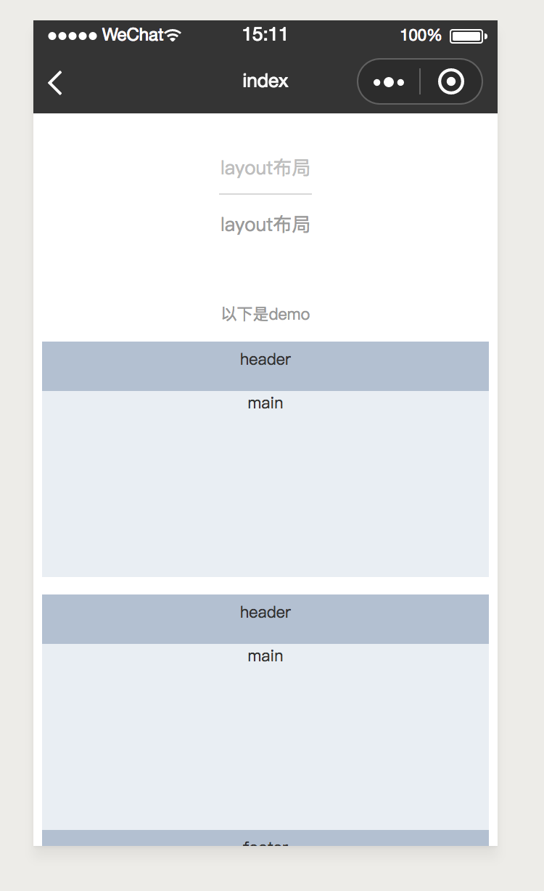
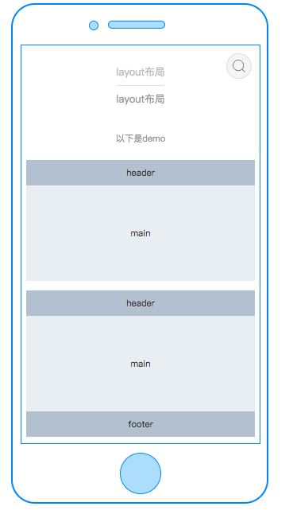
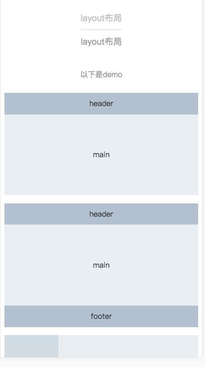

# container

---

### 示例

```html
<template>
  <view class="container">
    <scroller height="{{-1}}">
      <view class="title"><text>以下是demo</text></view>
      <!-- 1 -->
      <view class="container-wrap">
        <container direction="column">
          <head>
            <view class="container-item">
              <text>header</text>
            </view>
          </head>
          <main main-style="{{mainStyle}}">
            <view class="container-item">
              <text>main</text>
            </view>
          </main>
        </container>
      </view>
      <!-- 2 -->
      <view class="container-wrap">
        <container direction="column">
          <head>
            <view class="container-item">
              <text>header</text>
            </view>
          </head>
          <main main-style="{{mainStyle}}">
            <view class="container-item">
              <text>main</text>
            </view>
          </main>
          <foot>
            <view class="container-item">
              <text>footer</text>
            </view>
          </foot>
        </container>
      </view>
      <!-- 3 -->
      <view class="container-wrap">
        <container direction="row">
          <aside aside-style="{{asideStyle}}">
            <view class="container-item">
              <text>aside</text>
            </view>
          </aside>
          <main main-style="{{mainStyle}}" style="flex:1;">
            <view class="container-item">
              <text>main</text>
            </view>
          </main>
        </container>
      </view>
      <!-- 4 -->
      <view class="container-wrap">
        <container direction="column">
          <head>
            <view class="container-item">
              <text>header</text>
            </view>
          </head>
          <container direction="row" style="flex:1;">
            <aside aside-style="{{asideStyle}}">
              <view class="container-item">
                <text>aside</text>
              </view>
            </aside>
            <main main-style="{{mainStyle}}" style="flex:1;">
              <view class="container-item">
                <text>main</text>
              </view>
            </main>
          </container>
        </container>
      </view>
      <!-- 5 -->
      <view class="container-wrap">
        <container direction="column">
          <head>
            <view class="container-item">
              <text>header</text>
            </view>
          </head>
          <container direction="row" style="flex:1;">
            <aside aside-style="{{'height:380cpx'}}">
              <view class="container-item">
                <text>aside</text>
              </view>
            </aside>
            <container direction="column" style="flex:1">
              <main main-style="{{mainStyle}}" style="flex:1;">
                <view class="container-item">
                  <text>main</text>
                </view>
              </main>
              <foot>
                <view class="container-item">
                  <text>foot</text>
                </view>
              </foot>
            </container>
          </container>
        </container>
      </view>
      <!-- 6 -->
      <view class="container-wrap">
        <container direction="row">
          <aside aside-style="{{'height:380cpx'}}">
            <view class="container-item">
              <text>aside</text>
            </view>
          </aside>
          <container direction="column" style="flex:1;">
            <head>
              <view class="container-item">
                <text>header</text>
              </view>
            </head>
            <main main-style="{{mainStyle}}" style="flex:1;">
              <view class="container-item">
                <text>main</text>
              </view>
            </main>
          </container>
        </container>
      </view>
      <!-- 7 -->
      <view class="container-wrap">
        <container direction="row">
          <aside aside-style="{{'height:460cpx'}}">
            <view class="container-item">
              <text>aside</text>
            </view>
          </aside>
          <container direction="column" style="flex:1;">
            <head>
              <view class="container-item">
                <text>header</text>
              </view>
            </head>
            <main main-style="{{mainStyle}}" style="flex:1;">
              <view class="container-item">
                <text>main</text>
              </view>
            </main>
            <foot>
              <view class="container-item">
                <text>footer</text>
              </view>
            </foot>
          </container>
        </container>
      </view>
    </scroller>
  </view>
</template>
<script>
  class CLayout {
    data = {
      headerTitle: 'layout布局',
      headerDesc: 'layout布局',
      asideStyle: 'height:300cpx;',
      headStyle: '',
      mainStyle: 'height:300cpx',
      footStyle: '',
    };
  }
  export default new CLayout();
</script>
<style scoped>
  .container-wrap {
    padding-bottom: 30cpx;
    padding-left: 15cpx;
    padding-right: 15cpx;
  }
  .container {
    position: absolute;
    top: 0;
    left: 0;
    right: 0;
    bottom: 0;
  }
  .container-item {
    flex: 1;
    display: flex;
    flex-direction: row;
    justify-content: center;
    align-items: center;
    font-size: 28cpx;
    color: #333;
  }
  .title {
    display: flex;
    flex-direction: row;
    justify-content: center;
    line-height: 88cpx;
    font-size: 28cpx;
    text-align: center;
    height: 88cpx;
    color: #999;
  }
</style>
<script cml-type="json">
  {
    "base": {}
  }
</script>
```

<div style="display: flex;flex-direction: row;justify-content: space-around; align-items: flex-end;">
  <div style="display: flex;flex-direction: column;align-items: center;">
    
    <text style="color: #fda775;font-size: 24px;">wx</text>
  </div>
  <div style="display: flex;flex-direction: column;align-items: center;">
    
    <text style="color: #fda775;font-size: 24px;">web</text>
  </div>
  <div style="display: flex;flex-direction: column;align-items: center;">
    
    <text style="color: #fda775;font-size: 24px;">native</text>
  </div>
</div>
