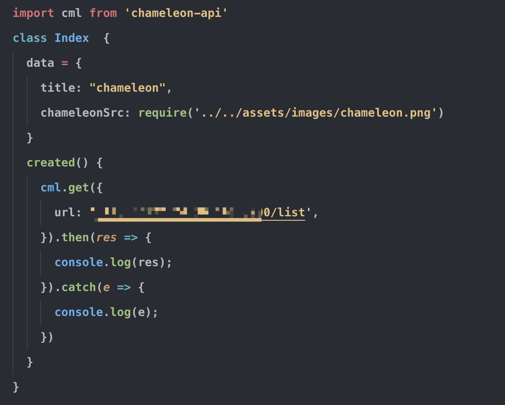
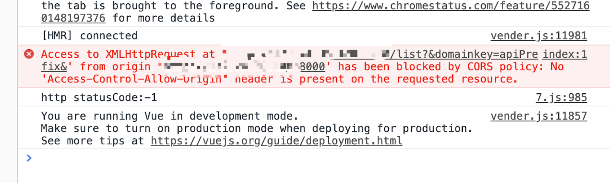
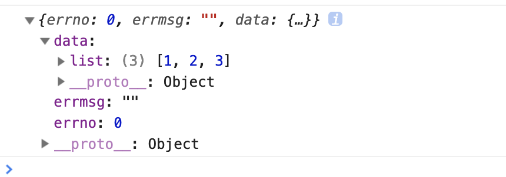

# 跨域请求解决方案

在前端开发中，跨域是一个老生常谈的问题，这篇文章将为你讲解 chameleon 开发中两种跨域请求解决办法。

## 通过 mock 转发请求

Chameleon 为了增强开发体验，提供 api mock 能力，可以模拟接口返回数据，在开发模式下，如果希望请求线上真实数据，通过 cml.get 方法直接请求接口则会遭遇跨域问题。这个时候只需要在 api mock 文件中加一层转发即可解决跨域问题。

这里以请求'/list'接口为例，不使用 mock 转发的代码如下：



此时可以在浏览器中看到如下报错：



在[数据 mock](../framework/mock.html)中已经详细介绍了 api mock 的工作原理，我们只需要在 api 的 mock 文件中增加相应的接口，然后把对服务端的接口请求移到 mock 接口的 controller 中即可，修改后代码如下：

```js
//index.cml
import cml from 'chameleon-api';
class Index {
  data = {
    title: 'chameleon',
    chameleonSrc: require('../../assets/images/chameleon.png'),
  };
  created() {
    cml
      .get({
        url: '/list',
      })
      .then((res) => {
        console.log(res);
      })
      .catch((e) => {
        console.log(e);
      });
  }
}

export default new Index();
```

```js
//mock/api.js
const http = require('http');
module.exports = [
  {
    method: ['get'],
    path: '/list',
    controller: function(req, res, next) {
      http.get('http://172.24.36.108:3000/list', (response) => {
        let data = '';
        response.setEncoding('utf8');
        response.on('data', (chunk) => (data += chunk));
        response.on('end', () => {
          res.json(JSON.parse(data));
        });
      });
    },
  },
];
```

浏览器中显示结果：



## api 配置跨域请求头

这个解决方案只需要在 api 的请求处理里面设置允许跨域的响应头即可。具体原理看[跨域资源共享](https://developer.mozilla.org/zh-CN/docs/Web/HTTP/Access_control_CORS)

下面是本地通过 express 创建的服务设置响应头代码示例：

```js
const express = require('express');
const app = express();

app.get('/list', (req, res) => {
  res.setHeader('access-control-allow-origin', 'http://172.24.36.108:8000'); // credentials为include时需指定地址，若希望设置为*，则需要在请求的地方设置credentials为omit
  res.setHeader('access-control-allow-methods', 'PUT,POST,GET,DELETE,OPTIONS');
  res.setHeader('access-control-allow-credentials', true);
  res.json({
    errno: 0,
    errmsg: '',
    data: {
      list: [1, 2, 3],
    },
  });
});

app.listen(3000, () => console.log('Example app listening on port 3000!'));
```

设置之后即可直接请求线上 api 接口。

## 其他

如果服务器端有针对 web 端做 jsonp 的处理也可以直接使用 jsonp 的请求方式。

## 相关资料

[chameleon-api 请求中设置 credentials](../api/request.html)
