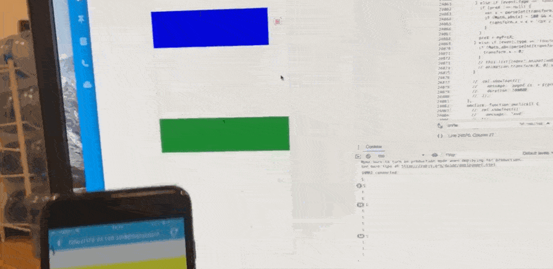
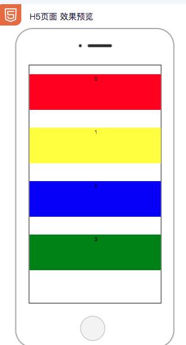

# 手把手教你系列- 卡片拖拽手势删除效果

## 背景介绍

手势效果是终端开发的常见需求，这篇文章手把手教你如何快速实现一个手势功能。
最终效果


## 项目初始化

新建一个项目 `demo-gesture`

```bash
cml init project
```

进入项目

```bash
cd demo-gesture
```

## 设计数据结构

我们要做一个列表，所以先设计一个数据结构如下：

```javascript
data = {
  list: [
    {
      // 用作样式名称
      className: 'inner-first',
      // 用作元素位置偏移
      transform: {
        y: 0,
        x: 0,
      },
    },
  ],
};
```

写进`/src/pages/index/index.cml`文件里面逻辑层 JS 代码里面

```html
<script>
  class Index {
    data = {
      list: [
        {
          className: 'inner-first',
          transform: {
            y: 0,
            x: 0,
          },
        },
        {
          className: 'inner-second',
          transform: {
            y: 0,
            x: 0,
          },
        },
        {
          className: 'inner-third',
          transform: {
            y: 0,
            x: 0,
          },
        },
        {
          className: 'inner-fouth',
          transform: {
            y: 0,
            x: 0,
          },
        },
      ],
    };
    methods = {};
  }

  export default new Index();
</script>
```

## 书写 CML 使用数据

我们查看[CML 文档使用列表渲染](../view/iterator.html)，

写进`/src/pages/index/index.cml`文件里面 CML 代码

```html
<template>
  <view class="wrapper">
    <view
      c-for="{{list}}"
      c-for-index="idx"
      c-for-item="itemName"
      data-index="{{idx}}"
      class="box {{itemName.className}}"
      style="transform: translate({{itemName.transform.x}}, 0);"
    >
      <text class="txt">{{idx}}</text>
      <view class="remove-btn" data-index="{{idx}}">
        <text class="rm">删</text>
      </view>
    </view>
  </view>
</template>
```

## 书写 CMSS

查看 CMSS 文档，CMSS 针对多端情况只能使用 flex 给页面布局，

```css
.wrapper {
  flex-direction: col;
  justify-content: space-around;
  height: 1200cpx;
}
.inner-first {
  background: red;
}
.inner-second {
  background: yellow;
}
.inner-third {
  background: blue;
}
.inner-fouth {
  background: green;
}
.box {
  height: 200cpx;
}
.txt {
  text-align: center;
  line-height: 50cpx;
  height: 50cpx;
}
.remove-btn {
  height: 50cpx;
  width: 50cpx;
  border: 1px solid hotpink;
  font-size: 10cpx;
  border-radius: 50cpx;
  transform: translate(780cpx, 0);
}
.rm {
  text-align: center;
  line-height: 50cpx;
  color: hotpink;
}
```

目前三端效果展现如下



## 添加手势

我们查看[事件绑定文档](../view/event.html)

给 box 元素添加事件绑定：

```html
c-bind:touchstart="eventhandler" c-bind:touchmove="eventhandler" c-bind:touchend="eventhandler"
```

添加事件回调函数

```javascript
methods = {
  eventHandler(event) {
    // 获取当前手指位置
    let myPreX = event.changedTouches[0].pageX;
    // 获取当前手指所触摸的Item元素
    let index = event.currentTarget.dataset.index;
    // 获取当前手指所触摸的Item元素的偏移值
    let transform = this.list[index].transform;
    if (index >= this.list.length) {
      return;
    }
    console.log(index);
    // 手指触摸开始时将上一个X方向偏移设为null
    if (event.type == 'touchstart') {
      preX = null;
    } else if (event.type == 'touchmove') {
      if (preX !== null) {
        let x = parseInt(transform.x) + myPreX - preX;
        //x < 0 当手指往右滑动时不允许移动滑块
        // > 100 当手指往左滑动超过100时不允许滑动滑块
        if (Math.abs(x) < 100 && x < 0) {
          //数据驱动视图更改
          transform.x = x + 'cpx';
        }
      }
      // 保存最后的位置
      preX = myPreX;
    } else if (event.type == 'touchend') {
      if (Math.abs(parseInt(transform.x)) < 90) {
        transform.x = 0;
      }
    }
  },
};
```

添加删除按钮事件回调函数

给 remove-btn 元素添加事件绑定：

```html
c-bind:click="onRemove"
```

```javascript
methods = {
  onRemove(e) {
    let index = e.currentTarget.dataset.index;
    this.list.splice(index, 1);
  },
};
```

`/src/pages/index/index.cml` 最终全部代码如下：

```html
<template>
  <view class="wrapper">
    <view
      c-for="{{list}}"
      c-for-index="idx"
      c-for-item="itemName"
      data-index="{{idx}}"
      class="box {{itemName.className}}"
      style="transform: translate({{itemName.transform.x}}, 0);"
      c-bind:touchstart="eventHandler"
      c-bind:touchmove="eventHandler"
      c-bind:touchend="eventHandler"
    >
      <text class="txt">{{idx}}</text>
      <view class="remove-btn" c-bind:click="onRemove" data-index="{{idx}}">
        <text class="rm">删</text>
      </view>
    </view>
  </view>
</template>

<script>
  let preX = null;
  class Index {
    data = {
      list: [
        {
          className: 'inner-first',
          transform: {
            y: 0,
            x: 0,
          },
        },
        {
          className: 'inner-second',
          transform: {
            y: 0,
            x: 0,
          },
        },
        {
          className: 'inner-third',
          transform: {
            y: 0,
            x: 0,
          },
        },
        {
          className: 'inner-fouth',
          transform: {
            y: 0,
            x: 0,
          },
        },
      ],
    };
    methods = {
      eventHandler(event) {
        // 获取当前手指位置
        let myPreX = event.changedTouches[0].pageX;
        // 获取当前手指所触摸的Item元素
        let index = event.currentTarget.dataset.index;
        // 获取当前手指所触摸的Item元素的偏移值
        if (index >= this.list.length) {
          return;
        }
        console.log(index);
        let transform = this.list[index].transform;
        // 手指触摸开始时将上一个X方向偏移设为null
        if (event.type == 'touchstart') {
          preX = null;
        } else if (event.type == 'touchmove') {
          if (preX !== null) {
            let x = parseInt(transform.x) + myPreX - preX;
            //x < 0 当手指往右滑动时不允许移动滑块
            // > 100 当手指往左滑动超过100时不允许滑动滑块
            if (Math.abs(x) < 100 && x < 0) {
              //数据驱动视图更改
              transform.x = x + 'cpx';
            }
          }
          // 保存最后的位置
          preX = myPreX;
        } else if (event.type == 'touchend') {
          if (Math.abs(parseInt(transform.x)) < 90) {
            transform.x = 0;
          }
        }
      },
      onRemove(e) {
        let index = e.currentTarget.dataset.index;
        this.list.splice(index, 1);
      },
    };
  }

  export default new Index();
</script>
<style scoped>
  .wrapper {
    flex-direction: col;
    justify-content: space-around;
    height: 1200cpx;
  }
  .inner-first {
    background: red;
  }
  .inner-second {
    background: yellow;
  }
  .inner-third {
    background: blue;
  }
  .inner-fouth {
    background: green;
  }
  .box {
    height: 200cpx;
  }
  .txt {
    text-align: center;
    line-height: 50cpx;
    height: 50cpx;
  }
  .remove-btn {
    height: 50cpx;
    width: 50cpx;
    border: 1px solid hotpink;
    font-size: 10cpx;
    border-radius: 50cpx;
    transform: translate(780cpx, 0);
  }
  .rm {
    text-align: center;
    line-height: 50cpx;
    color: hotpink;
  }
</style>
<script cml-type="json">
  {
  }
</script>
```

最终不到 150 行代码实现三端拖拽效果：

