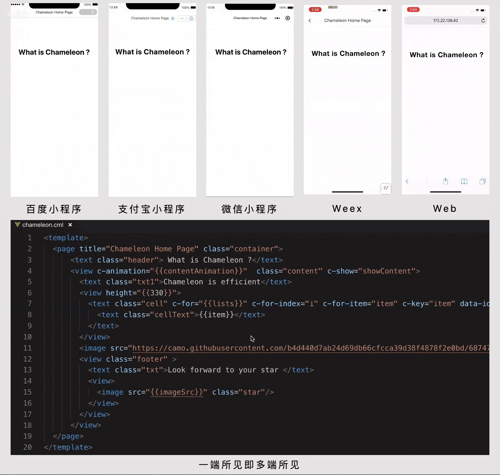

# cml 迁移指南(CML Migrate Guide)



`cml` 作为真正让一套代码运行多端的框架，提供标准的 MVVM 模式，统一开发各类终端。

同时，拥有各端独立的 `运行时框架(runtime)`、`数据管理(store)`、`组件库(ui)`、`接口(api)`。

此外，`cml`在跨端`能力加强`、`能力统一`、`表现一致`等方面做了许多工作。

今天，为了让大家的项目优雅升级，快速接入，给你带来一份丰盛的**cml 迁移指南**~

## 目录结构

和微信小程序一样，`cml` 包含一个描述整体程序的 `app` 和多个描述各自页面的 `page`。

#### 小程序目录结构

```javascript
.
├── components // 包含各个组件
├── pages // 包含各个页面
├── app.js  // 应用启动入口
├── app.json // 全局配置
├── app.wxss // 全局样式
└── project.config.json // 项目配置文件

```

#### cml 目录结构

```javascript
.
├── dist // 各个端构建结果
│   ├── tt
│   ├── qq
│   ├── alipay
│   ├── baidu
│   ├── wx
│   ├── web
│   ├── weex
│   └── config.json // 跨端配置map映射表
├── node_modules // 第三方库
├── mock // 模拟 接口数据 和 模板数据
├── src  // 源代码开发目录
│   ├── app // 应用启动入口
│   ├── assets // 静态资源
│   ├── components // 包含组件
│   ├── pages  // 包含页面
│   ├── store //数据管理
│   └── router.config.json // 路由配置文件
├── chameleon.config.js // 项目配置文件
└── package.json // npm包配置文件

```

## 如何修改配置

在小程序项目里面，分为：

#### [小程序 —— 项目配置](https://developers.weixin.qq.com/miniprogram/dev/devtools/projectconfig.html)

可以在项目根目录使用 `project.config.json` 文件对项目进行配置。

**配置示例：**

```json
{
  "miniprogramRoot": "./src",
  "debugOptions": {}
}
```

#### [小程序 —— 全局配置](https://developers.weixin.qq.com/miniprogram/dev/framework/config.html#%E5%85%A8%E5%B1%80%E9%85%8D%E7%BD%AE)

小程序根目录下的 `app.json` 文件用来对微信小程序进行全局配置，决定页面文件的路径、窗口表现、设置网络超时时间、设置多 tab 等

**配置示例：**

```json
{
  "pages": ["pages/index/index", "pages/logs/index"],
  "window": {
    "navigationBarTitleText": "Demo"
  },
  "networkTimeout": {
    "request": 10000,
    "downloadFile": 10000
  }
}
```

#### [小程序 —— 页面配置](https://developers.weixin.qq.com/miniprogram/dev/framework/config.html#%E9%A1%B5%E9%9D%A2%E9%85%8D%E7%BD%AE)

每一个小程序页面也可以使用 `.json` 文件来对本页面的窗口表现进行配置。

页面的配置只能设置 `app.json` 中部分 `window` 配置项的内容，页面中配置项会覆盖 `app.json` 的 `window` 中相同的配置项。

**配置示例：**

```json
{
  "navigationBarBackgroundColor": "#ffffff",
  "navigationBarTextStyle": "black",
  "navigationBarTitleText": "微信接口功能演示",
  "backgroundColor": "#eeeeee",
  "backgroundTextStyle": "light"
}
```

同样，在 `cml`项目里面，分为：

#### [cml —— 项目配置](https://cmljs.org/doc/framework/config.html)

`chameleon.config.js` 为项目的配置文件，你可以定制化构建，比如是否带 hash，是否  压缩等等。

**配置示例：**

```javascript
// 设置静态资源的线上路径
const publicPath = '//www.static.chameleon.com/static';
// 设置api请求前缀
const apiPrefix = 'https://api.chameleon.com';
// 合并配置
cml.config.merge({
  wx: {
    build: { apiPrefix },
  },
  alipay: {
    build: { apiPrefix },
  },
  baidu: {
    build: { apiPrefix },
  },
  web: {
    dev: {
      hot: true,
      console: true,
    },
    build: {
      publicPath: `${publicPath}/web`,
      apiPrefix,
    },
  },
  weex: {
    build: {
      publicPath: `${publicPath}/weex`,
      apiPrefix,
    },
  },
});
```

#### cml —— 全局配置

`cml` 项目 `app` 目录下的 `app.cml` 文件的 `<script cml-type="json" />` 用来对 `cml`应用 进行全局配置，具有 跨端配置 和 差异化 的能力

**配置示例：**

```html
<script cml-type="json">
  {
    "base": {
      "window": {
        "navigationBarTitleText": "各个端共同title",
      },
      "permission": {
        "scope.userLocation": {
          "desc": "你的位置信息将用于小程序位置接口的效果展示"
        }
      }
    },
    "wx": {
      "window": {
        "backgroundTextStyle":"light",
        "navigationBarBackgroundColor": "#fff",
        "navigationBarTitleText": "差异化 title",
        "navigationBarTextStyle":"black"
      }
    },
    "baidu": {
      "window": {
        "backgroundTextStyle": "light"
      }
    },
    "alipay": {
        "window": {
          "defaultTitle": "Chameleon"
        }
    }
  }
</script>
```

#### [cml —— 页面/组件配置](https://cmljs.org/doc/framework/json.html)

通过 `usingComponents` 配置 `组件路径` 注册引用的组件。

**配置示例：**

```html
<script cml-type="json">
  {
    "base": {
      "usingComponents": {
        "navi": "/components/navi/navi",
        "navi-npm": "cml-test-ui/navi/navi"
      }
    },
    "wx": {
    },
    "alipay": {
    },
    "baidu": {
    },
    "web": {
    },
    "weex": {
    }
  }
</script>
```

### 如何使用路由能力

#### 小程序配置路由

[app.json](https://developers.weixin.qq.com/miniprogram/dev/framework/config.html) 配置项列表的 `pages` 字段用于指定小程序由哪些页面组成，每一项都对应一个页面的 `路径+文件名` 信息。

**数组的第一项代表小程序的初始页面（首页）。新增/减少页面，需要对 `pages` 数组进行修改。**

如果项目有 `pages/index/index.wxml`、`pages/logs/logs.wxml` 两个页面，则需要在 `app.json` 中写

```json
{
  "pages": ["pages/index/index", "pages/logs/logs"]
}
```

#### cml 配置路由

[src/router.config.json](https://cmljs.org/doc/framework/router.html) 是路由的配置文件，`cml` 内置了一套各端统一的路由管理方式。相应有 `cml` 路由配置映射如下：

```javascript
{
  "mode": "history",
  "domain": "https://www.chameleon.com",
  "routes":[
    {
      "url": "/cml/h5/index",
      "path": "/pages/index/index",
      "mock": "index.php"
    },
    {
      "url": "/cml/h5/logs",
      "path": "pages/logs/logs",
      "mock": "logs.php"
    }
  ]
}
```

文件名不需要写文件后缀，`cml`框架会自动去寻找对于位置的 `.cml` 文件进行处理。

#### 小程序使用路由

- 打开新页面：调用 API [wx.navigateTo](https://developers.weixin.qq.com/miniprogram/dev/api/wx.navigateTo.html)
- 页面重定向：调用 API [wx.redirectTo](https://developers.weixin.qq.com/miniprogram/dev/api/wx.redirectTo.html)
- 页面返回：调用 API [wx.navigateBack](https://developers.weixin.qq.com/miniprogram/dev/api/wx.navigateBack.html)
- 打开另一个小程序：调用 API [wx.navigateToMiniProgram](https://developers.weixin.qq.com/miniprogram/dev/api/wx.navigateToMiniProgram.html)
- 返回到上一个小程序：调用 API [wx.navigateBackMiniProgram](https://developers.weixin.qq.com/miniprogram/dev/api/wx.navigateBackMiniProgram.html)

#### cml 使用路由

依据统一资源索引 URI，自适应打开不同环境同一路由 PATH：

- 打开新页面：调用 chameleon-api [cml.navigateTo](https://cmljs.org/doc/api/navigate.html)
- 页面重定向：调用 chameleon-api [cml.redirectTo](https://cmljs.org/doc/api/navigate.html#redirectto)
- 页面返回：调用 chameleon-api [cml.navigateBack](https://cmljs.org/doc/api/navigate.html#navigateback)
- 打开另一个跨端应用：调用 chameleon-api [cml.open](https://cmljs.org/doc/api/open.html)
- 返回到上一个跨端应用：调用 chameleon-api [cml.close](https://cmljs.org/doc/api/open.html#close)

## 如何注册

### 如何注册程序

#### 小程序注册程序

在小程序项目里面，`App()` 函数用来注册一个小程序。接受一个 `Object` 参数，其指定小程序的生命周期回调等。

**示例代码**

```javascript
App({
  onLaunch(options) {
    // Do something initial when launch.
  },
  globalData: 'I am global data',
});
```

#### cml 注册程序

**示例代码**

```html
<script>
  import store from '../store/index.js';
  import routerConfig from '../router.config.json';

  class App {
    data = {
      store,
      routerConfig,
    };
    created(res) {}
  }

  export default new App();
</script>
```

细心的你会发现，

小程序中`app.json app.js app.wxss`和 `src/app/app.cml`的对应关系如下

| 小程序 app.js | cml 项目 src/app/app.cml            |
| ------------- | ----------------------------------- |
| app.js        | `<script></script>`                 |
| app.wxss      | `<style></style>`                   |
| app.json      | `<script cml-type="json"></script>` |

### 如何注册页面

#### 小程序注册页面

在小程序项目里面，`Page(Object)` 函数用来注册一个页面。接受一个 `Object` 类型参数，其指定页面的初始数据、生命周期回调、事件处理函数等。

**示例代码：**

```javascript
// index.js
Page({
  data: {
    text: 'This is page data.',
  },
  changeText: function(e) {
    // sent data change to view
    this.setData({
      text: 'CML',
    });
  },
});
```

#### cml 注册页面

**示例代码**

```html
<script>
  class Index {
    data = {
      text: 'Chameleon',
    };
    methods = {
      changeText: function(e) {
        // sent data change to view
        this.text = 'CML';
      },
    };
    computed = {};
    watch = {};
  }
  export default new Index();
</script>
```

### 如何注册组件

#### 小程序注册组件

在小程序项目里面，
`Component(Object)` 构造器可用于定义组件，调用 `Component` 构造器时可以指定组件的属性、数据、方法等。

**示例代码**

```javascript
Component({
  properties: {
    myProperty: {
      // 属性名
      type: String, // 类型（必填）
      value: '', // 属性初始值（可选）
    },
    myProperty2: String, // 简化的定义方式
  },
  data: {
    text: '',
  }, // 私有数据，可用于模板渲染

  // 生命周期函数，可以为函数，或一个在methods段中定义的方法名
  attached() {},
  ready() {},
  methods: {
    onMyButtonTap() {
      this.setData({
        // 更新属性和数据的方法与更新页面数据的方法类似
        text: 'wx',
      });
    },
  },
});
```

#### cml 注册组件

**示例代码**

```html
<script>
  class MyComponent {
    props = {
      myProperty: {
        // 属性名
        type: String, // 类型（必填）
        default: '', // 属性初始值（可选）
      },
      myProperty2: String, // 简化的定义方式
    };
    data = {
      text: '',
    }; // 私有数据，可用于模板渲染

    beforeMount() {}
    mounted() {}
    methods = {
      onMyButtonTap() {
        this.text = 'cml';
      },
    };
    computed = {};
    watch = {};
  }
  export default new MyComponent();
</script>
```

## 如何声明生命周期

统一各端应用生命周期的定义，是跨端框架的重要组成，也是迁移的必经之路。

#### 小程序声明生命周期

可以在 `App(Object)`、`Page(Object)`、`Component(Object)` 传入`Object`参数，其指定小程序的生命周期回调等

**代码示例**

```javascript
// index.js
Page({
  onLoad(options) {
    // Do some initialize when page load.
  },
  onReady() {
    // Do something when page ready.
  },
  onShow() {
    // Do something when page show.
  },
  onHide() {
    // Do something when page hide.
  },
  onUnload() {
    // Do something when page close.
  },
  onShareAppMessage() {
    // return custom share data when user share.
  },
});
```

#### cml 声明生命周期

在`.cml` 文件 `<script />` 代码块返回的对象实例，其指定生命周期回调

**示例代码**

```html
<script>
  class Index {
    beforeCreate(query) {
      // data数据挂载到this根节点上之前，以及methods所有方法挂载到实例根节点之前
      // 注意：只用页面的 beforeCreate钩子 会返回页面query
      console.log('App beforeCreate: 打开当前页面路径中的参数是 ', query);
    }
    created() {
      // data,methods里面的这些events挂载完成
      console.log('App created');
    }
    beforeMount() {
      // 开始挂载已经编译完成的cml到对应的节点时
      console.log('App beforeMount');
    }
    mounted() {
      // cml模板编译完成,且渲染到dom中完成,在整个生命周期中只执行一次
      console.log('App mounted');
    }
    beforeDestroy() {
      // 实例销毁前
      console.log('App beforeDestroy');
    }
    destroyed() {
      // 实例销毁后
      console.log('App destroyed');
    }
  }
  export default new Index();
</script>
```

### App 生命周期 映射

小程序 `app.js`中的生命周期 -> cml `src/app/app.cml`

| 小程序   | chameleon    |
| -------- | ------------ |
| onLaunch | beforeCreate |
| onShow   | mounted      |
| onHide   | destroyed    |

### Page 生命周期 映射

小程序 `Page()`中的生命周期 -> cml `src/pages/mypage/mypage.cml`

| 小程序            | chameleon                                                                          |
| ----------------- | ---------------------------------------------------------------------------------- |
| onLoad            | beforeCreate                                                                       |
| onShow            | mounted                                                                            |
| onUnload          | destroyed                                                                          |
| onReady           | <a href="https://cmljs.org/doc/logic/lifecycle.html#生命周期多态">生命周期多态</a> |
| onHide            | <a href="https://cmljs.org/doc/logic/lifecycle.html#生命周期多态">生命周期多态</a> |
| onShareAppMessage | <a href="https://cmljs.org/doc/logic/lifecycle.html#生命周期多态">生命周期多态</a> |

### Component 生命周期 映射

小程序 `Component()`中的生命周期 -> cml `src/components/mycomponent/mycomponent.cml`

| 小程序   | chameleon   |
| -------- | ----------- |
| created  | created     |
| attached | beforeMount |
| ready    | mounted     |
| detached | destroyed   |

### 生命周期总结

每个 `cml` 实例(`App`、`Page`、`Component`)在被创建时都要经过一系列的初始化过程 ————

例如，需要设置数据监听、编译模板、将实例挂载到 `CML节点` 并在数据变化时更新 `CML节点` 等。同时在这个过程中也会运行一些叫做生命周期钩子的函数，这给开发者在不同阶段添加自己的代码的机会。

`cml` 为`App`、`页面Page`、`组件Component` 提供了一系列生命周期事件，保障应用有序执行。

另外，如果你想使用某个端特定的生命周期，你可以从业务出发使用 [生命周期多态](https://cmljs.org/doc/logic/lifecycle.html#%E7%94%9F%E5%91%BD%E5%91%A8%E6%9C%9F%E5%A4%9A%E6%80%81)。

## 数据如何响应到视图

如今，双向数据绑定&单向数据流 已深入开发者日常，MVMM 开发模式算是框架标配。

[数据绑定](https://cmljs.org/doc/view/databind.html)、[条件渲染](https://cmljs.org/doc/view/condition.html)、[列表渲染](https://cmljs.org/doc/view/iterator.html) 是如何书写的呢？

**示例代码**

#### 小程序使用数据响应

```html
<!--wxml-->
<view class="scroller-wrap">
  <!--数据绑定-->
  <view>{{message}}</view>
  <!--条件渲染-->
  <view wx:if="{{view == 'WEBVIEW'}}">WEBVIEW</view>
  <view wx:elif="{{view == 'APP'}}">APP</view>
  <view wx:else="{{view == 'MINA'}}">MINA</view>
  <!--列表渲染-->
  <view wx:for="{{array}}" wx:for-index="index" wx:for-item="item">{{item}}</view>
</view>
```

```javascript
// page.js
Page({
  data: {
    message: 'Hello MINA!',
    view: 'MINA',
    array: [1, 2, 3, 4, 5],
  },
  onLoad() {
    this.setData({
      message: 'wx',
    });
  },
});
```

#### cml 使用数据响应

```html
<template>
  <!--index.cml-->
  <view class="scroller-wrap">
    <!--数据绑定-->
    <view>{{message}}</view>
    <!--条件渲染-->
    <view c-if="{{view == 'WEBVIEW'}}">WEBVIEW</view>
    <view c-else-if="{{view == 'APP'}}">APP</view>
    <view c-else="{{view == 'MINA'}}">MINA</view>
    <!--列表渲染-->
    <view c-for="{{array}}" c-for-index="index" c-for-item="item">{{item}}</view>
  </view>
</template>
<script>
  class Index {
    data = {
      message: 'Hello MINA!',
      view: 'MINA',
      array: [1, 2, 3, 4, 5],
    };

    beforeCreate() {
      this.message = 'cml';
    }
  }
  export default new Index();
</script>
```

### 数据响应总结

`cml`运行时框架 提供了跨端响应式数据绑定系统(Data binding)，当做数据修改的时候，只需要在逻辑层修改数据，视图层就会做相应的更新。

只需要将 `view<-->model` 交互部分逻辑，作简单迁移，便可使它成为跨多端的数据响应系统。

## 事件交互

`cml` 支持一些基础的[事件](https://cmljs.org/doc/view/event.html)，保障各端效果(`类型`、`绑定`、`事件对象`)一致运行。

**示例代码**

#### 小程序使用事件

```html
<!--wxml-->
<view id="tapTest" data-hi="WeChat" bindtap="tapName">Click me!</view>
```

```javascript
// page.js
Page({
  tapName(event) {
    console.log(event);
  },
});
```

#### cml 使用事件

```html
<template>
  <view id="tapTest" data-hi="WeChat" c-bind:tap="tapName">
    <text>Click me!</text>
  </view>
</template>
<script>
  class Index {
    methods = {
      tapName(e) {
        // 打印事件对象
        console.log('事件对象:', e);
      },
    };
  }
  export default new Index();
</script>
```

### 事件使用总结

同时，还支持[自定义事件](#如何实现父子组件事件通信)，用于父子组件之间的通信。

另外，如果你想要使用某个端特定的事件，`cml` 并不会限制你的自由发挥，你可以从业务出发使用 [组件多态](https://cmljs.org/doc/framework/polymorphism/component.html) 或者 [接口多态](https://cmljs.org/doc/framework/polymorphism/api.html) 差异化实现功能。

## 布局和外观

各端描述 `布局和外观` 的[层叠样式表(CSS)](https://www.w3.org/Style/CSS/)实现存在差异，包括不限于 `布局`、`盒模型`、`定位`、`文本`。

所以， `cml` 框架内置[跨端一致性基础样式](https://cmljs.org/doc/view/cmss/base_style.html)能力。

并且，定义了用于描述页面的样式规范[CMSS(Chameleon Style Sheet)](https://cmljs.org/doc/view/cmss.html)。

### 如何导入外部样式

使用 `@import` 语句可以导入外联样式表，`@import` 后跟需要导入的外联样式表的相对路径，用 `;` 表示语句结束。

#### 小程序导入外部样式

**示例代码：**

```css
/** common.wxss **/
.small-p {
  padding: 5px;
}
```

```css
/** app.wxss **/
@import 'common.wxss';
.middle-p {
  padding: 15px;
}
```

#### cml 导入外部样式

[详细文档](https://cmljs.org/doc/api/runtime/@import.html)

**示例代码：**

```css
/** common.css **/
.small-p {
  padding: 5px;
}
```

```html
<!-- app.cml -->
<style>
  @import './common.css';
  .middle-p {
    padding: 15 cpx;
  }
</style>
```

### 样式使用总结

同时，为了统一多端尺寸单位，呈现效果一致，同时页面响应式布局，`cml` 项目统一采用 [cpx](https://cmljs.org/doc/view/cmss/unit.html) 作为尺寸单位，规定以屏幕 750px（占满屏幕）视觉稿作为标准。

而且，各端样式表拥有的能力 [不尽相同](https://cmljs.org/doc/example/web_wx.html)，是项目迁移的主要阵地之一。

另外，如果你想要使用某个端特定的样式能力，`cml` 并不会限制你的自由发挥，你可以从业务出发使用 [样式多态](https://cmljs.org/doc/view/cmss/css_diff.html)

**注意：由于 chameleon 应用是 跨多端`web native 小程序`框架，如果需要跨`native`，必须使用 [flexbox](https://cmljs.org/doc/view/cmss/layout.html) 进行样式布局！！！**

## 组件

`cml` 项目一切皆组件。组件(Component)是视图的基本组成单元。

框架为开发者提供了一系列[基础组件](https://cmljs.org/doc/view/base_component.html)，开发者可以通过组合这些[基础组件](https://cmljs.org/doc/view/base_component.html)进行快速开发。

如：

```html
<template>
  <view>
    <view>view 基础组件</view>
    <text>text 基础组件</text>
  </view>
</template>
```

同时，`cml` 支持简洁的组件化编程。

### 自定义组件

开发者可以将页面内的功能模块抽象成自定义组件，以便在不同的页面中重复使用。自定义组件在使用时与基础组件非常相似。

#### 如何创建自定义组件

##### 小程序创建自定义组件

**代码示例：**

```javascript
Component({
  properties: {
    // 这里定义了innerText属性，属性值可以在组件使用时指定
    innerText: {
      type: String,
      value: 'default value',
    },
  },
  data: {
    // 这里是一些组件内部数据
    someData: {},
  },
  methods: {
    // 这里是一个自定义方法
    customMethod() {},
  },
});
```

##### cml 创建自定义组件

**示例代码**

```html
<script>
  class MyComponent {
    props = {
      // 这里定义了innerText属性，属性值可以在组件使用时指定
      innerText: {
        type: String,
        value: 'default value',
      },
    };
    data = {
      // 这里是一些组件内部数据
      someData: {},
    };
    methods = {
      // 这里是一个自定义方法
      customMethod() {},
    };
    computed = {};
    watch = {};
  }
  export default new MyComponent();
</script>
```

#### 如何使用自定义组件

使用已注册的自定义组件前，首先要进行引用声明。此时需要提供每个自定义组件的标签名和对应的自定义组件文件路径。

##### 小程序使用自定义组件

**代码示例：**

在 `page.json` 中进行引用声明

```json
{
  "usingComponents": {
    "component-tag-name": "path/to/the/custom/component"
  }
}
```

在 `page.wxml` 中使用

```html
<view>
  <!-- 以下是对一个自定义组件的引用 -->
  <component-tag-name inner-text="Some text"></component-tag-name>
</view>
```

##### cml 使用自定义组件

**代码示例：**

在 `page.cml`中`<script cml-type='json' />`进行引用声明

```html
<script cml-type="json">
  {
    "base": {
        "usingComponents": {
          "component-tag-name": "path/to/the/custom/component"
        }
    }
  }
</script>
```

在 `page.cml`中`<template />`使用

```html
<template>
  <view>
    <!-- 以下是对一个自定义组件的引用 -->
    <component-tag-name inner-text="Some text"></component-tag-name>
  </view>
</template>
```

#### 如何实现父子组件事件通信

事件系统是组件间通信的主要方式之一。自定义组件可以触发任意的[事件](https://cmljs.org/doc/view/event.html)，引用组件的页面可以监听这些事件。

##### 小程序组件通信

**代码示例：**

```html
<!-- 页面 page.wxml -->
<view>
  <my-component bindcustomevent="onMyEvent"></my-component>
</view>
```

```javascript
// 页面 page.js
Page({
  methods: {
    onMyEvent(e) {
      console.log(e.detail); // 自定义组件触发事件时提供的detail对象
    },
  },
});
```

```html
<!-- 组件 my-component.wxml -->
<view>
  <button bindtap="onTap">点击这个按钮将触发“myevent”事件</button>
</view>
```

```javascript
// 组件 my-component.js
Component({
  methods: {
    onTap() {
      this.triggerEvent('customevent', {}); // 触发 自定义组件事件
    },
  },
});
```

##### cml 组件通信

**代码示例：**

```html
<!-- 页面 page.cml -->
<template>
  <view>
    <my-component c-bind:customevent="onMyEvent"></my-component>
  </view>
</template>
<script>
  class Index {
    methods = {
      // 这里是一个自定义方法
      onMyEvent(e) {
        console.log(e.detail); // 自定义组件触发事件时提供的detail对象
      },
    };
  }
  export default new Index();
</script>
<script cml-type="json">
  {
    "base": {
        "usingComponents": {
          "my-component": "path/to/the/custom/component"
        }
    }
  }
</script>
```

```html
<!-- 页面 path/to/the/custom/component.cml -->
<template>
  <view>
    <button c-bind:tap="onTap">点击这个按钮将触发“myevent”事件</button>
  </view>
</template>
<script>
  class MyComponent {
    methods = {
      // 这里是一个自定义方法
      onTap() {
        this.$cmlEmit('customevent', {}); // 触发 自定义组件事件
      },
    };
  }
  export default new MyComponent();
</script>
<script cml-type="json">
  {
  }
</script>
```

### 组件使用总结

和小程序一样，`cml框架` 提供了大量[内置组件](https://cmljs.org/doc/component/base/base.html)和[扩展组件](https://cmljs.org/doc/component/expand/expand.html)，抹平多端差异，便于开发者通过组合这些组件，创建出强大的应用程序。

扩展组件需要额外引入。如：

```html
<script cml-type="json">
  {
    "base": {
        "usingComponents": {
          "c-dialog": "cml-ui/components/c-dialog/c-dialog"
        }
    }
  }
</script>
```

在执行 `cml build` 构建打包时，`cml 框架` 会按需打包引用的内置组件和扩展组件，为代码瘦身。

[内置组件](https://cmljs.org/doc/component/base/base.html)和[扩展组件](https://cmljs.org/doc/component/expand/expand.html) 都是支持跨多端的，对于一些没有提供的某个端的组件，可以通过[组件多态](https://cmljs.org/doc/framework/polymorphism/component.html)来实现。

如果希望使用小程序端的原生组件，那么可以在原生标签前加上 `origin-*`，`cml`框架会渲染原生组件[参考](https://cmljs.org/doc/framework/linter/cml-template.html#%08%E5%BC%95%E7%94%A8%E5%B9%B3%E5%8F%B0%E5%8E%9F%E7%94%9F%E7%BB%84%E4%BB%B6)

**注意：`origin-*` 只能在[灰度区文件](https://cmljs.org/doc/framework/polymorphism/component.html#webweexwxalipaybaiducml)中使用！！**

如在 `map.wx.cml` 文件中使用原生地图组件 `<map/>`：

```html
<!-- map.wx.cml -->
<template>
  <origin-map
    id="map"
    longitude="113.324520"
    latitude="23.099994"
    controls="{{controls}}"
    bindcontroltap="controltap"
    style="width: 100%; height: 300px;"
  ></origin-map>
</template>
```

## 如何调用平台接口能力

在小程序里面，可以通过微信原生 `API`，调起如获取用户信息，本地存储，支付功能等。

**示例代码**

```javascript
try {
  wx.setStorageSync('name', 'Hanks');
} catch (e) {
  console.error(e);
}
```

同样，在 cml 项目里面可以这样调用：

**示例代码**

```javascript
import cml from 'chameleon-api';
cml.setStorage('name', 'Hanks').then(
  (res) => {
    console.log(res);
  },
  function(e) {
    console.error(e);
  },
);
```

### 接口使用总结

`cml` 框架提供了丰富的多态接口，可以调起各端提供的原生能力，如系统信息、元素节点信息、动画效果、本地存储、网络请求、地理位置等。请参考 [API](https://cmljs.org/doc/api/api.html) 文档。

`chameleon-api`提供的接口都是支持跨多端的，对于一些没有提供的某个端的原生接口，可以通过[接口多态](https://cmljs.org/doc/framework/polymorphism/api.html?h=%E5%A4%9A%E6%80%81%E6%8E%A5%E5%8F%A3)来调用。

## 迁移总结

CML 作为一端代码运行多端的框架，所有接口设计都考虑的是具备跨端要求的设计，没有使用任何一端的接口设计规范，而是全新一套框架，所以不要”想当然“用微信小程序或者 vue 的接口来开发 CML。

例如，如果你是微信小程序开发者，当你想使用 `tabbar` 功能时，可能会在[app.json 里面配置](https://developers.weixin.qq.com/miniprogram/dev/framework/ability/custom-tabbar.html)，这是错误的，这是微信特有模式，只在微信里面有效。在 cml 中请使用 [c-tabbar](https://cml.js.org/doc/component/expand/compound/c-tabbar.html) 来实现，这样所有端都有效。

## 迁移实例

下面给出`各端(vue、weex、小程序)迁移cml指南` 以及 `cml 导出组件到各端指南`的具体迁移文档：

- [如何迁移一个 Vue 项目到 chameleon](https://cmljs.org/doc/example/web_to_chameleon.html)
- [如何迁移一个 Weex 项目到 chameleon](https://cmljs.org/doc/example/weex_to_chameleon.html)
- [如何迁移一个微信小程序到 chameleon](https://cmljs.org/doc/example/wx_to_chameleon.html)
- [普通项目使用 chameleon 跨端 dialog 组件](https://cmljs.org/doc/example/webpack_output.html)
