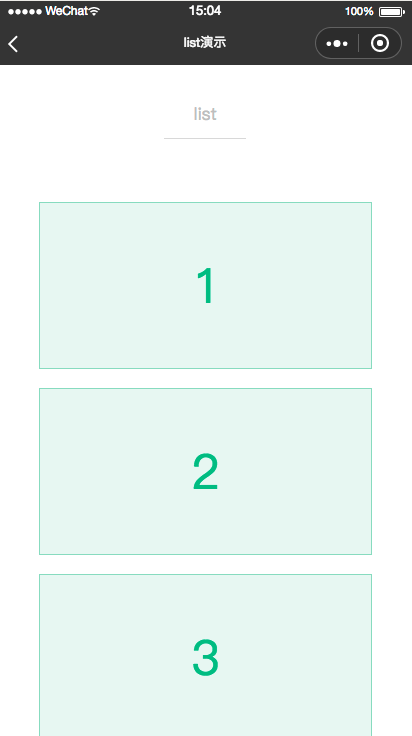
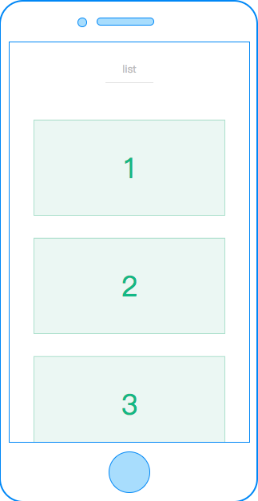

# list

---

可滚动长列表。

`<list>` 标签内可包含多条 `<cell>`，适合用于长列表的展示。

`<cell>` 使用文档 [cell](/component/base/content/cell.html)。

### 属性

<table>
  <tr>
    <th width="200px">属性名</th>
    <th>类型</th>
    <th width="60px">必填</th>
    <th>默认值</th>
    <th>说明</th>
  </tr>
  <tr>
    <td>height</td>
    <td>Number</td>
    <td>必传</td>
    <td>0</td>
    <td>定义滚动区域的高度</td>
  </tr>
  <tr>
    <td>bottom-offset</td>
    <td>Number</td>
    <td>否</td>
    <td>0</td>
    <td>距底部/右边多远时（单位cpx），触发 onBottom 事件</td>
  </tr>
  <tr>
    <td>c-bind:scrolltobottom</td>
    <td>EventHandle</td>
    <td>否</td>
    <td></td>
    <td>滚动到底部，会触发 scrolltobottom 事件
      <br/>
      返回事件对象：
      <br/>
      event.type= "scrolltobottom"
      <br/>
      event.detail = { direction }
    </td>
  </tr>
  <tr>
    <td>c-bind:onscroll</td>
    <td>EventHandle</td>
    <td>否</td>
    <td></td>
    <td>滚动时触发，
        <br/>
        返回事件对象：
        <br/>
        event.type = 'scroll'
        <br/>
        event.detail = {scrollLeft, scrollTop, scrollHeight, scrollWidth, deltaX, deltaY}
    </td>
  </tr>
</table>

### 限制

1. 不允许相同方向的 `<list>` 或者 `<scroller>` 互相嵌套，换句话说就是嵌套的 `<list>`/`<scroller>` 必须是不同的方向。

举个例子，不允许一个垂直方向的 `<list>` 嵌套的一个垂直方向的 `<scroller>` 中，但是一个垂直方向的 `<list>` 是可以嵌套的一个水平方向的 list 或者 `<scroller>` 中的。

### 示例

```html
<template>
  <view class="container">
    <list
      bottom-offset="{{bottomOffset}}"
      c-bind:scrolltobottom="onBottom"
      c-bind:onscroll="onScroll"
      height="{{winHeight}}"
    >
      <cell class="cell" c-for="{{lists}}" c-for-index="i" c-for-item="item" data-idx="{{i}}">
        <view class="panel">
          <text class="text">{{item}}</text>
        </view>
      </cell>
    </list>
  </view>
</template>

<script>
  import cml from 'chameleon-api';

  const LOADMORE_COUNT = 4;

  class List {
    data = {
      /**
       * list 配置 子元素必须是 cell 标签
       */
      bottomOffset: 20,
      lists: [1, 2, 3, 4, 5, 6, 7, 8, 9, 10],
      winHeight: 0,
    };
    mounted(res) {
      cml.getSystemInfo().then((info) => {
        this.winHeight = Number(info.viewportHeight);
      });
    }
    methods = {
      onBottom(e) {
        cml.showToast({
          message: 'loadmore',
          duration: 1000,
        });

        setTimeout(() => {
          const length = this.lists.length;
          for (let i = length; i < length + LOADMORE_COUNT; ++i) {
            this.lists.push(i + 1);
          }
        }, 800);
      },
      onScroll(e) {},
    };
  }

  export default new List();
</script>
<style scoped>
  .container {
    position: absolute;
    top: 88cpx;
    left: 0;
    right: 0;
    bottom: 0;
  }
  .panel {
    display: flex;
    width: 600cpx;
    height: 300cpx;
    margin-left: 75cpx;
    margin-top: 35cpx;
    margin-bottom: 35cpx;
    flex-direction: column;
    justify-content: center;
    border-width: 2cpx;
    border-style: solid;
    border-color: rgb(162, 217, 192);
    background-color: rgba(162, 217, 192, 0.2);
  }
  .text {
    font-size: 88cpx;
    text-align: center;
    color: #41b883;
  }
</style>

<script cml-type="json">
  {
    "base": {}
  }
</script>
```

<div style="display: flex;flex-direction: row;justify-content: space-around; align-items: flex-end;">
  <div style="display: flex;flex-direction: column;align-items: center;">
    
    <text style="color: #fda775;font-size: 24px;">wx</text>
  </div>
  <div style="display: flex;flex-direction: column;align-items: center;">
    
    <text style="color: #fda775;font-size: 24px;">web</text>
  </div>
  <div style="display: flex;flex-direction: column;align-items: center;">
    
    <text style="color: #fda775;font-size: 24px;">native</text>
  </div>
</div>

### 推荐使用

- 视窗为填满设备屏幕，示例如下

`<list>` 为根节点时无需设置高度，但是内嵌 `<list>` 高度必须可计算，你可以使用 flex 或 postion 将 `<list>` 设为一个响应式高度（例如全屏显示）, 也可以显式设置 `<list>` 组件的 height 样式。

```html
<view style="position:absolute;top: 0;left: 0;bottom: 0;right: 0;">
  <list>
    ...
  </list>
</view>
```

### Bug & Tip

1. `<list>`组件的父容器必须为可定位元素， `<list>`内容的布局由父容器决定。
2. `<list>` 中不可以使用 `<textarea>`、`<video>` 组件。
