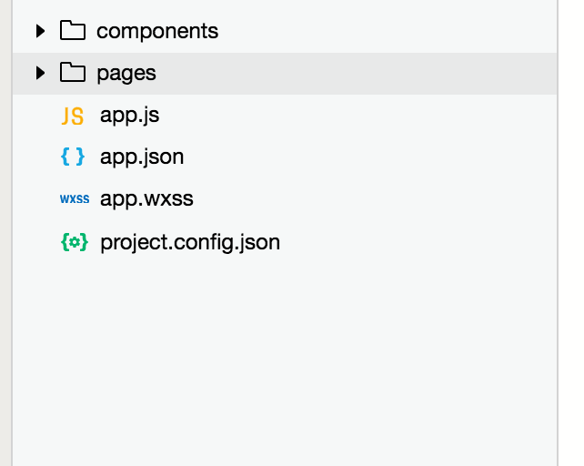
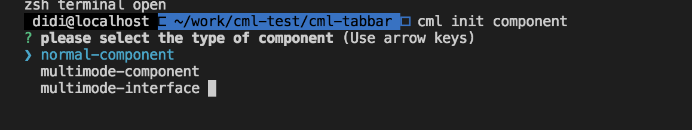

# 如何迁移一个微信小程序到 chameleon

## 1 迁移原则：

以小逻辑块为单位，对照老代码，以 cml 语法重写，报错可修正

这样可避免以下问题：

1、大块逻辑迁移会导致报错无法追查

2、直接 copy 会导致语法隐藏 bug 不可控（虽然 ide 没有问题，但真机调试出问题）

请尽量按照 cml 语法重写迁移，避免语法纠错浪费时间

#### 1.1 小程序多文件结构 -> cml 单文件页面

| 小程序   | chameleon                           |
| -------- | ----------------------------------- |
| xxx.wxml | `<template></template>`             |
| xxx.js   | `<script></script>`                 |
| xxx.wxss | `<style></style>`                   |
| xxx.json | `<script cml-type="json"></script>` |

## 2 项目初始化

```
cml init project

```

初始化后，cml 项目如下：


依具体情况 [配置构建平台](../framework/config.html?h=platforms) 和 [配置平台基础样式](./web_wx.html)

可修改 [chameleon.config.js](../framework/config.html?h=chameleon.config.js) 的 platforms 和 baseStyle 字段，如下：


假设有下面 👇 结构的小程序项目



pages 下包含各个页面，components 下包含各个组件代码

## 3 迁移 app.js、app.json

**小程序代码配置** [微信应用的配置](https://developers.weixin.qq.com/miniprogram/dev/framework/config.html#%E5%85%A8%E5%B1%80%E9%85%8D%E7%BD%AE)

app.json

```javascript
{
  "pages":[
    "pages/index1",
    "pages/index2",
    "pages/index3",
    "pages/index4",
  ],
  "window":{
    "backgroundTextStyle":"light",
    "navigationBarBackgroundColor": "#fff",
    "navigationBarTitleText": "WeChat",
    "navigationBarTextStyle":"black"
  }
}

```

### 3.1.0 迁移 app.json ———— 路由 pages 配置

以上小程序 `app.json` 中 `pages` 字段 -> `src/router.config.json` 中 `path` 字段

```javascript
{
  "mode": "history",
  "domain": "https://www.chameleon.com",
  "routes":[
    {
      "url": "/cml/h5/index",
      "path": "/pages/index1/index1",
      "name": "首页",
      "mock": "index.php"
    },
    {
      "url": "/cml/h5/inner-detail",
      "path": "/pages/index2/index2",
      "name": "首页",
      "mock": "index.php"
    },
    {
      "url": "/cml/h5/inner-home",
      "path": "/pages/index3/index3",
      "name": "首页",
      "mock": "index.php"
    },
    {
      "url": "/cml/h5/inner-my",
      "path": "/pages/index4/index4",
      "name": "首页",
      "mock": "index.php"
    }
  ]
}
```

### 3.1.1 迁移 app.json ———— 其他配置

小程序 `app.json` 中 其他字段 -> `src/app/app.cml` 中配置

```javascript

<script cml-type="json">
{
  "wx": {
    "window": {
      "backgroundTextStyle":"light",
      "navigationBarBackgroundColor": "#fff",
      "navigationBarTitleText": "Chameleon",
      "navigationBarTextStyle":"black"
    }
  }
}
</script>
```

### 3.2 迁移 app.js ———— [生命周期](https://cmljs.org/doc/logic/lifecycle.html)映射

小程序 `app.js`中的生命周期 -> `src/app/app.cml`

| 小程序   | chameleon    |
| -------- | ------------ |
| onLaunch | beforeCreate |
| onShow   | mounted      |
| onHide   | destroyed    |

总结

小程序中`app.json app.js app.wxss`和 `src/app/app.cml`的对应关系如下

| 小程序 app.js | cml 项目 src/app/app.cml            |
| ------------- | ----------------------------------- |
| app.js        | `<script></script>`                 |
| app.wxss      | `<style></style>`                   |
| app.json      | `<script cml-type="json"></script>` |

## 4 迁移页面

### 4.1 新建页面

如上所述，小程序 `app.json` 中 `pages` 每个字段，对应`router.config.json`中每条路由项，对应`cml`项目的每个页面

```javascript
cml init page

输入 index1

cml init page

输入 index2
...
```

利用脚手架命令，在`src/pages`中生成对应的页面

### 4.2 迁移[页面配置](https://developers.weixin.qq.com/miniprogram/dev/framework/config.html#%E9%A1%B5%E9%9D%A2%E9%85%8D%E7%BD%AE)

假设小程序原有页面 `index1.json` 配置如下

```javascript
{
  "usingComponents": {
    "my-component1": "/components/comp1",
    "my-component2": "/components/comp2",
    "my-component3": "/components/comp3",
  },
  "navigationBarTitleText": "index",
  "backgroundTextStyle": "dark",
  "backgroundColor": "#E2E2E2"
}
```

修改`src/pages/index1.cml` 页面配置，如下：

```javascript
<script cml-type="json">
{
  "base": {
    "usingComponents": {
     	"my-component1": "/components/comp1",
        "my-component2": "/components/comp2",
        "my-component3": "/components/comp3",
    }
  },
  "wx": {
    "navigationBarTitleText": "index",
    "backgroundTextStyle": "dark",
    "backgroundColor": "#E2E2E2"
  }
}
</script>
```

其中：

- `base` 代表各个小程序页面的共有配置

- `wx` 代表微信小程序端特有的配置

### 4.3 迁移页面 ———— [生命周期](https://cmljs.org/doc/logic/lifecycle.html)映射

| 小程序            | chameleon                                                                          |
| ----------------- | ---------------------------------------------------------------------------------- |
| onLoad            | created                                                                            |
| onShow            | onShow                                                                             |
| onReady           | mounted                                                                            |
| onHide            | onHide                                                                             |
| onUnload          | destroyed                                                                          |
| onShareAppMessage | <a href="https://cmljs.org/doc/logic/lifecycle.html#生命周期多态">生命周期多态</a> |

总结

1 小程序页面的迁移都要通过 `cml init page`去初始化这个页面

2 初始化的页面要在`src/router.config.json`配置对应的`path`字段

## 5 迁移组件

### 5.1 新建组件

如上，`index1.json`页面中引用了组件 `comp1 comp2 comp3`;

组件分为：`普通组件` 和 `多态组件`

这里以`普通组件`为例，多态组件具体使用可以[参考](https://cmljs.org/doc/framework/polymorphism/component.html?h=%E5%A4%9A%E6%80%81%E7%BB%84%E4%BB%B6)

```javascript
cml init component
选择 普通组件(normal-component)
输入 comp1

cml init component
选择 普通组件(normal-component)
输入 comp2

.....
```



之后，会在 `src/components`下生成对应的组件;

### 5.2 迁移组件 ———— 配置

同`4.2 迁移页面配置`

### 5.3 迁移组件 ———— [生命周期](https://cmljs.org/doc/logic/lifecycle.html)映射

| 小程序   | chameleon   |
| -------- | ----------- |
| created  | created     |
| attached | beforeMount |
| ready    | mounted     |
| detached | destroyed   |

总结

1 小程序组件的迁移都要通过 `cml init component`去初始化这个组件

2 初始化的组件要在使用该组件的地方配置 `usingComponents`字段

## 6 页面&&组件迁移细节

### 6.1 `template`模板迁移

这里以`cml`语法为例：[cml 基础语法](https://cmljs.org/doc/view/cml.html)

#### 6.1.1 数据绑定、条件渲染、循环、事件绑定的迁移

假设，原有小程序代码，如下：

```html
<view class="scroller-wrap">
  数据绑定
  <view>{{}}</view>
  条件渲染
  <view wx:if="{{condition1}}">wx:if</view>
  <view wx:elif="{{condition2}}">wx:elif</view>
  <view wx:else>wx:else</view>
  循环
  <view wx:for="{{array}}" wx:for-index="index" wx:for-item="item"></view>
  事件绑定
  <view id="tapTest" data-hi="WeChat" bindtap="tapName">Click me!</view>
</view>
```

那么，使用 `cml`语法后：

```html
<view>
  数据绑定
  <view>{{}}</view>
  条件渲染
  <view c-if="{{condition1}}">c-if</view>
  <view c-else-if="{{condition2}}">c-else-if</view>
  <view c-else>c-else</view>
  循环
  <view c-for="{{array}}" c-for-index="index" c-for-item="item"></view>
  事件绑定
  <view id="tapTest" data-hi="WeChat" bindtap="tapName">Click me!</view>
  chameleon语法扩展了事件绑定，支持直接在函数中传参
  <view id="tapTest" bindtap="tapName('weChat',1,2,item)">Click me!</view>
</view>
```

#### 6.1.2 小程序内置组件 -> cml 内置组件

| 小程序      | chameleon |
| ----------- | --------- |
| view        | view      |
| text        | text      |
| block       | block     |
| scroll-view | scroller  |
| list        | list      |
| swiper      | carousel  |
| button      | button    |
| input       | input     |
| textarea    | textarea  |
| switch      | switch    |
| radio       | radio     |
| checkbox    | checkbox  |
| image       | image     |
| video       | video     |

**注意：** 小程序和 cml 的内置组件传参是`不一样`的

具体 cml 内置组件使用方式[参考](https://cmljs.org/doc/component/base/base.html)

#### 6.1.3 小程序原生组件的迁移

对于原生组件，需要在多态组件中调用，并且，需要找到其他端类似的组件。

| 小程序       | chameleon                                                   |
| ------------ | ----------------------------------------------------------- |
| xxx.web.cml  | 可以再这里调用 vue 第三方库的组件                           |
| xxx.wx.cml   | 可以在这里调用微信第三方组件库或者微信的原生组件（origin-） |
| xxx.weex.cml | 可以在这里调用 weex 第三方组件库                            |

具体使用 [参考-多态组件](https://cmljs.org/doc/framework/polymorphism/component.html?h=%E5%A4%9A%E6%80%81%E7%BB%84%E4%BB%B6)

如果希望使用小程序端的原生组件，那么可以在原生标签前加上 `origin-`，`cml`框架会渲染原生组件[参考](https://cmljs.org/doc/framework/linter/cml-template.html#%08%E5%BC%95%E7%94%A8%E5%B9%B3%E5%8F%B0%E5%8E%9F%E7%94%9F%E7%BB%84%E4%BB%B6)

如果想要用微信小程序的第三方组件库，[参考:手把手教你系列-实现多态 echarts](https://cmljs.org/doc/example/poly.html)

假设，原有小程序代码，如下：

```html
<picker-view value="{{value}}" bindchange="bindChange">
  <picker-view-column>
    <view wx:for="{{list}}"><text>{{item}}</text></view>
  </picker-view-column>
</picker-view>
```

那么，使用`cml`语法后：

```html
<origin-picker-view value="{{value}}" bindchange="bindChange">
  <origin-picker-view-column>
    <view c-for="{{list}}"><text>{{item}}</text></view>
  </origin-picker-view-column>
</origin-picker-view>
```

#### 6.1.4 模板上需要替换的语法汇总

| 小程序       | chameleon   |
| ------------ | ----------- |
| wx:if        | c-if        |
| wx:elif      | c-else-if   |
| wx:else      | c-else      |
| wx:for       | c-for       |
| wx:for-index | c-for-index |
| wx:for-item  | c-for-item  |
| wx:key       | c-key       |
| bindtap      | c-bind:tap  |
| catchtap     | c-catch:tap |

#### 6.1.5 chameleon 对于语法的扩展支持

指令的扩展 c-show、c-model、c-show [参考](https://cmljs.org/doc/view/directive.html)

component is 动态组件的扩展 [参考](https://cmljs.org/doc/view/component.html)

事件绑定支持内联事件传参数 [参考](https://cmljs.org/doc/view/event.html)

总结

1 对于小程序的语法，比如`wx:if wx:for`等要替换成 cml 对应的语法 `c-if c-for`

2 对于小程序的事件绑定，要转化成 cml 的`c-bind c-catch`的形式，cml 扩展了支持事件传参

### 6.2 JS 内容迁移

#### 6.2.1 数据的迁移 [参考](../logic/logic.html)

其中需要注意点 小程序中的 `properties` 对应于 cml 中的 `props`

小程序

```javascript
 properties: {
    innerText: {
      type: String,
      value: 'default value',
    }
  },
```

cml 项目

```javascript
props = {
  innerText: {
    type: String,
    default: 'default value',
  },
};
```

#### 6.2.2 微信小程序 API 的迁移

假设，原有小程序代码，如下：

```javascript
wx.redirectTo({
  url: 'test?id=1',
});
```

那么，使用`cml`语法后：

```javascript
import cml from 'chameleon-api';
cml.redirectTo({
  path: '/pages/navigateBack/index',
  query: {
    id: 1,
  },
});
```

[小程序的 API 文档](https://developers.weixin.qq.com/miniprogram/dev/api/)

[chameleon-api 的文档](https://cmljs.org/doc/api/navigate.html#redirectto)

这里对于 API 小程序的 API 和 chameleon 的 API 的文档中对应细则做个简单的表格，如下

| 微信小程序 API                                                                                       | chameleon-api                                                   |
| ---------------------------------------------------------------------------------------------------- | --------------------------------------------------------------- |
| [wx.canIUse](https://developers.weixin.qq.com/miniprogram/dev/api/wx.canIUse.html)                   | [canIUse](https://cmljs.org/doc/api/caniuse.html)               |
| [系统信息](https://developers.weixin.qq.com/miniprogram/dev/api/wx.getSystemInfoSync.html)           | [系统信息](https://cmljs.org/doc/api/system.html)               |
| [计时器](https://developers.weixin.qq.com/miniprogram/dev/api/clearInterval.html)                    | [计时器](https://cmljs.org/doc/api/timer.html)                  |
| [路由](https://developers.weixin.qq.com/miniprogram/dev/api/wx.switchTab.html)                       | [路由](https://cmljs.org/doc/api/navigate.html)                 |
| [交互](https://developers.weixin.qq.com/miniprogram/dev/api/wx.showToast.html)                       | [交互](https://cmljs.org/doc/api/modal.html)                    |
| [设置页面 title](https://developers.weixin.qq.com/miniprogram/dev/api/wx.setNavigationBarTitle.html) | [设置页面 title](https://cmljs.org/doc/api/title.html#settitle) |
| [动画](https://developers.weixin.qq.com/miniprogram/dev/api/wx.createAnimation.html)                 | [动画](https://cmljs.org/doc/api/createAnimation/main.html)     |
| [网络](https://developers.weixin.qq.com/miniprogram/dev/api/wx.request.html)                         | [网络](https://cmljs.org/doc/api/request.html)                  |
| [数据缓存](https://developers.weixin.qq.com/miniprogram/dev/api/wx.setStorageSync.html)              | [数据缓存](https://cmljs.org/doc/api/storage.html)              |
| [获取图片信息](https://developers.weixin.qq.com/miniprogram/dev/api/wx.chooseImage.html)             | [获取图片信息](https://cmljs.org/doc/api/chooseImage.html)      |
| [位置](https://developers.weixin.qq.com/miniprogram/dev/api/wx.openLocation.html)                    | [位置](https://cmljs.org/doc/api/location.html)                 |

以上 `chameleon-api`提供的接口都是支持跨多端的，对于一些没有提供的跨多端的接口，而你的项目中又是必须用到的情况下，可以通过接口多态来实现 [参考](https://cmljs.org/doc/framework/polymorphism/api.html?h=%E5%A4%9A%E6%80%81%E6%8E%A5%E5%8F%A3)

#### 6.2.3 小程序事件的迁移

注意，自定义组件的事件的触发机制，映射如下：

| 小程序                     | chameleon               |
| -------------------------- | ----------------------- |
| this.triggerEvent(xxx,xxx) | this.\$cmlEmit(xxx,xxx) |

事件对象参数

- chameleon 对`web native wx`各个端的事件对象进行了统一代理 [参考](https://cmljs.org/doc/view/event.html?h=%E4%BA%8B%E4%BB%B6%E5%AF%B9%E8%B1%A1)；

- 对于灰度区组件(多态组件) 各个端的事件对象还是**对应端的事件对象**，chameleon 框架不会对灰度区`origin-`开头的标签和第三方组件 标签上绑定的事件进行事件代理

#### 6.2.4 模块化的迁移

小程序的模块化-[参考](https://developers.weixin.qq.com/miniprogram/dev/framework/app-service/module.html)

cml 的模块化

假如 模块文件 `m1.js`

```javascript
module.exports = {
  info: 'I am chameleon',
};
```

`xxx.cml` 引用了 `m1.js`

```javascript
import cml from 'chameleon-api'; //node_modules中的模块
console.log('cml', cml);
const m1 = require('path/to/m1.js');
console.log('m1', m1.info); // I am chameleon
```

总结

1 小程序 JS 层用到的全局变量`wx`要通过[chameleon-api](https://cmljs.org/doc/api/api.html)去替换成对应的,如果没有对应的 API，需要通过[多态接口](https://cmljs.org/doc/framework/polymorphism/api.html?h=%E5%A4%9A%E6%80%81%E6%8E%A5%E5%8F%A3)去实现

2 小程序中的`properties data`对应于 cml 项目 `props` ,`data`

3 小程序中的除了生命周期之外的事件都对应在 cml 项目中的`methods`

4 chameleon 提供了`chameleon-store`[参考](https://cmljs.org/doc/logic/store.html?h=chameleon-store),可以用来存储一些全局的变量

5 小程序触发视图更新的`setData`不能再使用，chameleon 自带了一套[响应式的数据视图绑定](https://cmljs.org/doc/logic/data_bind.html)

6 模块化中引用的模块要保证多端的适用性，参考 [chameleon-api](https://github.com/chameleon-team/chameleon-api)

### 6.3 style 内容的迁移

#### 6.3.1 页面布局的迁移

由于 chameleon 应用是 跨多端`web native 小程序`框架，如果需要跨`native`，必须使用 `flexbox`进行样式布局，其他场景可以参考[只跨 web 和小程序的应用](https://cmljs.org/doc/example/web_wx.html)

关于样式的使用教程 [参考](https://cmljs.org/doc/view/cmss.html)

模板上的样式语法 [参考](https://cmljs.org/doc/view/cmss.html),基本和微信小程序是相同的；

#### 6.3.2 样式单位的迁移

如果样式想要适配多端，需要将单位改成`cpx`;

假设，原有小程序代码，如下：

```css
.demo-com {
  display: flex;
  flex-direction: column;
  align-items: center;
  height: 400rpx;
  justify-content: center;
}
.title {
  align-self: center;
  color: #61c7fc;
  font-size: 72rpx;
  margin-top: 160rpx;
  margin-bottom: 20rpx;
}
.logo {
  width: 150rpx;
  height: 150rpx;
  margin-top: 100rpx;
}
```

那么，使用`cml`语法后：

```css
.demo-com {
  display: flex;
  flex-direction: column;
  align-items: center;
  height: 400cpx;
  justify-content: center;
}
.title {
  align-self: center;
  color: #61c7fc;
  font-size: 72cpx;
  margin-top: 160cpx;
  margin-bottom: 20cpx;
}
.logo {
  width: 150cpx;
  height: 150cpx;
  margin-top: 100cpx;
}
```

以上，简单的介绍了微信小程序迁移到 chameleon 的简单步骤，如果还有任何疑问，欢迎随时在 chameleon 官方微信和官方 QQ 群里进行反馈，我们将随时解答你的困惑，再次感谢你对 chameleon 的支持~

​ Best wishes

​ Chameleon 团队
