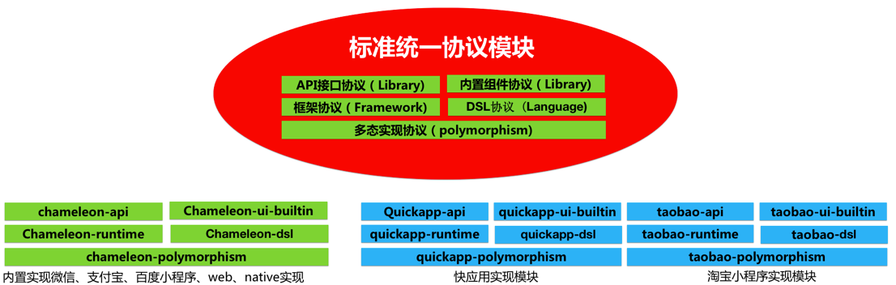
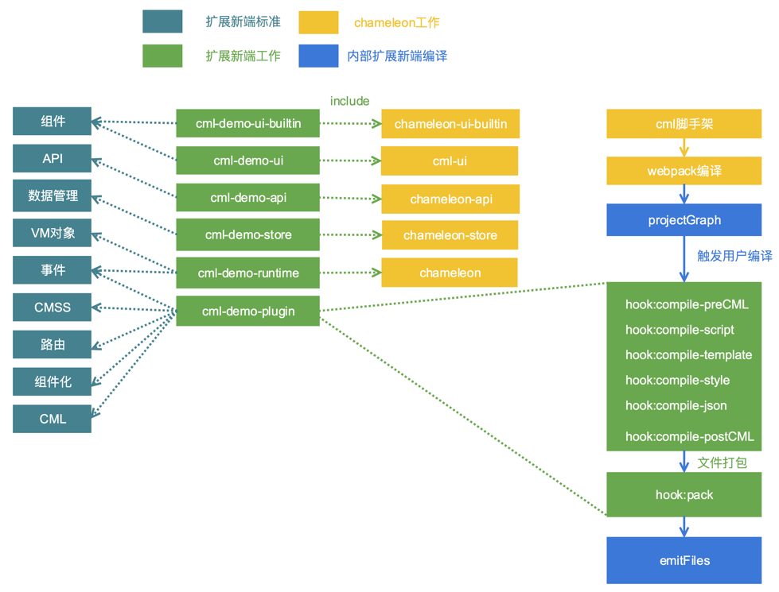

# 跨端标准协议(Terminal expand)[chameleon-tool@1.0.3]

新框架太多？学不动啦？有这一套跨端标准，今后再也不用学习新框架了。

如今前端比较流行的 React Native、Weex、Flutter 等跨平台开发框架，对于开发来说属于技术方案的选择，比如，我们会考虑用这个技术开发，性能会不会超过 h5，开发效率会不会超过原生开发等等。

但是从 2017 年微信推出小程序，到至今各大厂商都推出自己的小程序，跨端开发就不仅仅是技术的问题了。已经变成了必争的流量入口。现在的小程序大战像极了当前的浏览器大战。大战中受苦的是我们一线开发者，同样的应用要开发 N 次，面对了前所未有的挑战，所以跨端框架的产生是大趋势下的必然产物。

chameleon 基于对跨端工作的积累， 规范了一套跨端标准，称之为 MVVM+协议；开发者只需要按照标准扩展流程，即可快速扩展任意 MVVM 架构模式的终端。并让已有项目无缝运行新端。所以如果你希望让 chameleon 快速支持淘宝小程序、React Native？只需按标准实现即可扩展。

最终让开发者只需要用 chameleon 开发，就可以在任意端运行，再也不用学习新平台框架啦。

## 新端接入情况

滴滴、芒果 TV、阿里的同学合作，按照跨端协议流程，目前已完成**字节跳动小程序**的共建开发

- 分工排期如下：https://github.com/didi/chameleon/issues/157
- 仓库地址： https://github.com/chameleon-team/cml-tt-sets

**快应用官方研发团队**目前也接入完成

- 分工排期如下：https://github.com/didi/chameleon/issues/185
- 仓库地址： https://github.com/quickappcn/cml-extplatform-quickapp

## 跨端原理

跨端框架最核心的工作是统一，chameleon 定义了标准的跨端协议，通过编译时+运行时的手段去实现各端的代码和功能，其实现原理如下图所示。


其中运行时和基础库部分利用多态协议实现各端的独立性与框架的统一性。chameleon 目前支持的端都是采用这种方式，我们定义了扩展一个新端所需要实现的所有标准，用户只需要按照这些标准实现即可完成一个新端的扩展。

## 跨端标准协议

我们再来看一张 chameleon 的设计图，能够实现标准化的扩展新端，得益于多态协议中对各层代码进行了接口的定义，各端代码按照接口定义进行实现，向用户代码提供统一调用，同时还提供”多态协议“让用户代码保障可维护性的前提下，直接触达各端原生能力的方式。


- API 接口协议：定义基础接口能力标准。
- 内置组件协议：定义基础 UI 组件标准。
- 框架协议：定义生命周期、路由等框架标准。
- DSL 协议：定义视图和逻辑层的语法标准。
- 多态实现协议：定义允许用户使用差异化能力标准。



## 如何扩展新端？

简单来说只需要实现 6 个 npm 包。



### 实现 API 接口协议

`chameleon-api`提供了网络请求，数据存储，获取系统信息，交互反馈等方法，用户需要创建一个 npm 包，结构参考[cml-demo-api](https://github.com/chameleon-team/cml-extplatform-demo/tree/master/packages/cml-demo-api)。将`chameleon-api`中提供的每个方法利用[多态接口扩展](../framework/polymorphism/api_extend.md)语法扩展新端的实现。
以扩展一个`alert`方法为例,`chameleon-api`中`alert`方法的接口定义文件为`chameleon-api/src/interfaces/alert.interface`，其中的接口定义内容如下：

```
<script cml-type="interface">
type alertOpt = {
  message: String,
  confirmTitle: String
}
type successCallBack = (result: String) => void;
type failCallBack = (result: String) => void;
interface uiInterface {
  alert(opt: alertOpt, successCallBack: successCallBack, failCallBack: failCallBack): void,
}
</script>
```

用户实现的`interface`文件中采用`<include></include>`语法引入`chameleon-api`中`alert`方法的 interface 文件, 实现`uiInterface`。

```js
// 引入官方标准interface文件
<include src="chameleon-api/src/interfaces/alert/index.interface"></include>
// 扩展实现新端（以头条小程序为例，假设端扩展标识为：tt）
<script cml-type="tt">
class Method implements uiInterface {
  alert(opt, successCallBack, failCallBack) {
    // 根据头条小程序实现alert弹窗
    let { message, confirmTitle} = opt;
    tt.showModal({
      content: message,
      confirmText: confirmTitle,
      ......
    });
  }
}
export default new Method();
</script>
```

### 实现内置组件协议

组件分为内置组件<a href="https://github.com/chameleon-team/chameleon-ui-builtin">chameleon-ui-builtin</a>和扩展组件<a href="https://github.com/chameleon-team/chameleon-ui-builtin">cml-ui</a>。所以用户需要创建两个 npm 包分别实现这两个组件库，结构参考[cml-demo-ui-builtin](https://github.com/chameleon-team/cml-extplatform-demo/tree/master/packages/cml-demo-ui-builtin)和[cml-demo-ui](https://github.com/chameleon-team/cml-extplatform-demo/tree/master/packages/cml-demo-ui)。利用[多态组件扩展](../framework/polymorphism/component_extend.md)语法，对原有组件库中的每一个组件进行新端的实现。

原有组件库中的组件也分为两种，一种为各端都有分别实现的多态组件，例如`chameleon-ui-builtin`中的`button`组件。实现起来新端基本上也是要单独实现。另一种例如`chameleon-ui-builtin`中的`radio`组件，各端的实现都是用的`chameleon-ui-builtin/components/radio/radio.cml`。所以新端基本也可以复用这个实现，(还需要测试情况确实是否可以复用)。

##### 新端独立实现

例如：

编写 `my-ui-builtin/components/button/button.interface`

```js
// 引入官方标准interface文件
<include src="chameleon-ui-builtin/components/button/button.interface" />
```

编写 `my-ui-builtin/components/button/button.demo.cml`

```html
<template>
  <origin-button c-bind:tap="onclick" open-type="{{openType}}"> </origin-button>
</template>
<script>
  // js实现部分
</script>
<style scoped>
  // 样式部分
</style>
<script cml-type="json">
  // json配置
</script>
```

独立实现的`my-ui-builtin/components/button/button.demo.cml`文件属于<a href="https://cml.js.org/doc/framework/polymorphism/component.html">多态组件</a>的灰度层，可以调用各端底层组件和 api，具体例子参见<a href="https://github.com/chameleon-team/chameleon-ui-builtin/tree/master/src/components/button">button</a>和<a href="https://github.com/chameleon-team/chameleon-ui-builtin/tree/master/src/components/scroller">scroller</a>的实现。

##### 新端复用现有组件

编写 `my-ui-builtin/components/radio/button.interface`

```js
// 引入官方标准interface文件
<include src="chameleon-ui-builtin/components/radio/radio.interface"></include>
// 复用官方的实现
<script cml-type="demo" src="chameleon-ui-builtin/components/radio/radio.cml"></script>
```

### 实现 DSL 协议（编译时插件）

chameleon 内部会将整个项目文件编译为如下编译图结构，节点中的内容经过了标准编译，比如`script`节点的`babel`处理，`style`节点的`less`与`stylus`处理等等。


节点的数据结构如下：

```
class CMLNode {
  constructor(options = {}) {
    this.realPath; // 文件物理地址  会带参数
    this.moduleType; // template/style/script/json/asset
    this.dependencies = []; // 该节点的直接依赖       app.cml依赖pages.cml pages.cml依赖components.cml js依赖js
    this.childrens = []; // 子模块 cml文件才有子模块
    this.source; // 模块源代码
    this.output; // 模块输出  各种过程操作该字段
    ......
  }
}

```

用户只需要实现一个<a href="https://github.com/chameleon-team/cml-extplatform-demo/blob/master/packages/cml-demo-plugin/index.js">编译插件类</a>，利用钩子方法实现对节点的编译，所有节点编译完后再进行文件的组织。编译类如下：

```
module.exports = class DemoPlugin {
  constructor(options) {
    ......
  }
  /**
   * @description 注册插件
   * @param {compiler} 编译对象
   * */
  register(compiler) {
    // 编译script节点，比如做模块化
    compiler.hook('compile-script', function(currentNode, parentNodeType) {
    })
    // 编译template节点 语法转义
    compiler.hook('compile-template', function(currentNode, parentNodeType) {
    })
    // 编译style节点  比如尺寸单位转义
    compiler.hook('compile-style', function(currentNode, parentNodeType) {
    })
    // 编译结束进入打包阶段
    compiler.hook('pack', function(projectGraph) {
      // 遍历编译图的节点，进行各项目的拼接
      // 调用writeFile方法写入文件
      // compiler.writeFile()
    })
    ......
  }
}

```

### 实现框架协议

运行时主要是对 cml 文件的逻辑对象进行适配，chameleon 内部将 cml 文件的逻辑对象分为三类 App、Page、Component。对应会调用用户运行时 npm 包的`createApp、createPage、createComponent`方法，所以对外只需要实现这三个方法。

例如一个 Page 的逻辑对象如下：

```
class PageIndex {
  data = {
    name: 'chameleon'
  }
  computed = {
    sayName () {
      return 'Hello' + this.name;
    }
  }
  mounted() {
  }
}
export default new PageIndex();
```

编译时就会自动插入用户的运行时方法处理逻辑对象，例如`cml-demo-runtime`：

```
class PageIndex {
  ......
}
export default new PageIndex();

// 编译时自动插入用户配置的运行时方法
import {createPage} from 'cml-demo-runtime';
createPage(exports.default);
```

`createApp、createPage、createComponent`方法,参考<a href="https://github.com/chameleon-team/cml-extplatform-demo/tree/master/packages/cml-demo-runtime">cml-demo-runtime</a>的结构进行实现，需要`include` `chameleon-runtime`中相应的接口进行实现，才能够实现对`chameleon-runtime`的扩展。用户的工作量主要在于对逻辑对象的处理，可以参考<a href="https://github.com/chameleon-team/chameleon-runtime/tree/master/src/interfaces">chameleon-runtime</a>中的实现方式，一般需要如下方面的适配工作。

从宏观来看，运行时处理可分为：

- 输入 Options 对象的适配，[参考](https://github.com/chameleon-team/chameleon-runtime/blob/master/src/platform/common/proto/MiniVmAdapter.js)
- 跨端运行时能力注入，[参考](https://github.com/chameleon-team/chameleon-runtime/blob/master/src/platform/common/proto/MiniRuntimeCore.js)

从微观来看，有以下处理：

- 生命周期：[映射表参考](https://github.com/chameleon-team/chameleon-runtime/blob/master/src/platform/common/util/lifecycle.js) 和 [实现参考](https://github.com/chameleon-team/chameleon-runtime/blob/master/src/platform/common/proto/MiniVmAdapter.js#L91)
- 组件 props 属性：[适配参考](https://github.com/chameleon-team/chameleon-runtime/blob/master/src/platform/common/proto/MiniVmAdapter.js#L89) 和 [变化监听参考](https://github.com/chameleon-team/chameleon-runtime/blob/master/src/platform/common/proto/MiniVmAdapter.js#L48)
- 数据响应：[数据响应实现参考](https://github.com/chameleon-team/chameleon-runtime/blob/master/src/platform/common/proto/MiniRuntimeCore.js#L63)
- computed 计算能力：[实现参考](https://github.com/chameleon-team/chameleon-runtime/blob/master/src/platform/common/proto/MiniRuntimeCore.js#L85)
- watch 监听能力：[适配参考](https://github.com/chameleon-team/chameleon-runtime/blob/master/src/platform/common/proto/MiniRuntimeCore.js#L126) 和 [实现参考](https://github.com/chameleon-team/chameleon-runtime/blob/master/src/platform/common/proto/MiniRuntimeCore.js#L97)
- methods 方法属性：[适配参考](https://github.com/chameleon-team/chameleon-runtime/blob/master/src/platform/common/proto/MiniVmAdapter.js#L46)
- mixins 能力：[适配参考](https://github.com/chameleon-team/chameleon-runtime/blob/master/src/platform/common/proto/MiniVmAdapter.js#L31) 和 [合并参考](https://github.com/chameleon-team/chameleon-runtime/blob/master/src/platform/common/proto/MiniVmAdapter.js#L42)
- [生命周期多态](https://github.com/chameleon-team/chameleon-runtime/blob/master/src/platform/common/proto/MiniVmAdapter.js#L34)

例如： createPage 方法的实现

```
<include src="chameleon-runtime/src/interfaces/createPage/index.interface"></include>
<script cml-type="demo">
  class Method implements createPageInterface {
    createPage(options) {
      // 各端自行实现adapter
      adapter(options);
      //例如调用小程序原生页面构造函数
      Page(options);
      return {};
    }
  }

  export default new Method();
</script>
```

### 实现框架数据管理

`chameleon-store`提供了类似 Vuex 的数据管理解决方案，具体标准参见<a href="https://cml.js.org/doc/logic/store.html">数据管理</a>。同样利用多态协议实现其功能。

### 更多

- 扩展新端 demo 示例仓库: https://github.com/chameleon-team/cml-extplatform-demo。 实现了微信端的基本扩展，用户可以以此为模板进行开发。

- 更详细的教程参见<a href="https://cml.js.org/doc/extend/quickstart.html">扩展新端操作教程</a>。

期待更多人的加入开源。
