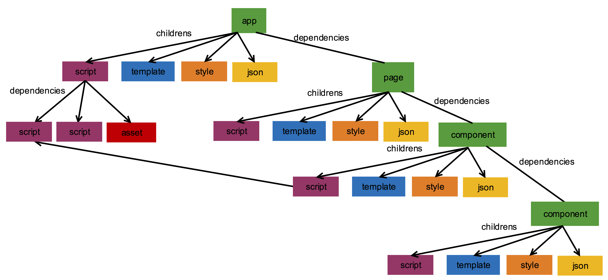

# 扩展新端编译手册

扩展新端编译插件的使用手册。

## 1 脚手架

<b>安装`chameleon-tool@1.0.3` 进行扩展新端的开发。</b>

## 2 扩展新端总体编译流程

扩展新端 首先要了解扩展新端总体的编译流程，理解用户扩展新端的工作处于编译的什么阶段。

- 黄色部分表示 cml 脚手架及 webpack 编译
- 蓝色部分表示扩展的 mvvm+编译
- 绿色部分表示用户要实现的部分，整个项目的文件会用一张编译图表示，用户提供针对每一个节点的编译处理，全部编译完成后，进行文件的拼接打包。


## 3 编译图与编译节点

在总体编译流程中，webpack 编译完成后，会将 webpack 编译的结果转成标准的 mvvm 编译图 projectGraph，这个图由 CMLNode 节点构成，先理解编译图的组织形式和节点的数据结构，对用户写编译插件有很大帮助。

### 3.1 编译节点

编译节点是 CMLNode 类的实例，CMLNode 定义如下:

```
class CMLNode {
  constructor(options = {}) {
    this.ext;
    this.realPath; // 文件物理地址  会带参数
    this.nodeType; // app/page/component/module // 节点类型     app/page/component  其他的为module  cml文件中的每一个部分也是一个Node节点
    this.moduleType; // template/style/script/json/asset
    this.dependencies = []; // 该节点的直接依赖       app.cml依赖pages.cml pages.cml依赖components.cml js依赖js
    this.childrens = []; // 子模块 cml文件才有子模块
    this.parent; // 父模块 cml文件中的子模块才有
    this.source; // 模块源代码
    this.convert; // 源代码的格式化形式
    this.output; // 模块输出  各种过程操作该字段
    this.identifier; // 节点唯一标识
    this.modId; // 模块化的id requirejs
    this.extra; // 节点的额外信息
    Object.keys(options).forEach(key => {
      this[key] = options[key];
    })
  }
}

```

具体字段含义如下:

<table>
  <tr>
    <th>字段</th>
    <th>含义</th>
  </tr>
  </tr>
    <tr>
    <td style="color: red;">nodeType</td>
    <td>节点类型，分为app/page/component/module，其中只有src/app/app.cml类型为app， router.config.json中配置的cml文件为page，其他的cml文件为component。非cml文件为Module</td>
  </tr>
  </tr>
    <tr>
    <td style="color: red;">moduleType</td>
    <td>
      模块类型，当节点的nodeType为app/page/component时，其moduleType为undefined。cml文件中四个部分的moduleType分别为template、script、style、json。其他节点的nodeType为module时，根据文件后缀判断moduleType。
      <table>
        <tr>
          <td>后缀</td>
          <td>moduleType值</td>
        </tr>
        <tr>
          <td>/\.css|\.less|\.stylus|\.styls$/</td>
          <td>style</td>
        </tr>
        <tr>
          <td>/\.js|\.interface$/</td>
          <td>script</td>
        </tr>
        <tr>
          <td>/\.json$/</td>
          <td>json</td>
        </tr>
        <tr>
          <td>/\.(png|jpe?g|gif|svg|mp4|webm|ogg|mp3|wav|flac|aac|woff|woff2?|eot|ttf|otf)(\?.*)?$</td>
          <td>asset</td>
        </tr>
        <tr>
          <td>其他后缀</td>
          <td>other</td>
        </tr>
      </table>
    </td>
  </tr>
  <tr>
    <td>dependencies</td>
    <td>节点的依赖节点，app依赖page page依赖component script节点中依赖require的节点</td>
  </tr>
  <tr>
    <td>childrens</td>
    <td>节点的子节点，只有cml文件才会有子节点，子节点为cml文件的四个部分，分别为四个节点</td>
  </tr>
  <tr>
    <td>parent</td>
    <td>节点的父节点，只有cml文件节点的子节点才有父节点</td>
  </tr>
  <tr>
    <td>originSource</td>
    <td>节点编译前源代码（目前只有script节点有该字段）</td>
  </tr>
  <tr>
    <td>source</td>
    <td>经过mvvm标准编译之后节点的代码</td>
  </tr>
  <tr>
    <td>convert</td>
    <td>source的转换格式，source均为字符串，convert可能装成AST或者JSON对象</td>
  </tr>
  <tr>
    <td>output</td>
    <td>节点的输出内容，建议用户编译可以将编译结果放在output字段用于输出</td>
  </tr>
  <tr>
    <td>identifier</td>
    <td>节点的唯一标识，是webpack module中的request字段，保证了唯一性</td>
  </tr>
  <tr>
    <td>modId</td>
    <td>节点的模块id，用于js的模块化id标识</td>
  </tr>
  <tr>
    <td>extra</td>
    <td>节点的额外信息，例如template节点就会添加上模板使用的原生组件和内置组件信息</td>
  </tr>
  <tr>
    <td>ext</td>
    <td>文件后缀，例如.js 注意如果引用资源后有参数也会带着，例如 .png?__inline</td>
  </tr>
  <tr>
    <td>realPath</td>
    <td>节点对应的文件路径，注意如果引用资源后有参数也会带着，例如 /user/didi/yyl/project/chameleon.png?__inline</td>
</table>

### 3.2 编译图组织结构

编译图由上节介绍的编译节点组成，以 nodeType 为 app 的节点开始形成编译图，内部会递归编译节点，根据节点的类型触发相应的用户编译。



## 4 如何编写用户插件

扩展内置组件库和内置 API 库是独立的两个 NPM 包，其他编译相关的工作都放在用户插件中。

### 4.1 确定端标识名称

扩展一个新端首先要确定这个端的标识名称，例如微信小程序端为`wx`,百度小程序端为`baidu`，这个标识决定了构建命令的名称、多态协议中的 cmlType, 配置对象中的 cmlType 等。

### 4.2 配置插件

在项目的 chameleon.config.js 中配置构建目标端命令时要执行的插件,这里配置的只是插件的名称，后面会讲解插件的写法。配置的字段为`extPlatform` Object 类型,<b>key 值为上一步确定的端标识名称</b>,<b>value 为要实现的插件的 npm 包名称</b>, 例如要扩展头条小程序，确定标识为`toutiao`。

```
cml.config.merge({
  extPlatform: {
    toutiao: 'cml-toutiao-plugin'
  }
})
```

当执行`cml 端标识名称 dev|build`时将走用户插件进行编译。

### 4.3 扩展新端插件

上一步讲解了如何配置端标识命令对应的用户插件，这里讲一下插件该如何编写。插件是一个`类`，要求是 npm 包的入口。下面展示出这个类的属性和方法。

```

module.exports = class ToutiaoPlugin {
    constructor(options) {
      let { cmlType, media} = options;
      this.webpackRules = []; // webpack的rules设置  用于当前端特殊文件处理
      this.moduleRules = []; // 文件后缀对应的节点moduleType
      this.logLevel = 3;
      this.originComponentExtList = ['.wxml']; // 用于扩展原生组件的文件后缀查找
      this.runtimeNpmName = 'cml-demo-runtime'; // 指定当前端的运行时库
      this.builtinUINpmName = 'cml-demo-ui-builtin'; // 指定当前端的内置组件库
      this.cmlType = cmlType;
      this.media = media;
      this.miniappExt = {  // 小程序原生组件处理
        rule: /\.wxml$/,
        mapping: {
          'template': '.wxml',
          'style': '.wxss',
          'script': '.js',
          'json': '.json'
        }
      }
      // 需要压缩文件的后缀
      this.minimizeExt = {
        js: ['.js'],
        css: ['.css','.wxss']
      }
    }
  /**
   * @description 注册插件
   * @param {compiler} 编译对象
   * */
  register(compiler) {
      /**
       * cml节点编译前
       * currentNode 当前节点
       * nodeType 节点的nodeType
       */
      compiler.hook('compile-preCML', function(currentNode, nodeType) {

      })
      /**
       * cml节点编译后
       * currentNode 当前节点
       * nodeType 节点的nodeType
       */
      compiler.hook('compile-postCML', function(currentNode, nodeType) {

      })

      /**
       * 编译script节点，比如做模块化
       * currentNode 当前节点
       * parentNodeType 父节点的nodeType
       */
      compiler.hook('compile-script', function(currentNode, parentNodeType) {

      })

      /**
       * 编译template节点 语法转义
       * currentNode 当前节点
       * parentNodeType 父节点的nodeType
       */
      compiler.hook('compile-template', function(currentNode, parentNodeType) {

      })

      /**
       * 编译style节点  比如尺寸单位转义
       * currentNode 当前节点
       * parentNodeType 父节点的nodeType
       */
      compiler.hook('compile-style', function(currentNode, parentNodeType) {

      })

      /**
       * 编译json节点
       * currentNode 当前节点
       * parentNodeType 父节点的nodeType
       */
      compiler.hook('compile-json', function(currentNode, parentNodeType) {

      })

      /**
       * 编译other类型节点
       * currentNode 当前节点
       */
      compiler.hook('compile-other', function(currentNode) {

      })


      /**
       * 编译结束进入打包阶段
       */
      compiler.hook('pack', function(projectGraph) {
        // 遍历编译图的节点，进行各项目的拼接
        //调用writeFile方法写入文件
        // compiler.writeFile()
      })
  }
}
```

下面对插件类中的每一个属性和方法的使用进行介绍。

### 插件构造函数参数

```
  constructor(options) {
    let { cmlType, media} = options;
  }
```

用户插件的构造函数会接受`options`参数,`cmlType`是当前端标识名称，例如`web|wx|weex`, `media`是构建的模式，`dev|build`。

#### this.logLevel

类型：Number
日志的等级, 可取值 0，1，2，3，默认值为 2，值越大显示日志越详细。

#### this.originComponentExtList

类型：Array
用于设置原生组件的文件后缀，适用于多态组件的查找。
例如 usingComponents 中对于组件的引用是没有后缀的，用户可以对其进行扩展，再进行组件查找时会尝试用户设置的后缀，一般用于多态组件调用底层原生组件。
例如微信小程序中：

```
this.originComponentExtList = ['.wxml']; // 用于扩展原生组件的文件后缀查找
```

#### this.runtimeNpmName

类型：String
用于设置当前端运行时 npm 包名称。

#### this.builtinUINpmName

类型：String
用于设置当前端内置组件 npm 包名称。

#### this.minimizeExt

类型：Object

```
  {
    js: Array,
    css: Array
  }
```

内置了两种代码压缩，一种是 js 一直是 css，用户指定输出文件后缀对应的压缩类型。例如微信小程序中：

```
  this.minimizeExt = {
    js: ['.js'],
    css: ['.css','.wxss']
  }
```

#### this.miniappExt

类型：Object
chameleon 内置了针对小程序类的原生组件的处理方法，只需要用户进行文件后缀的配置。例如微信小程序：

```
this.miniappExt = {  // 小程序原生组件处理
  rule: /\.wxml$/,
  mapping: {
    'template': '.wxml',
    'style': '.wxss',
    'script': '.js',
    'json': '.json'
  }
}
```

rule 的正则匹配文件后缀和`this.originComponentExtList`中的设置的文件后缀保持一致。
mapping 中的四个部分配置小程序对应的文件后缀。

#### this.webpackRules

类型：Array
当用户有其他文件类型的原生组件要处理，可以通过配置 weback 的 module.rules 字段，用于扩展目标端特殊文件类型的处理，用户可以扩展 webpack 编译过程的 loader。例如：

```
this.webpackRules = [{
  test: /\.vue$/,
  use: [{
    loader:'vue-loader',
    options: {}
  }]
}]
```

在 loader 中可以设置 this.\_module 中的一些字段控制生成的`CMLNode`的内容。

- this.\_module.\_cmlSource 设置`CMLNode`的 source 字段
- this.\_module.\_nodeType 设置`CMLNode`的 nodeType 字段
- this.\_module.\_moduleType 设置`CMLNode`的 moduleType 字段
- this.\_module.\_cmlExtra 设置`CMLNode`的 extra 字段

#### this.moduleRules

类型：Array
设置文件类型对应的 moduleType，可以配合 webpackRules 使用，内置对应关系如下：

```
 [ // 文件后缀对应module信息
  {
    test: /\.css|\.less|\.stylus|\.styls$/,
    moduleType: 'style'
  },
  {
    test: /\.js|\.interface$/,
    moduleType: 'script'
  },
  {
    test: /\.json$/,
    moduleType: 'json'
  },
  {
    test: /\.(png|jpe?g|gif|svg|mp4|webm|ogg|mp3|wav|flac|aac|woff|woff2?|eot|ttf|otf)(\?.*)?$/,
    moduleType: 'asset'
  }
]
```

例如用户可以扩展`.vue`类型的 moduleType 为`vue`。

```
this.webpackRules = [{
  test: /\.vue$/,
  moduleType: 'vue'
}]
```

在递归触发用户编译阶段的钩子名称，也是根据节点的`moduleType`决定，所以用户扩展了节点的`moduleType`，相应这个节点触发的编译钩子也为`compile-${moduleType}`, 上面的例子中触发`compile-vue`。

### register 方法

register 方法中接受`compiler`对象，该对象是编译的核心对象，用户通过该对象注册编译流程。

### compiler.hook 方法

使用该方法可以注册编译流程，第一个参数是钩子名称，第二个参数是处理函数，处理函数中会接收编译流程对应的参数，下面说明每一个钩子的作用和参数。

```
compiler.hook(钩子名称, function(参数) {

})
```

##### 1 compile-preCML

参数列表：(currentNode，nodeType)

- currentNode 当前处理的节点
- nodeType 当前节点的 nodeType，app/page/component

说明：

这个钩子是编译 cml 文件节点之前触发，并且传递 cml 文件节点，可以通过该钩子去处理 cml 文件节点的`template、json、style、script`四个子节点之前需要的联系。

##### 2 compile-postCML

参数列表：(currentNode，nodeType)

- currentNode 当前处理的节点
- nodeType 当前节点的 nodeType，app/page/component

说明：

这个钩子是编译完 cml 文件节点的依赖和子节点后触发，传递 cml 文件节点，可以通过该钩子去处理 cml 文件节点编译之后的处理。

##### 3 compile-script

参数列表：(currentNode，parentNodeType)

- currentNode 当前处理的节点
- parentNodeType 父节点的 nodeType，如果是 app/page/component 节点的子节点会有值，否则为 undefined

说明：
这个钩子用于处理`nodeType='module'`,`moduleType='script'`的节点，内部已经对 js 文件进行了 babel 处理，这个阶段用于做模块的包装，`compiler.amd`对象提供了 amd 模块的包装方法，模块 id 使用节点的`modId`字段。例如：

```
compiler.hook('compile-script', function(currentNode, parentNodeType) {
  currentNode.output = compiler.amd.amdWrapModule(currentNode.source, currentNode.modId);
})

```

##### 4 compile-template

参数列表：(currentNode，parentNodeType)

- currentNode 当前处理的节点
- parentNodeType 父节点的 nodeType，如果是 app/page/component 节点的子节点会有值，否则为 undefined

说明：
这个钩子用于处理`nodeType='module'`,`moduleType='template'`的节点，如果模板是类 vue 语法，内部已经将其转为标准的 cml 语法，这个阶段用于对模板语法进行编译，生成目标代码，转义可以采用`mvvm-template-parser`npm 包提供的方法，可以将模板字符串转为 ast 语法树进行操作。例如：

```
const {cmlparse,generator,types,traverse} = require('mvvm-template-parser');
compiler.hook('compile-template', function(currentNode, parentNodeType) {
    let ast = cmlparse(currentNode.source);
    traverse(ast, {
      enter(path) {
        //进行转义
      }
    });
    currentNode.output =  generate(ast).code;
})

```

##### 5 compile-style

参数列表：(currentNode，parentNodeType)

- currentNode 当前处理的节点
- parentNodeType 父节点的 nodeType，如果是 app/page/component 节点的子节点会有值，否则为 undefined

说明：
这个钩子用于处理`nodeType='module'`,`moduleType='style'`的节点，内部已经对 less stylus 等语法进行编译处理，这里得到的已经是标准的 css 格式，可以转成对应端的样式，比如对尺寸单位 cpx 的转换，将 css 转成对象形式等。例如：

```
compiler.hook('compile-style', function(currentNode, parentNodeType) {
   //利用编写postcss插件的形式进行转义
    let output = postcss([cpx()]).process(currentNode.source).css;
    currentNode.output =  output;
})

```

##### 6 compile-json

参数列表：(currentNode，parentNodeType)

- currentNode 当前处理的节点
- parentNodeType 父节点的 nodeType，如果是 app/page/component 节点的子节点会有值，否则为 undefined

说明：
这个钩子用于处理`nodeType='module'`,`moduleType='json'`的节点。例如：

```
compiler.hook('compile-json', function(currentNode, parentNodeType) {
  let jsonObj = currentNode.convert;
  jsonObj.name = "用户自定义操作"
  currentNode.output = JSON.stringify(jsonObj);
})

```

##### 6 compile-other

参数列表：(currentNode)

- currentNode 当前处理的节点

说明：
这个钩子用于处理`nodeType='module'`,`moduleType='other'`的节点。对于不是 cml 识别的模块类型进行编译。

##### 7 compile-asset

参数列表：(currentNode，parentNodeType)

- currentNode 当前处理的节点
- parentNodeType 父节点的 nodeType，如果是 app/page/component 节点的子节点会有值，否则为 undefined

说明：
这个钩子用于处理`nodeType='module'`,`moduleType='asset'`的节点，资源节点内部已经将其 source 转为 js 语法，返回资源的`publichPath`,所以将其等同于`script`节点进行处理。例如：

```
compiler.hook('compile-script', function(currentNode, parentNodeType) {
  currentNode.output = compiler.amd.amdWrapModule(currentNode.source, currentNode.modId);
})

```

##### 8 pack

参数列表：(projectGraph)

- projectGraph 编译图根节点

说明：
所有编译结束之后触发这个钩子，在这个钩子中编译图，拼接目标端的文件内容，调用`compiler.writeFile()`方法写入要生成的文件路径及内容。

```
compiler.hook('pack', function(projectGraph) {
  // 遍历编译图的节点，进行各项目的拼接
  //调用writeFile方法写入生成文件
  compiler.writeFile('/app.json',projectGraph.output)
})
```

#### compiler.amd

compiler.amd 对象提供了 js 语言的 AMD 模块化方案供开发者使用，

##### ompiler.amd.amdWrapModule

参数列表 ({content, modId})

- content js 模块的内容
- modId 该模块的 Id

说明： 将 js 模块包装成 amd 模块。
例如 modId 为`src/pages/index/index.cml`,content 为如下的模块：

```
class Index  {
  data = {
    title: "chameleon",
    chameleonSrc: require('../../assets/images/chameleon.png')
  }
}

export default new Index();
```

调用 compiler.amd.amdWrapModule 后返回的结果为：

```
cmldefine('src/pages/index/index.cml', function(require, exports, module) {
  class Index  {
    data = {
      title: "chameleon",
      chameleonSrc: require('../../assets/images/chameleon.png')
    }
  }

  export default new Index();
})
```

##### compiler.amd.getGlobalBootstrap

参数列表 (globalName)

- globalName 环境的全局变量

说明: 该方法返回 js amd 模块方案的启动脚本，这个脚本是将 cmldefine 和 cmlrequire 都放到用户传递的全局变量上。返回代码如下：

```

(function(cmlglobal) {
  cmlglobal = cmlglobal || {};
  cmlglobal.cmlrequire;

  var factoryMap = {};

  var modulesMap = {};
  cmlglobal.cmldefine = function(id, factory) {
    factoryMap[id] = factory;
  };

  cmlglobal.cmlrequire = function(id) {
    var mod = modulesMap[id];
    if (mod) {
      return mod.exports;
    }

    var factory = factoryMap[id];
    if (!factory) {
      throw new Error('[ModJS] Cannot find module `' + id + '`');
    }

    mod = modulesMap[id] = {
      exports: {}
    };

    var ret = (typeof factory == 'function')
      ? factory.apply(mod, [require, mod.exports, mod])
      : factory;

    if (ret) {
      mod.exports = ret;
    }
    return mod.exports;
  };

})($GLOBAL); // 全局变量
```

##### compiler.amd.getModuleBootstrap

无参数。

说明： 某些平台没有提供全局变量，所有 amd 的启动脚本也提供了模块化的方案。返回如下代码：

```

/**
 * 模块型
 */
(function() {

  var factoryMap = {};

  var modulesMap = {};
  var cmldefine = function(id, factory) {
    factoryMap[id] = factory;
  };

  var cmlrequire = function(id) {
    var mod = modulesMap[id];
    if (mod) {
      return mod.exports;
    }

    var factory = factoryMap[id];
    if (!factory) {
      throw new Error('[ModJS] Cannot find module `' + id + '`');
    }

    mod = modulesMap[id] = {
      exports: {}
    };

    var ret = (typeof factory == 'function')
      ? factory.apply(mod, [require, mod.exports, mod])
      : factory;

    if (ret) {
      mod.exports = ret;
    }
    return mod.exports;
  };

  module.exports = {
    cmldefine,
    cmlrequire
  }
})();

```

#### compiler.writeFile

参数列表 (filePath, content)

- filePath 文件路径相对路径，会在项目根目录`dist/${端标识}`下拼接上 filePath。
- content 输出的文件内容 `String or Buffer`

说明： 在`pack`钩子中通知用户所有节点已经编译完成，用户可以遍历`projectGraph`编译图，进行目标文件的拼接，调用`compiler.writeFile`方法进行写出，`pack`钩子执行完毕后，内部编译将输出文件。例如：

```
let appJson = {
  window: {
    "navigationBarTitleText": "Chameleon"
  }
}
compiler.writeFile('/app.json', JSON.stringify(appJson))
```

#### compiler.getRouterConfig

参数列表： 无参数
返回值结构：

```
{
  projectRouter,
  subProjectRouter
}
```

说明：projectRouter 为当前项目的 router.config.json 的对象形式。
subProjectRouter 为包含所有子项目的 router.config.json 对象，例如如下配置子项目：

```
cml.config.merge({
  subProject: ['cml-subproject']
})
```

compiler.getRouterConfig() 返回值结构如下：

```
{
  projectRouter: {
    "mode": "history",
    "domain": "https://www.chameleon.com",
    "routes":[
      {
        "url": "/cml/h5/index",
        "path": "/pages/page1/page1",
        "name": "主项目",
        "mock": "index.php"
      }
    ]
  },
  subProjectRouter: {
    // 子项目npm包名称为key，value为子项目的router.config.json
    "cml-subproject": {
      "mode": "history",
      "domain": "https://www.chameleon.com",
      "routes":[
        {
          "url": "/cml/h5/index",
          "path": "/pages/page1/page1",
          "name": "主项目",
          "mock": "index.php"
        }
      ]
    }
  }

}
```

利用这个方法可以获取路由配置，用户可以根据这些配置进行路由实现，同时 app 节点的`dependencies`字段中的节点都是页面节点。

### 组件化相关信息

1 cml 文件的 extra 字段 (0.4.0 以上开始生效)
CMLNode 中的 extra 字段用于存放节点的额外信息，cml 文件对应的节点，extra 中的 componentFiles 字段记录 cml 文件引用的组件信息,结构如下：

```
{
  componentFiles: {
    demo-com: "/user/cml/demo-project/src/components/demo-com/demo-com.cml"
  }
}
```

key 为组件名称，value 为组件的绝对路径。

2 cml 文件节点的 dependencies 字段
cml 文件节点的 dependencies 字段记录的就是这个 cml 文件引用的组件节点，其中如果 cml 文件是 app 节点 则`dependencies`中还包含页面节点。通过`componentFiles`字段中的组件绝对路径匹配`dependencies`中节点的`realPath`字段，就能找到组件名对应的节点。

3 cml 节点的 json 子节点
cml 节点的 children 字段存放 cml 文件的四个子节点，其中 moduleType 为 json 的节点 convert 字段为编译后的 json 对象。

扩展新端 demo 仓库: https://github.com/chameleon-team/cml-extplatform-demo
