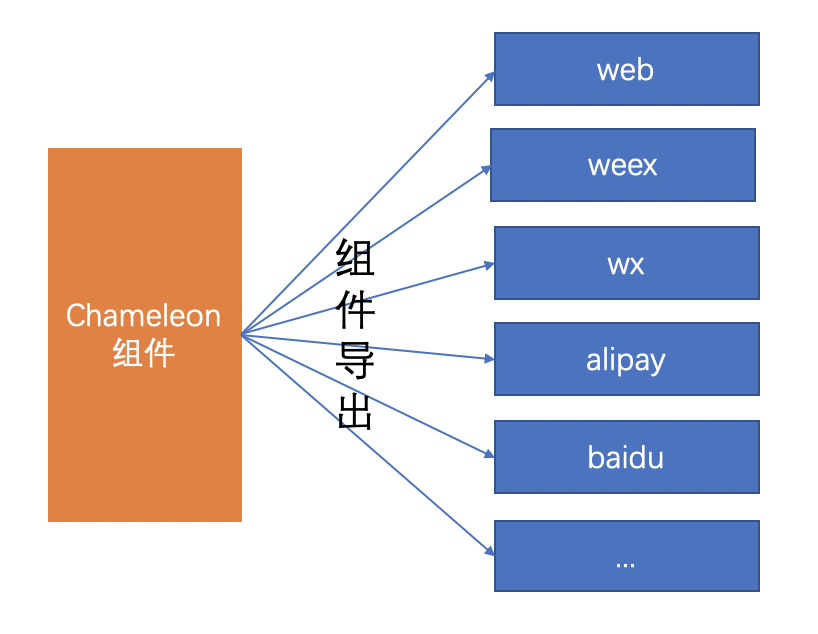

# 组件导出

这里介绍的是第二种场景，将 CML 组件导出到某个端使用。

## 介绍

为了让开发者更自由地使用 Chameleon，我们提供组件导出的形式，让开发者可以在任意端原有项目中使用通过 Chameleon 开发的组件。我们用 web 端和小程序端举例，按正常开发模式我们需要分别维护着 4 套代码（web、wx、alipay、baidu），在某一个业务场景下需要开发一个时间选择器的组件，原有模式下我们需要每个端独自开发，而对于这种公共的组件，就可以选择使用 Chameleon 去维护，通过 Chameleon 开发，只需要维护一套组件代码，最后通过组件导出就可以在各个端进行使用了。这样的模式完全利用了 Chameleon 的跨端优势，大大降低了代码开发维护成本。

组件导出开发模式：


## 命令行

- `cml web export` 执行 web 端组件导出
- `cml weex export` 执行 weex 端组件导出
- `cml wx export` 执行 wx 端组件导出
- `cml alipay export` 执行 alipay 端组件导出
- `cml baidu export` 执行 baidu 端组件导出

## 配置

在 chameleon.config.js 中增加 export 配置，即可自定义组件导出配置,可配置项参考下表：

<table>
  <tr>
    <th>配置项</th>
    <th>类型</th>
    <th>说明</th>
  </tr>
  <tr>
    <td>entry</td>
    <td>Array</td>
    <td>组件导出的入口目录，项目根目录的相对路径</td>
  </tr>
  <tr>
    <td>outputPath</td>
    <td>String</td>
    <td>组件导出目录，绝对路径</td>
  </tr>
  <tr>
    <td>publicPath</td>
    <td>String</td>
    <td>公共资源地址</td>
  </tr>
  <tr>
    <td>hash</td>
    <td>Boolean</td>
    <td>导出文件名是否带hash，默认true</td>
  </tr>
  <tr>
    <td>minimize</td>
    <td>Boolean</td>
    <td>导出文件名是否压缩，默认true</td>
  </tr>
  <tr>
    <td>disableExtract</td>
    <td>Boolean</td>
    <td>不拆分css，默认false</td>
  </tr>
  <tr>
    <td>externals</td>
    <td>Object</td>
    <td>导出依赖分离，可配置不导出部分依赖，而使用外部依赖</td>
  </tr>
</table>

以 web 端为例，配置如下：

```js
cml.config.merge({
  web: {
    dev: {},
    build: {},
    export: {
      entry: ['src/components'],
      publicPath: 'https://static.chameleon.com/static',
    },
  },
});
```

## 导出组件

chameleon 组件导出目录结构如下：

```
├── dist
|   ├── export
│   │   ├── platform (web、weex、wx、alipay、baidu ...)
│   │   │   ├── common
|   │   │   │   ├── web_global.js [仅导出web端组件时存在，需要在入口文件中引用]
|   │   │   │   ├── web_global.css [会在web_global.js中引用]
│   │   │   ├── 组件目录
│   │   │   └── 资源目录
```

下面是在 webpack+vue 环境下引用 chameleon 导出组件的示例：

假设目前已经通过 chameleon 项目导出了 c-header 组件，将组件移动到 webpack+vue 的环境后，需要进行一下几步操作：

1. 假设是 web 端组件，则首先需要在入口文件中引用 web_global.js
2. 在需要使用组件的地方引用组件即可

## 导出组件公共依赖分离

> 当组件 A 和组件 B 同时依赖于公共模块 C 时，普通导出会将 C 打包到导出的 A、B 组件代码中，此时使用 A、B 组件相当于有两份模块 C 的代码，为了优化这一问题，导出组件提供分离公共依赖配置，即将模块 C 作为第三方依赖，在 A、B 组件导出时将模块 C 分离，在使用时依赖模块 C。

这里以`chameleon-runtime`为例，首先将`chameleon-runtime`编译出仅 web 端使用的版本`chameleon-runtime-web`，在导出 web 组件配置部分增加相关配置，然后导出的组件在依赖`chameleon-runtime`的部分就会变成依赖`chameleon-runtime-web`，最后在使用的项目中下载`chameleon-runtime-web`即可使用。

```js
cml.config.merge({
  web: {
    export: {
      entry: ['src/components'],
      publicPath: 'https://static.chameleon.com/static',
      externals: {
        'chameleon-runtime': 'chameleon-runtime-web',
      },
    },
  },
});
```

## Bug&Tips

- .babelrc 配置中去掉`module: false`
- 由于生产模式组件为编译后的模块，所以尽量使用线上资源

## 示例

详细示例戳这里[普通项目使用跨端组件](/example/webpack_output.html)
