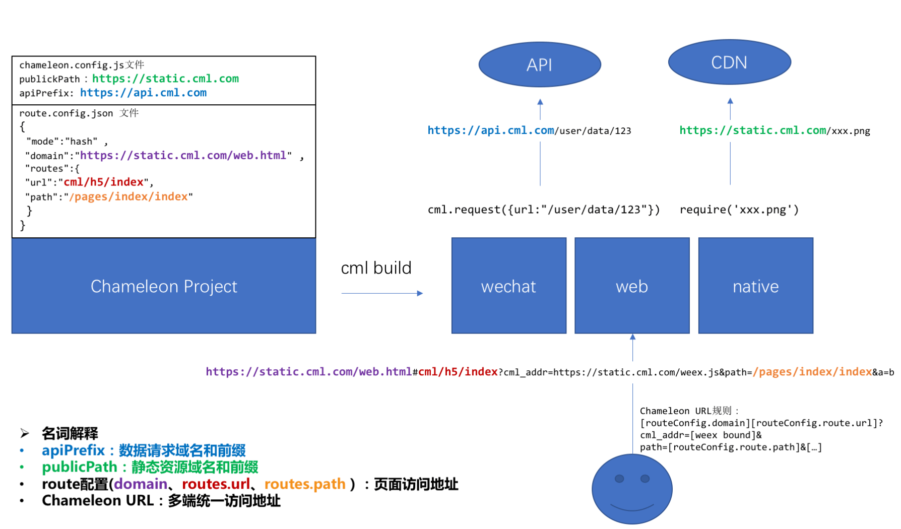

# chameleon 上线指南

## 1 是否添加 polyfill

chameleon 框架中 js 代码都是经过了 babel 编译，但是 babel 默认只转换语法，而不处理新的 API，例如`Object.assign,Object.entries`。如果<b>项目中使用了一些不经过 babel 的 API，并且线上产品需要兼容低版本系统的手机</b>，chameleon 提供了在各端添加 polyfill 的配置 参见<a href="./config.html#babelPolyfill">babelPolyfill</a>。

## 2 静态资源发布路径

静态资源发布路径 <b>是配合项目静态资源最终线上地址</b>,设置方法参见<a href="./config.html#babelPolyfill">资源发布路径</a>。
例如： 项目中引用了一个本地图片：

```
<template>
  <view class="scroller-wrap">
    <image src="{{chameleonSrc}}"></image>
  </view>
</template>

<script>

class Index  {
  data = {
    chameleonSrc: require('../../assets/images/chameleon.png')
  }
}
```

该图片执行 cml web build 打包到本地 `web/static/img/chameleon_83ee00e.png`;
如果预计将该静态资源上线到`https://static.cml.js/vender`下，例如图片线上地址`https://static.cml.js/vender/web/static/img/chameleon_83ee00e.png`。
则应该将 publicPath 设置为`https://static.cml.com/vender`后执行`cml web build`。

```
cml.config.merge({
  web: {
    build: {
      publicPath: "https://static.cml.com/vender"
    }
  }
});
```

这样代码中的图片地址线上就能够正确访问。 同理适用于 web 端 html 页面中注入的`link和script`标签。

### 小程序中的静态资源上线

由于小程序有包大小的限制，所有建议打包出的静态资源单独上线，不放在小程序包中，chameleon-tool@0.3.1 版本在 dev 模式也默认将图片的地址改成本地 web 服务器访问的地址，解决 css 中 background-image 不能使用本地图片的问题。

如果不将静态资源单独上线，注意要将 publicPath 设置为`/`，例如：

```
cml.config.merge({
  wx: {
    build: {
      publicPath: "/"
    }
  }
});
```

<b>注：百度小程序中必须将静态资源单独上线, 因为不支持静态资源的</b>。

## 3 api 请求前缀

请求前缀的配置可以灵活的控制项目中所有 ajax 请求的服务器地址，上线时记得将其改成正确的线上地址。具体讲解参见 <a href="./config.html#api请求前缀">api 请求前缀</a>和<a href="./config.html#domain-多域名请求前缀">domain 多域名请求前缀</a>。

## 4 web 端的路由模式

很多人将 web 端的 html 页面上线之后访问是空白页面。就是没有注意 web 端路由模式。web 端路由模式分为`history`和`hash`，在项目的`src/router.config.json`中配置。如果 web 端的页面没有后端服务提供路由，那么应该路由设置成`hash`模式，然后用页面地址+hash 值访问到相应的页面。`history`模式适用于有后端路由服务，访问设置的路由可以返回该 html 页面。
例如路由如下：

```
{
  "mode": "hash",
  "routes":[
    {
      "url": "/cml/h5/index",
      "path": "/pages/index/index",
      "name": "首页",
      "mock": "index.php"
    },
    {
      "url": "/cml/login/index",
      "path": "/pages/index/index",
      "name": "首页",
      "mock": "index.php"
    }
  ]
}
```

如果最终线上地址为`https://static.cml.com/project/page1.html`,则两个页面访问地址为
`https://static.cml.com/project/page1.html#/cml/h5/index` 和
`https://static.cml.com/project/page1.html#/cml/login/index`。

如果直接访问`https://static.cml.com/project/page1.html` 则会寻找路由为/的页面
`https://static.cml.com/project/page1.html#/`

## 5 跨端 chameleonUrl 与 config.json 的关系

跨端项目之间的跳转，chameleon 提供的解决方式是使用<a href="../api/open.html">open</a>方法传入统一的<a href="./chameleon_url.html">chameleonUrl 地址</a>，chameleonUrl 地址的生成就是需要根据项目 build 模式打包出的`config.json`信息。
例如：

```
[
    {
        "wx": {
            "appId": "wx_appid",
            "path": "/pages/index/index"
        },
        "baidu": {
            "appId": "baidu_appid",
            "path": "/pages/index/index"
        },
        "alipay": {
            "appId": "alipay_app_id",
            "path": "/pages/index/index"

        "web": {
            "url": "https://www.chameleon.com/index.html#/cml/h5/index"
        },
        "weex": {
            "url": "https://static.cml.com/vender/weex/test2_dba27fda9a7f49fae912.js",
            "query": {
                "path": "/pages/index/index"
            }
        }
    }
]
```

`config.json`中包含了每一个页面在各端的访问路径信息，用户可以根据这些信息拼接成 chameleonUrl，由后端下发给页面进行跳转。

weex 信息构成：

```
"weex": {
  "url": "https://static.cml.com/vender/weex/test2_dba27fda9a7f49fae912.js",
  "query": {
      "path": "/pages/index/index"
  }
}
```

url 是根据 publichPath 决定
query 中 path 信息是`router.config.json`中的 path。

web 信息构成：

```
"web": {
    "url": "https://www.chameleon.com/index.html#/cml/h5/index"
},
```

url 是根据`router.config.json`中设置的 domain 拼接 path 构成。domain 是这个页面的最终线上地址，和 publichPath 不一样，publicPath 只是前缀。

- <b>注: `router.config.json`中的 domain 指定页面最终线上地址，只是用于 config.json 的生成,真正决定 web 页面访问地址的还是取决于 web 服务器的配置。 而配置文件中的 publicPath 是指定静态资源线上地址的前缀。</b>

小程序信息的构成：

```
"wx": {
    "appId": "wx_appid",
    "path": "/pages/index/index"
},
"baidu": {
    "appId": "baidu_appid",
    "path": "/pages/index/index"
},
"alipay": {
    "appId": "alipay_app_id",
    "path": "/pages/index/index"
}
```

小程序的地址由 appId 和 path 构成，appId 来自于 chameleon.config.js 中的 buildInfo 的设置。

```
cml.config.merge({
  buildInfo: {
    wxAppId: 'wx_appid',
    baiduAppId: 'baidu_appid',
    alipayAppId: 'alipay_app_id'
  }
})
```

## 8 apiPrefix、publicPath、router.config.json、chameleonUrl 的关系



## 7 微信小程序分包加载

参见 https://cmljs.org/doc/example/subpage.html
